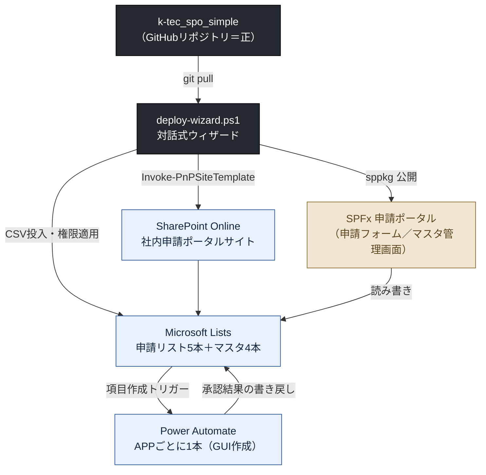

---
tags:
  - moc
  - ケーテック
client: ケーテック株式会社
created: 2026-09-05
updated: 2026-09-23
---

# ケーテック株式会社 — MOC

> [!info] このノートについて
> ケーテック株式会社に関するすべてのノートの入口（Map of Content）。まずここから該当ノートに飛ぶ。
> 職務経歴としての要約: [[02_resume/フリーランス/フリーランス - ケーテック株式会社]]

## 対象

ケーテック株式会社の社内申請業務を M365（SharePoint Online + Microsoft Lists + Power Automate）で
電子化するプロジェクト。起点は先方から受領した「IT依頼事項20260806.xlsx（経営SPGシート）」で、
2026-08-07 に18件の依頼として整理したのが最初の資料。以降 2026-09-05 時点までの内容を扱う。

実装は別リポジトリ `~/git/k-tec_spo_simple`（GitHub: `k-ktec/k-tec_spo_simple`）にある。
このVaultの記述は実装より遅れることがあるため、**状態を書き換える前に必ず現物のコードを見ること**。

## いま数字で見えていること

| 指標 | 値 |
|---|---|
| 先方から受けた依頼（元Excel） | 18件 |
| うち今回の対象として整理した件数 | 14件 |
| SPOに構築済みのAPP（申請リスト） | 5本（年休・仮払金・慶弔・海外保険・昼食） |
| 仮組みのまま残しているAPP | 1本（許可申請 No.11。別紙未入手） |
| 取り下げ・保留になった依頼 | 5件（実印・勤怠・日程調整・付与基準・旅費） |
| 未着手の横断依頼 | 3件（督促 No.13 ／ Ktec Apps No.15 ／ マクロ統合 No.17） |
| 承認方式の設計転換 | 2回（2026-08-08 と 2026-08-10） |
| 記録済みのヒアリング | 3回（2026-08-17 ／ 08-21 ／ 08-27） |
| 先方環境への提供経路 | GitHub → PowerShell ウィザード1本 → 先方テナント |

## ノート一覧

### 依頼と経緯
- [[01 依頼の全体像（IT依頼事項18件）]] — 18件の採否・重要度・現在の状態
- [[02 依頼と対応の台帳]] — 先方が何を言い、こちらが何をしたかの横断表
- [[03 プロジェクト経緯（2026-08〜）]] — 方針転換2回を含む時系列
- [[04 関係者と意思決定の構造]] — 経営SPG／購買G、誰が何を決めるか

### 作っているもの
- [[申請ポータル - 00 概要]] — 案件の入口。ここから各設計ノートへ
  - アーキテクチャ：[[申請ポータル - アーキテクチャ全体像]]
  - データ設計：[[申請ポータル - SPOサイト構成とリスト一覧]] ／ [[申請ポータル - 共通列とコンテンツタイプ]]
  - 承認：[[申請ポータル - 承認方式（簡易承認への転換）]]
  - 画面：[[申請ポータル - SPFx申請ポータル（画面側）]]
  - 提供：[[申請ポータル - デプロイ経路]]
  - 権限：[[申請ポータル - 権限設計とデータ保護]]
  - 実装知見：[[申請ポータル - PnPテンプレートの落とし穴]]

### バージョン記録（30-プラットフォーム/spo/）
> [!info] 2026-09-22開始。ver7以前は遡って作らない
> リリース(だいたい2週に1回想定)のたびに「ver8からの変化点となぜそうしたか」を積み上げていく薄い記録。
> 詳細設計は上記の各APPノートが正で、ここは版ごとの差分だけを追う。
- [[30-プラットフォーム/spo/ver8/ver8 リスト別機能一覧（ベースライン）]] — 最初のスナップショット(2026-09-09リリース分)
- [[30-プラットフォーム/spo/ver9/ver9 変化点]] — 作業中。年休カレンダー修正・特別休暇の事由カスケード・昼食メニュー2軸復活など
- [[30-プラットフォーム/spo/ver9/ver9 リリースノート（先方送付用）]] — 非エンジニア向けの下書き。送付前に要確認
- [[30-プラットフォーム/spo/ver10/ver10 要望事項]] — 着手待ちの要望バックログ（まだ「変化点」ではない）。
  海外保険加入依頼の追加要望(2026-09-23)が1件目

### 未決の論点
- [[テーマ1 - 電子化をどこまで広げるか]] — 14件のうち何を作り、何をやめるか（案件の親論点）
- [[テーマ2 - 承認者をどう決めるか]] — 2回転換した最重要の設計論点
- [[テーマ3 - 総務の全件閲覧をどう成立させるか]] — `ReadSecurity=2` の壁
- [[テーマ4 - マスタを増やすか]] — 上長マスタ・従業員マスタ（こちらは反対の立場・先方回答待ち）
- [[テーマ5 - 既存システムとの併存と属人化解消]] — Prevision・Ktec Apps・旧PowerApps
- [[テーマ6 - 未着手の横断依頼]] — No.13 督促 ／ No.15 通知修正 ／ No.17 マクロ統合

### 既存ツール（先方が使っているもの）
- [[Prevision（勤怠・外部製品）]] ／ [[Ktec Apps（既存・実体未確認）]] ／ [[旧PowerApps年休申請（前任者作）]]
- [[Req Navi（ヒアリング支援・自社）]] — ヒアリング回答の一次記録がここに入っている

### 次のアクション
- [[05 要確認事項]] — ★ブロッカー付き。回答がないと設計に進めないもの
- [[06 リポジトリ内ドキュメントの現状差分]] — 実装が先に進み、ドキュメントが取り残されている箇所

### 打ち合わせ記録
- [[2026-08-07 IT依頼事項の受領]] — 18件の一次整理
- [[2026-08-17 ヒアリング回答]] — 14件中10件に回答。取り下げ3件が確定
- [[2026-08-21 慶弔ルールの確認]] — 慶弔見舞金規程の提供。最大級のブロッカーが解消
- [[2026-08-27 年休・慶弔・昼食の変更依頼]] — 稼働後のフィードバック。旅費保留・付与基準取り下げ
- [[2026-08-27 依頼への対応回答（打ち合わせ説明用）]] — 上記21項目に対して何がどこまで動いているか。次回の説明用
- [[2026-09-09 承認者履歴・営業日カレンダー・従業員マスタ導入]] — テーマ2・4に決着。ver8としてリリース
- [[2026-09-22 年休・慶弔・昼食の追加要望]] — 稼働後のフィードバック第2弾。ver8の確認依頼への回答も含む。
  リストごとに①ver8修正内容→②要望→③ver9対応で整理、2026-09-23打ち合わせ準備を兼ねる
- [[2026-09-22 年休・慶弔・昼食の追加要望]] — 稼働後の追加フィードバック第2弾。カレンダー色分けの誤り・日数計算バグ・特別休暇の事由設計・派遣社員の扱い・昼食区分再設計など
- [[2026-09-23 海外保険加入依頼の追加要望]] — 渡航者情報追加・渡航先プルダウン化・帰国日→帰宅日表示名変更。今回は即着手せず次回まとめ対応(ver10想定)に積む方針

## 全体像（何を作っているかの要約図）

詳細は [[申請ポータル - アーキテクチャ全体像]] を参照。

## 現時点の総括

1. **依頼は18件あったが、実際に作ったのは5本のAPP。** ヒアリングを重ねるほど「やらない」判断が増えた
   （実印・勤怠・日程調整・付与基準は取り下げ、旅費は保留）。これは失敗ではなく、
   元Excelが「困りごとの列挙」であって要件ではなかったことの反映。→ [[01 依頼の全体像（IT依頼事項18件）]]
2. **設計の中心論点は一貫して「承認者を誰がどう決めるか」だった。** マスタによる動的解決 → APPフローへの
   直接設定 → 申請者が申請時に選択、と2回転換している。→ [[テーマ2 - 承認者をどう決めるか]]
3. **アーキテクチャは途中で大きく捨てた。** 中央承認エンジン方式（全社1本のフロー＋トランザクションリスト＋
   監査ログ）を設計しきった後に、簡易承認方式へ全面転換した。設計資産は `docs/flow-design.md` に残っているが
   現行実装とは一致しない。→ [[申請ポータル - 承認方式（簡易承認への転換）]]
4. **先方の運用能力に合わせることが最優先の制約になっている。** No.7 のやり直し理由が
   「前任者しかメンテできない」であり、以降の判断（マスタを増やさない・非エンジニアが回せるウィザード・
   標準機能で完結）はすべてここから来ている。→ [[テーマ5 - 既存システムとの併存と属人化解消]]
5. **未解決の最大の穴は「総務が全件を見られない」こと。** SharePoint の項目レベル権限の仕様上、
   単純なビュー追加では解決しない。→ [[テーマ3 - 総務の全件閲覧をどう成立させるか]]

---

## 変更履歴

### 2026-09-21 — フォルダ名を3社共通の標準に揃えた

Vault 全体の構成ルール（[[README]]）を改訂し、`03-01` / `03-02` / `03-03` を同じフォルダ構成に揃えた。ケーテックは既に標準準拠だったため、**フォルダ名の番号付けだけ**を行った（ノートの移動・改名はしていない）。

`案件/`→`20-案件/`、`ツール/`→`40-ツール/`、`打ち合わせ/`→`50-打ち合わせ/`、`テーマ/`→`60-テーマ/`。`10-事業体/`（先方の会社ノート）と `70-ECモール/` は該当ノートが無いため作っていない。

> [!note] 改訂ルールに対して未整理の2点（今回は動かしていない）
> 改訂で `40-ツール/` は「**先方**の業務で使われているシステム」に限定し、自作のものは `30-プラットフォーム/` か `20-案件/` に置くことにした。この定義に照らすと次の2つが宙に浮いている。**別途判断する。**
> - [[Req Navi（ヒアリング支援・自社）]] — `tags: 自社プロダクト`。クライアント案件ではなくヒアリングの実施基盤なので、`30-プラットフォーム/` が筋。03-01 側にも同名のノートがあり、1プロダクトが2クライアントフォルダに分かれている点も併せて整理が要る
> - [[申請ポータル - 00 概要|社内申請ポータル]]（17ノート） — こちらが構築し稼働させている自作プロダクト（`k-tec_spo_simple`、APP5本稼働中）。`20-案件/`（期限のある案件）と `30-プラットフォーム/`（構築・運用するプロダクト）のどちらに置くかが未確定

> [!note] 2026-09-21 追記：直下の番号つきノート6本も未整理
> 同日、README の「直下に残すのは**どのフォルダにも属さないもの**だけ」というルールを明確化した（調査時点のスナップショットは `10-事業体/`、1回の打ち合わせに紐づくものは `50-打ち合わせ/<日付>/`、打ち合わせをまたいで更新し続けるトラッカーは直下）。このルールに照らすと、直下6本のうち**直下が正しいのは2本だけ**。
>
> | ノート | 性格 | 本来の置き場所 |
> |---|---|---|
> | [[01 依頼の全体像（IT依頼事項18件）]] | 2026-08-07 に受領した依頼一覧のスナップショット | `50-打ち合わせ/2026-08-07/` 寄り |
> | [[02 依頼と対応の台帳]] | 依頼ごとの対応状況を更新し続ける台帳 | **直下でよい** |
> | [[03 プロジェクト経緯（2026-08〜）]] | 時系列の記録 | 判断が要る（沿革に近いが先方の沿革ではない） |
> | [[04 関係者と意思決定の構造]] | 先方が何者か（体制） | `10-事業体/` 寄り |
> | [[05 要確認事項]] | 打ち合わせをまたいで更新し続けるトラッカー | **直下でよい** |
> | [[06 リポジトリ内ドキュメントの現状差分]] | 自作プロダクト（`k-tec_spo_simple`）側の話 | `20-案件/` か `30-プラットフォーム/` 寄り |
>
> 今回は「ノートの移動・改名はしない」方針のため触っていない。上の「Req Navi」「社内申請ポータル」の2点と合わせて別途判断する。

### 2026-09-22 — `30-プラットフォーム/spo/` を新設

2026-09-21の未整理事項のうち1点に着手した。**`30-プラットフォーム/spo/` を新設し、バージョン記録を
開始した。** `社内申請ポータル`（`20-案件/社内申請ポータル/`）を `20-案件/` か `30-プラットフォーム/`
のどちらに置くかはまだ判断していないが（既存17ノートは今回動かしていない）、**新たに「リリースのたびに
変化点を記録する」という運用**を `30-プラットフォーム/spo/ver8/` から開始した。ver7以前は遡って作らない。
→ [[30-プラットフォーム/spo/ver8/ver8 リスト別機能一覧（ベースライン）]]

> [!note] 「1回の打ち合わせに紐づくものは `50-打ち合わせ/<日付>/`」ルールは一度試して撤回した
> 2026-09-23の打ち合わせ向けに `50-打ち合わせ/2026-09-23/` を作り、要望ノートと確認依頼まとめノートを
> 2本に分けて置いてみたが、**同じ内容を2つの構成（時系列の分析 vs APPごとの①②③要約）で書いていて
> 分かりづらい**と判断し、同日中に1本のノート（[[2026-09-22 年休・慶弔・昼食の追加要望]]）へ統合、
> 日付フォルダも撤去して他の打ち合わせ記録と同じ直下フラット構成に戻した。フォルダ分けは
> 「1回の打ち合わせで複数ノートに分割する必要が出たとき」だけ検討する運用に変更する。
