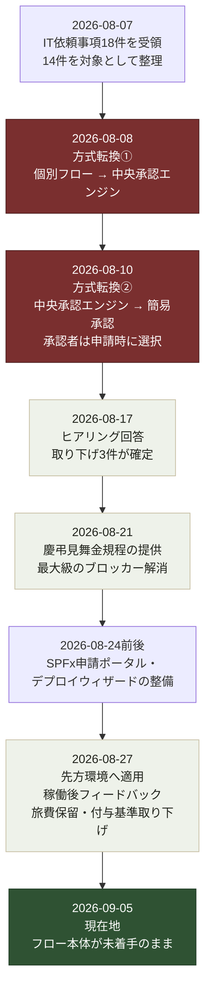

---
tags:
  - ケーテック
  - 経緯
client: ケーテック株式会社
created: 2026-09-05
updated: 2026-09-05
---

# 03 プロジェクト経緯（2026-08〜）

親: [[00 MOC|ケーテック株式会社 MOC]]

出典: `k-tec_spo_simple` の git 履歴、`issues/` と `docs/hearing/` の日付、各ファイル内の日付付きコメント。

> [!info] このノートの読み方
> **技術的な意思決定の履歴**を追うためのノート。個々の依頼への対応は [[02 依頼と対応の台帳]]、
> 到達点は [[申請ポータル - 00 概要]] を見ること。

## 全体の流れ

## 詳細

### 2026-08-07 — 起点

先方から `IT依頼事項20260806.xlsx`（経営SPGシート）を受領し、18件を課題No付きで整理した。
この日のうちに `issues/00_課題整理サマリ.md` と14本の要件定義書、`issues/99_不明点・確認事項一覧.md`
を作成している。→ [[2026-08-07 IT依頼事項の受領]] ／ [[01 依頼の全体像（IT依頼事項18件）]]

**この日に決めた技術方針が、以降ずっと制約として効いている**：

- SPO + Lists + Power Automate。**Forms 不使用・プレミアムコネクタ不使用・Dataverse 不使用**
- 狙いは追加ライセンス費用をゼロにすること（先方テナントが標準ライセンスのまま動くこと）
- リポジトリが正（Source of Truth）、テナントは適用結果にすぎない

同日、実機検証で2つの「できないこと」が確定した。どちらも設計に直接影響している。

| 試したこと | 結果 |
|---|---|
| Person列の既定値に `[Me]`（現在のユーザー）を設定 | **効かない。** 適用は成功し `DefaultValue` に文字列 `[Me]` が入るだけで、新規フォームは空のまま。適用ログでは気づけない |
| 「作成者と申請者をIFで振り分ける」計算列 | **作れない。** SharePointの計算列はPerson列も組み込みの作成者/IDも数式から参照できない |

→ 結果として「入力者を自動で入れる」はフォームでは実現できず、**フローが `Author` をコピーする**方式になった。

### 2026-08-08 — 方式転換①: 個別フロー → 中央承認エンジン

当初は「申請リスト1本につき完全なフローを1本」という構成だった。これを
**承認の待機処理を全社1本の中央フローに集約する**方式へ変更した。

- 中核: `ApprovalTransactions`（承認トランザクション）+ `RequestTypeSettings`（種別ごとの設定マスタ）
- Flow-A（起票・種別ごと）／ Flow-B（中央承認エンジン・全社1本）／ Flow-C（督促）／
  Flow-D（型固有の後処理）／ Flow-E（滞留検知）／ Flow-F（削除監視）／ Flow-G（取下げ受付）
- 狙い: 承認段数・承認者の解決方法をフローの分岐ではなく**マスタのデータ**として表現し、
  新種別の追加を「マスタに1行足すだけ」にする

同日、申請番号の設計も変えている。`{課題No2桁}-{ID6桁}` の自動採番をやめ、
**SharePoint組み込みの `ID` 列をそのまま一意キーとし、`Title` は「件名」として申請者が自由入力**する
方式にした（採番テーブルと排他制御を持つとフローが直列化して遅くなるため）。

→ 設計書は `docs/flow-design.md`（594行）に残っている。詳細は
[[申請ポータル - 承認方式（簡易承認への転換）]]。

### 2026-08-10 — 方式転換②: 中央承認エンジン → 簡易承認

中央承認エンジン方式を設計しきった直後に、**方式そのものを捨てた**。
`feature/simple-approval` ブランチで「各APPごとに完結する簡易承認方式」を試し、これが現在の `main` になっている。

同じ日のうちに、承認者の決め方がさらに2転している：

1. 当初案: **APPごとのフローに承認者（個人）を直接設定する**
2. 転換後: **申請者が申請時に `Approver` 列（Person）で承認者を選ぶ**

理由は「申請ごとに承認者を選べる必要がある」という判断。これにより
`ApproverMaster`（承認者マスタ）は完全に不要になり、削除された。
→ [[テーマ2 - 承認者をどう決めるか]]

同日、**環境変数（Environment Variables）は例外として使用可**という確認も取っている。
Power Automate の環境変数は既定環境の Dataverse を使うが、フロー内から参照する分には
プレミアムライセンス不要（Microsoft公式ドキュメントで確認済み）。禁止しているのは
Dataverse の**テーブルを業務データとして読み書きすること**。

同日、マスタの運用も変えた。`KeichoMaster` / `MenuMaster` / `BusinessCalendar` の3つは
**SPFx申請ポータルの「マスタ管理」画面から直接編集する**運用が正になり、
`config/masters/*.csv` + `seed-masters.ps1` は新規環境への初期投入専用に位置づけが変わった。

### 2026-08-17 — 初回ヒアリング回答

`Req Navi`（自社のAIヒアリングシステム）経由で14件への回答を受領。→ [[2026-08-17 ヒアリング回答]]

- **取り下げ3件が確定**（No.8 実印 / No.9 勤怠→給与連絡表 / No.10 日程調整）
- No.7 のやり直し理由が「前任者しかメンテできない（PowerAppsが複雑）」と判明。
  **以降のすべての設計判断の背骨になった** → [[テーマ5 - 既存システムとの併存と属人化解消]]
- No.3 が2段承認（所属長→社長）と判明し、`FinalApprover` 列を追加
- 渡航先マスタ（`DestinationMaster`）を新設し、表記ブレを防ぐLookup化

> [!warning] 回答に従わなかった判断が1件ある
> No.11（許可申請）について先方は「No.7へ統合」と回答したが、**社内判断で独立案件として維持**した。
> そのため No.7 の休暇区分に「出張」「直行直帰」を含めていない。
> この判断が先方に伝わっているかは、このVault作成時点では確認できていない〔要確認〕。

### 2026-08-21 — 慶弔見舞金規程の提供

08-07 から最大級のブロッカーだった規程本文が届き、慶弔連絡（No.2）を全面改訂した。
→ [[2026-08-21 慶弔ルールの確認]] ／ [[申請ポータル - APP No.02 慶弔連絡]]

特筆すべきは、**当初「条件分岐2つ（金額・休暇日数）」とされていた要件のうち、
休暇日数の分岐は存在しなかった**こと。規程に特別休暇の定めが無く、`SpecialLeaveDays` 列は削除された。
元Excelの記述が要件として正確でなかった例。

### 2026-08-22 — メニュー実データの提供

08-17 の回答（「ご飯サイズで価格が変わる」）をもとに `MealPattern` × `RiceSize` の2軸で
メニューマスタを組んでいたが、実データは**サイズ軸を持たない独立5メニュー**だった。
2列を廃止し `Title`+`Price` の単純表に戻している。

> [!tip] 教訓
> 08-17 の回答は「ご飯の大盛/普通盛り/小盛で価格が変わる」という**現象の説明**であって、
> データ構造の説明ではなかった。口頭回答からスキーマを組むと、実データが来た時点で作り直しになる。

### 2026-08-24 前後 — 提供経路の整備

先方の担当者（非エンジニアを想定）が自分で更新を反映できるよう、`scripts/deploy-wizard.ps1`
（対話式ウィザード）と `docs/setup-prerequisites.md`（Windows/Mac 別の前提ソフト導入手順）を整備した。
→ [[申請ポータル - デプロイ経路]]

この時期、SPFx申請ポータルも「マスタ管理画面」を含む形に育っている。
マスタ管理ナビの表示可否は**SharePointグループ名の文字列一致ではなく、対象リストへの実際の
編集権限（`EditListItems`）**で判定する実装に変えた（M365グループ連携サイトでは所有者グループが
`currentUser.groups()` に現れないことが実機で判明したため）。

### 2026-08-27 — 先方環境へ適用、稼働後フィードバック

`config` を先方環境に書き直して適用。**ここから「作ったものへの注文」フェーズに入った**。
→ [[2026-08-27 年休・慶弔・昼食の変更依頼]]

- 年休・慶弔の件名自動生成、AM休/PM休の終了日固定、土日除外の日数計算、代理申請などを実装
- **旅費申請が保留、付与基準確認が取り下げ**に。SPFxからタイル自体を削除
- 上長マスタ・従業員マスタの新設要望に対し、**こちらは反対の立場でメール文案を作成**し回答待ち
  → [[テーマ4 - マスタを増やすか]]

### 2026-09-05 — 現在地

- 申請リスト5本＋マスタ4本がSPO上に存在し、SPFx申請ポータルから申請できる状態
- **現行の簡易承認方式に対応する Power Automate フローは1本も存在しない。** `flows/solution/` に
  入っている `ApprovalFlows_1_0_0_2.zip` の中身は `FlowA_LeaveRequests_Submit`（2026-08-09作成）
  1本だけで、これは**捨てた中央承認エンジン方式のフロー**（環境変数が
  `spp_ApprovalTransactionsListId` / `spp_AuditLogListId` / `spp_RequestTypeSettingsListId` を
  参照しており、いずれも現在は存在しないリスト）。したがって承認・通知・ステータス書き戻し・
  金額自動計算はすべて未稼働
- リポジトリ内のドキュメントは中央承認エンジン方式のまま取り残されている箇所が複数ある
  → [[06 リポジトリ内ドキュメントの現状差分]]

> [!warning] 現在地の解釈に注意
> 「5本のAPPが構築済み」とは**リストとフォームができている**という意味であり、
> 申請業務が回っている状態ではない。承認フローが動いていないため、`Status` は「申請中」のまま
> 変わらず、`Applicant` / `ApplicantDepartment` / `PlannedAmount` / `Amount` も空のままになる。
> 先方への説明時にここを混同しないこと。
