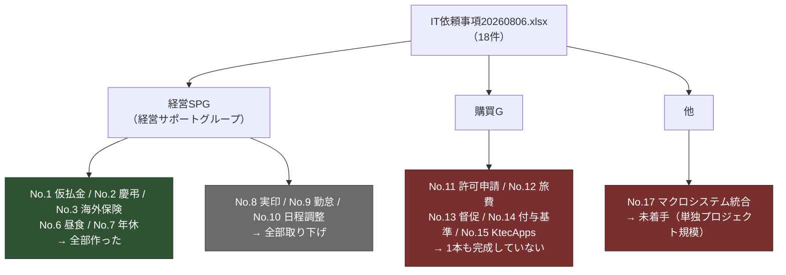

---
tags:
  - ケーテック
  - 体制
client: ケーテック株式会社
created: 2026-09-05
updated: 2026-09-05
---

# 04 関係者と意思決定の構造

親: [[00 MOC|ケーテック株式会社 MOC]]

> [!info] このVaultでの呼称ルール
> **個人名は書かない。役職・役割で書く。** 実装リポジトリ `k-tec_spo_simple` 側にも
> 「commit対象ファイルに実在の個人名・個人メールを書かない」規約があり、このVaultにも同じ扱いを延長する。
> ヒアリングメモに個人名が出てくる箇所は、このVaultでは「購買G担当者」「M365前任者」などに置き換えている。

## 依頼元の2つのグループ

依頼18件は要望部署によって性質がはっきり分かれている。

### 経営SPG（経営サポートグループ）

- 総務人事・経理まわりの申請業務が中心。**要件が閉じていて、こちらの手だけで進められた**
- 5本すべてがこのグループの依頼。取り下げ3件もこのグループ
- 稼働後のフィードバック（[[2026-08-27 年休・慶弔・昼食の変更依頼]]）もここから出ている

### 購買G

- 「リモート・スマホ対応、紛失防止、督促、進行・状況確認、ペーパーレス」が共通の狙い
- **依頼の中身が別紙（P1〜P11）に書かれており、その別紙が届いていない**。
  そのため No.11・No.12・No.13・No.15 のすべてが止まっている
- 唯一動いた No.12（旅費）も、2026-08-27 に「紙運用の方が申請者負担が軽い」として保留になった

> [!warning] 購買Gの依頼が1本も完成していない構造的な理由
> 経営SPG案件は「困っていること」がそのまま要件になったが、購買G案件は**既存の紙様式・既存フロー・
> 既存Excelを調べるところから始まる**。別紙・サンプル・既存システムへのアクセス権のどれか1つが
> 欠けると着手できない。これは工数の問題ではなく前提資料の問題。→ [[05 要確認事項]]

## 登場する役割

| 役割 | このプロジェクトでの位置づけ |
|---|---|
| 所属長 | 全APPの1段目承認者。ただし**マスタで定義していない**（申請者が申請時に選ぶ）→ [[テーマ2 - 承認者をどう決めるか]] |
| 社長 | No.3 海外保険の2段目承認者。`FinalApprover` 列にフローが固定値を書き込む想定 |
| 総務人事 | 慶弔の閲覧者、年休の20日締め出力の担当。**全件を見る権限がまだ無い** → [[テーマ3 - 総務の全件閲覧をどう成立させるか]] |
| 経理 | 仮払金・慶弔の通知先（グループ宛て） |
| 購買G担当者 | 別紙の提供元。No.11〜15 の要件保持者 |
| M365前任者 | 旧PowerApps年休申請の作成者。**この人しかメンテできない**ことがNo.7やり直しの理由 → [[旧PowerApps年休申請（前任者作）]] |
| 購買前任者 | 別系統の年休申請システムの作成者（3系統併存のうちの1つ） |
| 先方のデプロイ担当 | `deploy-wizard.ps1` を実行する人。**非エンジニアを想定**している → [[申請ポータル - デプロイ経路]] |

## 意思決定でこちらが持っているもの・持っていないもの

| 決められること（こちら） | 決められないこと（先方待ち） |
|---|---|
| データ設計（列・型・内部名・マスタ構造） | 承認者の決め方の最終形（上長マスタの是非） |
| 技術方式（簡易承認 vs 中央承認エンジン） | 総務の権限をどこまで広げるか（人選と信頼度の問題） |
| 提供経路（ウィザード・PowerShell・GitHub） | 別紙が必要な購買G案件の要件そのもの |
| 「複雑さを持ち込まない」という判断基準 | Entra ID の部署属性が整備されているか |
| 未確定部分を仮置きで進めるかどうか | 慶弔の第一子/それ以外のような規程の運用解釈 |

> [!tip] このプロジェクトの意思決定の特徴
> **こちらが「作らない」提案を出し、先方がそれを受け入れる**パターンが繰り返されている
> （上長マスタ反対・従業員マスタ反対・月次出力はPower Queryで・申込漏れは総務が直接入力）。
> 理由は一貫して「先方がメンテできる範囲に収める」こと。→ [[テーマ5 - 既存システムとの併存と属人化解消]]
