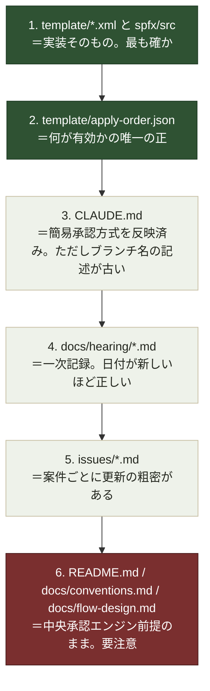

---
tags:
  - ケーテック
  - 技術的負債
client: ケーテック株式会社
created: 2026-09-05
updated: 2026-09-05
---

# 06 リポジトリ内ドキュメントの現状差分

親: [[00 MOC|ケーテック株式会社 MOC]]

> [!info] このノートの目的
> `k-tec_spo_simple` は**実装が2回大きく方向転換した**（[[03 プロジェクト経緯（2026-08〜）]]）ため、
> ドキュメントが取り残されている箇所が複数ある。**Vaultを書くときも、リポジトリを引き継ぐときも、
> どの記述を信じてよいか**の判断材料としてここに集める。
> 調査日: 2026-09-05（`main` の commit `305b644` 時点）。

## 何を信じるべきか（優先順位）

## 差分の一覧

### 1. `README.md` が中央承認エンジン方式のまま

`README.md` の「承認フローの構成（中央承認エンジン方式）」節に Flow-A〜F の表がそのまま残っている。
現行 `main` は簡易承認方式で、**この6本のフローはどれも存在しない**。

| README の記述 | 実態 |
|---|---|
| Flow-B 中央承認エンジン（全社で1本） | 存在しない。承認は各APPのフローが「承認の開始と待機」で行う |
| Flow-C 督促（全社で1本） | 存在しない。督促はスコープ外 |
| Flow-E 滞留検知 / Flow-F 削除監視 | 存在しない |
| 「対象リストの一覧は `docs/conventions.md` §1 を参照」 | conventions.md 側も古い（下記2） |

### 2. `docs/conventions.md` に削除済みリストの記述が残っている

§1 内部名一覧表と §6 権限マトリクスに、**簡易承認方式では削除されたリスト**の定義がそのまま載っている。

| conventions.md に載っているもの | 実態 |
|---|---|
| `ApproverMaster`（承認者マスタ）の列定義 | **削除済み。** 承認者は申請時に `Approver` 列で選ぶ |
| `RequestTypeSettings`（リクエストタイプ設定マスタ） | **削除済み。** `apply-order.json` から除外されている |
| §1「15_core（中央承認エンジンの中核リスト）」＝ `ApprovalTransactions` / `AuditLog` | **削除済み。** ファイル自体が存在しない |
| §0「承認者は承認者マスタから動的取得」「**承認者を申請者に選ばせない**」 | **撤回済み**（2026-08-10）。現在は申請者が選ぶ |
| §0 共通列に `WithdrawnAt` / `OriginItemId` | **削除済み**（`00_common/01_site-columns.xml` から除去） |
| §0 承認整合性の共通設計に「修正＝取下げ→再申請」「監査ログへの追記」 | 簡易承認方式では**必須にしない**方針に変更 |
| §5 監査ログとデータ改ざん耐性（AuditLog・ハッシュチェーン） | 節ごとスコープ外 |
| §6 権限マトリクスの `ApprovalTransactions` / `AuditLog` / `RequestTypeSettings` / `ApproverMaster` の行 | 対象リストが存在しない。**スクリプト側（`configure-list-permissions.ps1`）は正しく除外済み** |

> [!tip] スクリプトのほうが正しい
> `configure-list-permissions.ps1` の冒頭コメントには「本ブランチ（簡易承認方式）には main の中央承認エンジン
> 専用リストが存在しないため、それらへの権限設定は行わない」と明記されている。
> **ドキュメントより実装のほうが新しい**典型例。

### 3. `docs/flow-design.md`（594行）が全文、捨てた方式の設計書

Flow-A〜G、承認整合性チェック、スナップショット差分検知、取下げ受付、督促、状態遷移、環境変数一覧まで
きれいに設計されているが、**すべて中央承認エンジン方式の前提**。

> [!warning] 捨てるべきではない
> 現行実装とは一致しないが、**承認整合性・改ざん耐性まわりの検討内容は簡易承認方式でも通用する**
> （スナップショット承認・受付時の読み取り専用化・物理削除禁止は簡易方式にも引き継がれている）。
> 「旧設計書」と明記したうえで残すのが適切。→ [[申請ポータル - 承認方式（簡易承認への転換）]]

### 4. `CLAUDE.md` のブランチ記述が実態と合わない

冒頭に「**このブランチ（`feature/simple-approval`）について**」とあるが、
このブランチはすでに `main` にマージされており、ローカル・リモートともに存在しない
（`git branch -a` の結果に無い）。内容自体は簡易承認方式を正しく説明している。

同じ節の末尾に「`docs/conventions.md` / `docs/flow-design.md` は main 時点の中央承認エンジン前提の
記述がまだ残っている。設計判断が固まり次第、該当箇所を追従修正すること（**未着手**）」と
自己申告されている。上記1〜3はこの未着手分。

### 5. `issues/00_課題整理サマリ.md` §4 の共通前提が2箇所古い

| 記述 | 実態 |
|---|---|
| §4.1「申請番号: フローが `07-000123` 形式で自動付番」 | **廃止済み**（C-8、2026-08-08）。一意キーは組み込みの `ID`、`Title` は自由入力の件名 |
| §4.2「リスト番号対応表」の「申請番号の例」列 | 同上。列そのものが不要 |
| §4「承認者は原則 Lists の承認者マスタから動的取得。**申請者に承認者を選ばせない**（統制上の理由）」 | **撤回済み**（2026-08-10） |

同じ古い記述が `issues/01` / `issues/03` / `issues/07` / `issues/08` の列表（「申請番号 … `01-000123` 形式で付番」）
にもそのまま残っている。

### 6. `issues/99_不明点・確認事項一覧.md` が 2026-08-17 で止まっている

08-21 の規程提供と 08-27 の変更依頼を反映していない。特に `★2-1` / `★2-2`（慶弔見舞金規程）は
「未解消・引き続きブロッカー」と書かれたままだが**解消済み**。→ 反映後の状態は [[05 要確認事項]]。

### 7. `flows/` が旧方式の遺物になっている

| 対象 | 状態 |
|---|---|
| `flows/README.md` | フロー構成表が Flow-A〜F の中央承認エンジン方式のまま。「Flow-B と Flow-C は横展開時も複製しない」など、現行では意味を持たないルールが書かれている |
| `flows/solution/ApprovalFlows_1_0_0_2.zip` | 中身は `FlowA_LeaveRequests_Submit`（2026-08-09作成）**1本だけ**。環境変数が `spp_ApprovalTransactionsListId` / `spp_AuditLogListId` / `spp_RequestTypeSettingsListId` を参照しており、**いずれも現在は存在しないリスト**。このままインポートしても動かない |

> [!warning] これは「フローが1本ある」ではない
> 現行の簡易承認方式に対応するフローは**まだ1本も作られていない**。zip の存在を「実装済み」と
> 読み違えないこと。→ [[03 プロジェクト経緯（2026-08〜）]] の「現在地」

### 8. `template/10_masters/15_reminder-config.xml` が残置されている

`apply-order.json` で `enabled:false` にしてあり適用はされないが、ファイル自体は残っている。
督促（No.13）が中央承認エンジン方式の一部だったため。復活の見込みは
[[テーマ6 - 未着手の横断依頼]] 次第。

## 直すとしたらどこから

| 優先 | 対象 | 理由 |
|---|---|---|
| 1 | `README.md` の承認フロー構成表 | **リポジトリの入口**。ここが間違っていると引き継ぎ時に最初に誤解する |
| 2 | `CLAUDE.md` のブランチ記述 | AIが作業するたびに参照する。「このブランチ」が存在しない状態は混乱の元 |
| 3 | `docs/conventions.md` §1・§6 の削除済みリスト | 権限設計を触るときに誤った表を見る危険がある |
| 4 | `issues/99` の 08-21/08-27 反映 | ブロッカー判断に直結する |
| 5 | `docs/flow-design.md` の冒頭に「旧設計書」の断り書き | 全面書き換えは不要。位置づけを明示するだけでよい |
| 6 | `flows/` の整理 | 動かない zip の扱いを決める |
| 7 | `issues/00` §4 の申請番号・承認者の記述 | 影響は小さいが、要件定義書全体の信頼性に関わる |
