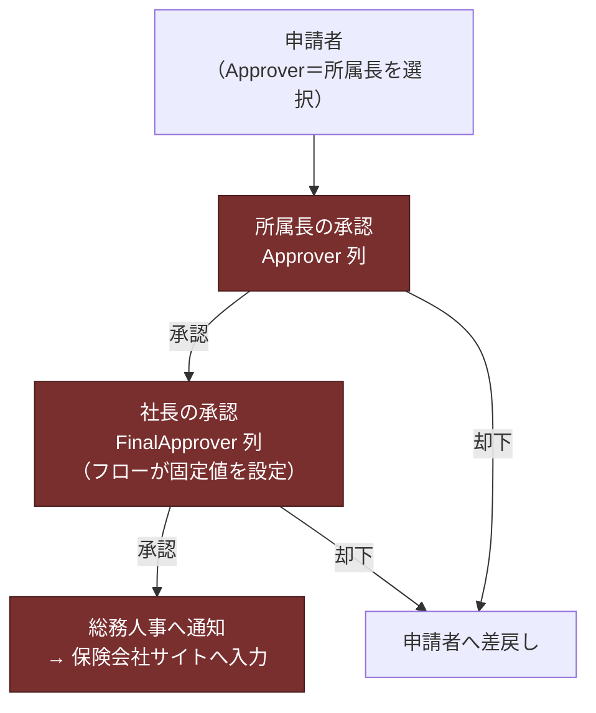

---
tags:
  - ケーテック
  - 案件
  - APP
client: ケーテック株式会社
親論点: テーマ1 - 電子化をどこまで広げるか
フェーズ: 開発中
課題No: 3
created: 2026-09-05
updated: 2026-09-05
---

# APP No.03 海外保険加入依頼

親: [[申請ポータル - 00 概要]] ／ [[00 MOC|ケーテック株式会社 MOC]]

| 項目 | 値 |
|---|---|
| リスト内部名 | `OverseasInsurance` |
| 表示名 | 海外保険加入依頼 |
| 定義 | `template/20_requests/03_overseas-insurance.xml` |
| 参照マスタ | `DestinationMaster`（渡航先マスタ） |
| 要望部署 | 経営SPG ／ 元重要度: 低 |
| 承認段数 | **2段（所属長 → 社長）**。唯一の2段承認APP |
| 状態 | ✅ リスト・フォーム構築済み ／ ❌ フロー未実装 |

## これは何か

海外出張・赴任時の保険加入依頼を電子化する。承認後、**総務が保険会社の専用サイトへ手入力する**
という運用は変えない（そこは本ポータルのスコープ外）。

## 承認経路

> [!info] 2026-08-17 で判明したこと
> 元資料の「所属部署担当者」は**存在しなかった**。実際の経路は
> 「申請者 → 所属長 → 社長承認 → 保険サイトへの入力（総務）」の2段承認。

## 列（固有列のみ）

| 内部名 | 表示名 | 型 | 備考 |
|---|---|---|---|
| `Title` | 件名 | Text（必須） | 申請者が自由入力 |
| `TravelerName` | 渡航者 | Person | 申請者≠渡航者のケースに対応 |
| `Destination` | 渡航先 | **Lookup → `DestinationMaster.Title`** | 2026-08-17、自由入力から変更 |
| `TravelPurpose` | 渡航目的 | Choice | 出張 / 赴任 / その他 |
| `DepartureDate` | 出発日 | DateTime(DateOnly) | |
| `ReturnDate` | 帰国日 | DateTime(DateOnly) | **出発日より前は弾く**（SPFxの `dateRangeRules`） |
| `Companions` | 同行者 | Note | 任意 |
| `IsRetroactive` | 事後申請(緊急時の後追い) | Boolean | |
| `FinalApprover` | 最終承認者(社長) | Person | **フローが固定値を設定**。新規フォーム非表示 |

## 設計判断が2つ入っている

### 1. 渡航先をマスタ参照にした（こちら発の提案）

自由入力テキストのままだと「アメリカ」「米国」「アメリカ合衆国」のような**表記ブレ**が起きる。
`template/10_masters/16_destination-master.xml`（渡航先マスタ）を新設し Lookup 参照にした。

適用順の都合上、**`20_requests` より前に適用する必要がある**（`apply-order.json` で担保）。

### 2. 社長（`FinalApprover`）をフローが書き込む方式にした

Person 列の既定値機能が実機で動作しないため（→ [[申請ポータル - PnPテンプレートの落とし穴]]）、
`FinalApprover` はフォームに出さず、**フローが起票時に固定の社長アカウントを書き込む**。

> [!warning] フロー実装時に決めること
> 社長アカウントの参照方法を **環境変数にするか固定値にするか**が未確定。
> フロー定義に個人名・個人メールを直書きしない規約があるため、**環境変数が妥当**だが未決定。

## 依頼と対応の履歴

| 日付 | 先方の回答 | 判断 | こちらの対応 |
|---|---|---|---|
| 2026-08-17 | 「所属部署担当者」は存在しない。実態は所属長→社長の2段承認 | ✅ | `FinalApprover` 列を追加し2段承認構成へ改訂 |
| 2026-08-17 | 保険会社所定様式は総務が別サイトで入力 | ❌ | スコープ外と整理。管理項目は「日付・氏名・担当部署・海外渡航先」の最小構成 |
| 2026-08-17 | 緊急時は口頭対応・後追い申請で履歴を残す | 🔁 | `IsRetroactive` 列を追加 |
| 2026-08-17 | （こちら発）渡航先の表記ブレ懸念 | 🔁 | 渡航先マスタを新設し Lookup 化 |

## スコープ外

- 保険会社への加入手続きそのもの（総務人事の手作業のまま）
- **パスポート番号等の機微情報** — 列を追加せず、保険会社所定様式で別途授受する方針を推奨。
  機微情報を Lists に置かない

## 未解決

- [ ] `FinalApprover`（社長）の参照方法（環境変数 or 固定値）
- [ ] 2段承認のフロー実装（「承認の開始と待機」を2回連続）
- [ ] 渡航先マスタの初期データ（`config/masters/destination-master.csv`）を先方版に整備
