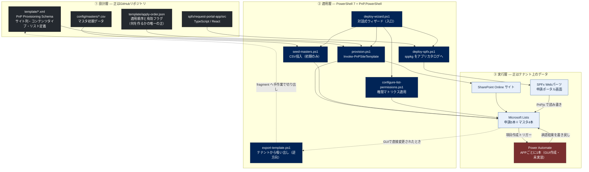

---
tags:
  - ケーテック
  - 案件
  - アーキテクチャ
client: ケーテック株式会社
親論点: テーマ1 - 電子化をどこまで広げるか
フェーズ: 開発中
created: 2026-09-05
updated: 2026-09-05
---

# 申請ポータル - アーキテクチャ全体像

親: [[申請ポータル - 00 概要]] ／ [[00 MOC|ケーテック株式会社 MOC]]

## 3つの層

このシステムは性質の違う3つの層でできている。**それぞれ「正（Source of Truth）」がどこにあるかが違う**のが
理解の要点。



## 層ごとの「正」の所在

| 層 | 正はどこか | 例外 |
|---|---|---|
| ① 設計層 | **GitHubリポジトリ**。テナントは適用結果にすぎない | — |
| ② 適用層 | GitHubリポジトリ | — |
| ③ 実行層 | **テナント上のデータ**（申請の実データ、承認者として選ばれた個人） | マスタ3本（慶弔・メニュー・営業日カレンダー）は**テナント側が正**。SPFxのマスタ管理画面から先方が直接編集する運用に変えた（2026-08-10） |

> [!important] マスタだけ「正」が反転している
> `KeichoMaster` / `MenuMaster` / `BusinessCalendar` は、初回投入だけ CSV + `seed-masters.ps1` で行い、
> **以降の継続更新は SPFx のマスタ管理画面が正**。リポジトリの CSV は初期値のスナップショットにすぎない。
> 理由は、価格改定や規程改定のたびにエンジニアを呼ばずに先方が直せるようにするため。
> → [[テーマ5 - 既存システムとの併存と属人化解消]]
>
> 一方、`ApproverMaster` / `RequestTypeSettings` は**そもそも存在しない**（承認方式の転換で削除）。
> `docs/conventions.md` にはこの2つを「CSV + seed が正」とする記述が残っているが、対象リストが無い。
> → [[06 リポジトリ内ドキュメントの現状差分]]

## GitHub → PowerShell → 環境 の流れ

先方担当者（非エンジニアを想定）が更新を反映するときの実際の操作は**コマンド1本**。

```bash
pwsh -File scripts/deploy-wizard.ps1
```

ウィザードの中身は既存スクリプトを順に呼ぶだけで、ロジックを重複させていない。

1. 前提ソフトの確認（不足時は `docs/setup-prerequisites.md` を案内）
2. `git pull` でリポジトリを最新化
3. 対象環境の選択（`dev` / `dev-simple` / `prod`）
4. `config/{Env}.json` の内容を1項目ずつ確認（現在値をそのまま使うか聞かれる）
5. 最終確認のうえ、**リスト適用 → マスタ投入 → 権限適用 → SPFxビルド・公開** を順に実行

詳細は [[申請ポータル - デプロイ経路]]。

## テナントへの接続方式

- **PnP.PowerShell + Entra ID アプリ登録 + 対話ログイン**（`Connect-PnPOnline -Interactive`）
- 接続情報は `config/{env}.json`（`SiteUrl` / `ClientId` / `Tenant` / `Permissions`）。
  **実データの config は commit しない**（`.gitignore` 対象。`*.sample.json` だけが commit される）
- 同一テナント内で環境が増えても **Entra ID アプリ登録は使い回す**（空のままウィザードを実行すると
  新規アプリを自動作成してしまい、不要な管理者承認待ちが発生するため）

## この構成を選んだ理由

| 選択 | 代替案 | なぜこちらを選んだか |
|---|---|---|
| PnP Provisioning XML（IaC） | テナントでGUIポチポチ | 開発テナント → 先方テナントへ**同じ経路で再現**できる。差分の履歴が git に残る |
| SPFx 独自フォーム | Lists 標準フォーム＋JSONカスタマイズ | 条件表示・自動計算・締切チェック・件名の自動生成が JSON では組めない → [[申請ポータル - SPFx申請ポータル（画面側）]] |
| PowerShell ウィザード | 個別コマンドの手順書 | **非エンジニアが回せること**が要件。手順書だと必ず属人化する |
| Power Automate は GUI 作成 | フロー定義をコードで管理 | 「承認の開始と待機」を含む複雑なアクションをコードで書き起こすのは非現実的。AI がフローのビジネスロジックを断定的に生成しない、というルールにしている |
| 環境変数でリスト GUID を持つ | フローにハードコード | 環境（dev/prod）ごとに GUID が変わるため。**ここだけ Dataverse の例外を使っている** |

## 既知の弱点

| 弱点 | 内容 |
|---|---|
| **フローがコード管理外** | GUI 作成のため、リポジトリには zip でしか残らない。列を変えたときのフロー側の追従は人力 |
| **既存サイトへの再適用に限界がある** | 共通コンテンツタイプに列を追加しても、既にバインド済みのリストには伝播しない（`Overwrite="false"` のため）。XML から列を消してもテナント側には残る。共通列の増減を伴う変更は**新しいサイトを作って先頭から流し直す**のが最も確実 → [[申請ポータル - PnPテンプレートの落とし穴]] |
| **SPFx のチェックが迂回できる** | 昼食の8:30締切チェックは SPFx フォーム側だけ。標準のリストフォームから直接投稿すれば素通りする（「悪意ある迂回は想定しない」と割り切り済み） |
| **マスタの正がリポジトリを離れた** | 先方が直接編集する運用にした3本は、リポジトリから状態が見えない |
