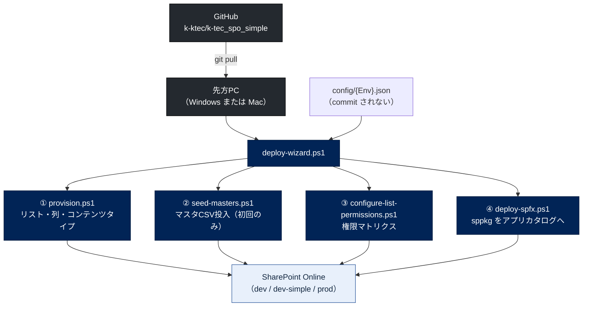

---
tags:
  - ケーテック
  - 案件
  - デプロイ
client: ケーテック株式会社
親論点: テーマ1 - 電子化をどこまで広げるか
フェーズ: 開発中
created: 2026-09-05
updated: 2026-09-05
---

# 申請ポータル - デプロイ経路

親: [[申請ポータル - 00 概要]] ／ [[00 MOC|ケーテック株式会社 MOC]]

出典: `scripts/`、`docs/setup-dev.md` / `setup-prod.md` / `setup-prerequisites.md`。

## 設計目標

**先方の担当者（非エンジニアを想定）が、コマンド1本で「最新化 → 環境へ適用」を完結できること。**

これは技術的な要求ではなく、[[テーマ5 - 既存システムとの併存と属人化解消]] から来た要求。
No.7 のやり直し理由が「前任者しかメンテできない」だったため、
**引き継げないものを作らない**ことが最優先になっている。

## 全体の流れ



## 入口: `deploy-wizard.ps1`

```bash
pwsh -File scripts/deploy-wizard.ps1
```

**中身は既存スクリプトを順に呼ぶだけで、ロジックを重複させていない。**

1. **前提ソフトの確認** — 不足時は `docs/setup-prerequisites.md` を案内（自動インストールを試みるものもある）
2. **`git pull`** でリポジトリを最新化（未コミットの変更があれば警告して止まる）
3. **対象環境の選択** — `1) dev（自前ミニテナント）` / `2) dev-simple（簡易確認用）` / `3) prod（先方テナント・本番）`
4. **`config/{Env}.json` を1項目ずつ確認** — 「現在 [XX] だけどOK?」形式。Enter または `y` でそのまま、`n` で入力し直す
   - `ClientId` が未設定なら Entra ID アプリ登録の案内が出る（**初回のみ**）
   - 権限マトリクス用のグループ名もここで確認する
5. **最終確認のうえ順に実行** — リスト適用 → マスタ投入 → 権限適用 → SPFxビルド・公開（各ステップはスキップ可）

## 個々のスクリプト

| スクリプト | 役割 | 主なパラメータ |
|---|---|---|
| `provision.ps1` | `apply-order.json` の `enabled:true` を上から順に `Invoke-PnPSiteTemplate` | `-Env` / `-Only <path>`（fragment単体） / `-WhatIf` |
| `seed-masters.ps1` | `config/masters/*.csv` をマスタリストへ投入 | `-Env` |
| `configure-list-permissions.ps1` | 権限継承を解除し、`Permissions` のグループへロールを割り当て | `-Env` / `-WhatIf` |
| `deploy-spfx.ps1` | `.sppkg` をサイトコレクションアプリカタログへ公開・インストール | `-Env` / `-PackagePath` |
| `export-template.ps1` | テナントから `Get-PnPSiteTemplate` で吸い出す（**逆方向**） | `-Env`（dev のみ） |
| `seed-sample-requests.ps1` | 動作確認用のサンプル申請を投入 | — |
| `lib/common.ps1` | config読込 / `Connect-PnPOnline` / ログ出力の共通処理 | — |

### 開発サイクル（エンジニア側）

```bash
pwsh -File scripts/provision.ps1 -Env dev -Only template/20_requests/07_leave-request.xml
```

1. `template/` の fragment XML を編集
2. 上のコマンドで**その1本だけ**適用して確認
3. GUI で目視確認
4. 問題なければ commit（**リスト1本 / フロー1本単位**。日本語コミットメッセージ可）

## 接続方式

- **PnP.PowerShell + Entra ID アプリ登録 + 対話ログイン**（`Connect-PnPOnline -Interactive`）
- `config/{env}.json` に `SiteUrl` / `ClientId` / `Tenant` / `Permissions` を持つ
- **実データの config は commit しない**（`.gitignore`）。commit されるのは `*.sample.json` だけ

> [!important] ClientId は使い回す
> 同一テナント内で環境（dev / test / prod 等）が増えても、**Entra ID アプリ登録は使い回してよい**。
> 空のままウィザードを実行すると新規アプリを自動作成してしまい、**不要な管理者承認待ちが発生する**。
> 既に承認済みの ClientId があれば config にコピーすること（`dev.sample.json` にもこの注記がある）。

## 前提ソフト（`docs/setup-prerequisites.md`）

Windows / Mac の両方について、非エンジニア向けに手順が書かれている。

| ソフト | 用途 | Windows | Mac |
|---|---|---|---|
| PowerShell 7 | スクリプト実行 | winget | Homebrew |
| git | リポジトリの取得・更新 | winget | Homebrew |
| Node.js | **SPFxアプリのビルドに必要** | winget | Homebrew |
| PnP.PowerShell | SharePoint 操作 | `Install-Module` | `Install-Module` |

Windows では実行ポリシーでスクリプトがブロックされる場合の対処も書かれている。

## 先方テナントへの導入（`docs/setup-prod.md`）

1. **先方管理者への依頼事項**（サイト作成権限、アプリ登録の承認、Purview監査ログの有効化、
   サイトコレクション管理者の最小化 など）
2. `provision`（サイト構築）
3. `seed`（マスタデータ投入）— `config/masters/*.csv` に**先方版データ**を用意してから実行
4. 権限マトリクスの適用
5. **ソリューションインポート**（Power Automate のフロー。**未実施**）
6. 接続の共同所有者設定 — dev で作った接続をそのまま prod に持ち込まない。
   **サービスアカウントで接続を作成し、共同所有者を設定する**（属人化防止）
7. フロー有効化
8. パイロット運用

> [!warning] `setup-prod.md` の §8 は中央承認エンジン前提
> 「中央フロー障害時の手動対応手順」という節があるが、**中央フローは存在しない**。
> → [[06 リポジトリ内ドキュメントの現状差分]]

## 逆方向: テナント → リポジトリ

テナント側で GUI から直接変更してしまった場合は、`export-template.ps1 -Env dev` で
`Get-PnPSiteTemplate`（Handlers: Lists, Fields, ContentTypes）により吸い出し、
`template/_extracted/`（`.gitignore` 対象）に出力する。

**そこから `00_common` / `10_masters` / `20_requests` の fragment へ切り出す作業は人力（AIの担当）。**
自動では戻らない。

## 既知の弱点

| 弱点 | 内容 |
|---|---|
| **既存サイトへの再適用に限界がある** | 共通コンテンツタイプに列を追加しても、既にバインド済みのリストには伝播しない。XMLから列を消してもテナント側には残る。**共通列の増減を伴う変更は、新しいサイトを作って先頭から流し直すのが最も確実**（納品時と同じ経路の検証にもなる） |
| **フローがこの経路に乗っていない** | Power Automate はソリューションの手動インポート。ウィザードの対象外 |
| **`provision.ps1` は権限を設定しない** | リストを新規作成した直後は必ず `configure-list-permissions.ps1` を1回実行する必要がある |
| **マスタの正がテナント側にある** | `seed-masters.ps1` は `Title` をキーにした upsert（存在すれば `Set-PnPListItem` で**更新**、無ければ追加）。CSVに無い行は消さないが、**CSVにある行は先方がGUIで編集した内容を上書きする**。初回投入専用と位置づけているのはこのため（→ [[申請ポータル - アーキテクチャ全体像]]） |
