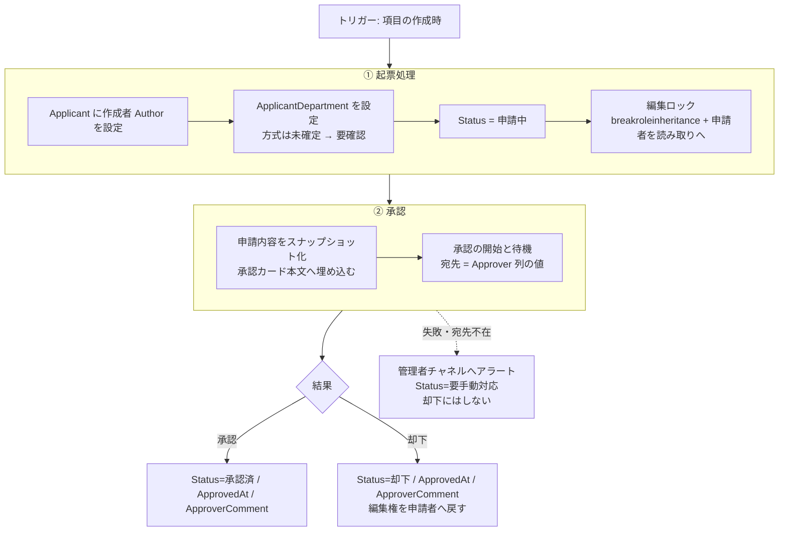

---
tags:
  - ケーテック
  - プラットフォーム
  - PowerAutomate
  - 設計
client: ケーテック株式会社
created: 2026-09-28
updated: 2026-10-07
---

# Power Automate フロー設計図（簡易承認方式）

親: [[00 MOC|ケーテック株式会社 MOC]]

> [!info] このノートの役割
> 各申請APP(SharePointリスト)に作る **Power Automate フローの設計図**。リポジトリ(`k-tec_spo_simple`)の
> `CLAUDE.md`(簡易承認方式)を元に、フロー実装者(Claude/FlowAgentへの指示、または手で作る人)向けに整理した。
> リポジトリの `docs/flow-design.md` は **`main` の中央承認エンジン方式の記述のままで、簡易方式には合わない**
> (下の「旧設計書の流用範囲」参照)。簡易方式に沿った設計書の改訂はリポジトリ側でも未着手なので、
> **現時点ではこのノートが簡易方式の設計図の代わり**になる。
>
> **2026-10-07 方針変更**: フローは Claude(FlowAgent MCP)で生成し、人がポータルで確認して採用する。
> 従来の「GUIで作る・AIはフロー定義を新規生成しない」は廃止。運用ルールと環境の状態は
> [[30-プラットフォーム/powerautomate/Claude(FlowAgent MCP)でのフロー生成]] を参照。

## 1. 方式の要点

- **各APPごとに独立した1本のフロー**。中央フロー(Flow-B〜F)・`ApprovalTransactions`・`RequestTypeSettings`・
  `ApproverMaster` は使わない。
- 承認は Power Automate 組み込みの「**承認の開始と待機**」を使う。Forms・プレミアムコネクタ・Dataverse(業務データ用途)は不使用。
- 承認者は **申請者が新規フォームの `Approver` 列(Person)で選ぶ**。フローはその値をそのまま宛先にする
  (マスタ参照もフロー側のハードコードもしない)。`Approver` は編集フォームでは隠す(提出後に変えさせない)。
- 横展開時にフローを複製することは許容する(中央フローではないので複製禁止ルールは適用外)。

## 2. 全APP共通の流れ（3ステップ）

### ① 起票処理

| # | 処理 | 内容 |
|---|---|---|
| 1 | 申請者 | `Applicant` に作成者(`Author`)を設定。フォームからは隠れており申請者は入力しない |
| 2 | 所属部署 | `ApplicantDepartment` の扱いは未確定(§6)。残す場合は Entra ID の `department` 取得 or 手入力 |
| 3 | ステータス | `Status = 申請中`(列の既定値も申請中) |
| 4 | 編集ロック | REST「HTTP 要求を SharePoint に送信」(標準コネクタ)で項目の権限継承を解除し、申請者を読み取りのみにする |

- `Title`(件名)・`RequestDate`・`Approver`・各リスト固有列は申請者入力。フローは触らない。
- 編集ロックに使うロール定義ID等は環境依存なので環境変数化する(§4)。

### ② 承認

- **スナップショット承認**: 申請時点の全項目値を承認カードの文面に埋め込む。承認者が見た内容と
  保存内容が食い違わないようにするための共通ルール。
- スナップショット対象の列一覧はフロー冒頭の変数にまとめ、コメントを残す(列追加時の更新漏れ防止)。
- 宛先は `Approver` 列の値。個人名・個人メールをフロー定義に直書きしない。

### ③ 結果の書き戻し

| 承認結果 | 書き戻し |
|---|---|
| 承認 | `Status=承認済` / `ApprovedAt`=現在時刻 / `ApproverComment`=承認コメント |
| 却下 | `Status=却下` / `ApprovedAt` / `ApproverComment`。申請者の編集権を戻す |

### 年休申請(No.7)の2段承認

2026-09-23 に先方要望で2段承認になった。②承認を次のように2回呼ぶ。

1. `LeaderApprover`(1次・リーダー・**任意**)が空でなければ「承認の開始と待機」(宛先=`LeaderApprover`)。
   空ならこの段はスキップ。**1次が却下なら2次へ進めず却下で確定**(未確認。要確認事項)。
2. `Approver`(2次・マネージャー・**必須**)へ「承認の開始と待機」。
3. 結果は最終段の結果で書き戻す。

承認カード本文は共通列 `ApprovalMessage`(SPFxが申請時に作成)をそのまま使い、フローで列を連結しない。
空のとき(リスト標準フォームから登録)は簡易な文面にする。

## 3. 共通部品（全フロー必須）

1. **承認者に到達できない場合のフォールバック**: 退職・異動済みで「承認の開始と待機」が失敗した場合、
   管理者チャネルへアラート + `Status=要手動対応`。**申請を却下にしない**。
   (`Approver` は自由選択のPerson列でマスタによる制限が無いため、誤選択は起こり得る既知の制約)
2. **フロー自身のエラーハンドリング**: 1本で起票〜結果反映まで担うので、スコープ+失敗時分岐で
   管理者アラートを必ず入れる。
3. **論理削除**: 削除は物理禁止。`Status` で管理する。
4. **承認整合性**: スナップショット承認(§2②)と編集ロック(§2①-4)の2点。

## 4. 環境変数（必須）

ハードコードせず Power Automate ソリューションの環境変数にする。環境変数はDataverseを使うが、
フロー内から参照する分にはプレミアム不要と確認済み(CLAUDE.md §0 の例外)。

- `SiteUrl`(申請ポータルのURL)
- 各リスト名(リストGUID or 内部名)
- 管理者通知チャネルのチームID・チャネルID(部署・役割単位。個人チャットIDは不可)
- SharePointロール定義ID(読み取り/編集/フルコントロール)

接続参照は**インポート先で作り直す**。prod ではサービスアカウントで接続を作り、共同所有者を設定する
(`docs/setup-prod.md`)。

## 5. 列の対応（フローが読み書きする共通列）

| 内部名 | 誰が入れる | フローの扱い |
|---|---|---|
| `Title`(件名) | 申請者 | 読むだけ(承認カードに載せる) |
| `RequestDate` | 申請者 | 読むだけ |
| `Approver`(Person) | 申請者(新規フォームのみ) | **宛先として読む** |
| `Applicant`(Person) | フロー | 作成者を書く |
| `ApplicantDepartment` | フロー | 方式未確定(§6) |
| `Status` | フロー | 申請中 / 承認済 / 却下 / 要手動対応(＋業務固有値: 精算済・取消 など) |
| `ApprovedAt` | フロー | 承認/却下日時 |
| `ApproverComment` | フロー | 承認者コメント |

`Status` の選択肢は共通列に相乗りしているため、リストによっては使わない値が残る(仮払金の「精算済」等)。

## 6. 要確認事項・未確定（仮置きせず明示）

- **`ApplicantDepartment`** を残すか削るか。残す場合の取得方法(Entra ID `department` / 手入力)。
- **2段承認が要るAPP**(許可申請 No.11・旅費 No.12)の構造: 直列(「承認の開始と待機」を2回連続) or
  並列合議(1回の宛先を複数人)。2人目の承認者は、そのAPP固有のPerson列を別途用意する。
- **督促・滞留検知・監査ログ(ハッシュチェーン)** は簡易方式のスコープ外。必要になったらAPP単位で追加するか、
  `main` の中央承認エンジンに合流するかを要判断。
- **取消操作**(昼食 No.6 の「取消」Status)は、誰がいつまで取消せるかのUI/フロー実装が未着手。
- 実機(テナント)未確認の前提が多い。フロー作成後に年休申請 No.7 で1周して検証する。

## 7. 実装の進め方

1. **雛形は年休申請(No.7)**。1本を完成させて、承認〜書き戻し〜フォールバックまで通す。
   生成は FlowAgent 経由(`[TEST]` 付き・公開しない・新規作成のみ。詳細は上記の運用ノート)。
2. 通ったフローを **ソリューションとしてエクスポート**し、`flows/solution/` に zip を置く。
3. 他APP(仮払金 No.1・慶弔 No.2・海外保険 No.3・昼食 No.6・勤怠 No.9)へ横展開。
   差分は **トリガー先リスト・スナップショット対象列・APP固有の承認段数**のみ。
4. 列・コンテンツタイプを変えたら、フロー側の列参照も更新し、ソリューションを再エクスポート。

## 8. 旧設計書（`docs/flow-design.md`）の流用範囲

リポジトリの旧設計書は中央承認エンジン前提(Flow-A〜G)。簡易方式で使える部分・使えない部分:

| 旧設計書の章 | 簡易方式での扱い |
|---|---|
| §5 承認整合性チェック(差分検知・取下げ競合) | **考え方のみ流用**。取下げ→再申請と `AuditLog` は簡易方式で必須にしない |
| §6 権限制御(受付時の読み取り専用化) | **そのまま流用**(REST `breakroleinheritance`) |
| §10 エラーハンドリング | **流用**(管理者アラート+`要手動対応`) |
| §13 環境変数一覧 | **考え方を流用**(項目は本ノート§4に絞る) |
| §4 Flow-B / §7 Flow-D / §8 Flow-G / §9 Flow-C / §11 監査ログ / §12 状態遷移 | **使わない** |

## 関連

- リスト別の設計: [[30-プラットフォーム/powerautomate/Power Automate リスト別フロー設計(簡易承認方式)]]

- リポジトリ: `k-tec_spo_simple`(`CLAUDE.md`、`docs/flow-design.md`、`flows/README.md`、`flows/solution/`)
- [[30-プラットフォーム/spo/ver8/ver8 リスト別機能一覧（ベースライン）]]
