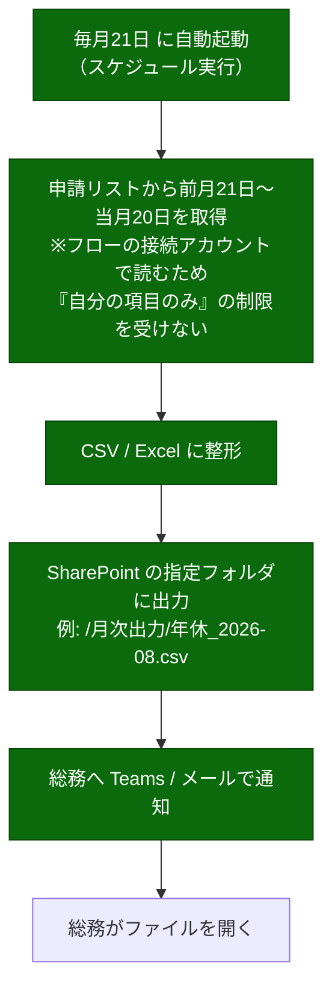

---
tags:
  - ケーテック
  - 打ち合わせ
  - 対応報告
client: ケーテック株式会社
created: 2026-09-05
updated: 2026-09-05
---

# 2026-08-27 依頼への対応回答（打ち合わせ説明用）

親: [[00 MOC|ケーテック株式会社 MOC]] ／ 依頼の原文: [[2026-08-27 年休・慶弔・昼食の変更依頼]]

> [!info] このドキュメントについて
> 2026-08-27 にいただいた要望21項目について、**現時点で何がどこまで動いているか**を
> 実装（`k-tec_spo_simple` リポジトリの `main`）に当たって確認した結果です。
> 「対応しました」と言えるもの・言えないものを分けてあります。

## 凡例

| 記号 | 意味 |
|---|---|
| ✅ | 実装済み。動いている |
| 🔁 | ご要望とは形を変えて実装済み（理由を併記） |
| 🗣 | システムではなく**運用**で対応する方針（合意済み or 提案） |
| ⏸ | **未対応**。前提が決まらないと着手できない |
| ❓ | ご要望の内容をこちらが掴めておらず、確認したい |

---

## 全体サマリ

| 分類 | 件数 | 内訳 |
|---|---|---|
| ✅ 実装済み | 9 | 件名の自動反映×2、代理申請、土日除外計算、AM/PM休の終了日固定、遅刻早退の時間入力、外出削除、申込方法2種、8:30締切 |
| 🔁 形を変えて実装 | 1 | 取消欄（`Status` に「取消」を追加） |
| 🗣 運用で対応 | 3 | 20日締め出力、申込漏れ救済、出力データ項目 |
| ⏸ 未対応 | 5 | 雇用形態・勤続年数の自動化、慶弔金額の自動算出、承認者の自動設定、特別休暇の年休表示、取得理由の非表示 |
| ❓ 確認したい | 3 | 申請状態の閲覧範囲（権限レベル次第）、カレンダー公開可否、上長マスタの粒度 |

> [!warning] 前提として1点だけ先にお伝えしたいこと
> **現在、Power Automate のフローがまだ1本もありません。**
> リスト・入力画面はできていますが、承認・通知・ステータス更新・金額の自動計算は
> **すべてフローが担当する部分**のため、まだ動きません。
>
> 具体的には、以下は現時点で空欄・初期値のままになります。
> `ステータス`（申請中のまま）／`申請者`／`所属部署`／`承認日時`／`承認コメント`／
> 慶弔の`支給予定額`／昼食の`金額`
>
> 「入力できる」と「業務が回る」の間にこの1段があります。

---

## 慶弔連絡

### ① 件名は「慶弔区分＋氏名」の自動反映とする

**✅ 実装済み。ご想定いただいた「入力できなくして、計算したものをタイトルにする」方式そのものです。**

> ご提案いただいた「できないならタイトル列を別で設ける（必須のデフォルトは適当に『申請』とか）」という
> **代替案は不要**です。SharePoint 標準フォームでは確かにできませんが、
> 今回は独自の入力画面（SPFx）を作っているため、標準の `タイトル` 列をそのまま自動生成にできます。
> **列を増やさずに済んでいます。**

| 項目 | 内容 |
|---|---|
| 生成される件名 | `申請日(yyyymmdd)_制度種別_対象者氏名`（例: `20260827_結婚祝金_山田太郎`） |
| 入力可否 | **常にグレーアウト**。手入力は一切できません |
| 制度種別が未選択のとき | 空欄のままグレーアウト（材料が揃うまで生成しない） |
| 代理申請のとき | 氏名部分は**申請者ではなく対象者**の氏名になります |

**コード上の根拠**

- `requestTypes.ts:233` — `{ name: 'Title', ..., required: true, readOnly: true }`
- `requestTypes.ts:89` — `computeKeichoFields()` が件名を組み立てる
- `RequestForm.tsx:296` — `const locked = isComputedNow || !!field.readOnly;` → `:305` で `disabled={locked}`
- `02_keicho-report.xml:60-63` — `Title` は `Required="true"` のまま（自動生成した値が入るので必須違反にならない）

> [!info] 件名フォーマットをご要望から少し変えています
> ご依頼は「慶弔区分＋氏名」でしたが、それだけだと**同じ人が同じ制度で複数回申請したときに件名が完全に
> 重複**します。一覧・検索・通知文面がすべて件名を参照するため、先頭に申請日を付けました。

### ② 雇用形態および勤続年数は入力不要とし、システムで管理する

**⏸ 未対応。あえて手を付けていません。**

これを実現するには**従業員マスタ（社員→雇用形態・入社日）を新しく作る**必要があります。
その是非についてこちらから懸念をお伝えし、**ご回答待ちの状態**です。

**こちらの懸念**

- マスタが古くなると、**間違った値が正しい顔をして全件に適用されます**。自己申告なら
  「自己申告である」という前提が共有されるので承認者が確認します
- 更新の責任者が決まっていない状態でマスタを作ると、**維持されないマスタ**になります

**確認したいこと（メールでもお送りしています）**

- 従業員台帳の所在（Prevision 等に既にありますか）
- CSV での抽出は可能ですか
- 更新の責任者はどなたになりますか

**対案**: 総務が承認時に雇用区分を確定する運用（マスタを持たずに正確性を担保する）

**現状の実装**

- `requestTypes.ts:269-276` — `EmploymentType`（正社員/嘱託員/パート/契約社員）と
  `YearsOfService` は**申請者の自己申告**の入力欄
- `02_keicho-report.xml` — 同上

→ 詳しくは [[テーマ4 - マスタを増やすか]]

### ③ 慶弔金額はマスタ情報を基に自動算出・表示する

**⏸ 未対応（②とセットで止まっています）。**

慶弔金額は「制度種別 × 対象者 × **雇用区分** × 同居条件 × 業務上/業務外」で決まるため、
**②の雇用区分が確定しないと金額も確定しません。**

ただし**準備はすべて済んでいます**。

| 準備できているもの | 状態 |
|---|---|
| 慶弔マスタ（`KeichoMaster`） | ✅ 2026-08-21 の規程に合わせて全面再設計済み。5つの軸で金額が引ける |
| 支給予定額の列（`PlannedAmount`） | ✅ 作成済み。フォームには出さず、フローが書き込む設計 |
| 審議中フラグ（`IsUnderDeliberation`） | ✅ 社葬等協議事項のときにオンにする |
| **算出するフロー** | ❌ 未実装 |

**コード上の根拠**

- `12_keicho-master.xml` — マスタ定義
- `requestTypes.ts:307-308` — `PlannedAmount` / `IsUnderDeliberation` は `hiddenInNewForm: true`
  （＝フローが設定する列として新規フォームから隠してある）

> [!info] ②が決まらなくても部分的には動かせます
> 雇用形態を自己申告のままにしておいても、**その申告値を使ってマスタから金額を引くフロー**は作れます。
> 「金額の自動表示だけ先に欲しい」ということであれば、②と切り離して着手できます。

### ④ 代理申請機能を設ける（代理申請時は対象者を入力できるように）

**✅ 実装済み。ご要望どおりの動きです。**

| 動き | 内容 |
|---|---|
| 起票区分に「代理申請」を追加 | 選択肢は `本人申請` / `人事起票` / **`代理申請`** |
| 対象者の入力欄 | **「代理申請」を選んだときだけ表示**されます（それ以外のときは出ません） |
| 件名への反映 | 代理申請のときは、件名の氏名部分が**対象者の氏名**になります |

**コード上の根拠**

- `requestTypes.ts:243-250` — `InitiatorType` の選択肢に `代理申請` を追加
- `requestTypes.ts:252-259` — `TargetEmployee`（対象者）に
  `visibleWhen: (values) => values.InitiatorType === '代理申請'`
- `requestTypes.ts:93-98` — 代理申請時は `TargetEmployeeDisplayName` を件名に使う
- `02_keicho-report.xml:86-96` — リスト側の選択肢定義

---

## 年休申請

### ⑤ 取得日数を自動計算する（土日を除外）

**✅ 実装済み。**

| 休暇区分 | 計算 |
|---|---|
| 年休・特別休暇・欠勤 | 開始日〜終了日の**土日を除いた日数** |
| AM休・PM休 | **0.5日**（終了日は開始日に固定） |
| 遅刻・早退 | **自動計算しない**（時間単位のため日数になじまない。手入力できます） |

**コード上の根拠**

- `requestTypes.ts:24-36` — `businessDaysInclusive()`（日曜=0・土曜=6 を除外）
- `requestTypes.ts:79-80` — 半休は `× 0.5`

> [!warning] 祝日・会社休日は除外できていません
> 現状は**土日だけ**の除外です。年末年始・お盆・祝日は日数に入ってしまいます。
>
> `営業日カレンダー`（`BusinessCalendar`）というリストは既に用意してあるので、
> **そこに会社の休日を入れていただければ接続できます**が、
> 「年休の日数計算に祝日を含めるかどうか」自体をまだ伺えていません。
> → **確認したいこと（後述）**

### ⑥ 「AM休」「PM休」のときは「取得日（終了）」を選択できない

**✅ 実装済み。** 開始日と同じ日に自動で固定され、入力欄はグレーアウトします。

**コード上の根拠**

- `requestTypes.ts:69-72` — `if (isHalfDay) { result.EndDate = start; }`
- `RequestForm.tsx:296` — 自動計算された項目は編集不可になる

### ⑦ 毎月20日締めの申請データを Excel / CSV で出力できるようにする

**🗣 実現できます。ルートが3つあり、どれも追加ライセンスなしで可能です。**

「自分の項目のみ」という制限がかかっているのは事実ですが、
**これは実現可能性の問題ではなく、どのルートを選ぶかの分岐点**です。

| ルート | やり方 | 誰の権限で読むか | 追加開発 |
|---|---|---|---|
| **A** | 総務の方が SPO のリストを直接開く／Excel の Power Query でリストに接続する | **開いている本人** | 不要 |
| **B** | Power Automate が月次で全件を読み、Excel / CSV に書き出す。総務はそのファイルを開く | **フローの接続アカウント** | フロー1本 |
| **C** | 総務グループの権限レベルを上げてから A を行う | 開いている本人 | 不要（権限設定のみ） |

#### ルートA — そのまま見られる可能性があります

**「普通に SPO のリストにアクセスすれば見られる」というご指摘は、多くの場合そのとおりです。**

「自分が作成した項目のみ」という制限は、**サイトの所有者やフルコントロール／デザイン権限を持つ方には
そもそも適用されません**（SharePoint の仕様として、`Manage Lists` 権限を持つ人は制限の対象外）。

つまり **総務の方がサイトの所有者グループに入っていれば、今すぐリストを開いて全件見えますし、
Power Query もそのまま動きます。**

> [!info] 前回の私の説明を訂正します
> 前回「総務の方であっても自分が出した申請しか見えません」とお伝えしましたが、**言い過ぎでした。**
> 正しくは「**閲覧／投稿レベルの権限しか持っていない方には**見えません」です。
>
> さらに、リポジトリ上では **先方環境の権限グループの設定値が空のまま**になっており
> （`config/prod.json` の `Permissions` が全項目未設定）、
> **そもそも「自分の項目のみ」の設定が実際に適用されているかどうかも、こちらからは確認できません。**
> 適用ステップがスキップされていれば、制限自体かかっていません。
>
> **まず現物を見て、総務の方が実際に何が見えるかを確認するのが最初です。**

#### ルートB — 権限を一切触らずに実現できます（こちらの推奨）

**「Power Automate → Excel 出力でカバーできる」というご指摘も、そのとおりです。**
むしろ**これが本命だと考えています。**

| 論点 | 内容 |
|---|---|
| **なぜ制限を受けないか** | フローは「フローを作った人／接続に使ったアカウント」の権限で動きます。サービスアカウント（フルコントロール）で接続すれば全件読めます |
| **ライセンス** | SharePoint コネクタも「CSV テーブルの作成」も**標準機能**。プレミアム不要です |
| **プライバシー面はむしろ有利** | リストの権限を緩めずに済みます。**出力ファイルに載せる列を選べる**ので、慶弔のように「金額と氏名は総務だけ」という制御も出力側でできます |
| **総務側の操作** | フォルダを開いてファイルを取るだけ。Power Query の設定も不要 |

> [!tip] 締切ロジックを人に依存させずに済むのも利点です
> ルートAだと「前月21日〜当月20日」のフィルタを総務の方が毎回正しく設定する必要がありますが、
> ルートBならフロー側に固定できます。**締め処理の属人化を防げます。**

#### ルートC — 権限を上げる場合の注意点

総務グループが閲覧レベルのままで、かつルートBも作らない場合に限り、権限を上げる選択になります。

> [!warning] このときだけ副作用があります
> 「自分の項目のみ」を外せるのは **デザイン以上の権限**ですが、この権限は
> **読み取り制限と同時に書き込み制限も解除**します。
> つまり総務の方が全社員の申請を**編集・削除もできる**状態になります
> （「物理削除は禁止」という設計とは緊張関係になります）。
>
> ルートBならこの副作用が発生しないため、**わざわざ権限を上げる理由は薄い**と考えています。

#### いずれのルートでも確認させてください

**フィルタに使う日付列を「取得日（開始）」にするか「申請日」にするか**で集計の意味が変わります
（休暇を取った日を基準にするか、申請した日を基準にするか）。

### ⑧ 承認者は上長情報から自動設定する（上長マスタを別リストで管理したい）

**⏸ 未対応。こちらから懸念をお伝えしており、ご回答待ちです。**

**現状**: 申請者が申請時に「承認者」欄で選ぶ方式になっています（`Approver` 列）。
提出後に差し替えられないよう、**編集フォームからは隠してあります**。

- `01_site-columns.xml:158-166` — `Approver` は新規フォームに表示、編集フォームは `ShowInEditForm="false"`

**こちらの懸念**

いただいたご依頼の中に、そのまま懸念の理由が書かれていました。

> 「現行のM365管理方法では**上長変更のたびに設定変更が必要となるため運用負荷が高い**」

**別リストにしても、更新が必要な回数は変わりません。** M365 の上長情報が維持できていないのであれば、
新しいリストも同じように古くなっていく可能性が高いと考えています。

そして**マスタが古いときの被害が大きい**という違いがあります。

| 方式 | 情報が古かったときに何が起きるか |
|---|---|
| 申請時に選ぶ（現行） | **その1件だけ**間違った人に飛ぶ。申請者がすぐ気づく |
| 上長マスタ | **全申請が**間違った人に飛ぶ。誰も気づかないまま溜まる |

**こちらからの対案**

1. **前回選んだ承認者を初期値として表示する** — 毎回選ぶ手間だけを無くします
2. **承認者の候補をグループに限定する** — 誤って関係ない人を選ぶことを防ぎます

### ⑧-2「上長マスタは担当者ベースか、部署単位か？」というご質問について

**部署単位を推奨します**（マスタを作る場合）。

| 粒度 | メンテナンス回数 | 起きること |
|---|---|---|
| **部署単位**（部署 → 上長） | **部署の数だけ**の行。上長が交代したときだけ更新 | 兼務・出向の方をどちらの部署として扱うか決める必要があります |
| 担当者ベース（社員 → 上長） | **社員の数だけ**の行。入社・退職・異動のたびに更新 | 実質的に**従業員マスタを持つのと同じ維持コスト**になります |

担当者ベースは、行数が社員数まで膨らむうえに更新のきっかけが多く、
**「メンテされないマスタ」になるリスクが最も高い形**です。

> [!info] 補足: 部署単位なら、マスタを作らずに済むかもしれません
> **Entra ID（M365アカウント）に全社員の「部署」属性が登録されているか**をまだ確認できていません。
> もし部署属性が正しく維持されているなら、部署から上長を引く仕組みは
> **上長マスタ1本だけ**（社員マスタ不要）で成立します。
> 逆に部署属性が未整備だと、社員マスタも併せて必要になり、維持コストが跳ね上がります。
>
> **これは年休だけでなく全申請の「所属部署」の自動設定にも関わる、最も影響範囲の広い確認事項**です。

→ 詳しくは [[テーマ2 - 承認者をどう決めるか]] ／ [[テーマ4 - マスタを増やすか]]

### ⑨ 「早退」「遅刻」のときは時間入力を可能とする

**✅ 実装済み。** 「遅刻」「早退」を選んだときだけ、時刻（開始）・時刻（終了）の欄が出ます。

**コード上の根拠**

- `requestTypes.ts:160-172` — `StartTime` / `EndTime` に
  `visibleWhen`（休暇区分が遅刻・早退のときのみ表示）
- `07_leave-request.xml:133,141` — リスト側の列定義

### ⑩ 「外出」は利用実績がないため不要

**✅ 実装済み。** 選択肢から削除し、**8区分 → 7区分**になりました。

現在の休暇区分: `年休` / `AM休` / `PM休` / `特別休暇` / `欠勤` / `遅刻` / `早退`

- `requestTypes.ts:155` ／ `07_leave-request.xml:58-72`

### ⑪ 件名は「休暇区分＋氏名」を自動反映する

**✅ 実装済み。慶弔（①）と同じ方式です。**

生成される件名: `申請日(yyyymmdd)_休暇区分_氏名`（例: `20260827_年休_山田太郎`）

**こちらも「タイトル列を別で設ける」代替案は不要です。** 標準の `タイトル` 列を
そのまま自動生成にしてあり、常時グレーアウトで手入力できません。

- `requestTypes.ts:147` — `readOnly: true`
- `requestTypes.ts:51-58` — `computeLeaveFields()` が件名を組み立てる

### ⑫ 申請状態は申請者と承認者のみが確認できるようにする

**❓「今そうなってなかったっけ？」→ 権限レベル次第です。承認者の側だけ足りていません。**

見え方は**その人が持っている権限レベルによって変わります。**

| 誰が | 他人の申請が見えるか |
|---|---|
| 一般の社員（閲覧・投稿レベル） | ❌ 見えません（自分の申請だけ） |
| **承認者（所属長）** | ❌ **見えません**（承認カードで内容を見る設計） |
| サイト所有者・フルコントロール／デザイン権限の方 | ✅ **見えます**（「自分の項目のみ」の対象外） |

つまり、**ご要望の「申請者と承認者のみ」に対しては、承認者の側が足りていない**という状態です。
逆に「総務が見えない」わけではなく、**総務の方の権限レベル次第**です（→ ⑦）。

**コード上の根拠**

- `configure-list-permissions.ps1:147` — `-ReadSecurity 2`（自分が作成した項目のみ読み取り可）。
  ただし `Manage Lists` 権限を持つ方はこの制限の対象外
- `RequestList.tsx:93` — 申請ポータルの「マイ一覧」画面は `AuthorId eq (ログインユーザー)` で絞っています。
  **こちらは権限に関係なく自分の分だけ**表示します（画面の仕様）

> [!info] 承認者が見えなくても、承認の実務は回ります
> 承認者は **Teams / メールに届く承認カード**で申請内容を見て承認します。
> 承認カードには申請時点の全項目が埋め込まれる設計（スナップショット承認）なので、
> **リストを見に行く必要はありません。**
>
> 前回「これで十分」とご回答いただいたのはこの点についてです。
> ただしフローが動き出してから「やはり承認者も一覧で進捗を見たい」となる可能性はあるので、
> **改めて確認させてください。**
>
> 承認者に一覧を見せたい場合、権限を上げなくても
> **⑦のルートB（フローが出力したファイルを見てもらう）で対応できます。**

> [!warning] 前回の説明を訂正します: 「専用のリストビューを作れば見えるのでは」について
> 前回、このコメントに対して「ビューでは回避できません」とだけお答えしましたが、
> **説明が不十分でした。**
>
> 正確には次のとおりです。
>
> - **ビューの設定そのものでは**、確かに「自分の項目のみ」は回避できません
>   （ビューは「見せ方」を変えるもので「見える範囲」は変わらないため）
> - **ただし、見ている人が `Manage Lists` 権限（デザイン以上）を持っていれば、
>   そもそも制限がかからず全件見えます。** サイト所有者はこれに該当します
> - つまり「ビューを作れば見える」というご認識は、**その方の権限次第で正しい**です
>
> なお、前回「総務向けグループへの閲覧権限が実質無効化されている」と書きましたが、
> **これも不正確でした。** `config/prod.json` の権限グループ設定が全項目空のため、
> **そもそもグループへの権限付与自体が実行されていません**
> （`configure-list-permissions.ps1` は未設定の項目をスキップします）。
> 先方環境で実際にどの権限が効いているかは、**現物を見ないと分かりません。**

### ⑬ 年休申請のカレンダー公開可否は選択制とする

**❓ ご要望の内容をこちらが掴めておらず、未着手です。**

> 「上と一緒？ というかそもそもカレンダーじゃない、リスト」というご指摘のとおりです。
> **現時点でカレンダーは存在しません。** リストと申請フォームだけです。

整理させてください。3つの別々の話が混ざっている可能性があります。

| # | 話 | 現状 |
|---|---|---|
| A | **リスト上で他人の申請が見えるかどうか** | ⑫の話。現在は「自分のみ」 |
| B | **誰がいつ休むかを一覧で見られる場所を作るか**（＝カレンダー的なもの） | **存在しません。作るかどうか未決** |
| C | Bを作る場合、公開/非公開を申請者が選べるようにするか | Bが決まらないと決められません |

**確認したいこと**

- そもそも B（休暇予定の共有ビュー）は必要でしょうか。必要な場合、
  Outlook / Teams のカレンダーに載せたいのか、SharePoint のリスト表示で十分でしょうか
- **許可申請（No.11）でも「カレンダー反映」が挙がっています。同じものを指していますか？**
  もし同じなら、まとめて設計したほうが良いと考えています

### ⑭ 有給取得の特別休暇については、システム上「年休」と表示する

**⏸ 未対応です。** 現在も「特別休暇」という選択肢が独立して存在しています。

- `requestTypes.ts:155` — `['年休', 'AM休', 'PM休', '特別休暇', '欠勤', '遅刻', '早退']`

**確認したいこと**: 実現方法が2通りあり、意味が変わります。

| 案 | やること | 影響 |
|---|---|---|
| A | 選択肢から「特別休暇」を消す（申請者は「年休」を選ぶ） | データ上も区別が消える。**慶弔の特別休暇などを後から集計できなくなります** |
| B | 選択肢は残し、**表示だけ**「年休」にする | 内部的には区別が残り、集計もできる。ただし件名も「年休」になります |

「表示する」というご要望からは B と読めますが、**どこでの表示か**（申請一覧か、
共有カレンダーか、Prevision へ渡すときか）で作り方が変わります。

### ⑮ 有給取得理由はカレンダー上には表示しない

**⏸ 保留。** ⑬のカレンダーが存在しないため、そもそも表示する場所がありません。
⑬が決まってから対応します。

---

## 昼食

### ⑯ 「当日申込」と「期間まとめ申込」の2種類から選択できるようにする

**✅ 実装済み（入力画面まで）。**

| 選択 | 表示される項目 |
|---|---|
| 当日申込 | 喫食日 |
| 期間まとめ申込 | 対象期間（開始）・対象期間（終了） |

- `requestTypes.ts:376-405` — `SubmissionMode` と条件表示
- `06_lunch-order.xml` — `SubmissionMode` / `PeriodStartDate` / `PeriodEndDate`

> [!warning] 「期間まとめ申込」を日別の申込に展開する処理は未実装です
> 現状は「7/1〜7/5」という1件の申込が1行として保存されるだけで、
> **5日分の申込として集計されません。**
> 日別への展開は Power Automate 側の処理になるため、フロー実装時の対応になります。

### ⑰ 申込取消に対応するため、取消欄を設ける

**🔁 「取消」という状態は用意しましたが、取消ボタンはまだありません。**

- `01_site-columns.xml:152` — ステータスの選択肢に「取消」を追加済み

**なぜ列ではなく状態にしたか**: 申込を物理削除すると「誰が何を頼んだか」の記録自体が消え、
食堂への発注数との突き合わせができなくなるためです。**削除ではなく「取消済み」として残す**設計にしています。

**確認したいこと**

- **誰が取消せますか**（本人のみ / 総務も可）
- **いつまで取消せますか**（締切の8:30まで / それ以降も総務なら可）

この2つが決まらないと、ボタンを付けても運用が破綻します。

### ⑱ 申込締切時間は当日8:30とし、それ以降は入力不可とする

**✅ 実装済み。** 8:30 を過ぎると送信ボタンでエラーになり、登録できません。

- `requestTypes.ts:116-131` — `lunchSubmitGuard()`
- 「期間まとめ申込」には適用していません（当日申込のみ）

> [!info] 締切時刻が前回の回答と変わっています
> 2026-08-17 には「**当日8時15分まで**」とご回答いただいていましたが、
> 08-27 のご依頼は「**当日8:30**」でした。**実装は8:30**にしてあります。
> どちらが正しいか確認させてください。

> [!warning] 抜け道が1つあります（意図的に許容しています）
> このチェックは申請ポータルの画面側だけのものです。
> SharePoint の標準のリスト画面から直接入力すると、締切後でも登録できてしまいます。
>
> 完全に塞ぐことはできますが、⑲の救済措置（総務が締切後に代理入力する）と
> **仕組みとして矛盾する**ため、あえて塞いでいません。
> 「悪意を持って抜け道を使う社員は想定しない」という前提でよろしいでしょうか。

### ⑲【検討事項】申込漏れ発生時の救済措置

**🗣 総務の方が標準のリスト画面から直接入力する運用を提案します（専用画面は作らない）。**

理由: ⑱の抜け道がそのまま救済手段になるため、**追加開発なしで今日から使えます。**

> [!warning] 1点だけ、事前にご承知おきいただきたいことがあります
> この方法で総務の方が代理入力すると、**「申請者」欄には総務の方のお名前が記録されます**
> （実際に注文した本人の名前ではありません）。
>
> システムが「作成者」を自動で申請者に設定する仕様のためです。
>
> 本人の名前を残したい場合は、**件名に手で書き添えていただく**運用になります。
> 「注文者を正確に残したい」ということであれば、専用の対象者欄を追加する形で別途ご相談させてください。

### ⑳【検討事項】出力データに含める内容

ご要望: 注文者一覧 / ご飯普通盛り数量 / ご飯小盛り数量 / 各数量集計結果

**🗣 メニュー名をそのまま集計すれば出せます。ただし用語の対応を確認させてください。**

**現在のメニューマスタの中身**（2026-08-22 にご提供いただいた実データ）

| メニュー名 | 価格 |
|---|---|
| 大盛り | ¥400 |
| Aランチ | ¥360 |
| 小盛 | ¥340 |
| Aランチ副食 | ¥300 |
| 折詰弁当 | ¥1,100 |

> [!warning] 「ご飯普通盛り」というメニューが存在しません
> ご要望にある「ご飯普通盛り数量」に対応するメニューが、マスタの中にありません。
>
> - **「普通盛り」＝「Aランチ」**という理解でよろしいでしょうか
> - **「ご飯小盛り」＝「小盛」**でよろしいでしょうか
>
> ここが合っていれば、あとはメニュー名ごとに数量を合計するだけで出力できます。

**メニュー名は先方で自由に変更できます**（申請ポータルの「マスタ管理」画面から編集できます）。
出力にそのまま使われるので、**分かりやすい名前に変えていただくのが一番早い**と考えています。

> [!warning] 集計処理そのものはフロー側で未実装です
> 現時点では、`金額`（メニュー単価 × 数量）の自動計算も動いていません。
> 日次の発注通知・月次集計も含め、フロー実装時の対応になります。

---

## 旅費申請 — 保留

**✅ 承知しました。対応済みです。**

- `apply-order.json` — 旅費申請リストを無効化（`enabled: false`）
- `requestTypes.ts` — 申請ポータルのメニューから**タイルごと削除**

> [!info] 「準備中」表示にせず、消しました
> 「準備中」と表示したままにすると、いつか出てくるものとして期待させてしまうため、
> **メニューから完全に消す**扱いにしています（実印申請・勤怠データと同じ扱い）。
>
> 定義ファイル自体は残してあるので、**再開する場合は設定を1行戻すだけ**です。

工番管理との親和性というご判断は理解しました。仮に将来再開する場合も、
**紙運用のまま電子化するのではなく、工番の扱いを含めて設計し直す**必要があると考えています。

## 付与基準確認 — 取り下げ

**✅ 承知しました。旅費と同じ扱いで、リスト・メニューの両方から外してあります。**

---

## 打ち合わせで確認したいこと（優先順）

### 最優先 — これが決まらないと実運用に入れません

| # | 確認事項 | 影響 |
|---|---|---|
| 1 | **上長マスタ・従業員マスタを作るか**（作る場合は更新責任者はどなたか） | ②③⑧。慶弔の金額自動算出と承認者の自動設定 |
| 2 | **Entra ID に全社員の「部署」属性が登録されているか**（表記は正式名称と一致していますか） | 全申請の「所属部署」自動設定、部署単位の上長解決 |
| 3 | **Power Automate のフローを作る順番**（1本目は年休を想定） | 承認・通知・金額計算・月次出力のすべて |

### その場で一緒に確認したいこと（画面を見れば済むもの）

| # | 確認事項 | なぜ |
|---|---|---|
| 4 | **総務の方が申請リストを開いて、他の方の申請が見えるか** | 見えれば⑦はそのまま Power Query で完結します。**現物を見るのが一番早い**です |
| 5 | 総務の方がサイトの所有者グループに入っているか | 上と同じことを設定側から確認するもの |

> [!info] 権限は「決めごと」ではなく「現状確認」に降格しました
> 前回この項目を最優先の未決事項として挙げていましたが、**書き方が正しくありませんでした。**
>
> - 総務の方の権限レベルによっては、**今すぐそのまま全件見えます**
> - 見えなくても、**⑦のルートB（フローで出力ファイルを作る）で権限を触らずに実現できます**
>
> したがって「権限を上げるかどうか」を先に決める必要はありません。
> **現物を確認し、必要ならルートBを作る**、という順序で進められます。

> [!tip] ルートBを採るなら、フローの1本目に向いています
> 月次出力フローは、承認フローと違って**他の仕組みに依存しない独立した1本**です
> （リストを読んでファイルを書くだけ）。
> 承認フローより先に作れば、**総務の実務が先に楽になります。**

### 次に確認したいこと

| # | 確認事項 | 該当 |
|---|---|---|
| 4 | 昼食の締切は **8:15 と 8:30 のどちらが正しいか** | ⑱ |
| 5 | 「普通盛り＝Aランチ」「小盛り＝小盛」という理解でよいか | ⑳ |
| 6 | 昼食の取消は**誰が・いつまで**できるか | ⑰ |
| 7 | 承認者がリスト上で他人の申請を見られなくてよいか（承認カード＋出力ファイルで足りるか） | ⑫ |
| 8 | 休暇予定の共有ビュー（カレンダー）は必要か。必要なら Outlook か SharePoint か | ⑬⑮ |
| 9 | 「特別休暇を年休と表示」は**データも統合**するか、**表示だけ**変えるか | ⑭ |
| 10 | 年休の日数計算に**祝日・会社休日**を含めるか | ⑤ |
| 11 | 20日締めの集計は「取得日（開始）」基準か「申請日」基準か | ⑦ |
| 12 | 昼食の代理入力で**申請者名が総務の名前になる**点は許容できるか | ⑲ |

### あわせてご相談したいこと

| # | 内容 |
|---|---|
| 13 | **Power Automate のフローをどの順で作るか。** 年休を1本目にする想定です（他APPはその複製で展開できます） |
| 14 | **許可申請（No.11）の別紙 P1〜4** — 未入手のため、要件が確定していません。年休の「カレンダー」要望と同じものを指している可能性があります |
| 15 | 慶弔で規程から判断してこちらが**独自に追加した項目**（業務上/業務外の傷病区分）の追認 |
| 16 | 慶弔の**結婚祝金・第一子とそれ以外**の金額差 — 現在は対象者の選択肢が「子女」一本のため区別できず、人事の手動調整に委ねています |

---

## 関連

- [[2026-08-27 年休・慶弔・昼食の変更依頼]] — 依頼の原文と実装記録
- [[02 依頼と対応の台帳]] — 全依頼の横断表
- [[テーマ3 - 総務の全件閲覧をどう成立させるか]] — 最優先#1 の詳細
- [[テーマ4 - マスタを増やすか]] — 最優先#2 の詳細
- [[申請ポータル - 00 概要]] — 現在の到達点
