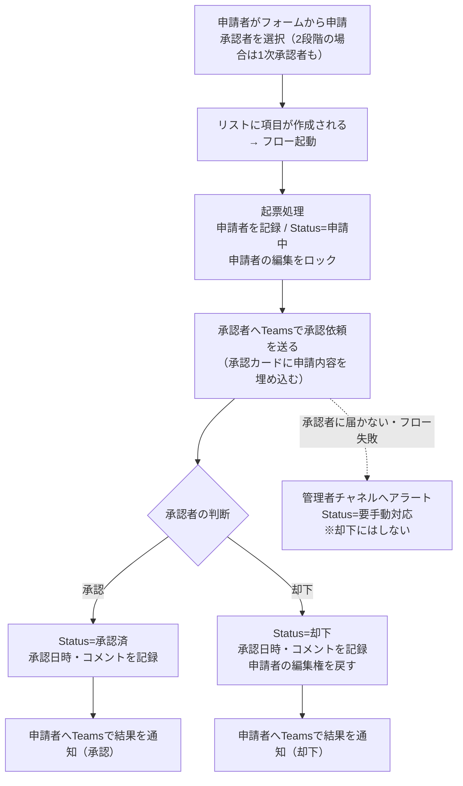
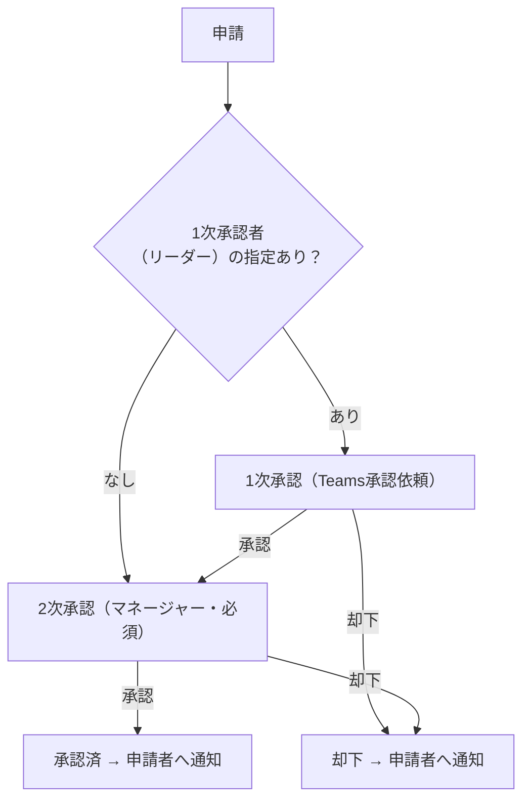

---
tags:
  - ケーテック
  - 打ち合わせ
  - アジェンダ
client: ケーテック株式会社
created: 2026-10-06
updated: 2026-10-06
---

# 2026-10-06 打ち合わせ

親: [[00 MOC|ケーテック株式会社 MOC]] ／ 前回: [[2026-09-22 年休・慶弔・昼食の追加要望]]

> [!info] 開催日 2026-10-07（明日）。事前準備ノート
> 議題は5つ。①ver10の確認 → ②Power Automateの流れ共有 → ③追加要望ヒアリング → ④Power Query（時間があれば）→ ⑤マスタ確認。
> ver10の詳細はTeamsで送付済みのため、当日は**サマリーのみ**で進める。

## 0. 当日の進め方（目安）

| 順 | 議題 | 目的 | 目安 |
|---|---|---|---|
| 1 | ver10の確認 | 全変更が問題ないか承認をもらう／残り確認事項を解消 | 15分 |
| 2 | Power Automateの流れ | 次フェーズ(本番サイト作成＋フロー)の共通像を合意 | 15分 |
| 3 | 追加要望ヒアリング | 新規要望の有無を確認 | 10分 |
| 4 | Power Query設定 | 時間があれば総務のExcelで再トライ | 余った時間 |
| 5 | マスタの確認 | 設定済みマスタの中身を先方と一緒に確認 | 10分 |

---

## 1. ver10の変更サマリーと確認

前回(09-22)の打ち合わせ以降の変更はすべて ver10 系（10.0.2〜10.0.4）。**全部入れ替え済みなので、問題ないかの最終確認**が目的。

### 1-1. 変更サマリー

| 版 | 対象 | 変更の要点 |
|---|---|---|
| **10.0.2** | 許可申請 | **廃止** |
| | 海外保険(No.3) | 渡航者の詳細項目追加／渡航先をプルダウン化／「帰国日」→「帰宅日」／承認者の選び方を他と統一 |
| | 年休(No.7) | 遅刻・早退の時刻を「時」「分」の2プルダウンに分割 |
| | 昼食(No.6) | **1申請＝1人分**に戻す(人数・明細・数量を廃止)／前回内容の引き継ぎ／**承認者なし**で申請 |
| | 全APP(昼食除く) | **2段階承認**(1次=リーダー任意 → 2次=マネージャー必須) |
| **10.0.3** | 慶弔(No.2) | 項目順の変更／件名の自動作成変更／制度種別から「特別加算金」「社葬等協議事項」を削除／結婚祝金・弔慰金の対象者選択肢を変更／出産祝金・傷病見舞金の入力欄追加／「事実発生日」を制度ごとに呼び分け／慶弔マスタ更新 |
| **10.0.4** | 年休 | 「内容」の①〜⑦記号を削除／長い選択肢の折り返し表示／遅刻・早退で終了日・日数を選択不可／時刻欄の整理／「時」を8〜17のみに／項目名を「開始時刻-時」等に |
| | 慶弔 | 「起票区分」「対象者(代理申請)」を年休と同じ構成に戻した／結婚祝金×子女では「挙式あり」を選択不可に |
| | 昼食 | メニューをプルダウン選択に |

詳細: [[30-プラットフォーム/spo/ver10/ver10.0.2 リリースノート（先方送付用）|10.0.2]] ／ [[30-プラットフォーム/spo/ver10/ver10.0.3 リリースノート（先方送付用）|10.0.3]] ／ [[30-プラットフォーム/spo/ver10/ver10.0.4 リリースノート（先方送付用）|10.0.4]]

### 1-2. 先方に確認したいこと（ver10の残り確認事項）

- [ ] **全体**: ver10.0.2〜10.0.4の変更内容に問題ないか（実機確認の結果、気づいた点）
- [ ] **昼食 / メニュー（10.0.4 ⑨）**: 依頼文の「下記メニューについて」以降が**こちらに届いていなかった**。「メニュー欄をプルダウンにする」の理解で合っているか
- [ ] **昼食 / 前回内容の引き継ぎ（10.0.2 ⑧）**: テスト環境で「前と同じ内容が出てこない」との報告あり。**現在も再現するか**
- [ ] **慶弔 / 代理申請（10.0.4 ⑦）**: 代理申請のとき「対象者(代理申請)」と「対象者(従業員台帳から検索)」の**2か所で対象者を選ぶ**形になる。手間として問題ないか／台帳検索欄は不要か（不要なら雇用形態・勤続年数の自動入力はなくなる）
- [ ] **慶弔 / 10.0.3期間中に出された代理申請**: 「対象者(代理申請)」が空欄のまま。移し替えは未実施だが問題ないか
- [ ] **年休 / 既存申請の「内容」**: 提出済みの申請には①〜⑦付きの内容が残る（新規申請から記号なし）。問題ないか
- [ ] **年休 / 列の表示名**: 時刻(開始)/(終了)を「開始時刻/終了時刻」にそろえるか（任意・W-5）
- [ ] **2段階承認 / 役職**: 「1次承認者=リーダー」「承認者=マネージャー」に実際に役職の方を選ぶかはシステムで判定できない。**誤選択は運用でカバー**でよいか
- [ ] **慶弔 / 10.0.3の確認事項**: 「事実発生日」の呼び分け、お子様氏名欄（結婚祝金/出産祝金）の整理の2点が先方に伝わっているか
- [ ] **年休 / 内容の号と取得日数**: 「①〜⑦の上限日数」と実際の取得日数の整合チェックは未実装（承認者の目視）。引き続きこの運用でよいか

> [!warning] 過去の未解決（打ち合わせで触れておく価値があるもの）
> - 承認者Person Pickerで**氏名検索だと出てこない人**がいる件: 15→30に緩和済みだが根本原因は未特定。**今も出てこない人はいるか**
> - 結婚祝金の「子女 第一子／第一子以外」の金額区別、傷病見舞金「休業4週間以上」は承認者の目視判断でよいか → [[05 要確認事項]]
> - 昼食締切が **8:15（08-17回答）と 8:30（08-27依頼）で食い違い**。実装は8:30（V-1）

---

## 2. 次フェーズ: サイトの正式作成とPower Automate

> [!important] 今回のSPOサイトの確認が済んだら
> 次は ①**本番サイトの正式な作成** → ②**Power Automateフローの作成**。
> フローは**各リストでほぼ同じ構成**（差分はトリガー先リスト・スナップショット列・承認段数だけ）。
> 先方には下の図で「申請→Teams通知→承認→結果が戻る＋通知」の流れを説明する。

### 2-1. フローの全体像（全リスト共通）

### 2-2. 2段階承認のAPP（年休・仮払金・慶弔・海外保険）

- **昼食申込は承認なし**（フローは「受付の記録＋通知」程度になる想定）
- フローは年休(No.7)を雛形に1本完成させ、他のAPPへ横展開する

### 2-3. 先方と合意したいこと（フロー作成前に決める）

- [ ] **通知の手段・宛先**: 承認依頼＋結果通知はTeams（個人チャット）でよいか。メールも併用するか（C-3）
- [ ] **管理者アラートの通知先**: 失敗時に通知するTeamsチャネルを用意してもらえるか（部署単位のチャネル。個人宛は不可）
- [ ] **却下時の再申請**: 却下後は「新規で出し直し」でよいか（編集権を戻す方式を想定）
- [ ] **フロー・リストの所有アカウント**: 個人所有を避け、サービスアカウント＋共同所有にしたい（C-4・属人化防止）
- [ ] **本番サイトの管理者**（サイト作成・権限グループの作成担当）
- [ ] **督促（滞留した承認のリマインド）**: 今回は対象外（簡易承認方式ではスコープ外）でよいか（No.13）
- [ ] **取消操作**（昼食）: 誰がいつまで取消せるか
- [ ] **`ApplicantDepartment`（申請者の所属部署）の扱い**: Entra IDの部署属性が全員に入っているか（★C-7）。入っていなければ従業員マスタから取る形に切り替える
- [ ] **フロー作成時の動作確認の協力**: テスト申請に付き合ってもらえるか（承認者役が必要）

参考: [[Power Automate フロー設計図（簡易承認方式）]] ／ [[申請ポータル - Power Automateフロー設定手順（簡易承認方式）]]

---

## 3. 追加要望のヒアリング

ver10までの要望はすべて取り込み済み。バックログは空（[[30-プラットフォーム/spo/ver10/ver10 要望事項]]）。

- [ ] 年休・慶弔・昼食・海外保険・仮払金の**ほかに追加したい要望はあるか**
- [ ] 実機で触ってみて気づいた不便・誤り
- [ ] フロー化にあたって**通知の文面や項目**で希望はあるか
- [ ] 保留・見送り中のAPP（旅費・督促・付与基準・Ktec Apps・マクロ統合）を**今後どうするか**（再開希望があるか）→ [[申請ポータル - 見送り・保留したAPP]]

聞いた内容はこのセクションに追記し、`ver10 要望事項` ではなく**ver11以降のバックログ**として管理する。

---

## 4. ExcelでSharePointリストを引っ張る Power Query（時間があれば）

目的: 総務が**毎月20日締めの年休一覧**や**慶弔の印刷用一覧**を、開発なしでExcelから出せるようにする。

**手順**
1. Excel「データ」→「データの取得」→「SharePointリストから」→ サイトURLを入力 → `LeaveRequests`（慶弔は `KeichoReports`）
2. Power Queryエディタで対象期間（前月21日〜当月20日）にフィルタ
3. 必要な列だけ残して読み込み、ピボット等で集計
4. 以降は「更新」だけで最新化

**当日の確認ポイント**
- [ ] **総務の権限**: 全件取れるか。取れない（自分の分しか出ない）場合は、**Power Automateで月次にExcel/CSVを書き出す**案に切り替える（[[テーマ3 - 総務の全件閲覧をどう成立させるか]]）
- [ ] **フィルタ基準の日付列**: 「取得日(開始)」＝休暇を取った日基準か、「申請日」＝申請した日基準か（未確認）
- [ ] 前回うまくいかなかった点（認証・列の展開など）があれば、その場で再現して直す
- [ ] 慶弔の「1申請＝1枚・承認印欄付き」の印刷用レイアウトをExcelで作る方針で最終OKか

参考: [[申請ポータル - APP No.07 年休申請]]（毎月20日締めの出力）

---

## 5. マスタの確認

マスタの設定は先方で実施済みとのことだが、**一度中身を一緒に確認したい**旨を伝える。

| マスタ | 内容 | 確認ポイント |
|---|---|---|
| **従業員マスタ**(`EmployeeMaster`) | 雇用形態・入社日等。慶弔の自動入力・金額算出に利用 | 全員登録済みか／**更新責任者と更新頻度**（未定のまま）／派遣・未登録者の扱い |
| **慶弔マスタ**(`KeichoMaster`) | 制度種別×対象者×雇用区分×同居×業務上 → 支給額 | 規程と金額が一致しているか／ver10.0.3の改訂後の内容／結婚祝金の第一子以外の金額 |
| **メニューマスタ**(`MenuMaster`) | 昼食メニューと価格 | メニュー5種＋価格が現行どおりか／「提供中」フラグ（プルダウンに出るのは提供中のみ） |
| **営業日カレンダー**(`BusinessCalendar`) | 会社休日（土日＋四角枠のGW/お盆/年末年始） | 2026年度データの投入状況／**お盆期間が入っているか**（8/7〜8/17が4日になること）／**来年度の更新担当** |
| **渡航先マスタ**(`DestinationMaster`) | 海外保険の渡航先 | ver10.0.2で渡航先をプルダウンに変更後、**現在も使うか**（不要なら整理） |

- [ ] 各マスタの**更新担当者・更新タイミング**を決める（「メンテされないマスタは無いより悪い」→ [[テーマ4 - マスタを増やすか]]）
- [ ] 本番サイトを作り直す際の**マスタデータの投入元**（現行のseed or 先方のExcel）を決める

---

## 6. 議事メモ（当日記入）

### 決まったこと
-

### 持ち帰り（こちら）
-

### 持ち帰り（先方）
-

### 次回
-

## 関連

- [[05 要確認事項]] ／ [[02 依頼と対応の台帳]]
- [[申請ポータル - 00 概要]] ／ [[申請ポータル - SPOサイト構成とリスト一覧]]
- [[30-プラットフォーム/spo/ver10/ver10 要望事項]]
