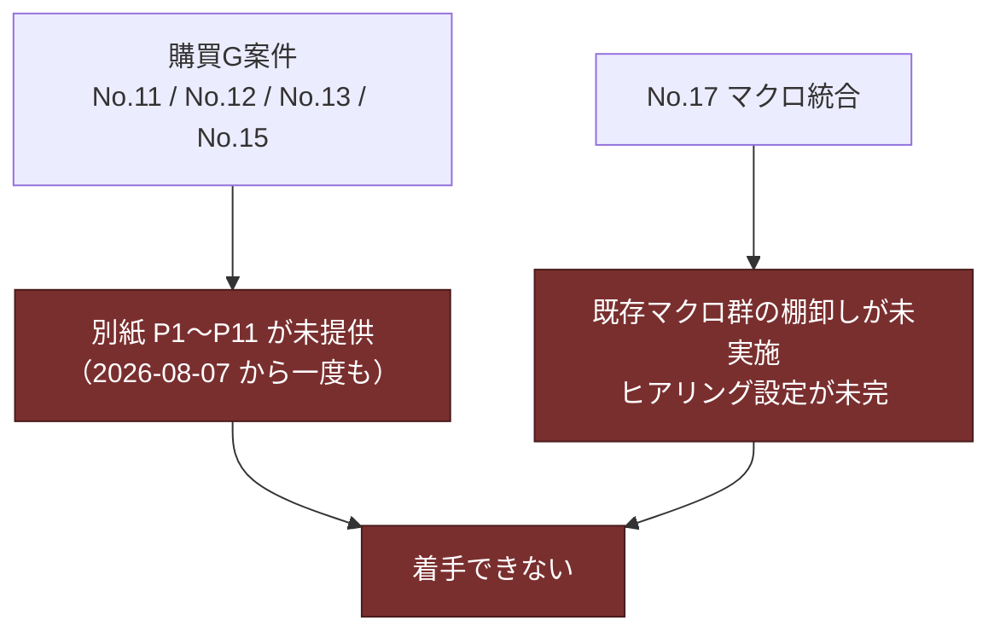

---
tags:
  - ケーテック
  - 課題テーマ
client: ケーテック株式会社
created: 2026-09-05
updated: 2026-09-05
---

# テーマ1｜依頼14件のうち、何を作り、何を作らないか

親: [[00 MOC|ケーテック株式会社 MOC]]

## 配下の案件

- [[申請ポータル - 00 概要|社内申請ポータル]]（開発中） — A型（申請・承認フロー型）5本＋昼食を集約したもの

## 現状

先方から18件の依頼を受け、14件を対象として整理した。**2026-09-05 時点で完成したのは5本**。

| 結末 | 件数 | 内訳 |
|---|---|---|
| 構築済み | 5 | No.1 仮払金 / No.2 慶弔 / No.3 海外保険 / No.6 昼食 / No.7 年休 |
| 仮組みのまま | 1 | No.11 許可申請（別紙未入手） |
| 保留 | 1 | No.12 旅費 |
| 取り下げ | 4 | No.8 実印 / No.9 勤怠 / No.10 日程調整 / No.14 付与基準 |
| 未着手 | 3 | No.13 督促 / No.15 Ktec Apps / No.17 マクロ統合 |

→ [[01 依頼の全体像（IT依頼事項18件）]] ／ [[申請ポータル - 見送り・保留したAPP]]

## この論点が「まだ決まっていない」理由

「14件やる」という合意はどこにもない。実際には**1件ずつヒアリングして、やるかやらないかを
その場で決めてきた**。そして減り続けている。

- 2026-08-17: 3件が取り下げ（No.8 / No.9 / No.10）
- 2026-08-27: 1件保留・1件取り下げ（No.12 / No.14）

**どこで止めるのか、残り3件（No.13 / No.15 / No.17）に手を付けるのかは決まっていない。**

## 取り下げの理由には3つの型がある

| 型 | 例 | 意味するもの |
|---|---|---|
| **① そもそも自動化の余地が無かった** | No.9 勤怠（「現状を確認したところ自動化要素なし」） | 元Excelは困りごとの列挙であって、業務分析ではなかった |
| **② 標準機能で足りていた** | No.10 日程調整（Outlookで完結） | 「システムが無い」のではなく「使い方が共有されていない」だけだった |
| **③ 電子化すると負担が増える** | No.12 旅費（工番管理との親和性から紙の方が申請者負担が軽い） | **最も重要な型。** 業務の絡み合いを無視して電子化すると悪化する |

> [!important] ③ が最も示唆的
> No.12 の保留理由は「システムが作れない」ではなく「**システムにすると申請者が余計な情報を
> 入力することになる**」だった。工番（工事番号）と申請経路が絡み合っている。
> 同じことが No.11（許可申請）や No.17（マクロ統合）でも起きうる。

## 完成した5本に共通していること

| 条件 | 説明 |
|---|---|
| **要望部署が経営SPG** | 総務人事・経理まわりで、業務が1部署に閉じている |
| **既存資産の調査が要らなかった** | 紙 or 手作業からの移行で、既存システムを読み解く必要がない |
| **A型（申請 → 承認 → 記録）に収まる** | 共通コンテンツタイプとSPFxの申請エンジンで雛形化できる |

**この3条件のいずれかが欠けると止まる**、というのが14件を通した経験則。

## 止まっている案件に共通していること

**工数の問題ではなく前提資料の問題**。→ [[05 要確認事項]] ★C-1

## 決めるべきこと

- [ ] **残り3件（No.13 / No.15 / No.17）に手を付けるのか、ここで一区切りにするのか**
- [ ] No.11 の別紙を待ち続けるのか、要件未確定のリストを一旦テナントから外すのか
- [ ] 完成した5本を**実運用に載せる**（＝フローを作る）のが先か、新しい案件に広げるのが先か
- [ ] No.12 の「紙の方が軽い」という判断は、工番管理を含めて再設計すれば覆るのか

> [!tip] 現時点での見立て
> **フローが1本も動いていない状態で新しい案件を増やすべきではない。**
> 5本のAPPは「リストとフォームがある」だけで、申請業務としては1件も回っていない。
> → [[申請ポータル - 00 概要]] の「到達点」

## 関連

- [[テーマ5 - 既存システムとの併存と属人化解消]] — 「作らない」判断の背骨にある制約
- [[テーマ6 - 未着手の横断依頼]] — 残り3件の中身
