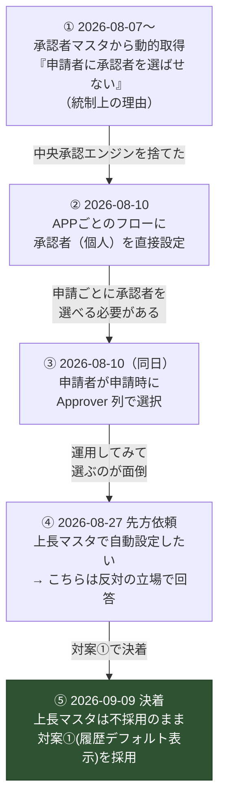

---
tags:
  - ケーテック
  - 課題テーマ
  - 設計判断
client: ケーテック株式会社
created: 2026-09-05
updated: 2026-09-09
---

# テーマ2｜承認者をどう決めるか（マスタ動的解決 vs 申請時選択）

親: [[00 MOC|ケーテック株式会社 MOC]]

> [!important] このプロジェクトで最も方針が揺れた論点 → 2026-09-09に決着
> **2026-08-10 の1日のうちに2回**方針が変わっている。そして 2026-08-27 に先方から
> 「上長マスタで自動設定したい」という依頼が来て、振り出しに戻る可能性が出ていたが、
> **2026-09-09、上長マスタは不採用のまま、対案①(履歴デフォルト表示)を採用することで決着した。**

## 変遷

## ① 承認者マスタ方式（採用しなかった）

`ApproverMaster`（承認者マスタ）を持ち、部署名をキーに承認者を引く。

| 列 | 用途 |
|---|---|
| `Title`（部署名） | キー |
| `PrimaryApprover` | 1段目の既定承認者 |
| `DeputyApprover` | 所属長不在時 |
| `UpperManager` | 2段目承認・督促エスカレーション先 |
| `IsActive` | いいえ の行は解決対象外 |
| `NotifyChannelName` | 通知チャネル名 |

**メリット**: 統制が効く（申請者が勝手に緩い承認者を選べない）。承認者の変更が1箇所で済む。

**採用しなかった理由**: 中央承認エンジン方式を捨てたことに連動。加えて後述のメンテナンス問題。

## ③ 申請時選択方式（現行）

**申請者が新規フォームの `Approver` 列（Person）で承認者を選ぶ。**
フローはその値をそのまま「承認の開始と待機」の宛先として使う。

| 実装 | 内容 |
|---|---|
| 列 | 共通サイト列 `Approver`（User、必須） |
| 新規フォーム | **表示**（申請者が選ぶ） |
| 編集フォーム | **非表示**（`ShowInEditForm="false"`）。提出後に差し替えられると承認整合性が崩れるため |
| 選択肢の制限 | **なし**（テナント内の全ユーザーから選べる） |

### 既知の弱点

> [!warning] 退職者・異動済みの人物を選べてしまう
> マスタによる選択肢の制限が無いため、誤選択が起こりうる。
>
> **フォールバック**: 承認者に到達できない場合は、管理者チャネルへアラート ＋ `Status=要手動対応` に更新する。
> **承認者に到達できなくても申請を却下にしない**（共通部品として全フローに組み込む必須設計）。
> ただし**まだ未実装**（フローが1本も無いため）。

## ⑤ 決着（2026-09-09）

**上長マスタは不採用のまま、対案①(前回選んだ承認者を初期値表示)を採用して実装した。**
`Approver`列の申請時選択という現行方式(③)自体は変わっていない。「毎回選ぶのが面倒」という
先方の不満(④の背景)は、選択の手間を減らすことで解消し、統制上の懸念(誰が承認者を選ぶか)は
維持したまま両立させた。

実装内容: 新規申請フォームを開いたとき、自分がそのリストに直近提出した申請の`Approver`を
初期値として表示する(リストごとに独立。承認確定前でも直近1件を使う。上書き可能)。
→ 詳細は [[2026-09-09 承認者履歴・営業日カレンダー・従業員マスタ導入]]

## ④ 上長マスタ案（2026-08-27 の先方依頼・不採用で決着）

> 「承認者は上長情報から自動設定したい。ただしM365の上長情報は異動のたびに手入力が必要で
> 運用負荷が高いため、**上長マスタを別リストで管理する案**を検討したい（担当者ベース/部署単位の
> どちらが良いか要検討）」

**先方自身が「M365の上長情報はメンテされない」と認めたうえで、別マスタを提案している**点に注意。

### こちらの立場: 反対（メール文案作成済み・回答待ち）

| 反対理由 | 内容 |
|---|---|
| メンテナンスされない実績 | M365の上長情報が維持できていないなら、別リストにしても同じことが起きる |
| 誤設定時の影響範囲が大きい | マスタが間違っていると**全申請が間違った承認者へ飛ぶ**。申請時選択なら1件で済む |

### 提示している対案

1. **前回選んだ承認者を初期値表示する**（選ぶ手間だけを減らす）
2. **承認者候補をグループに限定する**（誤選択のリスクだけを減らす）

→ 詳細は [[テーマ4 - マスタを増やすか]]

## 比較表

| 観点 | ① 承認者マスタ | ③ 申請時選択（現行） | ④ 上長マスタ |
|---|---|---|---|
| 統制（緩い承認者を選ばせない） | ○ | **✕** | ○ |
| 申請者の手間 | ○（選ばなくてよい） | △（毎回選ぶ） | ○ |
| メンテナンス負荷 | **✕**（異動のたびに更新） | ○（不要） | **✕**（同左） |
| 誤りの影響範囲 | 大（全申請） | 小（1件） | 大（全申請） |
| 承認者が不在・退職のとき | マスタ側で吸収できる | フォールバックで吸収（未実装） | マスタ側で吸収 |
| 申請ごとに承認者を変えられるか | ✕ | **○** | ✕ |
| 実装コスト | マスタ＋解決ロジック | **ほぼゼロ** | マスタ＋解決ロジック＋メンテ運用 |

> [!tip] 論点の本質
> 「どちらの方式が優れているか」ではなく、**このプロジェクトの制約
> （[[テーマ5 - 既存システムとの併存と属人化解消]]）の下でどちらが持続するか**。
> 承認者マスタが機能するのは「誰かが責任を持って維持する」場合だけで、
> **その責任者が決まっていないなら申請時選択の方が壊れにくい**。
>
> 逆に、承認の統制（自分に甘い承認者を選ぶ）が実際に問題になるなら、
> 対案②（候補をグループに限定）で十分な可能性が高い。

## 決めるべきこと

- [x] ~~上長マスタを作るか~~ → **2026-09-09、不採用で決着**
- [x] ~~作らない場合、対案①②のどちらを実装するか~~ → **対案①（前回値の初期表示）を実装（2026-09-09）**
- [ ] 承認者に到達できない場合のフォールバックを、どのフローから実装するか（未着手）
- [ ] 「申請者が自分に甘い承認者を選ぶ」ことが実際に起きているか（運用実績が無いため未検証）

## 関連

- [[申請ポータル - 承認方式（簡易承認への転換）]] — 方式転換の全体像
- [[申請ポータル - 共通列とコンテンツタイプ]] — `Approver` 列の実装
- [[申請ポータル - APP No.07 年休申請]] — 上長マスタ依頼の発端
