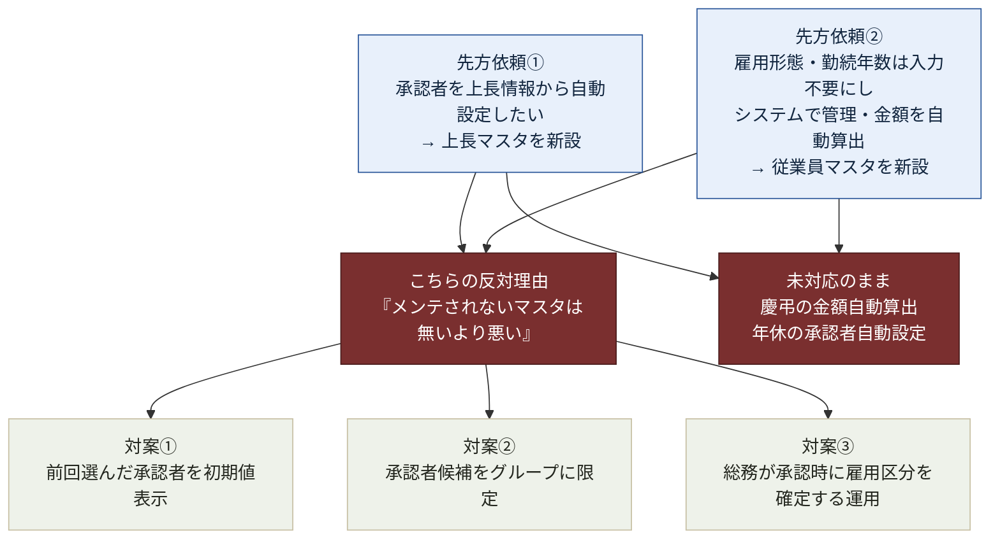

---
tags:
  - ケーテック
  - 課題テーマ
  - 設計判断
client: ケーテック株式会社
created: 2026-09-05
updated: 2026-09-09
---

# テーマ4｜マスタを増やすか（上長マスタ・従業員マスタ）

親: [[00 MOC|ケーテック株式会社 MOC]]

> [!important] 2026-09-09、2つの依頼への結論が出た(片方は不採用、片方は方針転換)
> 2026-08-27 に先方から出た2つの依頼に対し、当初こちらは両方に反対の立場だった。
> **依頼①(上長マスタ)は不採用のまま決着**([[テーマ2 - 承認者をどう決めるか]]の対案①採用で解消)。
> **依頼②(従業員マスタ)は、対象が約50名という規模を理由に、持つ判断へ転換した。**
> 詳細は [[2026-09-09 承認者履歴・営業日カレンダー・従業員マスタ導入]]。

## 論点の構図

## 依頼① 上長マスタ

> 「承認者は上長情報から自動設定したい。ただしM365の上長情報は異動のたびに手入力が必要で
> **運用負荷が高い**ため、上長マスタを別リストで管理する案を検討したい
> （担当者ベース/部署単位のどちらが良いか要検討）」

### こちらの反対理由

| 理由 | 内容 |
|---|---|
| **メンテナンスされない実績がある** | 先方自身が「M365の上長情報は異動のたびに手入力が必要で運用負荷が高い」と言っている。**同じ人が別リストを維持できる根拠がない** |
| **誤設定時の影響範囲が大きい** | マスタが古いと**全申請が間違った承認者へ飛ぶ**。申請時選択なら誤りは1件で済む |

### 対案

1. **前回選んだ承認者を初期値表示する** — 選ぶ手間だけを減らす
2. **承認者候補をグループに限定する** — 誤選択のリスクだけを減らす

→ 承認者方式の全体像は [[テーマ2 - 承認者をどう決めるか]]

## 決着（2026-09-09）

| 依頼 | 結論 | 理由 |
|---|---|---|
| ①上長マスタ | **不採用** | [[テーマ2 - 承認者をどう決めるか]]の対案①(履歴デフォルト表示)で「選ぶ手間」の不満を解消できたため、マスタ新設のメンテナンスリスクを取る必要が無くなった |
| ②従業員マスタ | **採用(方針転換)** | 対象が約50名という規模から、「メンテされないマスタは無いより悪い」という基準の例外として扱った。ただし更新責任者・更新頻度は依然未定のまま実装している(下記参照) |

`EmployeeMaster`は総務提供のCSV(約56名)を元に新設した。慶弔連絡の`雇用形態`・`勤続年数`は、
対象者をこのマスタから検索・選択すると自動反映され編集不可になる(マスタ未登録者・「派遣」等
変換できない雇用形態のみ自己申告のまま)。`上長`(Supervisor)列は依頼①が不採用で決着したため、
受け皿として用意していたが不要と判断し削除した。

> [!warning] 「メンテされないマスタは無いより悪い」という基準自体は撤回していない
> 今回は「初回データが手に入ったから作った」のであって、「更新責任者が決まったから作った」の
> ではない。異動・退職のたびに誰がどうやって`EmployeeMaster`を更新するかは**依然未定**。
> この点が崩れたら、当初の懸念どおり「古いマスタが正しい顔をして間違った値を出す」リスクが
> 現実化する。→ 下記「決めるべきこと」に追記

## 依頼② 従業員マスタ（EmployeeMaster）

> 「雇用形態および勤続年数は入力不要とし、システムで管理する」
> 「慶弔金額はマスタ情報を基に自動算出・表示する」

慶弔連絡（No.2）の以下3列を自動化したいという依頼。

| 列 | 現状 |
|---|---|
| `EmploymentType`（雇用形態） | 申請者の**自己申告**（正社員/嘱託員/パート/契約社員） |
| `YearsOfService`（勤続年数） | 申請者の**自己申告**（自動計算なし） |
| `PlannedAmount`（支給予定額） | フローが `KeichoMaster` から算出する想定（フロー未実装） |

慶弔金額は「制度種別 × 対象者 × **雇用区分** × 同居条件 × 傷病条件」で決まるため、
**雇用区分が確定しないと金額も確定しない**。

### こちらの反対理由と確認質問

反対理由は上長マスタと同じ。加えて、以下を確認する質問を用意している。

- **台帳の所在**（[[Prevision（勤怠・外部製品）]] 等に既にあるのか）
- **CSV 抽出可否**
- **更新責任者は誰か**

### 対案

**総務が承認時に雇用区分を確定する運用**。
申請者の自己申告を承認者（総務）が確認して確定させる。マスタを持たずに正確性を担保する。

## こちらの一貫した判断基準

> [!important] 「メンテされないマスタは、無いより悪い」
> マスタが古いと、**間違った値が正しい顔をして全件に適用される**。
> 自己申告なら「これは自己申告だ」という前提が関係者に共有されるため、承認者が確認する。
>
> この基準は [[テーマ5 - 既存システムとの併存と属人化解消]] から来ている。
> No.7 のやり直し理由が「前任者しかメンテできない」であり、
> **維持できないものを作らない**ことがこのプロジェクトの背骨になっている。

## すでに持っているマスタとの違い

なぜ `KeichoMaster` / `MenuMaster` / `BusinessCalendar` は持てて、上長マスタは持たないと判断したのに
従業員マスタだけ持つ判断に転換したのか。

| マスタ | 更新頻度 | 更新のきっかけ | 誰が更新するか | 判定 |
|---|---|---|---|---|
| `KeichoMaster` | 数年に1回 | **規程の改定** | 総務人事 | ○ 持てる |
| `MenuMaster` | 年に数回 | **価格改定** | 総務 | ○ 持てる |
| `BusinessCalendar` | 年1回 | **年間カレンダーの確定** | 総務 | ○ 持てる |
| `DestinationMaster` | 稀 | 新しい渡航先が出たとき | 総務 | ○ 持てる |
| **上長マスタ** | **異動のたび** | 人事異動（不定期・通知が来ない） | **未定** | ✕ 不採用のまま決着 |
| **従業員マスタ**(`EmployeeMaster`) | **入退社・昇格のたび** | 人事イベント（同上） | **未定のまま** | △ **2026-09-09、規模(約50名)を理由に持つ判断へ転換。更新責任者は依然未定** |

> [!warning] 従業員マスタだけ判定基準の例外にした
> 「更新のきっかけが可視か」という分かれ目に照らせば、従業員マスタも上長マスタと同じく✕のはず。
> 今回持つ判断にしたのは**対象人数が少ない(約50名)ことを理由にした例外扱い**であり、
> 「更新責任者が決まった」という本来の判定基準をクリアしたわけではない。
> 将来この前提が崩れた場合(全社展開で人数が増える等)、再度上長マスタと同じ結論(✕)に
> 戻す可能性がある。

> [!tip] 分かれ目は「更新のきっかけが可視か」
> 規程改定・価格改定・年間カレンダーは**イベントとして総務に届く**。
> 人事異動は**システムの更新担当者には届かない**（人事部門の中で完結する）。
> これが持てるマスタと持てないマスタの境界線。
>
> **逆に言えば、Entra ID の部署属性が正しく維持される仕組みがあるなら話が変わる。**
> → [[05 要確認事項]] ★C-7

## 決めるべきこと

- [x] ~~上長マスタを作るか~~ → **2026-09-09、不採用で決着**
- [x] ~~従業員マスタを作るか~~ → **2026-09-09、作る判断に転換**(`EmployeeMaster`新設)
- [ ] **`EmployeeMaster`の更新責任者・更新頻度**(異動・退職のたびに誰がどう反映するか。未定のまま実装した)
- [ ] 従業員台帳が Prevision・HRBrain 等から定期的にCSV抽出できる運用になっているか(今回は単発提供)
- [ ] `EmployeeUser`(テナントユーザー名)の紐付け方法(受領データにメールアドレスが無いため初回投入時は空欄)
- [ ] Entra ID の部署属性が全社員分整備されているか（★C-7。整備されているなら
  `ApplicantDepartment` の自動取得が成立し、部署単位の承認者解決も現実的になる）

## 関連

- [[テーマ2 - 承認者をどう決めるか]] — 依頼①の詳細
- [[申請ポータル - APP No.02 慶弔連絡]] — 依頼②の詳細
- [[申請ポータル - アーキテクチャ全体像]] — マスタの「正」がどこにあるか
