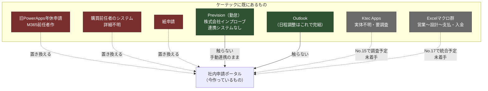

---
tags:
  - ケーテック
  - 課題テーマ
client: ケーテック株式会社
created: 2026-09-05
updated: 2026-09-05
---

# テーマ5｜既存システムとの併存と属人化解消

親: [[00 MOC|ケーテック株式会社 MOC]]

> [!important] このプロジェクトのすべての設計判断の背骨
> No.7（年休申請）のやり直し理由が **「現状M365前任者しかメンテできない（PowerAppsが複雑なため）」**
> だったこと。機能の不具合ではなく**引き継げないこと**が理由だった。
> ここから「複雑さを持ち込まない」という一貫した判断基準が生まれている。

## 現状: 併存しているもの

## 年休申請だけで3系統が併存している

2026-08-17 のヒアリングで判明。

| 系統 | 状態 |
|---|---|
| 紙申請 | 現役 |
| 購買前任者が作ったシステム | 現役 |
| M365前任者が作った PowerApps | 現役だが**その人しかメンテできない** |

**現物へのアクセス権は未付与**のため、既存データの移行要否は判断できていない。
→ [[旧PowerApps年休申請（前任者作）]] ／ [[05 要確認事項]]

## 「触らない」と決めたもの

| 対象 | 判断 |
|---|---|
| **Prevision（勤怠システム）** | 連携システムが無く、運用は「Previsionで有休・半休を選択 → Excel 書き出し → 社労士へメール送付」の手動フロー。**このまま変えない** |
| **Outlook（日程調整）** | 標準機能で完結しているため No.10 は取り下げ |
| **保険会社の専用サイト** | 総務の手入力のまま（No.3 のスコープ外） |
| **旅費の紙運用** | 工番管理との親和性から、当面は紙の方が申請者負担が軽い（No.12 保留） |

## 属人化解消のために実際にやったこと

| # | 施策 | どの依頼から来ているか |
|---|---|---|
| 1 | **中央承認エンジン方式を捨て、簡易承認方式にした** | 「前任者しかメンテできない」への直接の応答。中央エンジンは同じ失敗を繰り返す構造だった → [[申請ポータル - 承認方式（簡易承認への転換）]] |
| 2 | **マスタを増やさない** | 上長マスタ・従業員マスタに反対 → [[テーマ4 - マスタを増やすか]] |
| 3 | **承認者マスタを廃止し、申請時選択にした** | マスタのメンテナンス責任者が決まらないため → [[テーマ2 - 承認者をどう決めるか]] |
| 4 | **マスタ管理をGUI画面にした** | 価格改定・規程改定でエンジニアを呼ばなくて済む（2026-08-10） → [[申請ポータル - SPFx申請ポータル（画面側）]] |
| 5 | **デプロイを対話式ウィザード1本にした** | 非エンジニアが「git pull → 適用」を完結できる → [[申請ポータル - デプロイ経路]] |
| 6 | **前提ソフトの導入手順を Windows/Mac 両方で書いた** | 同上（`docs/setup-prerequisites.md`） |
| 7 | **月次出力を Power Query で提示した** | 開発物を増やさない（総務のExcelブックだけで完結） |
| 8 | **申込漏れの救済を運用で吸収した** | 専用の代理申請UIを作らない |
| 9 | **リポジトリを正（IaC）にした** | テナントを直接いじる運用を禁じ、変更履歴を git に残す |

> [!tip] 一貫しているのは「開発物を増やさない」こと
> 施策 2・7・8 はいずれも**「作らない」提案**。
> 機能を足すより、**維持コストを足さない**ことを優先している。

## ただし、まだ属人化が残っている箇所

| 箇所 | 内容 |
|---|---|
| **Power Automate フロー** | GUI 作成のため、リポジトリには zip でしか残らない。**作った人しか構造が分からない**という構造は残っている |
| **フローの所有アカウント** | 個人所有を避け共有所有/サービスアカウントにするか**未確定**（`issues/99` C-4）。No.12 で顕在化していた問題 |
| **接続参照** | dev で作った接続を prod に持ち込まない、prod ではサービスアカウントで作成し共同所有者を設定する、という方針はあるが**実施は未着手** |
| **`template/_extracted/` からの切り出し** | テナント側の変更をリポジトリへ戻す作業は人力 |
| **列定義と `requestTypes.ts` の二重管理** | 対で更新する規律に依存している |

> [!warning] フロー本体が最大の残存リスク
> このプロジェクトは「引き継げないシステムを作り直す」案件なのに、
> **未実装のフローが同じ性質（GUI作成・コード管理外・作った人依存）を持っている。**
> フロー実装時には、命名規約・環境変数の使用・所有アカウント・接続参照の方針を
> **先に決めてから作る**こと。→ `flows/README.md` の必須ルール

## 決めるべきこと

- [ ] フロー・リストの所有アカウント方針（個人所有を避けるか）— ★C-4
- [ ] 旧PowerApps・購買前任者システムの現物へのアクセス権
- [ ] 既存の年休申請データの移行要否
- [ ] 紙運用の廃止日（3系統併存をいつ解消するか）
- [ ] Ktec Apps の実体調査（No.15）に着手するか → [[テーマ6 - 未着手の横断依頼]]

## 関連

- [[Prevision（勤怠・外部製品）]] ／ [[Ktec Apps（既存・実体未確認）]] ／ [[旧PowerApps年休申請（前任者作）]]
- [[申請ポータル - APP No.07 年休申請]] — 発端
