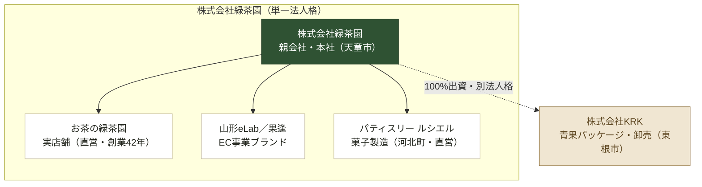
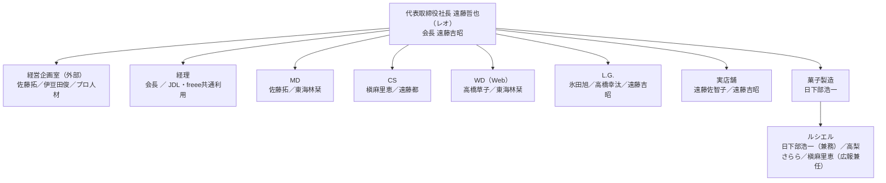

---
tags:
  - 緑茶園
  - 経営構造
client: 緑茶園グループ
created: 2026-08-29
updated: 2026-09-04
---

# 資本・ブランド構造

親: [[00 MOC|緑茶園グループ MOC]]

## 要点

お茶の緑茶園・山形eLab／果逢・パティスリー ルシエルは、すべて**株式会社緑茶園という同一法人の中の事業（屋号）**。法人格として独立しているのは**株式会社KRKだけ**で、緑茶園が100%出資する子会社という関係になっている。

実線＝同一法人内の事業部門、破線＝資本関係（別法人格）。代表取締役は緑茶園・KRKともに遠藤哲也氏が兼務している。

## 対応表

| 名称 | 位置づけ | 所在地 | 統括者 | ノート |
|---|---|---|---|---|
| 株式会社緑茶園 | 親会社・本社 | 天童市久野本3-1-33 | 会長 遠藤吉昭／社長 遠藤哲也 | [[株式会社緑茶園（本体）]] |
| 山形eLab／果逢 | EC事業ブランド（緑茶園の屋号） | 本社内に同居 | 遠藤哲也（通販業務責任者） | [[山形eLab・果逢]] |
| お茶の緑茶園 | 実店舗ブランド（緑茶園の直営） | 天童市久野本3-1-33（電話 023-654-3032） | 店長 遠藤佐智子 | [[お茶の緑茶園]] |
| パティスリー ルシエル | 菓子製造ブランド（緑茶園の直営・法人格なし） | 河北町西里377-5 | パティシエ 日下部浩一（緑茶園従業員） | [[パティスリー ルシエル]] |
| 株式会社KRK | 緑茶園100%出資の子会社 | 東根市松沢56-4 | 代表取締役 遠藤哲也（兼務） | [[株式会社KRK]] |

## 内部組織図（株式会社緑茶園）

代表取締役社長 遠藤哲也のもとに、本部機能と6つの事業部門が並ぶ。

- MD：新規獲得・売上最大化（CPA・顧客獲得数）
- CS：リピート促進（レビュー評価・注文件数）
- WD：転換率・Web滞在時間・アクセス数
- L.G.：発送個数・商品回転・トータル販売個数
- 実店舗：新商品発掘、リピート・新規獲得
- 菓子製造：ルシエルのパティシエ業務＋広報兼任体制

## 資本関係・議決権（分かっている範囲）

- KRKは緑茶園100%出資が確定（社内ヒアリング）。代表取締役も遠藤哲也で同一。
- 緑茶園本体の株主構成・議決権は非公開（有価証券報告書なし、EDINET非該当）。
- 創業者世帯＝会長 吉昭×佐智子夫妻、現経営＝哲也氏（子世代）と推定される。
- 資本金1,000万円（求人媒体記載、未確証）。

> [!warning] 誤引用注意
> 「お茶ECの月商2,000万円突破」として紹介される事例は**中根製茶株式会社（茶つみの里）**という別企業。山形eLabの実績として引用しない。

## 関連ノート

- [[02 沿革]]
- [[株式会社緑茶園（本体）]] / [[山形eLab・果逢]] / [[お茶の緑茶園]] / [[パティスリー ルシエル]] / [[株式会社KRK]]
