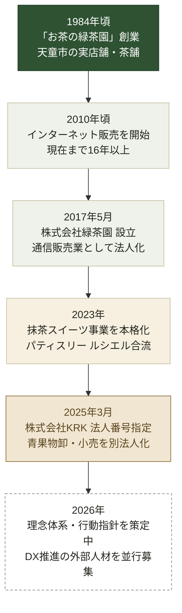

---
tags:
  - 緑茶園
  - 経営構造
client: 緑茶園グループ
created: 2026-08-29
updated: 2026-09-04
---

# 沿革

親: [[00 MOC|緑茶園グループ MOC]]

お茶（老舗実店舗）→ EC で地域食品を全国流通 → 菓子製造（ルシエル統合）→ 青果物流通を別法人化（KRK）という順番でドメインが拡張してきた。

> [!note] 色の意味
> 濃緑＝お茶（創業ドメイン）／淡緑＝EC／生成り＝菓子製造／ベージュ＝青果流通／白破線＝進行中。ドメインが積み上がってきた順序がそのまま色の並びになっている。

## 各段階の補足

- **1984頃 — 創業**：遠藤家の老舗茶舗として天童市で創業。2026年時点で創業42年。
- **2010頃 — EC開始**：果逢サイトに「インターネット販売においても16年以上の歴史」との記載があり、逆算するとこの頃が開始時期。
- **2017-05 — 法人化**：株式会社緑茶園設立（法人番号 8390001014903）。SalesNow DB調べ。
- **2023 — 抹茶スイーツ本格化／ルシエル合流**：山形トヨタ名店セレクション記事（2026-02-06）に「ご縁があって河北町のパティスリー ルシエルさんがグループ企業に加わり…」との記載。共同開発の「Chou×CHACHACHA（茶筒シュー）」が代表作に。
- **2025-03 — KRK法人番号指定**：社内ヒアリングでは「2025年1月設立」とされているが、法人番号公表サイトの指定日は2025-03-13。法人番号は登記と同時に付番されるため、実登記は3月頃、事業計画・準備開始が1月だった可能性が高い。厳密な設立日は法務局の登記事項証明書で確定できる。
- **2026 — 理念体系の再構築**：タグライン「そのひと時を、最高にする。」を第一候補として決定。詳細は [[07 理念体系とビジョン2029]]。

## 関連ノート

- [[01 資本・ブランド構造]]
- [[株式会社KRK]]
