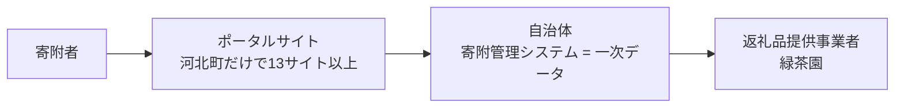

---
tags:
  - 緑茶園
  - 事業体
  - 販売チャネル
client: 緑茶園グループ
created: 2026-09-15
updated: 2026-09-15
aliases:
  - ふるさと納税
  - ふるさと納税返礼品
---

# ふるさと納税の取扱い（ポータル横断調査）

親: [[00 MOC|緑茶園グループ MOC]] ／ 関連: [[山形eLab・果逢]] / [[パティスリー ルシエル]] / [[株式会社緑茶園（本体）]] / [[platform - 10 変換器構想とMDC出力]]

> [!info] このノートの位置づけ
> ふるさと納税ポータルの横断調査（2026-09-15、Web検索ベース）。**どのサイトで・どの自治体の・どの商品が売られているか**という販売チャネルの外形整理。[[platform - 10 変換器構想とMDC出力]] に残っている「ふるさと納税の『枚数管理』の実体を確認する」（受注管理の内部運用）とは別軸で、そちらは**この調査では未解明のまま**。

## 結論

取り扱いは主に**山形県河北町**の返礼品として、**13サイト以上**のふるさと納税ポータルで展開されている。「提供事業者：株式会社緑茶園／販売事業者：グルメ＆ギフトお取り寄せ山形eLab」の名義。**さとふるでの取り扱いも確認済み**（[[山形eLab・果逢]] のYahoo!ショップ店頭でも「さとふる」へ誘導している）。

## 1. 河北町（西村山郡／自治体コード 06321）— 主戦場

河北町は令和6年度に14億1,067万円超の寄附を受けている人気自治体で、緑茶園グループはその主要な返礼品提供事業者の一角〔出典：河北町公式〕。

| ポータルサイト | 掲載確認 | 確認できた掲載例 |
|---|---|---|
| 河北町ふるさと納税特設サイト（自治体直営） | ◎ | 生産者一覧に「株式会社 緑茶園」明記。フルーツ定期便 ka074-029-r8 等 |
| さとふる | ◎ | 山形eLab果物（さくらんぼ・桃・ぶどう・米）、緑茶園の焼き菓子（11袋／22袋） |
| ふるさとチョイス | ◎ | 提供事業者「株式会社 緑茶園」名義（さくらんぼ紅秀峰・佐藤錦・やまがた紅王、桃、フルーツ定期便） |
| ふるなび | ◎ | 緑茶園「伝統焼き菓子セット」6袋／11袋／22袋入 |
| 楽天ふるさと納税 | ◎ | 「フルーツ王国やまがた」特集で山形eLab商品を展開（河北町は2025年2月度 楽天ショップ・オブ・ザ・マンスふるさと納税賞受賞） |
| au PAY ふるさと納税 | ◎ | 緑茶園の焼き菓子 9,000円／16,000円／27,000円 |
| ANAのふるさと納税 | ◎ | ルシエルのフランス伝統焼き菓子6袋、シャインマスカット、さくらんぼ等 |
| JALふるさと納税 | ◎ | 提供元「株式会社緑茶園」（シャインマスカット ジュエリーBOX等） |
| JRE MALLふるさと納税 | ◎ | 緑茶園 焼き菓子11袋 16,000円、さくらんぼ各サイズ |
| セゾンのふるさと納税 | ◎ | 緑茶園 焼き菓子22袋、ルシエル 本格生チョコレート |
| ふるラボ（テレビ朝日） | ◎ | 提供事業者「株式会社 緑茶園」名義で果物・定期便 |
| ふるさと納税百選（ドコモ） | ◎ | 事業者名「株式会社 緑茶園」（白桃・シャインマスカット・さくらんぼ） |
| Yahoo!ふるさと納税 | ◎ | 提供事業者「緑茶園」／販売事業者「山形eLab」（白桃・桃・さくらんぼ） |
| まいふる by AEON CARD | ◎ | 提供元「山形eLab」（黄桃2kg 品種おまかせ ka074-027-r8 等） |

## 2. 天童市（自治体コード 06210）— 事業者として登録

| ポータルサイト | 状況 |
|---|---|
| 天童市ふるさと納税特設サイト | 事業者紹介に「(株)緑茶園」を掲載 |
| 楽天ふるさと納税（天童市） | 提供事業者「山形eLab」名義の返礼品あり |
| ふるさとチョイス／ふるなび／au PAY ふるさと納税（天童市） | 天童市の正規サイトとして案内あり〔緑茶園ブランド商品の個別掲載までは未確認〕 |

## 3. 実際に出ている商品

- **果物（[[山形eLab・果逢]]）**：さくらんぼ（佐藤錦・紅秀峰・やまがた紅王）、白桃・黄桃、シャインマスカット、ラ・フランス、りんご、フルーツ定期便3回（ka074-029-r8）等。上位約2%に絞る「果逢プレミアム」系も掲載
- **[[パティスリー ルシエル]]**：フランスの伝統焼き菓子セット6袋／11袋／22袋入、本格生チョコレート（ビター＆アールグレイ）
- **米**：はえぬき・つや姫（山形eLab名義）

> [!warning] お茶葉そのものの掲載は確認できていない
> [[お茶の緑茶園]] ブランドの日本茶がふるさと納税返礼品として掲載されている事実は、今回の調査では確認できなかった。確認できたのは**果物とルシエルの焼き菓子**のみ。天童市側でのお茶返礼品の有無は未確認。

## 4. 注意点・未確認事項

- マイナビふるさと納税は2026年3月31日で寄付受付を終了（現在は利用不可）
- [[株式会社KRK]]（東根市）の返礼品掲載は確認できなかった
- 三越伊勢丹ふるさと納税・モバイルふるさと納税は、緑茶園商品の直接掲載までは未確認
- 各サイトで扱う返礼品・寄付金額はサイトごとに異なる。自治体公式が偽サイトへの注意喚起をしている（値引きをうたうサイトは偽物）

## 5. なぜAPI一括取得ができないのか（構造的な理由。2026-09-15追加調査）

> [!important] ポータルをまたいだ「受注API一括取得」は、ほぼできない
> 理由は技術ではなく**構造**。ふるさと納税の受注データの一次保有者は**自治体**で、しかも**ポータルサイトごとに管理画面がバラバラ**。API公開の有無もサイトごとに真逆で、最大手の一角である**さとふるはAPI連携ができない**（自治体職員の実務記録でも「毎日手動でデータ取り込み」と明言 — [note記事](https://note.com/harukahitoritabi/n/n3df1c43bf2d5)）。緑茶園グループは河北町だけで13サイト以上に展開しているため、その分だけ手作業の入口が増えている。

- データはモール→自社ECのように直接来ない。**間に自治体が入る**
- サイトごとに管理画面が別（自治体用・事業者用が分離）
- さとふるは事業者ごとに管理画面があり、返礼品登録・在庫管理・価格変更まで事業者が実施。**API不可**
- 河北町・天童市のように複数自治体に出していると、同じ返礼品でも「自治体×サイト」の組み合わせ数だけ発注が分散する

## 6. サイト別「受注データの取り方」

| ポータル | APIで取得 | 実際の取り方 |
|---|---|---|
| 楽天ふるさと納税 | 〔△〕RMS Web APIで注文取得可（`searchOrder`→`getOrder`） | **ただしこれは自社で開設した店舗の注文が対象**。ふるさと納税の受注は自治体の店舗アカウントに入るため、緑茶園が直接叩けるのは自社店舗分のみの可能性がある〔要確認〕（[楽天FAQ](https://webservice.faq.rakuten.net/hc/ja/articles/37599235125913)） |
| ふるなび | ○（間接） | アイモバイル×Hameeで、ふるなびの寄附情報を「ネクストエンジン」へAPI自動連携（[プレスリリース](https://prtimes.jp/main/html/rd/p/000000620.000009971.html)） |
| ふるさとチョイス | △（ベンダー経由） | 自治体の管理システム（例：エッグ）が寄附・注文情報の取込を完全自動化。事業者専用管理画面＋送り状CSVのワンクリック出力も提供（[エッグ](https://furusato-tax.egg.co.jp/)） |
| さとふる | × | API連携不可。CSVを手動ダウンロードして他システムへ取込（[ECコネクター事例](https://www.ec-connector.com/case/07-example.html)） |
| ふるさとズ（店舗型） | ○ | ふるさと納税do・レジホーム等と自動API連携（[公式ヘルプ](https://help.furusatos.com/lg/furusatodo/)） |
| au PAY／JAL／ANA／JRE／セゾン／Yahoo!／まいふる／ふるラボ／ドコモ | ×（事業者側） | 自治体の管理システム or 事業者用画面・CSV経由。事業者への直接API提供は確認できず |
| 河北町特設サイト（自治体直営） | × | 自治体窓口・管理システム経由 |

> [!warning] 楽天ふるさと納税のAPI対象が緑茶園の自社店舗と一致するかは未確認
> EC Channel Console はすでに楽天RMS Web APIで受注を取得しているが（[[platform - 09 受注機能（旧 EC Channel Console）#棚卸課題との対応|棚卸課題との対応]]）、それは**緑茶園の通常ECの店舗アカウント**。ふるさと納税の楽天店舗は**自治体名義の別アカウント**である可能性が高く、その場合現状のAPI実装ではふるさと納税分の受注は取れない。要確認。

## 7. 現実的な4つの打ち手

| 打ち手 | 中身 | 向いている状況 |
|---|---|---|
| ① 受注管理SaaSに集約 | 「ネクストエンジン」等をハブにし、API対応サイトは自動取込、非対応サイトはCSVを変換ツール（ECコネクター等）で自動取込 → 発送・在庫・伝票を一元化 | 自社EC（楽天/Yahoo/自社）も既に回している。緑茶園に一番ハマる |
| ② 自治体側のシステムに乗る | 河北町・天童市が導入する寄附管理システムの事業者専用画面を使う（発送登録・送り状CSV出力） | 自治体がエッグ等を採用していれば追加コストほぼゼロ |
| ③ RPA | 各ポータル管理画面にログイン→ダウンロード→取込を自動化。APIが無いサイトの最終手段 | サイト数が多く、SaaS連携が無いサイトが残る場合 |
| ④ BPO（業務代行） | 受注〜発送〜問い合わせを外部委託。ツール導入より早い | 繁忙期（さくらんぼ・桃の季節）の山を越えたい |

ネクストエンジンは基幹システム連携を「CSV連携」「アプリ連携」「API」の3方式で用意しており（[公式](https://next-engine.net/functions/system-renkei/)）、さとふるのようなAPI不可サイトもCSV→API変換で自動化できる（①＋②の併用が現実解）。

## 8. 緑茶園グループへの当てはめ

- **河北町分**：さとふる・楽天・ふるなびは自動化ルートが存在。ふるさとチョイス系は自治体のシステム次第。JAL/ANA/JRE/セゾン/Yahoo!/まいふる/ふるラボ/ドコモは自治体経由の手作業が残りやすい
- **天童市分**：楽天・ふるなび中心。サイト数は河北町より少ない＝管理負荷の本体は河北町側
- **季節集中**：さくらんぼ（6月）・桃（8〜9月）・シャインマスカット（9〜10月）に受注が集中。繁忙期だけ発注が跳ねる構造で、平時のツール投資対効果が出にくい
- [[パティスリー ルシエル]] の焼き菓子は通年・常温で定期便もあるため、在庫連動が課題になりやすい

## 9. 次の一手（未着手）

- 緑茶園が実際に発注を受けている経路を、河北町・天童市の管理システム単位で特定する（＝どのサイトが自動化可能かの切り分け）
- サイト×自治体×取込方式の一覧表を作る（受注管理SaaS前提）
- 緑茶園側の「受注管理が大変」が**自社EC（楽天/Yahoo）込み**なのか**ふるさと納税分だけ**なのかを先方に確認する（打ち手の優先度が変わる）

## この調査が [[platform - 10 変換器構想とMDC出力]] に効くところ

- ふるさと納税の受注は**単一チャネルではなく13サイト以上に分散**しており、しかも**大半がAPI取得不可という構造的な理由**が判明した（上記5〜6節）。「ふるさと納税＝当面は手動」という [[platform - 10 変換器構想とMDC出力]] の位置づけは、**未調査だからではなく構造的にそうならざるを得ない**ことが裏付けられた
- 逆に言えば、**正規化データへの集約＋MDC一括出力という変換器構想の価値が高い**チャネルだということでもある。ふるさと納税だけ別ハブ（ネクストエンジン等）を新規導入するより、既存の手動受注取込（統一フォーマット）にそのまま乗せる方が投資対効果は良さそう〔判断はまだ確定していない〕
- 🔴 [[platform - 09 受注機能（旧 EC Channel Console）#棚卸課題との対応|楽天は実装済み✅]] となっているAPI連携は、**緑茶園の通常EC店舗アカウントのものであり、ふるさと納税の楽天店舗（自治体名義の別アカウントの可能性）はおそらく対象外**。要確認（上記「楽天ふるさと納税のAPI対象」参照）
- 「枚数管理」の実体（[[platform - 10 変換器構想とMDC出力]] の次のアクション）はこの調査でも未解明のまま。別途ヒアリングが必要

## 関連ノート

- [[山形eLab・果逢]] / [[パティスリー ルシエル]] / [[株式会社緑茶園（本体）]]
- [[platform - 10 変換器構想とMDC出力]] / [[platform - 09 受注機能（旧 EC Channel Console）]]
