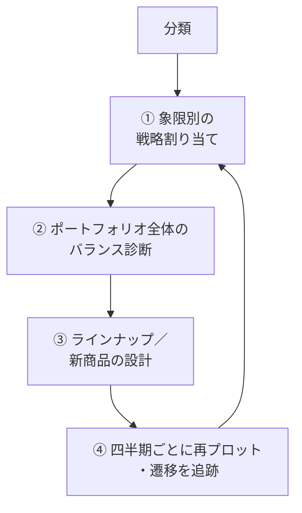

---
tags:
  - 緑茶園
  - 案件
  - platform
  - 売上分析
  - PPM
client: 緑茶園グループ
親論点:
  - テーマ1 - 受注チャネル統合とツール複数人化
フェーズ: 構想
層: 機能
created: 2026-09-19
updated: 2026-09-20
aliases:
  - PPM運用サイクル
  - 商品ポートフォリオ運用
---

# platform - 11 商品ポートフォリオの運用サイクル（PPM）

親: [[platform - 00 概要]] ／ 関連: [[easyECS - 00 概要]]（売上ダッシュボードの受注履歴）／ [[07 理念体系とビジョン2029]] ／ [[_未確定事項]]

> [!info] このノートの位置づけ
> ちぇるが整理した資料「PPM分類の次にやること — 商品ポートフォリオの運用サイクル」（2026-09、スライド12枚版と同内容の読み物版）を Markdown に起こしたもの（前半）と、**統合コンソールに写している受注履歴で実際にできるか**を 2026-09-19 に試算した結果（後半）。
> 売上分析の仕組み（集計の数え方・画面・スクリプト）の実体はリポジトリ（`analysis/sales-report/`、`/dashboard/sales/analysis`）が正本。ここに書くのは「何をやりたいか」と「データで何ができて何ができないか」の判断だけ。
> 資料中の SKU 番号・遷移マトリクスの数値は例示用のサンプル。後半の数値は実データ（2017-01〜2026-09-17）。

---

## 前半：資料の内容

### 0. 前提

PPM（プロダクト・ポートフォリオ・マネジメント）は商品を「成長率」と「シェア」の2軸で4象限に分ける。

| 象限 | 定義（ざっくり） |
|---|---|
| 花形（Star） | 成長率が高く、シェアも高い |
| 金のなる木（Cash Cow） | 成長は鈍いが、シェアが高く安定して利益を生む |
| 問題児（Question Mark） | 成長率は高いが、シェアはまだ低い |
| 負け犬（Dog） | 成長率もシェアも低い |

- いきなり商品開発に入らない。まず「どの商品に金と手間を配るか」を決める
- ラインナップ見直し・新商品は、診断で見えた「穴」を埋めるフェーズとしてその後に来る
- **核心：PPM は一度分類して終わりではない。分類後の運用サイクルが本体**

### 1. 象限別の基本戦略

| 象限 | 基本戦略 | EC での具体策 |
|---|---|---|
| 花形 | 投資して守る・伸ばす | 広告集中、在庫を切らさない、価格を維持してシェア防衛 |
| 金のなる木 | 収穫 | 成長投資を絞って利益を花形・問題児に再配分。値引きをやめて粗利改善、セット販売・定期購入で客単価を上げる |
| 問題児 | 選別（育てるか撤退か） | 少額でテスト→基準を満たしたものだけ本格投資、残りは早期撤退。「8週間で CVR◯%・粗利◯%を超えたら昇格」のような基準を**先に**決める |
| 負け犬 | 撤退／ニッチ化 | 在庫一掃・取扱終了（ただし下記の例外） |

- **金のなる木も放置すると落ちる。** 検索順位・レビュー数が生命線で、「最小限の防御コスト」はかかる前提で計画する
- **負け犬を撤退させる前に確認する**：① 併売で他の商品を引っ張っていないか（おとり商品にできるか）② 検索流入の入口になっていないか。役割があれば残す判断もある

### 2. ポートフォリオ全体のバランス診断

| 診断軸 | 問い | 対応 |
|---|---|---|
| 将来性 | 3年後に金のなる木になるはずの問題児が十分いるか | いなければ新商品開発が急務 |
| 依存リスク | 売上の◯%が上位1〜2商品に偏っていないか | EC は1つのヒット商品への依存が一番危険。花形候補を育てて分散する |
| 浪費 | 負け犬が在庫・広告費をどれだけ食っているか | 撤退・ニッチ化で資金と手間を回収する |

### 3. ラインナップ／新商品のデザイン

| 診断結果 | 商品デザインの方向 |
|---|---|
| 将来の金のなる木候補が不足 | 問題児の伸びしろ、または金のなる木の系列展開（上位版・詰め合わせ・サブスク） |
| 花形がまもなく金のなる木になる | 次の花形候補への投資計画（問題児から昇格させる） |
| 負け犬が棚と在庫を圧迫 | 撤退し、空いた枠を併売データで見つけた隣接カテゴリで埋める |
| 粗利が薄い | 金のなる木のリニューアル・値上げテスト、低粗利 SKU のセット化 |

新商品をゼロから考えるより、**金のなる木の派生（客が既にいる需要）と問題児の中の選別**のほうが成功率が高い。

### 4. 四半期サイクルで回す（SKU 運用表）

各 SKU に「象限 → 推奨施策 → 責任者／KPI → 次の見直し日」を紐付けた一覧を作り、四半期ごとに更新する。

| 象限 | SKU（例） | 推奨施策 | 責任者／KPI | 次の見直し日 |
|---|---|---|---|---|
| 花形 | ST-2401 | 広告集中・在庫確保・ランキング維持 | CVR／ROAS、欠品ゼロ | 2026/04/01 |
| 金のなる木 | CC-0930 | 値引き廃止・セット販売・レビュー保護 | 粗利率、レビュー平均 | 2026/04/01 |
| 問題児 | QM-5032 | クーポンの A/B テスト、CVR 1.2%・粗利20%で昇格判定 | CVR／粗利率 | 2026/04/01 |
| 問題児 | QM-5101 | 基準未達。在庫一掃・投資停止 | 売切り完了 | 2026/11 頃 |
| 負け犬 | DG-0809 | 併売・検索入口を確認のうえ撤退か役割維持 | 陳列コスト | 2027/01 |

四半期ごとに再プロットして象限間の移動を追う。花形→金のなる木、問題児→花形、金のなる木→負け犬の流れが見えると「うちの勝ち筋はどのタイプの商品か」が定量的に分かる。**移動の追跡こそが PPM の本体。**

### 5. 移動の追跡：断面の比較

#### 5.1 スナップショットの取り方（4ルール）

| ルール | 内容 |
|---|---|
| ① 周期は四半期で固定 | 月次だと季節のノイズで象限が行ったり来たりする |
| ② 成長率は前年同期比 | 前期比だと季節商品が全滅する |
| ③ 突き合わせは商品名でなく商品ID | 名前変更・リニューアルは別 ID になりがち。漏れると移動が多発して見える |
| ④ 新商品は「観察枠」に置く | 立ち上がりは必ず問題児に見える。発売後◯週間は分類を待つ |

#### 5.2 遷移マトリクス（4×4）

2時点の断面を 4×4 の状態遷移表に集計する（数値は例）。

| 前 \ 後 | 花形 | 金のなる木 | 問題児 | 負け犬 | 計 |
|---|---|---|---|---|---|
| 花形 | 5 | **3** | 1 | 0 | 9 |
| 金のなる木 | 0 | 6 | 0 | **2** | 8 |
| 問題児 | **2** | 1 | 4 | 1 | 8 |
| 負け犬 | 0 | 0 | 0 | 5 | 5 |
| 計 | 7 | 10 | 5 | 8 | 30 |

見るべき4つのシグナル：

1. **昇格（問題児→花形）**：勝ち筋。ここの成功率が商品開発の当たり判定
2. **収穫（花形→金のなる木）**：順調に成熟している証拠
3. **老朽化（金のなる木→負け犬）**：依存リスクの実現。増えていたら新商品が追いついていない
4. **新規流入**：各期に入ってくる問題児の数。ゼロなら将来の花形が生まれない

各象限に何期いたか（滞在期間）を SKU 単位で取ると、「うちの花形の寿命は◯期」のような自社のパターンが数字になる。

#### 5.3 見せ方

期→期の流れを帯で描くサンキー（alluvial）図が経営会議で効く（「金のなる木から負け犬へ抜ける帯の太さ」が一目で分かる）。

#### 5.4 軸の「再基準化」問題

相対軸（相対シェア、中央値で分割）だと境界線が毎期動くので、商品は何も変わらなくても「移動した」ように見える。

| 方式 | 長所 | 短所 |
|---|---|---|
| 固定閾値（例：成長率±5%） | 比較が正確 | 市場全体が伸びると全体が上に寄る |
| 毎期再基準化 | 相対的な立ち位置は正確 | 「移動」に市場全体の変化が混ざる |

**落とし所：固定閾値を主軸にし、期ごとの境界値をメモしておく。**

### 6. 9年分のデータの使い方

| | やること | 得られるもの |
|---|---|---|
| A. 遷移確率の社内基準値 | 四半期の断面 約35期分で遷移マトリクスを安定させる | 「問題児が1年以内に花形に上がる確率◯%」「金のなる木が負け犬に落ちるまで平均◯期」。今の商品が普通の速度で育っているかを判定できる |
| B. ライフサイクルの型当て | 売上曲線を正規化して時系列クラスタリング（DTW 距離など） | 「定番じわ上げ型」「季節型」「一発屋型」「初速だけ型」などの型。勝ちパターンに近い形の商品に投資する根拠 |
| C. 昇格予測モデル | 過去に金のなる木になった商品が問題児だった頃の指標を教師データに、LightGBM＋SHAP | 「今の問題児のうち過去の勝ちパターンに最も近いのはこの3商品」。投資先の選別が勘から根拠に変わる |
| D. 時代効果との突き合わせ | COVID 期（2020-21）の EC 急拡大、2022年以降の物価高・円安などと重ねる | 売上変動の何割が時代で、何割が自分たちの手柄／失点か |

長期データの注意：

- **古いデータほど当てにならない**（モールの仕様変更・商品 ID の改番・カテゴリ再編）。まず 2017 年分で商品 ID が突き合わせられるかを確かめる
- **COVID 期はベースラインを分ける。** 2020-21 を混ぜると遷移確率も季節性も歪む
- 遠い過去は学習用、**運用の主軸は直近3年**

### 7. チェックリスト

- [ ] 1. 象限別の戦略を SKU 一覧に紐付け（推奨施策・責任者／KPI・見直し日）
- [ ] 2. ポートフォリオのバランス診断（将来性・依存リスク・浪費）
- [ ] 3. 「穴」を埋めるラインナップ／新商品計画（金のなる木の派生＋問題児の選別）
- [ ] 4. 四半期の断面 → 遷移マトリクス → サンキー図で移動を追跡
- [ ] 5. 9年データで遷移確率・勝ちパターン・昇格予測を社内基準にする（運用の主軸は直近3年）

---

## 後半：今の受注履歴でできるか（2026-09-19 試算）

### 使えるデータと、無いデータ

売上ダッシュボード用に毎晩写している easyECS の受注履歴（[[easyECS - 00 概要#売上ダッシュボードのために受注履歴を写す（2026-09-17 決定）]]）が材料。2017-01 から、受注日×SKU×ストア×モール×新規／リピーターの数量と税抜売上がある。「分析」画面と `analysis/sales-report` には、すでに**品目単位の社内版 PPM を1断面だけ**作ってある（直近12か月、構成比の累積70%まで＝大、伸びは会社全体の伸びで区切る）。

| 資料が使う指標 | 手元にあるか | 代わりにできること |
|---|---|---|
| 成長率（前年同期比） | ある | — |
| シェア | **市場シェアは無い** | 社内の構成比で代える（今の社内版 PPM と同じ） |
| 粗利・粗利率 | **無い**（原価を写していない） | 売上ベースで見る。粗利の判定は原価が入るまで保留 |
| CVR・アクセス・検索流入 | **無い**（モール管理画面側のデータ） | — |
| 広告費・ROAS | **無い** | — |
| 在庫・欠品 | **無い**（easyECS の在庫は写していない） | — |
| レビュー数・評価 | **無い** | — |
| リピート率 | 受注ごとの新規／リピーターの別はある（顧客コードは写していない） | SKU ごとのリピーター比率 |
| 併売 | ある（併売分析は作成済み） | 負け犬の「おとり」役の確認に使える |
| 価格帯 | ある（数量と売上から平均単価） | — |

→ **分類と遷移の追跡（資料の 0・4・5・6A・6B・6D）は今のデータでできる。** 象限別の KPI（CVR・ROAS・粗利率・レビュー）と「浪費」の診断（在庫・広告費）、昇格予測（6C）の説明変数の大半は、**データが無いのでできない**。

### 実データで分かったこと

#### ① 商品 ID の突き合わせ（ルール③）はほぼ効く。ただし「枝番」の扱いを決める必要がある

- 前年に売れた SKU のうち翌年も売れているものが、**前年の売上の 96〜99%** を占める（2017→2018 から 2025→2026 まで毎年）。2017 年の SKU のうち 2025 年にも売れているものは件数で約半分、**売上では 89%**。モールの改番で連続性が壊れている様子は無い
- SKU の販売期間を売上で重み付けした平均は **8.3 年**。主力は長く同じコードで売られている
- **ただし 2026 年は新しい SKU が 185 本と多い**（例年 80〜120 本）。中身は `mm-113-th-akatsuki`・`mm-113-th-odoroki` のように、**既存の SKU（`mm-113`）に品種などの枝番を付けたもの**が中心で、桃・さくらんぼに集中している。2026 年の売上の 9% がこうした新しい SKU。枝番を別商品として数えると、親の SKU が「落ちた」ように見え、枝番が「新規」に見える
- 〔枝番を親にまとめてよいかは、SKU の付け方のルール次第。先方に未確認〕

#### ①' 商品名から「擬似 SKU」を作る案の検証（2026-09-19 追記）

「同じ商品でも年度やモールをまたいで SKU が違うのでは」という仮説で、明細の商品名（`ec.sales_goods_names`）を見た。

- **モールをまたいで SKU は共通だった。** 売上の 97.6% は2つ以上のモールで売れている SKU（最大8モール）。easyECS がモールの商品を共通の SKU に寄せている
- **年度をまたいだ付け替えもほとんど無い。** 累計売上 30 万円以上で 2025-09 より前に売れなくなった SKU 82 本について、同じ系統のコードで前後1年に売れ始めた SKU と商品名の類似度を比べた。候補は5組だけで、どれも 1kg と 5kg のような**別商品**だった
- **商品名のほうが SKU より揺れる。** 同じ SKU の商品名が数十通りあるものが売上の 66%（「母の日」「まだ間に合う」「楽天スーパーSALE」などの売り文句が期ごとに変わる）。名前を商品 ID の代わりにすると、かえって分裂する
- 本当に「同じものが別 SKU」なのは次の2つ：
  - **`ss-` 付きの SKU**（108本、うち104本は `ss-` を外した SKU が並んで存在。例：`ss-sk-105` と `sk-105`）。同じ年に並行して売れていて、楽天・楽天Pay・Yahoo に多く Amazon にほぼ無い。〔何を分けているのかは未確認〕
  - **枝番**（`mm-113-th-akatsuki` など。①の 2026 年の増加）
- **商品名が効くのは、SKU の「上」の単位を作るとき。** 商品名から品種・等級・重さを正規表現で取り出すだけで、売上の約7割で品種と等級が、95%で重さが取れた。品目×品種×等級（重さは無視）でまとめると、SKU 約 2,100 本が約 150 の「商品シリーズ」になる（例：さくらんぼ｜佐藤錦｜特秀＝73 SKU）。品目（20）では粗すぎる問題を解く（③の「行ったり来たり」の率は粒度では下がらなかった。①''）
- → 擬似 SKU は「SKU を置き換える ID」ではなく、**SKU をまとめる親（商品シリーズ）として作る**のがよい。作り方は、機械（正規表現または LLM）で案を出し、先方が画面で直す（品目分類 `ec.sku_categories` と同じ運用）

#### ①'' 「同じ商品」とみなす粒度と、閾値の推奨（2026-09-19 決定）

粒度はコンサルタント側で決めてよい（ちぇるの判断、2026-09-19）。例として「佐藤錦の特秀 500g と 1kg は同じシリーズ」。これを出発点に、候補を実データで比べて決めた。

**推奨する単位：商品シリーズ ＝ 品目 × 品種 × 用途（贈答／家庭用）× 形態（単品／詰め合わせ）**

| まとめるもの（区別しない） | 分けるもの（区別する） |
|---|---|
| 重さ・玉数・玉サイズ（500g と 1kg、L と 2L） | 品目（さくらんぼ・桃・りんご…） |
| 等級のうち贈答の中の違い（**特秀と秀**） | 品種（佐藤錦・紅秀峰・やまがた紅王…）。複数の品種から選べない「佐藤錦 or 紅秀峰」は「おまかせ」として1つ |
| 行事の名前（母の日・父の日・お中元）、化粧箱・包装、売り文句 | 用途：**贈答（特秀・秀・優）と家庭用（訳あり・お徳用・家庭用）** |
| モール、`ss-` の有無、品種の枝番（`-th-akatsuki` など）〔`ss-` は先方未確認〕 | 形態：単品と詰め合わせ（福袋・セット・食べ比べ） |

判断の理由：

- **重さをまとめる**：同じ客が予算に合わせて量を選んでいるだけで、需要は同じ。PPM で問いたいのは「佐藤錦の贈答が伸びているか」であって、「1kg が伸びているか」ではない
- **特秀と秀をまとめる**：佐藤錦の単品で見ると、特秀と秀は年によって**逆向きに動く**（2022年 特秀 −6%／秀 +30%、2025年 特秀 +20%／秀 −21%）。合計はなめらか（−10%〜+18%）。収穫の出来による等級の出方と値付けで、贈答の中で需要が移っているだけと見られ、分けると偽の「移動」が生まれる。**特秀の割合（2017年 62% → 2026年 81%）は、高級化の指標として別に見る**
- **贈答と家庭用を分ける**：買う人・価格帯・売り方（ギフト訴求か、お得感か）が違い、PPM の施策（値引きをやめる／セットにする など）が逆になる
- **詰め合わせを分ける**：単品の派生として作るもので、資料 3 の「金のなる木の系列展開」の成否を別に追いたい
- **果物以外（加工食品・お茶・麺・菓子など）は、商品名に品種が無いので「親コード」（`ss-`・枝番を外した SKU）をそのまま単位にする**。これらは SKU が長く安定している

比べた結果（年1回・9月の断面、2019〜2026）：

| 粒度 | 単位の数 | 大（花形＋金のなる木）の数 | 伸びを単年で見たとき 移動率／翌年戻る率 | 伸びを2年の年率で見たとき 移動率／翌年戻る率 |
|---|---|---|---|---|
| SKU | 約 2,060 | 約 50 | 0.51／0.40 | 0.34／0.15 |
| **商品シリーズ（推奨）** | **約 125** | **約 18** | 0.50／0.36 | **0.34／0.12** |
| 等級も分けたシリーズ（特秀／秀／家庭用） | 約 160 | 約 18 | 0.49／0.34 | 0.37／0.16 |
| 品目 | 20 | 4 | 0.47／0.40 | — |

（移動率＝前年と象限が変わった割合。翌年戻る率＝動いたもののうち、翌年に元の象限へ戻った割合。観察枠は除く）

- **行ったり来たりを減らすのは、粒度より「伸びの見方」だった。** 粒度を変えても移動率はほぼ同じ。**伸びを2年の年率にすると、翌年戻る率が 0.36 → 0.12 に下がる**。閾値に ±10% の幅を持たせる案（幅の中では前の象限のまま）は、ほとんど効かなかった（果物の伸びは年に ±20〜50% 動くので、幅に入らない）
- それでもシリーズにするのは、**人が見て施策を決められる数（約 125）になる**ことと、枝番・`ss-`・重さ違いが1つにまとまって「落ちた／新しく出た」の偽の動きが消えるため

**推奨する閾値**

- 縦軸（伸び）：**2年の年率から、会社全体の2年の年率を引いたもの**が 0 以上なら上。市場全体（COVID 期など）の動きを消すため。固定の数字との両方を出し、各期の会社全体の年率を記録する（資料 5.4 の落とし所）
- 横軸（大きさ）：**構成比 1% 以上を「大」**（累積70% だとシリーズの上位10本前後しか入らない）。〔1% が妥当かは、最初の断面を先方と見て調整する〕
- 観察枠：初めて売れてから2年未満（2年の年率が出せないため）

**残る課題**：商品名から品種が取れないものが売上の約3割あり、中身は主に果物以外（上の方針で親コードにする）と、**品種を名前に書いていない桃**。桃は「品種おまかせ」として1つにまとめる案が有力だが、分類の初版を先方に見せて確かめる。作り方は、機械で案を出して先方が画面で直す（品目分類と同じ）

#### ①''' 遷移マトリクスとサンキー図の試作で見えたこと（2026-09-19）

①'' の単位と閾値で、2020〜2026 年の毎年の断面（遷移6回分）を作った（`analysis/sales-report` の `transition.py`、結果は `out/transition.html`。売上の実数が入るのでコミットしない）。品種を書いていない・複数から選べないものは「おまかせ」に寄せた。

- 追う対象：SKU 約 2,060 本 → 商品シリーズ約 1,070 本（果物以外は親コードなので多い）。そのうち**一度でも構成比 0.1% 以上になった 124 本**を追った。構成比 0.1% 以上は 71 本で、売上の約 92% を占める
- **昇格（問題児→花形）はほとんど起きない。** 直近3回で1本（問題児の 1.6%）、COVID 期の2回でも1本。花形はさくらんぼ・桃・りんごの主力シリーズでほぼ固定されていて、「問題児を育てて花形にする」勝ち筋が、今のラインナップでは実績として見えない。資料 2 の「将来性」の診断に直結する
- **収穫（花形→金のなる木）は直近3回で 31%、老朽化（金のなる木→負け犬）は 21%。** COVID 期（29%・6%）より老朽化が増えている。〔落ちたものの中身（シャインマスカットの贈答・米のはえぬき など）の理由は未確認。収穫の出来か、売り方か〕
- **花形と金のなる木のあいだは、シリーズ単位でもまだ行き来する**（6回で 17本ずつ）。この2つは伸びの符号だけで分かれるので、果物の出来で入れ替わる。資料 4 の推奨施策を象限で機械的に決めると毎年施策が変わる → **施策は「大か小か」（花形＋金のなる木＝主力）で決め、伸びは注意の向け先として使う**ほうが運用しやすい（案）
- 観察枠に大きなものがある：保存水 `water-102`（構成比 4.9%、発売2年未満）、やまがた紅王の贈答（0.7%）。新しい商品が実際に育っている例
- 会社全体の2年の年率は 2020年 +38% → 2023年 −6% → 2026年 +8%。全体の動きを差し引かなければ、COVID 期は全部が花形・問題児に寄って見えていた
- 分類の誤りも見えた（ラ・フランスの SKU が、名前の中の「ふじ」でりんごの品種に読まれている など）。**機械の案を人が直す仕組み（商品シリーズのマスタ）が要る**

#### ①'''' 商品シリーズを SKU マスタとして持ち、品目もそこで決める（2026-09-19 決定）

試作が使えそうだったので、商品シリーズを統合コンソールのマスタにする（ユーザー承認）。

| 判断 | 理由 |
|---|---|
| SKU を親（商品シリーズ）に紐付ける形にする（SKU 1本に1行＝SKU マスタ） | 商品名から読んだ案は間違う（ラ・フランスが「ふじ」で読まれる など）。人が直した紐付けを残す場所が要る |
| **品目も SKU マスタ（所属するシリーズ）から決める**。SKU の頭の文字のルールは、紐付けの無い新しい SKU に最初の案を出す役に下げる | 頭の文字では例外の SKU を1本だけ直せない。枝番（品種）も年によって付いたり付かなかったりする。一度確定すれば、名前や枝番の付け方が変わっても分類が動かない |
| 案は「案」のまま入れ、人が確かめたら「確定」にする | 1,000 本を超えるシリーズを一度に人が見るのは無理。売上の大きい主力（約70本）から見直す |
| 2段階で進める。①マスタを作る（既存の画面の数字は変わらない）②売上ダッシュボードの品目をマスタから取るように切り替え、遷移の分析を画面に載せる | ②で品目別の数字が少し動く（未分類・別の品目にいた SKU が移る）。主力の見直しを先方と済ませ、動く理由を説明できる状態で切り替える |
| 画面はマスタの「商品シリーズ」。編集の権限は品目分類と同じ | 同じ人が直す想定。既存の「SKU対応表」は EC チャネルの SKU の対応で別もの |

#### ①''''' 主力シリーズ（構成比0.1%以上・64本）の見直し（2026-09-19）

機械の案を投入したあと、直近12か月の構成比0.1%以上・64シリーズ（売上の約92%）を実際に開いて確認した。3種類の不具合を見つけ、うち2種類はコードを直して本番の該当SKUも正しいシリーズへ移した（すべて「案」のままだったものを移動・確定。人が確定済みだったものへの上書きは無し）。

| 見つけたもの | 直したか | 内容 |
|---|---|---|
| 数量パックの「セット」（例：スイカ「2玉セット」）が詰め合わせに誤判定 | 直した（3 SKU） | 重さ・玉数の違いと同じにまとめる。詳細は①''との重複のため省略 |
| 花・お酒・お茶・チョコレートとの組み合わせ商品が、商品名に「セット」の語が無いだけで単品に紛れる（例：「ハーバリウム ＆ さくらんぼ佐藤錦」「さくらんぼ紅茶 × 生チョコレート」） | 直した（28 SKU） | 同じ商品なのに商品名の書き方の揺れ（「ギフトセット」と書くか書かないか）だけで、片方は詰め合わせ・片方は単品に分かれていた。ハーバリウム・ブリザードフラワー・フラワースタンド・ブーケ・花束・ウイスキーボトル・紅茶・チョコレートとの組み合わせを示す語を追加で見るようにした |
| 2品種を組み合わせた詰め合わせ（例：ぶどう「シャインマスカット ＆ ピオーネ」）が、「詰め合わせ」の語が無いだけで単品のまま（3 SKU、ぶどう） | **見送り**（未修正） | 同じ「名前に複数の品種名を含む」パターンでも、桃・梨（35 SKU）は「選べる10品種から1つ」という単品カタログ表記、米（5 SKU）は「つや姫の弟（品種の由来説明）」で実際は単品。3パターンを安全に見分ける規則が作れず、直すと桃・梨の35件を壊すリスクの方が大きいため見送った |

見直しの結果、**バグと呼べるものは無かった**（誤判定はゼロ）：「セット」を含む7つの詰め合わせシリーズ全部（米＋お茶、りんご＋洋梨、桃の複数品種、さくらんぼ＋花／お茶／お酒 など）。「ジャムにもOK」「ジュースにも」のような用途の説明文は、実際にジャム・ジュースが入っているわけではないと確認した（誤検出しない）。

`sk-503`（さくらんぼ紅茶×生チョコ）は実際には果肉のさくらんぼが入っておらず、「さくらんぼ 佐藤錦 贈答 詰め合わせ」への統合は品種ラベルとして厳密ではない。売上が累計1.2万円と僅少なため、専用シリーズは作らずそのまま寄せた。

**段階2（ダッシュボードの品目の出どころ切り替え）は、この見直しをもって着手可**と判断（ユーザー承認、2026-09-19）。

売上が出る四半期の割合（全期間）：

| 品目 | 1〜3月 | 4〜6月 | 7〜9月 | 10〜12月 |
|---|---|---|---|---|
| さくらんぼ | 6% | **91%** | 3% | 0% |
| 桃 | 3% | 19% | **76%** | 2% |
| 梨 | 2% | 7% | **84%** | 7% |
| 花 | 3% | 0% | 1% | **95%** |
| ラ・フランス | 8% | 7% | 15% | **69%** |
| りんご | 23% | 3% | 18% | **56%** |
| 米 | 26% | 29% | 31% | 15% |
| 保存水 | 33% | 24% | 32% | 12% |

- 1四半期だけ切ると、果物は旬の四半期以外で売上がほぼゼロになり、象限が決まらない
- **断面は四半期ごとに取るが、中身は「直近12か月」と「その前の12か月」の比較にする**のが現実的（今の社内版 PPM と同じ窓）。こうすると旬が過ぎた四半期だけ果物の位置が動き、他の四半期はほぼ動かない。季節の無い品目（米・保存水・お茶・加工食品）は毎四半期動きうる
- 資料 6A の「四半期の断面が約35期分」は、12か月の窓を四半期ずつずらしたものなので**互いに大きく重なっていて独立ではない**。遷移確率を推定するときに実質使えるのは**年1回の断面で 8 回、遷移は 7 回分**（2019〜2026、前年比に1年分を使うため）

#### ①'''''' 品目マスタを商品シリーズに統一し、「売上の品目分類」画面を廃止（2026-09-19 決定）

主力の見直しの途中で、ユーザーから「SKU の頭の文字ルール（`ec.sku_categories`）と商品シリーズが並存していて分かりにくい」と指摘があり、統一した。

| 判断 | 理由 |
|---|---|
| 品目名の一覧を持つだけの表 `ec.product_categories` を新設し、`ec.product_series.category` に外部キーを付けた（`on update cascade`） | 「品目名の正本リスト」と「SKU → 品目の判定ルール」を1つの表が兼ねているのが分かりにくさの元。役目を分けた |
| **新しい SKU への品目の案は、頭の文字ルールでなく「同じ親コード（枝番を除いた SKU）の兄弟が属するシリーズから継ぐ」方式に変更** | 頭の文字ルールは例外の SKU を1本だけ直せない・メンテナンスが要る。兄弟から継ぐ方式なら新しいルールを登録する手間がゼロになる |
| 兄弟が見つからない（本当に初めての商品）SKU は案を作らず、「品目不明」として人が直接シリーズを選んで紐付ける（画面に専用の一覧を追加） | ユーザーの指示「あぶれたものに関しては判断をする機能をつけた方が良くないですか」。自動判定を無理に効かせるより、判断の要る箇所を可視化するほうが安全 |
| `/masters/sku-categories` 画面・関連の Server Action・`lib/ec/sales/categories.ts` を削除。編集は `/masters/product-series` に統一 | 画面が1つで済む |
| `ec.sku_categories`（頭の文字ルール）表自体はまだ残す | 売上ダッシュボード（`queries.ts`・`analysis-queries.ts`）が段階2の切り替えまでまだ直接読んでいるため。段階2完了後に別の migration で落とす |

**副次的な発見**：この作業で、頭の文字ルールが一度も登録されていなかった SKU が **351シリーズ・369本** 見つかった。直近12か月の売上は合計7万円台で全体の0.26%と僅少。中身の163本は陶器ギフトブランド「工房ゆずりは」（`y-` 系列、果物と無関係）で、旧 EC Channel Console の時代から品目未登録のまま埋もれていたと見られる。売上規模が小さいため中身の整理は行わず、品目名だけ「未分類」から「その他」に改名した（ユーザー判断：「とりあえずその他にでも入れて置いたらいいかも」）。

**残作業（低優先度）**：「工房ゆずりは」（163本）を含む売上ゼロの342本は、2026-09-19 の統合で「その他 低稼働」1本にまとめた（下記①''''''''）。本来の品目（雑貨・陶器など）を先方に確認して登録し直す価値はあるが、急ぎではない。

#### ①''''''' 段階2：ダッシュボードの品目の出どころを商品シリーズに切り替え（2026-09-19 完了）

`lib/ec/sales/queries.ts`・`analysis-queries.ts` の SKU → 品目の判定を、**「SKU が商品シリーズに紐付いていればその品目、無ければ頭の文字ルール、どちらにも無ければ「その他」」**の順に変更した（旧来は頭の文字ルールだけ）。

- 切り替え前後で判定結果が**全 SKU で完全に一致する**ことを本番データで突合して確認済み（商品シリーズの品目は元々頭の文字ルールから作った案そのものだったため。今回の見直しで動かした SKU も品目自体は変えていない）。**数字は何も動いていない**
- ダッシュボード4画面（経営サマリー・商品／モール・季節・分析4タブ）を画面で確認。エラー無し
- ついでに見つけた別のバグも直した：`listSalesCategories()`（品目の絞り込みの選択肢）が `ec.product_categories`（「その他」を含む）と、手書きで足していた `UNCATEGORIZED` 定数を二重に返していて、絞り込みに「その他」が2回出ていた。重複を削除
- `ec.sku_categories`（頭の文字ルール）表自体はまだ落とさない。紐付けの無い新しい SKU が出たときのフォールバックとして使うため

**これで PPM の運用サイクルの土台（分類・遷移の追跡・ダッシュボードとの統合）が一通りそろった。** 次の一歩は、主力シリーズを四半期または年1回の頻度で見直す運用に乗せること（[[_未確定事項]] の「四半期の見直し体制」）。

#### ①'''''''' 親コード方式のシリーズを大幅に減らす（2026-09-19、ユーザー主導）

段階2のあと、ユーザーから「フルーツギフトなど、ほぼ売れていない1SKUだけのシリーズが大量にあり、これをシリーズと呼ぶことに違和感がある」との指摘。調べると、品種で分けない品目（お茶・健康茶、加工食品・名産品、菓子・ジャム、麺、肉・水産、フルーツギフト、雑貨、その他、保存水）のシリーズ**1,010本のうち、931本（92%）が SKU 1本だけ、654本（65%）が直近12か月で売上ゼロ**だった（品種で分けるさくらんぼ・桃・りんご等は対象外）。

**2段階で整理した：**

1. **ABC区分（累積70%）による統合**：`analysis/sales-report` の SKU ABC 分析で既に使っている基準（売上の多い順に累積70%＝A区分）をそのまま適用。品目ごとに A区分だけ個別のシリーズとして残し、残り（B・C・売上ゼロ）は品目ごとに1本の「〇〇 低稼働」シリーズへまとめた。まとめても本数が減らない品目（対象1本だけ、保存水など）は対象から除外。あわせて、品目「その他」のうち直近12か月で売上のある9シリーズ（お茶屋さんの石鹸・花梨の化粧水）を先に「雑貨」へ付け替えてから適用（雑貨に近い実際に売れている商品のため）。**結果：1,074本 → 136本**（親コード方式は1,010本 → 72本）
2. **残った64本（低稼働8本を除く）を商品名から改名・統合**：ユーザーの発案で「`麺 gt-101` のような親コードのままの名前も、LLM（Claude）が商品名を読めば意味が分かる（例：山形県産 極太田舎・生そば）」→ 対象は全64本、**このセッション内で Claude が1件ずつ商品名を直接読んで判断**する形で実施（外部 LLM API のスクリプトは作らなかった）。改名と同時に、重さ・個数・グレード違いで別シリーズになっていた同じ商品を12組見つけて統合（例：たまねぎパウダーの容量違い3種、米沢牛もも しゃぶしゃぶ用の600g/800g、オレンジスライスジャムの個数違い4種）。**結果：64本 → 46本**

**あえて統合しなかった判断**（対象・用途・テーマが違う別商品として分離）：

| 分けたもの | 理由 |
|---|---|
| 想茶石鹸（女性向け）／爽茶石鹸（男性向け） | ターゲットが違う |
| スイーツ福袋「和」／「洋」 | 味のテーマが違う |
| 米沢牛もも「しゃぶしゃぶ用」／「すき焼き・焼肉用」 | 用途が違う |
| 将棋最中／将棋まんじゅう | 別の菓子 |
| 本わさび／葉わさび | 部位が違う（根／葉） |
| 山形フルーツゼリー／山形フルーツジャム（いずれも蔵王ファクトリー） | 商品の形態が違う |

**最終結果：シリーズ全体で 1,138本 → 118本**（品種で分けるシリーズ64本は変えていない。親コード方式は1,074本 → 54本）。SKU の紐付け総数（2,059本）は一貫して変化なし＝データの欠落なし。すべて画面と本番データの突合で確認済み。

#### ①''''''''' 商品シリーズ単位の PPM と遷移の追跡を画面に載せた（2026-09-20）

統合コンソールの売上ダッシュボードに「商品ポートフォリオ」（`/dashboard/sales/portfolio`）と「商品カルテ」（`/dashboard/sales/items`）を追加した（画面の割り当ては [[platform - 06 デザイン指示書]] 4.3）。決めたことだけ書く。

| 判断 | 理由 |
|---|---|
| PPM は分析画面のタブではなく**新しい画面**に置く（タブは今の位置づけ／遷移マトリクス／流れ図／滞在期間） | 分析画面がすでに長く、これ以上足すと重い（ユーザー判断） |
| 単位は**統合コンソールの商品シリーズ**（試作の機械の案ではない）。「〇〇 低稼働」のまとめ枠は**象限に入れず**、会社全体の売上（構成比の分母・会社全体の伸び）には含める | まとめ枠は「あまり売れないものの寄せ集め」なので、1つの商品として花形・負け犬と分けても意味が無い。分母から外すと構成比が実際より大きく出る |
| 閾値は①''のまま（構成比 1% 以上が大、0.1% 未満は追わない、伸びは2年の年率と会社全体の差）。シリーズを 118 本にまとめ直したあとも変えなかった | 1% が妥当かは、最初の断面を先方に見せて調整する予定のまま |
| 断面は 2020〜2026 年の**7回**（遷移6回分）。試算では2019年も含めていたが、2019年は2年前の12か月が 2017 年の途中から始まるため外した | データが 2017-01 から。2年の年率が出せない断面を入れると、全員が観察枠に寄る |
| 売れ筋・新規／リピーター別・季節の商品の表・ABC 分析は**シリーズ／SKU の切り替え**にして、既定をシリーズにした。**ストアごとの平均単価だけ SKU のまま**（シリーズでの絞り込みは付けた） | SKU は年をまたいで付け替わる・枝番が付くなど信頼度が低い（ユーザー指摘）一方、シリーズには重さ・等級違いが混ざるので、モール間で単価を比べるのは SKU でないと意味が変わる |
| 「商品カルテ」を専用の画面にした（シリーズ・SKU を検索して選ぶ。各表の名前からもリンク） | 個別の商品を確かめる入口が無かった。横に出るパネルだと URL で共有できず、検索して開く入口も作れない |

**検算**：会社全体の2年の年率は 2020年 +38.2%・2023年 −5.6%・2026年 +8.4% で、①'''の値（+38%・−6%・+8%）と一致した。追うシリーズは 77 本（一度でも象限か観察枠になったもの）。

**118 本にまとめ直しても、①'''の所見は変わらなかった**：昇格（問題児→花形）は直近3回で 1/51（2.0%）、COVID 期は 2/18。老朽化（金のなる木→負け犬）は直近3回で 6/31（19%）。収穫（花形→金のなる木）は 10/29（34%）、転落（花形→負け犬）は 7/29（24%）。「問題児を育てて花形にする」勝ち筋は、今のラインナップでは実績として見えない。

**まだ入れていないもの**：資料 4 の運用表（施策・責任者・見直し日）は、先方が四半期または年1回の見直しを回すと決まってから足す（下の「まだ決まっていないこと」）。画面の「今の位置づけ」は、その運用表のたたき台まで。

#### ③ 品目単位では数が少なすぎ、SKU 単位では小さい SKU が行ったり来たりする

- 品目は 20。年7回の遷移でも 140 件で、遷移確率を出すには少ない。**品目は「見せる単位」、遷移の統計は SKU 単位**になる
- SKU 単位で試しに分けた（直近12か月、構成比の累積70%までを「大」、伸び +5% 以上を「上」の固定閾値、初めて売れてから2年未満は観察枠）。2019〜2026 の 7 回分の遷移を足し合わせると：

| 前 \ 後 | 花形 | 金のなる木 | 問題児 | 負け犬 | 観察枠 | 売れなくなった |
|---|---|---|---|---|---|---|
| 花形 | 68 | 88 | 0 | 66 | 0 | 1 |
| 金のなる木 | 58 | 62 | 2 | 30 | 0 | 1 |
| 問題児 | 40 | 1 | 421 | 882 | 0 | 170 |
| 負け犬 | 41 | 1 | 946 | 1,044 | 0 | 534 |
| 観察枠 | 15 | 2 | 217 | 256 | 504 | 553 |
| 新しく売れた | 0 | 0 | 1 | 467 | 949 | 0 |

- **問題児⇄負け犬の行き来（882件・946件）が圧倒的に多い。** 小さな SKU は収穫の当たり外れや数件の注文で ±5% をまたぐので、固定閾値だけだと資料 5.1 ①が防ごうとしている「行ったり来たり」がそのまま起きる。花形⇄金のなる木（88件・58件）も、会社全体が伸びた年・落ちた年に揃って動いている
- 「大」は毎年 50 本前後しかなく、SKU のほとんど（約 600〜700 本）は問題児か負け犬に入る
- → 資料どおりの 4×4 をそのまま SKU に当てると、**シグナル（昇格・収穫・老朽化）がノイズに埋もれる**。次のどれか（または組み合わせ）が要る：
  - 伸びの判定に**幅を持たせる**（例：上に入るのは +10% 以上、下に落ちるのは −10% 以下、その間は前の象限のまま）
  - 伸びを単年ではなく**2年や3年の年率**で見る
  - **売上が小さすぎる SKU を分類の対象から外す**（例：年間売上の下位〔 〕%）
  - 市場全体の動きを消すために、伸びを**会社全体の伸びとの差**で見る（資料 5.4 の「再基準化」側。固定閾値との両方を出し、境界値を記録する）

#### ④ 時代効果（6D）は、手元のデータでもはっきり見える

年ごとの売上（2019年＝100）：2017 48 ／ 2018 81 ／ 2019 100 ／ **2020 163** ／ 2021 154 ／ 2022 151 ／ 2023 130 ／ 2024 143 ／ 2025 137 ／ 2026（9/18 まで）132。

- 2020 年に 1.6 倍に跳ね、2023 年に落ちている。資料の「COVID 期はベースラインを分ける」はこのデータにそのまま当てはまる。**2020→2021・2022→2023 の遷移は、時代の影響として分けて見る**
- 運用の主軸を直近3年（2023-09 以降）にする方針とも合う

### 結論（判断）

| 資料のステップ | 今のデータで | 補足 |
|---|---|---|
| 0. 分類 | **できる（品目は作成済み）** | シェアは社内の構成比で代える。SKU 単位にするには枝番の扱い（①）と、小さい SKU の扱い（③）を先に決める |
| 1. 象限別の戦略・KPI | **分類と推奨施策の対応まではできる。KPI は一部だけ** | 売上・伸び・リピーター比率・単価は出せる。CVR・ROAS・粗利率・レビュー・欠品は無い |
| 2. バランス診断 | **将来性・依存リスクはできる。浪費はできない** | 依存リスク：上位 SKU の構成比は ABC で既に出ている。浪費は在庫・広告費が要る |
| 3. ラインナップ設計 | **材料の一部は出せる** | 併売分析（作成済み）で隣接カテゴリを探せる。粗利の視点は原価待ち |
| 4. 四半期サイクル・SKU 運用表 | **断面の自動作成はできる。責任者・施策・見直し日は人が入れる** | 運用表は人が書き込むので、画面で持つなら DB に表が要る（今は読み取り専用の分析だけ） |
| 5. 遷移マトリクス・サンキー | **できる。ただし閾値の工夫が要る（③）** | 年1回の断面なら 2019〜2026 の 7 回分。四半期ごとの表示は12か月の窓を3か月ずつずらす形 |
| 6A. 遷移確率の基準値 | **できるが、独立な遷移は年7回分** | COVID 期を除くとさらに減る。「普通の速度」の目安程度にとどめる |
| 6B. ライフサイクルの型 | **できる** | 月次の売上曲線は SKU ごとに9年分ある。季節型が大半なので、旬の年ごとの売上で型を見るほうが素直 |
| 6C. 昇格予測（LightGBM＋SHAP） | **今は勧めない** | 教師になる「問題児→花形」は7年で約 40 件、説明変数も立ち上がり速度・単価・リピーター比率・モールの内訳くらい。予測より、昇格した 40 件を並べて眺めるほうが先 |
| 6D. 時代効果 | **できる** | 年ごと・品目ごとの伸びを会社全体の伸びと並べるだけでも見える |

**やるとしたらの順番（案）**

1. SKU の枝番をまとめるルールを決める（先方に SKU の付け方を確認）
2. 年1回（9月・果物の旬の後）の SKU 単位の断面を 2019〜2026 分作り、閾値の案を2〜3通り試して「行ったり来たり」が落ち着くものを選ぶ（`analysis/sales-report` で。本番には書かない）
3. 遷移マトリクスとサンキー図、COVID 期を分けた遷移確率、滞在期間を出す
4. 使えそうなら画面（分析）に載せる。SKU 運用表（施策・責任者・見直し日）まで持つかは、先方が四半期の見直し会議を回すかどうか次第

## まだ決まっていないこと

- [ ] SKU の枝番（`mm-113` と `mm-113-th-akatsuki` など）を1つの商品として数えてよいか。SKU の付け方のルール → [[_未確定事項]]
- [x] ~~分類の単位：品目（20）で見せるか、SKU で見せるか、その間（親 SKU・商品シリーズ）を作るか~~ → **商品シリーズ（品目×品種×用途×形態。果物以外は親コード）**（①''、2026-09-19 ちぇるの判断）
- [ ] `ss-` 付きの SKU は何を分けているのか（`ss-` を外した SKU と同じ商品として数えてよいか）
- [x] ~~閾値：固定（何%）か、会社全体の伸びとの差か。小さい SKU をどこで切るか~~ → **伸びは2年の年率と会社全体の差、大きさは構成比1%以上**（①''。1% は最初の断面を先方と見て調整）
- [ ] 品種を名前に書いていない桃を「品種おまかせ」1つにまとめてよいか（分類の初版を先方に見せる）
- [ ] 原価を写すか（粗利で見られるようになる。easyECS に原価があるかも未確認）
- [ ] 先方が四半期（または年1回）の見直しを回す体制があるか。責任者を誰にするか。SKU 運用表を統合コンソールで持つか
- [ ] 商品シリーズの主力（構成比 0.1% 以上の約70本）の紐付けを、先方と一緒に確認する（段階2で品目の出どころを切り替える前に）
- [ ] CVR・アクセス・広告費・レビューをモール管理画面から取るか（取るなら別の取り込みが要る）

## 関連

- [[easyECS - 00 概要]] — 受注履歴を統合コンソールに写した判断（売上ダッシュボード）
- [[07 理念体系とビジョン2029]] — 売上10億円・粗利25%。粗利の目標があるので、原価が無いと PPM の「収穫」の判断が売上だけになる
- [[platform - 06 デザイン指示書]] — 4.3 の売上ダッシュボード（分析）の画面の割り当て
- [[_未確定事項]]
