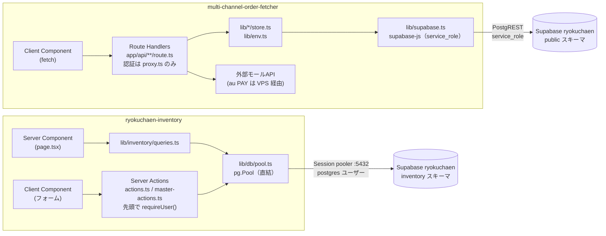

---
tags:
  - 緑茶園
  - 案件
  - platform
  - 統合調査
  - 技術スタック
client: 緑茶園グループ
層: 基盤
created: 2026-09-14
updated: 2026-09-14
---

# スタックと構成の比較

親: [[platform - 00 概要]]

## README の要約

### ryokuchaen-inventory（仕入アプリ POC）

- Airtable ベース「入荷記録表」（`appgHXd85EhNBuXlt`）→ Supabase `inventory` スキーマへの**抽出スクリプト**と、その上で動く**仕入アプリ（POC）**
- Airtable へは読み取りしかしない
- 画面：ホーム／入荷入力／取引一覧（CSV出力）／月締め／支払明細書（印刷で帳票）／マスタ（取引先・商品・原価・規格8種）／データ品質
- **POC 中は抽出のたびに全データが消える**（全件を消して入れ直す・id も振り直し）。アプリの連番は100万番台から
- 設計判断の正本は vault：[[Airtable再構築 - DBスキーマ定義]]・[[Airtable再構築 - Supabase実装（inventoryスキーマ）]]・[[Airtable再構築 - 画面設計（UI・UX）]]

### multi-channel-order-fetcher（EC Channel Console）

- 7モール（楽天・Amazon・Yahoo!・au PAY・Shopify・Temu・LINEギフト）の受注を公式APIで取得・表示。5チャネル実装済み・2チャネルはスタブ
- 手動受注取り込み（MDC取り込み／その他受注取り込み、SKU対応表つき）、受注残ボード（easyECS 受注CSV → SQLビューで4軸集計）
- チャネル認証情報は `.env` ではなく **DB の key/value テーブル**に保存。読み戻さない
- au PAY は送信元IP制限をさくらVPSの中継プロキシで回避（[[05 さくらVPS（固定IP経由の踏み台）]]）
- ドキュメントの分担ルールが CLAUDE.md にある（システム仕様＝README、判断の経緯＝vault）

## アーキテクチャ

どちらも Next.js App Router の単一アプリで、`app/(app)/` ルートグループ（サイドバー付き）＋ `app/login/` ＋ `proxy.ts` という**同じ骨格**。違いはデータの読み書きの流れにある。

| 観点 | inventory | EC Channel Console |
|---|---|---|
| 変更処理 | **Server Actions**（`"use server"` ファイル3本） | **Route Handlers**（`app/api/` 以下9本。Server Actions は0） |
| 読み取り | Server Component から直接クエリ | 画面はクライアントから `fetch('/api/...')`（7か所） |
| DB接続 | `pg` で Postgres に直結（トランザクションが要るため） | `supabase-js` の service_role クライアント（PostgREST 経由） |
| SQL | 生SQL（`lib/inventory/sql.ts` に共通片） | クエリビルダ（`.from().select()`） |
| 集計 | SQLビュー＋クエリ内集計 | SQLビューに1か所だけ置く（フロントで再集計しない方針） |
| 設定の持ち方 | `constants.ts` の定数・ラベル表 | `registry.ts`（チャネル・取り込み先の定義を唯一の情報源に） |
| エラーの返し方 | `ActionResult { ok, message }`／`FormState { error, message }` | `{ error: { code, message, detail } }`＋`ChannelError` |
| 監査・ログ | `inventory.audit_logs` に変更前後の値 | `multi_channel_order_fetcher_logs` にエラーのみ（監査証跡ではない） |
| レンダリング | layout で Cookie を読むので動的 | layout に `dynamic = "force-dynamic"`（毎回チャネル設定状態をDBから読む） |
| クライアント状態 | localStorage（入荷下書き・サイドバー開閉） | なし |

## 依存パッケージのバージョン

`package.json` の指定と、`node_modules` に実際に入っているバージョン（2026-09-14 確認）。

| パッケージ | inventory 指定 → 実体 | EC 指定 → 実体 | 差 |
|---|---|---|---|
| **next** | `^16.3.5` → 16.3.5 | `16.3.2`（**固定**） → 16.3.2 | パッチ差＋指定方式が違う |
| react / react-dom | `^19.2.8` → 19.2.8 | `19.2.8`（固定） → 19.2.8 | なし |
| **tailwindcss** | `^4.3.3` → 4.3.3 | `^4.3.3` → 4.3.3 | なし |
| @tailwindcss/postcss | `^4.3.3` → 4.3.3 | `^4.3.3` → 4.3.3 | なし |
| **shadcn/ui** | 未導入 | 未導入（README に「導入せず自前実装」と明記） | **なし**（どちらにも `components.json`・Radix・`clsx`・`tailwind-merge`・`cva` が無い） |
| @supabase/supabase-js | `^2.116.0` → 2.116.0 | `^2.114.0` → 2.114.0 | マイナー差 |
| @supabase/ssr | `^0.12.7` → 0.12.7 | `^0.12.5` → 0.12.5 | パッチ差 |
| typescript | `^5.7.3` → 5.9.3 | `^5.9.0` → 5.9.3 | 実体は同じ |
| @types/node | `^22.10.5` → 22.20.2 | `^24.0.0` → 24.13.3 | **メジャー差** |
| @types/react(-dom) | `^19.3.0` | `^19.2.0` | 軽微 |
| lucide-react | 1.45.0 | — | inventory のみ（サイドバーのアイコン） |
| pg / @types/pg | 8.23.0 | — | inventory のみ |
| airtable / dotenv / tsx | 0.12.2 / 16.x / 4.19.x | — | 抽出スクリプト用 |
| fast-xml-parser | — | 5.11.0 | EC のみ（Yahoo・au PAY の XML） |

> [!tip] バージョン差は統合の障害にならない
> 差があるのはパッチ・マイナーだけで、Next.js 16 の `proxy.ts` 規約・Tailwind v4 の `@theme`・`@supabase/ssr` の Cookie API はどちらも同じ書き方をしている。**UI ライブラリ（shadcn/ui）の差分は存在しない**ので、「どちらに合わせるか」ではなく「統合を機に入れるか入れないか」の判断になる。

## 設定ファイルの差

| | inventory | EC |
|---|---|---|
| `package.json` `"type"` | `"module"` | 指定なし（CommonJS 扱い） |
| `tsconfig` の厳しさ | `noUncheckedIndexedAccess`・`noUnusedLocals` あり | なし。代わりに `allowImportingTsExtensions`、`.next-test/types` を include |
| `next.config.mjs` | 空 | `distDir: process.env.EC_DIST_DIR \|\| ".next"`（モック検証用に出力先を分ける） |
| `globals.css` | EC と同じトークン（`--color-surface/canvas/line`）＋**印刷用スタイル**（`.no-print`） | トークンのみ |
| lint | スクリプトなし | `"lint": "next lint"`（Next 16 では `next lint` コマンドが廃止されている。同梱ドキュメント `version-16.md` に言及あり。動作は未確認） |
| フォーマッタ設定 | なし | なし |
| 静的アセット | なし | `public/logo.png`・`app/icon.png`・`app/apple-icon.png` |
| 開発ポート（`.claude/launch.json`） | **3100** | 3000（ただし `npm run test:mock` が **3100** を使う） |

## スクリプト・テスト・運用

| | inventory | EC |
|---|---|---|
| 開発 | `dev` / `build` / `start` / `typecheck` | 同左＋`dev:mock` / `mock:server` |
| テスト | なし（`typecheck` と抽出の `--dry-run`・`--offline` チェックのみ） | `test:mock`（モックAPIに対する通し検証 101項目）／`test:backlog`／`test:manual-orders`（いずれも `.mjs`） |
| バージョン管理 | なし | **post-commit フックで `package.json` の version と CHANGELOG を自動更新**（`--amend` で履歴を書き換える） |
| バッチ | `extract:airtable`（全件入れ直し） | なし |
| ドキュメント | README のみ | README／CLAUDE.md（vault 同期ルール）／AGENTS.md（Next.js エージェント規約）／CHANGELOG／`docs/` |

## 画面構成（ルーティング）

| パス | inventory | EC |
|---|---|---|
| `/` | ホーム（今日の入荷・月締め待ち・要確認） | ダッシュボード（全チャネルの接続設定状態） |
| `/login` | ログイン | ログイン |
| 業務画面 | `/receiving` `/transactions` `/transactions/export` `/closing` `/statements` `/statements/[id]` | `/channels/{7チャネル}` `/manual-orders/{mdc,other}` `/backlog/{live,manual}` |
| マスタ・設定 | `/partners` `/partners/new` `/partners/[id]` `/products`（`?peek=`） `/products/new` `/products/[id]` `/specs` | `/settings`（チャネル認証情報。画面名は「マスタ設定」） |
| API | なし（CSV出力だけ `(app)` 内の `route.ts`） | `/api/orders/[channel]` `/api/settings` `/api/backlog/*` `/api/manual-orders/[destination]{,/sku-map}` |
| POC専用 | `/quality` | — |

衝突するのは `/` と `/login` だけ。ただし「マスタ」という言葉の意味が違う（→ [[04 移植の障害と設計判断]]）。
