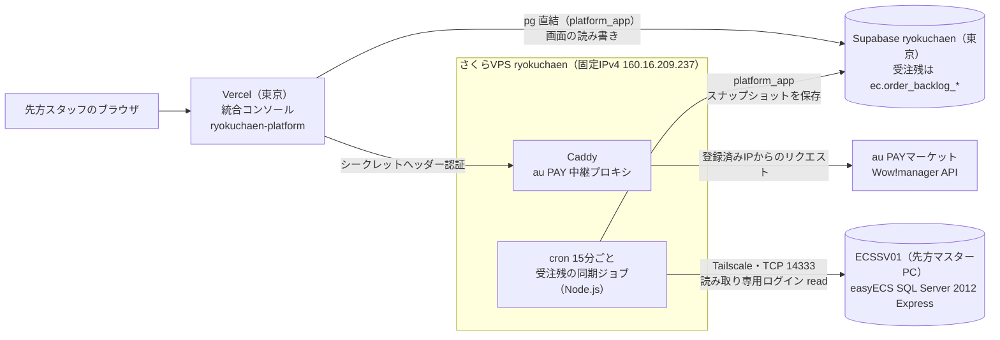

---
tags:
  - 緑茶園
  - 案件
  - 開発中システム
  - インフラ
client: 緑茶園グループ
親論点: テーマ1 - 受注チャネル統合とツール複数人化
フェーズ: 運用中
層: 基盤
created: 2026-09-12
updated: 2026-09-17
aliases:
  - ryokuchaen
  - EC Channel Console - さくらVPS（ryokuchaen）
  - さくらのVPS
---

# さくらのVPS `ryokuchaen`（固定IP中継サーバ）

親: [[platform - 09 受注機能（旧 EC Channel Console）]] ／ 関連: [[easyECS - 01 DB接続（Tailscale・SQL Server）]] ／ 親論点: [[テーマ1 - 受注チャネル統合とツール複数人化]]

> [!info] このノートの位置づけ
> [[platform - 09 受注機能（旧 EC Channel Console）|EC Channel Console]] のために契約した**固定IPのサーバ1台**についての、契約情報・入り方・運用メモ。
>
> **サーバ上で動いているものの実装仕様（Caddyの設定・環境変数・切り分け手順）はリポジトリ側が正本** → `~/git/multi-channel-order-fetcher/docs/credentials.md`「中継プロキシ経由で使う場合」〔当時。リポジトリはアーカイブ済みで、今の正本は `ryokuchaen-platform` と VPS 側の `ryokuchaen_sakuravps` リポジトリ〕。このノートが持つのは**サーバそのもの**（契約・ログイン・OS・役割）だけ。二重管理にしない。
>
> **認証情報はこのVaultに書かない。** SSHパスワード・`AU_PROXY_SECRET` などはここには載せない（契約時に設定した値／パスワード管理側で管理する）。

## なぜこのサーバがあるのか

月数百円のVPS1台で、**構造の同じ壁が2つ**解ける。どちらも「送信元が固定IPでないと繋げない」という同型の問題。

> [!note] 2026-09-17：下の図を今の構成に更新した
> 更新前の図は「EC Channel Console 本体（Vercel）」と「定期ジョブで同期（未実装）」の点線だった。easyECS の同期ジョブが稼働し、アプリも統合コンソール（`ryokuchaen-platform`）に替わったため書き直した。

### 全体構成（2026-09-17 時点）



**受注残ボードのデータの流れ**：easyECS（正本）→ VPS の cron が15分ごとに読む → Supabase にスナップショットとして保存 → 画面（Vercel）は開くたびに Supabase の最新を読む。

| 置き場所 | 持っているもの |
|---|---|
| easyECS（`ECSSV01`） | 受注の正本。こちらからは**読むだけ**（書き込みは MDC 形式CSVの取込に限る。[[platform - 10 変換器構想とMDC出力]]） |
| さくらVPS | 同期ジョブのプログラム・接続設定（権限 600）・実行ログ（店舗ごとの件数の合計だけ。受注番号などは残さない）。**受注データそのものは置かない** |
| Supabase | 取り込んだ受注残の明細。連携分は最新5回分だけ残す |
| Vercel | 何も持たない（画面を出すたびに Supabase を読む） |

- **なぜ Vercel から easyECS を直接読まないか**（届かない・easyECS に負荷をかける・PC が止まると画面も止まる）は [[platform - 10 変換器構想とMDC出力]] の「2026-09-17：VPS中継＋Supabase同期を確定」
- 実装の正本：ジョブ本体と画面は `ryokuchaen-platform` の `docs/easyecs-backlog-sync.md`、サーバへの配置・cron・Node.js は `ryokuchaen_sakuravps` の `docs/runbook.md`「5. easyECS 受注残の同期ジョブ」
- 経路（Tailscale・先方PCの設定・ログイン）は [[easyECS - 01 DB接続（Tailscale・SQL Server）]]

| 役割 | 状態 | 詳細 |
|---|---|---|
| **au PAYマーケット中継プロキシ**（Caddy＋シークレットヘッダー認証＋Let's Encrypt自動HTTPS） | 🟢 **稼働中**。2026-09-09 に本番デプロイから実データ62件の取得を確認 | → [[platform - 09 受注機能（旧 EC Channel Console）]]「au PAYマーケットのIP制限」 |
| **easyECS の SQL Server から読み取り、Supabaseへ同期する定期ジョブ** | 🟢 **稼働中（2026-09-17〜）**。cron で15分ごと。19:45 の自動実行で保存まで確認。Node.js はユーザー領域（`~/.local/node`）に置いた。配置・更新の手順は `ryokuchaen_sakuravps` リポジトリの runbook「5. easyECS 受注残の同期ジョブ」 | → [[platform - 10 変換器構想とMDC出力]] |

> [!note] 2026-09-12 時点の記述（履歴として残す）
> VPS側には Tailscale を導入済み。**繋ぐ相手側（`ECSSV01`）が未対応**なので、SQL Server 側の役割はまだ動いていない。
> → **2026-09-17 解消**。下記「Tailscale（easyECS SQL Server への経路）」参照。

## Tailscale（easyECS SQL Server への経路）

2026-09-17 に開通。このVPSは Tailscale 上で **`easyecs-relay`（`100.101.93.114`）** として、先方マスターPC `ECSSV01`（`100.100.97.48`）の SQL Server（TCP 14333）に届く。**先方PCのファイアウォールは、このVPSからの接続だけを許可している。**

- VPS 側の状態（2026-09-17 確認）：`tailscaled` は自動起動・稼働中、自動更新オン、**ノードキーの期限は無効化済み**（既定のままだと 2027-03-08 に切れる予定だった）
- **Tailscale の構成・先方PCで行った設定・SQL Server の情報・読み取り専用ログイン・開発機からの繋ぎ方は [[easyECS - 01 DB接続（Tailscale・SQL Server）]] を正本とする**（2026-09-17 に本ノートから移した）

## サーバー情報

| 項目 | 値 |
|---|---|
| 名前 | `ryokuchaen` |
| ホスト名 | `tk2-246-32983.vs.sakura.ne.jp` |
| IPv4 | `160.16.209.237` |
| IPv6 | `2001:e42:102:1806:160:16:209:237` |
| OS | Ubuntu 24.04 LTS |
| サービスコード | `113802134330` |
| 管理ユーザー名 | `ubuntu` |

**このIPv4アドレスが、先方のWow!managerに登録してもらった値**（クロスモール側の8個のIPに追記する形。上書きではない）。サーバを再契約・移設するとIPが変わり、au PAYの受注取得が止まる。→ [[platform - 09 受注機能（旧 EC Channel Console）]]

## ログイン

```bash
ssh ubuntu@tk2-246-32983.vs.sakura.ne.jp
```

パスワードは契約時に自分で設定したもの。

会員メニュー（コンソール・再インストール・シリアルコンソール）：https://secure.sakura.ad.jp/vps/

## つまずいたポイント

> [!warning] さくらのVPSの管理ユーザー名は、OSごとに決まっている
> `root` や Mac 側のユーザー名で入ろうとすると `Permission denied` になる。Ubuntu の管理ユーザーは **`ubuntu` 固定**。
>
> | OS | 管理ユーザー名 |
> |---|---|
> | Ubuntu | `ubuntu` |
> | Debian | `debian` |
> | CentOS 系 | `root` |

> [!danger] パスワードを忘れると再発行できない
> さくら側はユーザーが設定したパスワードを保持していないため、**再発行の手段が無い**。次善策は会員メニューからの **OS再インストール**（＝サーバ上のものが全部消える）。
> このサーバは au PAY の中継プロキシが載っており、**再インストールすると Caddy の設定ごと作り直しになる**（IPは維持される）。パスワードは確実に保管する。

## 運用TODO

- [ ] **未適用のアップデートを当てる**（初回ログイン時点で32件・うちセキュリティ1件、再起動要求あり）
  ```bash
  sudo apt update && sudo apt upgrade -y
  sudo reboot
  ```
  再起動中は au PAYマーケットの受注取得が一時的に落ちる（プロキシが止まるため）。取り込み作業と重ならない時間に実施する。
- [ ] SSH鍵認証に切り替え、パスワード認証を無効化するか判断する（現状はパスワード認証）
  - 2026-09-17 時点で、開発機からは鍵（`~/.ssh/config` の `ryokuchaen-vps`）で入れることを確認。パスワード認証が無効化済みかは未確認
- [ ] 2026-09-17 のログで、海外IPから `root`・`ubuntu` へのパスワード総当たりが数分おきに来ていた（すべて失敗）。**パスワード認証の無効化を優先する**
- Tailscale・`ECSSV01` まわりの運用TODO（アクセス制御の絞り込み、切断の検知、有料化・tailnet の持ち主）は [[easyECS - 01 DB接続（Tailscale・SQL Server）]] の「運用TODO」へ移した

## 関連

- [[platform - 09 受注機能（旧 EC Channel Console）]] — au PAYマーケットのIP制限と、その解決の経緯
- [[platform - 10 変換器構想とMDC出力]] — Tailscale＋VPS経由で easyECS の SQL Server を読む構想（2026-09-17 経路開通）
- [[easyECS - 00 概要]] — Tailscale で繋いでいる easyECS の DB（接続方法・DB構造）
- [[_未確定事項]] — SQL Server 2012 のサポート終了・テーブル定義書・負荷の許容など、先方に確認が残っている事項
- [[各モール API認証情報の取得手順]] — 先方に渡す配布用資料。IP登録の説明はこちら
- [[クロスモール（I'LL社）]] — 一元管理SaaS各社も固定IPを確保している、という判断根拠
