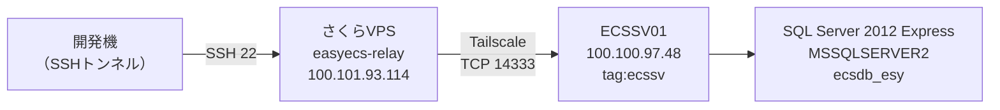

---
tags:
  - 緑茶園
  - ツール
  - インフラ
  - easyECS
client: 緑茶園グループ
関連テーマ: テーマ1 - 受注チャネル統合とツール複数人化
created: 2026-09-17
updated: 2026-09-17
aliases:
  - easyECS 接続
  - ECSSV01
  - Tailscale（easyECS）
---

# easyECS — DB接続（Tailscale・SQL Server）

親: [[easyECS - 00 概要]] ／ 関連: [[05 さくらVPS（固定IP経由の踏み台）]]

> [!warning] 認証情報はこのノートに書かない
> 読み取り専用ログインのパスワードは開発機の `.env.local`（`sqlserverid_read`／`salserverpass_read`。同期ジョブ用に同じ値を `EASYECS_SQL_USER`／`EASYECS_SQL_PASSWORD` でも持つ）で管理する。VPS には同期ジョブの設定ファイル（権限 600）として送っている。`sa` の認証情報は使わない前提で、Vault にも残さない。

## 経路

2026-09-17 に開通。



- **SQL Server に届くのは VPS だけ。** 先方PCのファイアウォールで、許可元を VPS の Tailscale アドレスに限定している
- 開発機は Tailscale に参加していない。VPS を踏み台にした SSH トンネルで繋ぐ
- **受注残の同期ジョブは VPS 上で動いている**（2026-09-17〜、cron で15分ごと、`read` ログインで読む）。Vercel からは直接行かない（[[変換器構想とMDC出力]] の判断）。Supabase・Vercel まで含めた全体の構成図は [[05 さくらVPS（固定IP経由の踏み台）]] の「全体構成」

## Tailscale

### tailnet は「こちら管理」に一本化した

| 端末 | tailnet 上の名前 | Tailscale IP | 所有 | キーの期限 |
|---|---|---|---|---|
| さくらVPS | `easyecs-relay` | `100.101.93.114` | `CHOISC1208@github` | **無効化済み**（2026-09-17） |
| 先方マスターPC | `ecssv01` | `100.100.97.48` | タグ `tag:ecssv` | なし（タグ付きのため） |

tailnet は **`choisc1208.github`（こちらのアカウント・Free プラン）**。ポリシーには `tagOwners` の `tag:ecssv` だけを追加し、通信の許可は既定（全部許可）のまま。

> [!important] なぜ先方の tailnet ではなく、こちらの tailnet に入れたか
> 先方（遠藤社長）は当初、自身のアカウントで**別の tailnet**（`yamagataelab.page`、有料プランのトライアル中）を作り、そこに `ECSSV01` を登録していた。別 tailnet の端末同士は通信できないため、次の3案を比べた。
>
> | 案 | 採否 | 理由 |
> |---|---|---|
> | **A. `ECSSV01` をこちらの tailnet に入れ直す** | ✅ 採用 | 先方のトライアル終了に左右されない。アクセス制御をこちらで一元管理できる |
> | B. 先方 tailnet のまま、ノード共有（Share）してもらう | 不採用 | 先方の管理画面操作が要る。トライアル終了後の挙動が未確認 |
> | C. VPS を先方 tailnet に入れる | 不採用 | 管理が先方持ちになり、運用負荷とリスクが最大 |
>
> **残る論点**（→ 下の「運用TODO」）
> - 先方の業務サーバが、こちらの**個人アカウント（GitHub ログイン）の tailnet** に入っている。契約終了・引き継ぎ時に先方持ちへ移すか
> - **Free（Personal）プランは規約上「非商用に限る」**（2026-09-17 料金ページで確認）。機能は足りているが、有料にするなら先方の独自ドメインの tailnet で契約して移すほうが持ち主として自然。`yamagataelab.page` は店舗名「山形ｅLab」と一致するので緑茶園側のドメインと思われるが、公式の接点メールは `yamagata-elab.com`（[[山形eLab・果逢]]）で、別ドメイン〔所有者は未確認〕

### 先方マスターPC（`ECSSV01`）で行ったこと（2026-09-17）

遠藤社長に PowerShell で実行してもらった。

1. `tailscale logout` — 先方 tailnet から抜ける
2. `tailscale up --auth-key=... --unattended` — こちらで発行した**使い捨て・有効期限1日・タグ `tag:ecssv` 付き**の認証キーで参加。`--unattended` は Windows に誰もログインしていなくても接続を保つため
3. **管理者の PowerShell で**ファイアウォール規則を追加・変更

```powershell
New-NetFirewallRule -DisplayName "SQL Server from easyecs-relay (Tailscale)" -Direction Inbound -Protocol TCP -LocalPort 1433 -RemoteAddress 100.101.93.114 -Action Allow -Profile Any
Set-NetFirewallRule -DisplayName "SQL Server from easyecs-relay (Tailscale)" -LocalPort 14333
```

**SQL Server・easyECS の設定は変えていない。**

### ポートの調べ方（そのとき実行した読み取りだけのコマンド）

```powershell
Get-Service -Name "MSSQL*","SQLBrowser" | Format-Table Name, Status, DisplayName
Get-NetTCPConnection -State Listen | Where-Object { $_.OwningProcess -in (Get-Process sqlservr).Id } | Format-Table LocalAddress, LocalPort
Get-NetConnectionProfile | Format-Table InterfaceAlias, NetworkCategory
```

結果：`MSSQL$MSSQLSERVER2` が Running、既定の `MSSQLSERVER` と `SQLBrowser` は Stopped。待ち受けは **14333** と 49448（どちらも全アドレス）。Tailscale の接続は Private 扱い。

## SQL Server

| 項目 | 値 |
|---|---|
| バージョン | **SQL Server 2012**（11.0.5058 = SP2）**Express Edition** |
| インスタンス | **`MSSQLSERVER2`**（名前付き） |
| ポート | **14333**。動的ポートの範囲（49152〜）の外なので固定設定と推定〔レジストリでの確認は未了〕。49448 の用途は未確認 |
| SQL Server Browser | 停止中 → **インスタンス名では探せない。ポート番号を直接指定する** |
| 業務DB | **`ecsdb_esy`**（ユーザーDBはこれ1つ） |
| 先方社内での接続先 | `ECSSV01\MSSQLSERVER2,14333`（easyECS の接続先設定画面。2026-09-09 確認）。`ECSSV01` は先方LAN内でしか名前解決できない |
| easyECS 本体の接続ユーザー | **`sa`**（同上） |
| 暗号化 | **TLS 1.2 非対応**。暗号化ありの接続は `unsupported protocol` で失敗し、**暗号化なしでだけ接続できる** |
| 日時の型 | `datetime`（タイムゾーンなし・日本時間で入っている〔推定〕） |

> [!danger] SQL Server 2012 は Microsoft のサポートが終了している（延長サポート 2022年7月まで）
> easyECS の稼働基盤そのもののリスク。先方・SAVAWAY が認識しているかは未確認 → [[_未確定事項]]

## 読み取り専用ログイン `read`

- **2026-09-17、こちらで `sa` を使って作成。** 9/9 に先方へ発行を依頼していたが、`sa` の認証情報を共有されたため自前で作った。**SAVAWAY には未連絡**
- 権限は **`ecsdb_esy` の `db_datareader` のみ**。確認結果：sysadmin／db_datawriter／db_owner いずれも無し、DB 権限は `CONNECT`・`SELECT` だけ、ほかの DB は見えない
- **調査・開発・同期ジョブはこのログインだけを使う。`sa` は使わない**
- easyECS のデータ・設定には触れておらず、ログインを1つ足しただけなので [[06 触らない領域]] とは衝突しないと判断

作成に使った SQL（パスワードは実行時に差し込み）：

```sql
CREATE LOGIN [read] WITH PASSWORD = N'…', CHECK_POLICY = ON, DEFAULT_DATABASE = [ecsdb_esy];
USE ecsdb_esy;
CREATE USER [read] FOR LOGIN [read];
ALTER ROLE db_datareader ADD MEMBER [read];
```

> [!danger] `sa` のパスワードは変えられない前提で扱う
> easyECS 本体が `sa` で接続している。**`sa` のパスワードを変えると easyECS が繋がらなくなるおそれがある。** 変える場合は SAVAWAY に確認してから。

## 開発機からの繋ぎ方

### 使えるツール・使えないツール（2026-09-17 実測）

| ツール | 結果 | 理由 |
|---|---|---|
| **VS Code ＋ SQLTools ＋ SQLTools SQL Server**（Matheus Teixeira） | ✅ 採用 | ドライバが tedious（Node.js）で、暗号化なしの接続ができる |
| Node.js の `mssql`（tedious）で `encrypt: false` | ✅ 接続確認に使用 | 同上。同期ジョブもこの形になる見込み |
| VS Code の **MSSQL 拡張**（Microsoft） | ❌ `error: 35 - An internal exception was caught` | Encrypt を Optional にしてもログインだけは TLS で暗号化しようとし、TLS 1.2 非対応のサーバと合意できない |
| **TablePlus** | ❌ `TDS server connection failed` | 同上の理由と推定。SSH は通っていた（VPS のログで確認）。Dialect・Database 空欄を変えても不可 |
| DBeaver ＋ jTDS ドライバ | 未検証 | jTDS は暗号化なしで繋げるので候補。SSH トンネルも DBeaver 内で設定できる |

### 手順（SQLTools）

1. ターミナルで SSH トンネルを張る（**接続している間は開いたまま**。何も表示されずに止まって見えるのが正常）

```bash
ssh -N -L 14333:100.100.97.48:14333 ryokuchaen-vps
```

2. SQLTools で接続を登録する（**User Settings に保存**。Workspace に保存するとリポジトリにコミットされるおそれがある）

| 項目 | 値 |
|---|---|
| Server Address | `localhost` |
| Port | `14333` |
| Database | `ecsdb_esy` |
| Username | `read` |
| Password mode | Use SecretStorage |
| **Encrypt** | **オフ** |

3. 使い終わったらターミナルで `Ctrl + C`

**SSH の踏み台（さくらVPS）**

| 項目 | 値 |
|---|---|
| Server | `160.16.209.237` |
| Port | `22` |
| User | `ubuntu` |
| 鍵 | `~/.ssh/ryokuchaen_vps_new`（パスフレーズ付き。キーチェーンに保存済み）。`~/.ssh/config` では `ryokuchaen-vps` |

> [!caution] 本番の easyECS が使っているDB
> `read` に書き込み権限は無い。ただし**読み取りでも、大きなテーブルへの条件なしの集計・並べ替えは easyECS の処理を待たせることがある**。調べるときは主キー（`order_no` など）で範囲を絞る。重いクエリは営業時間外に行う。

### 接続の確かめ方

```bash
# VPS 上で
tailscale ping ecssv01
nc -vz 100.100.97.48 14333
```

- `tailscale ping` の結果は `via DERP(tok)`・`direct connection not established`（17〜23ms）。先方ルーターの事情で直接接続にならず東京の中継経由。定期同期の用途では問題ない
- `ping` が通って `nc` が失敗するなら、先方PC側（ファイアウォール・SQL Server）の問題

## つまずいたポイント

> [!warning] 先方が自分の tailnet に登録していた
> インストールしてログインすると、その人のアカウントの tailnet に入る。**こちらの認証キーで参加し直してもらう**必要があった。

> [!warning] ポートは 1433 ではなく 14333
> 既定の 1433 で規則を作るとタイムアウトした。名前付きインスタンスは既定ポートを使わない。`Get-NetTCPConnection` で `sqlservr` の待ち受けポートを見て特定した。

> [!warning] ファイアウォール規則の追加は「管理者として実行」が必要
> 通常の PowerShell（プロンプトが `C:\Users\...`）では `New-NetFirewallRule` が「アクセスが拒否されました」になる。`tailscale` コマンドは管理者でなくても通る。管理者で開くとプロンプトは `C:\WINDOWS\system32`。

> [!warning] TLS 1.2 非対応で、よく使う GUI ツールが繋がらない
> 経路は通っているのに、ツール側がエラーになる。原因の切り分けには、Node.js の `mssql` で `encrypt: false`／`true` を両方試すのが早かった（false は成功、true は `unsupported protocol`）。

## 切断のリスクと対策

Tailscale は「しばらく使わない」ことでは切れない。切れる原因になるのは次のもの。

| 原因 | 状態 |
|---|---|
| ノードキーの期限切れ | ✅ 両端とも無期限（VPS は既定で 2027-03-08 に切れる予定だったのを無効化） |
| VPS の再起動 | ✅ `tailscaled` は自動起動・稼働中。自動更新オン |
| `ECSSV01` の再起動（Windows Update など） | ✅ `--unattended` のため、ログインしなくても再接続する |
| `ECSSV01` のスリープ・電源オフ | 未確認（マスターPCなので常時起動のはず） |
| 先方がタスクトレイからログアウト・アンインストール | 起こりうる |
| `ECSSV01` の Tailscale が古くなりすぎる | 自動更新は未設定 |

## 運用TODO

- [ ] **Tailscale のアクセス制御を絞る**：`easyecs-relay` → `tag:ecssv` の TCP 14333 だけにする（現在は全部許可）
- [ ] `ECSSV01` の Tailscale 自動更新を有効にする（次に先方PCに入るとき `tailscale set --auto-update`）
- [ ] `ECSSV01` がスリープしない設定か先方に確認する。あわせて「タスクトレイの Tailscale からログアウトしない・アンインストールしない」と伝える
- [ ] **切れたことに気づける仕組みを作る**：同期ジョブに「SQL Server に接続できなければ通知」を入れる
- [ ] 14333 が固定ポートかをレジストリで確認する（最初に試したパスでは何も返らなかった。32ビット版だと場所が違う）
- [ ] Tailscale を有料プランにするか、誰が契約するかを決める（上記「なぜ先方の tailnet ではなく…」）
- [ ] 契約終了・引き継ぎ時に、`ECSSV01` を先方持ちの tailnet へ移すか判断する
- [ ] 読み取り専用ログインを追加したことを SAVAWAY に伝えるか判断する（→ [[_未確定事項]]）

## 関連

- [[easyECS - 00 概要]] ／ [[easyECS - 02 DB構造（ecsdb_esy）]] ／ [[easyECS - 03 受注テーブル（t_sell系）]]
- [[05 さくらVPS（固定IP経由の踏み台）]] — 踏み台・同期ジョブを載せるサーバ
- [[変換器構想とMDC出力]] — VPS中継＋Supabase同期という方針の経緯
