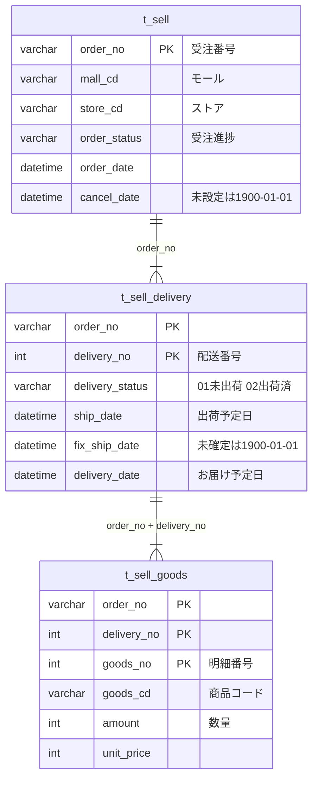

---
tags:
  - 緑茶園
  - ツール
  - easyECS
  - DB設計
client: 緑茶園グループ
関連テーマ: テーマ1 - 受注チャネル統合とツール複数人化
created: 2026-09-17
updated: 2026-09-17
aliases:
  - t_sell
  - t_sell_delivery
  - t_sell_goods
  - easyECS 受注テーブル
---

# easyECS — 受注テーブル（t_sell・t_sell_delivery・t_sell_goods）

親: [[easyECS - 00 概要]] ／ 関連: [[easyECS - 02 DB構造（ecsdb_esy）]] ／ [[変換器構想とMDC出力]]

> [!info] 出典と取り方
> 2026-09-17、読み取り専用ログインで取得。
> - **型・NULL可否・主キー**：システムカタログ
> - **行数**：`sys.partitions`（全件）
> - **充足率・値の傾向**：**直近の受注 3,000件**（`order_no` の大きい順、受注日 2026-09-01〜09-17）と、それに属する配送先 3,064件・明細 3,147件。`WITH (NOLOCK)` で読み、easyECS の処理を止めないようにした
>
> **季節の偏りに注意**：9月前半＝桃・りんご・ぶどうの繁忙期のサンプル。予約受注（数か月先の出荷）も含む。
> **個人情報・自由記述の列（氏名・住所・電話・メール・備考・社員名）は、値を一切載せていない**（充足率と最大文字数だけ）。受注番号などの識別子は、数字を `9` に置き換えた「形式」だけを載せた。
> 「意味」は列名と値からの推定を含む。ベンダーのテーブル定義書は未入手。

## 3テーブルの関係

| テーブル | 中身 | 主キー | 行数（全件） | 列数 |
|---|---|---|--:|--:|
| `t_sell` | 受注の見出し（1受注＝1行） | `order_no` | 523,033 | 103 |
| `t_sell_delivery` | 配送先（1受注に複数ありうる） | `order_no`, `delivery_no` | 531,325 | 59 |
| `t_sell_goods` | 明細（1配送先に複数ありうる） | `order_no`, `delivery_no`, `goods_no` | 566,813 | 39 |

**直近3,000受注での形**

| | 1 | 2 | 3 | 4 | 5以上 |
|---|--:|--:|--:|--:|--:|
| 1受注あたりの配送先の数 | 2,970 | 18 | 7 | 4 | 1（21件の配送先を持つ受注が1件） |
| 1配送先あたりの明細の数 | 2,998 | 57 | 5 | 1 | 3 |

→ **ほとんどが「1受注・1配送先・1明細」**。ただしギフトの複数配送（1受注→21配送先）もある。

### インデックス

| テーブル | インデックス |
|---|---|
| `t_sell` | 主キー `order_no`（クラスタ化）／`customer_cd`／`site_order_no`／`order_date`／`add_date`／`order_status`／`payment_type`／`pack_order_no`／`tax_date` |
| `t_sell_delivery` | 主キー `order_no, delivery_no`（クラスタ化）／`rapi_order_delivery_no` |
| `t_sell_goods` | 主キー `order_no, delivery_no, goods_no`（クラスタ化） |

> [!important] 読むときの作法
> `t_sell_delivery` と `t_sell_goods` には `delivery_status`・`ship_date` などのインデックスが**無い**。「未出荷の明細」を条件で探すと53万〜57万行を全部読むことになる。**主キー（`order_no`）の範囲で絞る**か、`t_sell` のインデックス（`order_date`・`add_date`・`order_status`）で先に受注を絞ってから結合する。

## 受注CSV（受注タイプ1）との対応

9/8 に解析した受注CSV（76列）の列と、DB の列の対応。〔すべて列名と値からの推定。CSV と同じ受注で値を突き合わせてはいない〕

| 受注CSVの列 | DB の列 | 根拠 |
|---|---|---|
| システム受注番号 | `t_sell.order_no` | 14桁の数字 |
| 配送番号 | `t_sell_delivery.delivery_no` | |
| 商品番号 | `t_sell_goods.goods_no` | CSV で `(システム受注番号, 配送番号, 商品番号)` が全行一意だった＝`t_sell_goods` の主キーと同じ |
| 受注進捗名 | `t_sell.order_status` → `m_name.order_status` | 900番台に「マルシェ」「もも：秀」など CSV と同じ語彙 |
| 配送進捗名 | `t_sell_delivery.delivery_status` → `m_name.delivery_status` | CSV は `未出荷`／`出荷済` の2値。サンプルも `01`／`02` の2値 |
| 出荷日 | `t_sell_delivery.ship_date` | 常に実日付（1900 なし）で一致 |
| 配送日 | `t_sell_delivery.delivery_date` | 同上 |
| 出荷確定日 | `t_sell_delivery.fix_ship_date` | 未確定が 1900-01-01 で一致 |
| キャンセル日付 | `t_sell.cancel_date` | 未キャンセルが 1900-01-01 で一致 |
| ストア名 | `t_sell.store_cd` → `m_name.store_cd` | 下の「ストア」の表を参照 |
| 商品コード | `t_sell_goods.goods_cd` | |

> [!danger] ストア名は重複している。集計・識別は `store_cd` で行う
> `02`・`05`・`07` の表示名が同じで、**`07` だけ末尾に半角スペースがある**。直近サンプルでは `07`（2,028件）がモール区分「楽天Pay」、`05`（358件）が「AMAZON」とほぼ同数で、**別のストア**。
> 9/8 の受注CSV解析では「末尾スペースで同一ストアが2つに分裂する（1742件と138件）」として **trim して1つにまとめる判断**をし、統合コンソールの受注残ボードも取り込み時にストア名を trim している。**これは楽天とAmazon を1つのストアに混ぜている可能性が高い。**
> 〔CSV の「ストア名」がこの `m_name.store_cd` の表示名そのものかは未照合。確定するまで 9/8 の判断は暫定扱い〕→ [[変換器構想とMDC出力]]

## 区分値（`m_name`）

### 受注進捗 `order_status`

本来の進捗と、**先方が追加した商品カテゴリ（900番台）**が混在している。

| コード | 名前 | 種類 | 直近サンプルの件数 |
|---|---|---|--:|
| `01` | 未確認 | 進捗 | 13 |
| `02` | 与信未 | 進捗 |  |
| `802` | 楽天処理中 | 楽天連携 | 17 |
| `803` | 楽天処理エラー | 楽天連携 |  |
| `05` | 入金待ち | 進捗 |  |
| `908` | フルーツ | **先方が追加（分類）**〔推定〕 | 112 |
| `903` | マルシェ | **先方が追加（分類）**〔推定〕 | 66 |
| `912` | ぶどう | **先方が追加（分類）**〔推定〕 | 119 |
| `909` | りんご：秀・準 | **先方が追加（分類）**〔推定〕 | 202 |
| `904` | りんご：茶箱 | **先方が追加（分類）**〔推定〕 | 214 |
| `911` | もも：秀(白+黄) | **先方が追加（分類）**〔推定〕 | 248 |
| `907` | もも：訳(白+黄) | **先方が追加（分類）**〔推定〕 | 194 |
| `906` | 予備1 | **先方が追加（分類）**〔推定〕 |  |
| `913` | 予備2 | **先方が追加（分類）**〔推定〕 |  |
| `914` | 予備3 | **先方が追加（分類）**〔推定〕 |  |
| `910` | メール済 | **先方が追加（分類）**〔推定〕 |  |
| `905` | 保存水 | **先方が追加（分類）**〔推定〕 | 13 |
| `902` | 翌日・日時 | **先方が追加（分類）**〔推定〕 | 74 |
| `06` | 発送待 | 進捗 |  |
| `04` | 与信エラー | 進捗 |  |
| `07` | 出荷指示済 | 進捗 | 325 |
| `08` | 出荷済 | 進捗 | 14 |
| `09` | 発送済 | 進捗 | 218 |
| `12` | 売上請求エラー | 進捗 |  |
| `881` | 取引登録エラー | NP後払い連携 |  |
| `888` | 出荷報告エラー | NP後払い連携 | 1 |
| `96` | 保留1 | 進捗 |  |
| `03` | 与信中 | 進捗 |  |
| `11` | 売上請求済 | 進捗 | 1128 |
| `119` | クレーム案件 | 進捗 |  |
| `97` | 保留2 | 進捗 |  |
| `98` | 保留3 | 進捗 |  |
| `10` | 売上請求中 | 進捗 |  |
| `103` | 全終了データ | 進捗 |  |
| `99` | キャンセル | 進捗 | 40 |
| `801` | 楽天確認待ち | 楽天連携 |  |
| `17` | 発送済未入金 | 進捗 |  |
| `14` | 与信取消エラー | 進捗 |  |
| `16` | 売上請求取消エラー | 進捗 |  |
| `13` | 与信取消中 | 進捗 |  |
| `15` | 売上請求取消中 | 進捗 |  |
| `95` | 削除済み受注進捗 | 進捗 |  |
| `880` | 取引登録中 | NP後払い連携 |  |
| `883` | 取引登録済 | NP後払い連携 |  |
| `882` | 取引キャンセル済 | NP後払い連携 |  |
| `884` | 取引キャンセル中 | NP後払い連携 |  |
| `885` | 取引キャンセルエラー | NP後払い連携 |  |
| `886` | 出荷報告中 | NP後払い連携 |  |
| `887` | 出荷報告済 | NP後払い連携 | 2 |
| `890` | 出荷指示エラー | NP後払い連携 |  |
| `891` | 出荷キャンセルエラー | NP後払い連携 |  |
| `900` | 出荷不可 | 進捗 |  |
| `901` | 出荷キャンセル | 進捗 |  |

### 配送進捗 `delivery_status`

| コード | 名前 | 直近サンプルの件数 |
|---|---|--:|
| `01` | 未出荷 | 1342 |
| `02` | 出荷済 | 1722 |
| `90` | 出荷不可 |  |
| `91` | 出荷キャンセル |  |

### モール区分 `mall_cd`

| コード | 名前 | 直近サンプルの件数 |
|---|---|--:|
| `01` | 楽天 |  |
| `22` | MakeShop |  |
| `23` | カラーミー |  |
| `24` | SHOP LIST |  |
| `36` | 楽天Pay | 2280 |
| `03` | yahoo | 230 |
| `04` | Wowma! | 124 |
| `02` | MDC | 9 |
| `05` | AMAZON | 357 |
| `06` | 47Club |  |
| `07` | ECCUBE |  |
| `08` | ぐるなび |  |
| `09` | GiftShop(今半) |  |
| `10` | aiship |  |
| `11` | ワイズカート |  |
| `12` | コールセンター |  |
| `20` | ウィモ |  |
| `25` | Ｅストアーショップサーブ |  |
| `26` | ヤマダモール |  |
| `27` | ヤフオク! |  |
| `29` | ポンパレモール |  |
| `30` | CARTSTAR |  |
| `31` | FutureShop2 |  |
| `32` | AmazonFBA |  |
| `33` | 売れるネット広告つくーる |  |
| `37` | LOHACO |  |
| `38` | PayPayモール |  |
| `99` | その他 |  |

### ストア `store_cd`

| コード | 名前 | 直近サンプルの件数 |
|---|---|--:|
| `01` | グルメ＆ギフトお取り寄せ　山形ｅLab　本店 | 8 |
| `02` | グルメ＆ギフトお取り寄せ　山形ｅLab |  |
| `03` | グルメ＆ギフトお取り寄せ　山形ｅLab　yahoo店 | 230 |
| `04` | 味自慢の都　ぐるなび食市場店 |  |
| `06` | グルメ＆ギフトお取り寄せ　山形ｅLab　ポンパレモール店 |  |
| `08` | グルメ＆ギフトお取り寄せ　山形ｅLab Wowma店 | 124 |
| `05` | グルメ＆ギフトお取り寄せ　山形ｅLab | 358 |
| `07` | グルメ＆ギフトお取り寄せ　山形ｅLab␣（末尾に半角スペース） | 2028 |
| `09` | 東北マルシェ | 252 |

### 支払方法 `payment_type`（使われているものだけ）

| コード | 名前 | 直近サンプルの件数 |
|---|---|--:|
| `105` | 全額ポイント利用 | 10 |
| `01` | クレジットカード | 2197 |
| `03` | 銀行振込 | 8 |
| `08` | セブンイレブン決済(前払) | 60 |
| `10` | ローソン決済(前払) | 39 |
| `19` | Amazon決済 | 357 |
| `23` | NP後払い | 39 |
| `24` | ソフトバンクまとめて支払い | 1 |
| `104` | ａｕかんたん決済 | 90 |
| `112` | PayPayクレジット | 35 |
| `113` | PayPay残高等 | 76 |
| `114` | PayPayポイント | 88 |

### 配送種別 `delivery_type`・配送時間 `delivery_time`・ギフト `gift_flg`

**配送種別 `delivery_type`**

| コード | 名前 | 直近サンプルの件数 |
|---|---|--:|
| `01` | ヤマト運輸 | 2346 |
| `02` | 佐川急便 | 599 |
| `06` | ネコポス | 119 |
| `05` | ゆうパック |  |
| `07` | 定形外郵便 |  |
| `08` | レターパック |  |
| `90` | 楽天物流 |  |
| `91` | Yahoo物流 |  |
| `89` | AmazonFBA |  |
| `92` | ヤマト運輸(冷蔵) |  |

**配送時間 `delivery_time`**

| コード | 名前 | 直近サンプルの件数 |
|---|---|--:|
| `00` | 指定なし | 2256 |
| `01` | 午前中 | 227 |
| `12` | 12:00-14:00 |  |
| `14` | 14:00-16:00 | 73 |
| `16` | 16:00-18:00 | 104 |
| `18` | 18:00-20:00 | 217 |
| `20` | ----- |  |
| `182` | 18:00-21:00 |  |
| `192` | 19:00-21:00 | 187 |

**ギフト `gift_flg`**

| コード | 名前 | 直近サンプルの件数 |
|---|---|--:|
| `0` | _ | 2125 |
| `1` | ギフト | 939 |
| `2` | 納品書金額表示無し |  |

## 列の一覧

凡例：**充足率**＝直近サンプルで NULL・空文字でない割合／🔒＝個人情報・自由記述のため値を載せない／形式の `9` は数字

### `t_sell`（受注）

| 列 | 型 | NULL | 充足率 | 意味 | 直近サンプルの値 |
|---|---|---|---|---|---|
| `order_no` | varchar(50) | 不可 | 100% | 受注番号（easyECS 採番。CSV「システム受注番号」） | 形式 `99999999999999` |
| `pack_order_no` | varchar(50) | 不可 | 0% | 同梱先の受注番号〔推定〕 | （空） |
| `site_order_no` | varchar(50) | 可 | 100% | モール側の注文番号（楽天・Amazon などで形式が違う） | 形式 `999999-99999999-9999999999`×2279、`999-9999999-9999999`×357、`99999999`×230、`999999999`×124 |
| `mall_cd` | varchar(3) | 不可 | 100% | モール区分 → `m_name.mall_cd` | `36`×2280、`05`×357、`03`×230、`04`×124、`02`×9 |
| `store_cd` | varchar(3) | 可 | 100% | ストア → `m_name.store_cd` | `07`×2028、`05`×358、`09`×252、`03`×230、`08`×124、`01`×8 |
| `order_date` | datetime | 不可 | 100% | 受注日時 | 2026-09-01〜2026-09-17 |
| `cancel_date` | datetime | 可 | 100% | キャンセル日。**未キャンセルは 1900-01-01**（NULLではない） | 1900-01-01〜2026-09-17（1900-01-01 が 2974件） |
| `customer_cd` | varchar(20) | 可 | 100% | 顧客コード → `m_customer` | 形式 `99999999999999` |
| `customer_name` | varchar(1000) | 不可 | 100% | 注文者 氏名 | 🔒 個人情報・自由記述のため値は載せない（最大23文字） |
| `customer_name_kana` | varchar(1000) | 可 | 87% | 注文者 カナ | 🔒 個人情報・自由記述のため値は載せない（最大29文字） |
| `customer_zipcd` | varchar(20) | 可 | 100% | 注文者 郵便番号 | 🔒 個人情報・自由記述のため値は載せない（最大8文字） |
| `customer_address` | varchar(1000) | 可 | 100% | 注文者 住所 | 🔒 個人情報・自由記述のため値は載せない（最大80文字） |
| `customer_tel` | varchar(50) | 可 | 100% | 注文者 電話 | 🔒 個人情報・自由記述のため値は載せない（最大14文字） |
| `customer_fax` | varchar(50) | 可 | 0% | 注文者 FAX | （空） |
| `customer_mail` | varchar(255) | 可 | 99% | 注文者 メール | 🔒 個人情報・自由記述のため値は載せない（最大54文字） |
| `comment` | varchar(max) | 可 | 38% | 注文時の備考（購入者の入力など）〔推定〕 | 🔒 個人情報・自由記述のため値は載せない（最大804文字） |
| `notes` | varchar(8000) | 可 | 91% | 社内メモ〔推定〕 | 🔒 個人情報・自由記述のため値は載せない（最大92文字） |
| `warehouse_notes` | varchar(8000) | 可 | 68% | 倉庫向けメモ〔推定〕 | 🔒 個人情報・自由記述のため値は載せない（最大62文字） |
| `alert_message` | varchar(4000) | 可 | 59% | 注意喚起メッセージ〔推定〕 | 🔒 個人情報・自由記述のため値は載せない（最大237文字） |
| `order_status` | varchar(3) | 不可 | 100% | 受注進捗 → `m_name.order_status`。**900番台は商品カテゴリに転用**（下表） | `11`×1128、`07`×325、`911`×248、`09`×218、`904`×214、`909`×202、`907`×194、`912`×119 ほか（18種） |
| `payment_type` | varchar(3) | 可 | 100% | 支払方法 → `m_name.payment_type` | `01`×2197、`19`×357、`104`×90、`114`×88、`113`×76、`08`×60、`10`×39、`23`×39 ほか（12種） |
| `number_of_payment` | int | 可 | 100% | 分割回数〔推定〕 | `0`×2994、`103`×3、`2`×2、`105`×1 |
| `mobile_flg` | varchar(1) | 不可 | 100% | 0=PC／1=MOBILE | `0`×2570、`1`×430 |
| `point` | int | 不可 | 100% | 利用ポイント | 0〜13000（468種） |
| `coupon` | int | 不可 | 100% | クーポン値引 | `0`×2672、`200`×108、`1000`×43、`1500`×40、`500`×34、`10`×24、`300`×19、`150`×14 ほか（21種） |
| `out_tax` | int | 不可 | 100% | 税抜合計 | 590〜120000（226種） |
| `tax` | int | 不可 | 100% | 消費税 | 56〜9600（209種） |
| `in_tax` | int | 不可 | 100% | 税込合計 | 648〜129600（214種） |
| `carriage` | int | 不可 | 100% | 送料 | `0`×2796、`600`×78、`300`×52、`770`×27、`990`×24、`1500`×15、`1200`×3、`900`×2 ほか（11種） |
| `collect_commission` | int | 不可 | 100% | 代引手数料〔推定〕 | `0`×2961、`250`×28、`300`×11 |
| `all_total` | int | 不可 | 100% | 請求合計 | 0〜129600（784種） |
| `pack_flg` | varchar(1) | 不可 | 100% | 同梱フラグ〔推定〕 | 常に `0` |
| `add_date` | datetime | 不可 | 100% | 登録日時 | 2026-09-01〜2026-09-17 |
| `edit_date` | datetime | 不可 | 100% | 更新日時 | 2026-09-02〜2026-09-17 |
| `edit_user` | varchar(50) | 不可 | 100% | 最終更新者（社員名） | 🔒 個人情報・自由記述のため値は載せない（最大7文字） |
| `regular_order_no` | varchar(50) | 可 | 0% | 定期購入の元受注〔推定〕 | （空） |
| `number_of_delivery` | int | 不可 | 100% | 配送回数〔推定〕 | 常に `0` |
| `point_type` | int | 不可 | 100% | ポイントの区分・他社ポイント〔推定〕 | 常に `0` |
| `point_other_use_type` | int | 不可 | 100% | ポイントの区分・他社ポイント〔推定〕 | `9`×2379、`0`×621 |
| `point_other_use` | int | 不可 | 100% | ポイントの区分・他社ポイント〔推定〕 | 0〜13000（365種） |
| `point_other_get_type` | int | 不可 | 100% | ポイントの区分・他社ポイント〔推定〕 | 常に `9` |
| `point_other_get` | int | 不可 | 100% | ポイントの区分・他社ポイント〔推定〕 | `0`×2990、`9`×10 |
| `repeater_flg` | varchar(1) | 不可 | 100% | 0=新規／1=リピーター | `0`×1842、`1`×1158 |
| `tax_date` | datetime | 可 | 100% | 税計算の基準日〔推定〕（サンプルでは order_date と同値） | 2026-09-01〜2026-09-17 |
| `rapi_payment_name` | nvarchar(32) | 可 | 99% | 楽天連携用 | `クレジットカード`×2197、`Amazon決済`×357、`ａｕかんたん決済`×90、`PayPayポイント`×88、`PayPay残高等`×76、`セブンイレブン決済(前払)`×58、`ローソン決済(前払)`×39、`PayPayクレジット`×35 ほか（12種） |
| `rapi_payment_control_type` | nvarchar(2) | 可 | 74% | 楽天連携用 | `01`×2197、`11`×32 |
| `rapi_dlv_chrg_defray_type` | nvarchar(1) | 可 | 99% | 楽天連携用 | 常に `0` |
| `rapi_full_payment_on_point_flg` | nvarchar(1) | 可 | 99% | 楽天連携用 | 常に `0` |
| `rapi_reserve_period` | int | 可 | 100% | 楽天連携用 | 常に `0` |
| `rapi_order_split_flg` | nvarchar(1) | 可 | 100% | 楽天連携用 | 常に `0` |
| `rapi_all_in_one_flg` | nvarchar(1) | 可 | 100% | 楽天連携用 | 常に `0` |
| `rapi_site_type` | nvarchar(5) | 可 | 99% | 楽天連携用 | 常に `0` |
| `ypf_kyoutsuku_flg` | nvarchar(1) | 可 | 99% | Yahoo!連携用〔推定〕 | 常に `0` |
| `ypf_bill_to_cntry_nm` | nvarchar(10) | 可 | 0% | Yahoo!連携用〔推定〕 | （空） |
| `ypf_discount_money2` | nvarchar(9) | 可 | 0% | Yahoo!連携用〔推定〕 | （空） |
| `ypf_detail_arised_point` | nvarchar(9) | 可 | 0% | Yahoo!連携用〔推定〕 | （空） |
| `npapi_regist_inst_seq_no` | int | 可 | 0% | NP後払い連携用 | `19445`×2、`19438`×1、`19439`×1、`19440`×1、`19441`×1、`19442`×1、`19443`×1、`19444`×1 ほか（9種） |
| `npapi_revision_inst_seq_no` | int | 可 | 0% | NP後払い連携用 | （空） |
| `npapi_cancel_inst_seq_no` | int | 可 | 0% | NP後払い連携用 | （空） |
| `npapi_ship_repo_inst_seq_no` | int | 可 | 0% | NP後払い連携用 | `11344`×1、`11347`×1、`11350`×1 |
| `npapi_transaction_id` | nvarchar(11) | 可 | 0% | NP後払い連携用 | 🔒 個人情報・自由記述のため値は載せない（最大11文字） |
| `npapi_settlement_type` | nvarchar(2) | 可 | 0% | NP後払い連携用 | 常に `02` |
| `yaapi_auction_id` | nvarchar(20) | 可 | 0% | ヤフオク！連携用 | （空） |
| `yaapi_order_no` | nvarchar(15) | 可 | 0% | ヤフオク！連携用 | （空） |
| `yaapi_yjp_id` | nvarchar(40) | 可 | 0% | ヤフオク！連携用 | （空） |
| `npapi_send_delivery_no` | int | 可 | 0% | NP後払い連携用 | 常に `1` |
| `flg_set_tax` | int | 不可 | 100% | 税率別集計あり〔推定〕 | 常に `1` |
| `out_tax_0` | int | 不可 | 100% | 税率 0% 分の内訳 | 常に `0` |
| `tax_0` | int | 不可 | 100% | 税率 0% 分の内訳 | 常に `0` |
| `in_tax_0` | int | 不可 | 100% | 税率 0% 分の内訳 | 常に `0` |
| `point_0` | int | 不可 | 100% | 税率 0% 分の内訳 | 常に `0` |
| `coupon_0` | int | 不可 | 100% | 税率 0% 分の内訳 | 常に `0` |
| `order_out_tax_0` | int | 不可 | 100% | 税率 0% 分の内訳 | 常に `0` |
| `order_tax_0` | int | 不可 | 100% | 税率 0% 分の内訳 | 常に `0` |
| `order_in_tax_0` | int | 不可 | 100% | 税率 0% 分の内訳 | 常に `0` |
| `coupon_fix_0` | int | 不可 | 100% | 税率 0% 分の内訳 | 常に `0` |
| `out_tax_5` | int | 不可 | 100% | 税率 5% 分の内訳 | 常に `0` |
| `tax_5` | int | 不可 | 100% | 税率 5% 分の内訳 | 常に `0` |
| `in_tax_5` | int | 不可 | 100% | 税率 5% 分の内訳 | 常に `0` |
| `point_5` | int | 不可 | 100% | 税率 5% 分の内訳 | 常に `0` |
| `coupon_5` | int | 不可 | 100% | 税率 5% 分の内訳 | 常に `0` |
| `order_out_tax_5` | int | 不可 | 100% | 税率 5% 分の内訳 | 常に `0` |
| `order_tax_5` | int | 不可 | 100% | 税率 5% 分の内訳 | 常に `0` |
| `order_in_tax_5` | int | 不可 | 100% | 税率 5% 分の内訳 | 常に `0` |
| `coupon_fix_5` | int | 不可 | 100% | 税率 5% 分の内訳 | 常に `0` |
| `out_tax_8` | int | 不可 | 100% | 税率 8% 分の内訳 | 0〜120000（207種） |
| `tax_8` | int | 不可 | 100% | 税率 8% 分の内訳 | 0〜9600（190種） |
| `in_tax_8` | int | 不可 | 100% | 税率 8% 分の内訳 | 0〜129600（204種） |
| `point_8` | int | 不可 | 100% | 税率 8% 分の内訳 | 0〜6477（149種） |
| `coupon_8` | int | 不可 | 100% | 税率 8% 分の内訳 | `0`×2674、`200`×108、`1000`×43、`1500`×40、`500`×31、`10`×24、`300`×19、`150`×12 ほか（25種） |
| `order_out_tax_8` | int | 不可 | 100% | 税率 8% 分の内訳 | 0〜120000（431種） |
| `order_tax_8` | int | 不可 | 100% | 税率 8% 分の内訳 | 0〜9600（330種） |
| `order_in_tax_8` | int | 不可 | 100% | 税率 8% 分の内訳 | 0〜129600（429種） |
| `coupon_fix_8` | int | 不可 | 100% | 税率 8% 分の内訳 | `0`×2730、`200`×108、`1500`×39、`1000`×30、`10`×24、`150`×12、`30`×11、`100`×11 ほか（20種） |
| `out_tax_10` | int | 不可 | 100% | 税率 10% 分の内訳 | `0`×2949、`1260`×12、`3000`×6、`4419`×5、`3535`×4、`1473`×2、`2946`×2、`3500`×2 ほか（24種） |
| `tax_10` | int | 不可 | 100% | 税率 10% 分の内訳 | `0`×2949、`126`×12、`300`×6、`441`×5、`353`×4、`147`×2、`294`×2、`350`×2 ほか（24種） |
| `in_tax_10` | int | 不可 | 100% | 税率 10% 分の内訳 | `0`×2949、`1386`×12、`3300`×6、`4860`×5、`3888`×4、`1620`×2、`3240`×2、`3850`×2 ほか（24種） |
| `point_10` | int | 不可 | 100% | 税率 10% 分の内訳 | `0`×2982、`193`×2、`1`×1、`3`×1、`6`×1、`10`×1、`25`×1、`35`×1 ほか（18種） |
| `coupon_10` | int | 不可 | 100% | 税率 10% 分の内訳 | `0`×2993、`74`×2、`150`×2、`92`×1、`119`×1、`197`×1 |
| `order_out_tax_10` | int | 不可 | 100% | 税率 10% 分の内訳 | 0〜11401（55種） |
| `order_tax_10` | int | 不可 | 100% | 税率 10% 分の内訳 | 0〜1137（53種） |
| `order_in_tax_10` | int | 不可 | 100% | 税率 10% 分の内訳 | 0〜12538（54種） |
| `coupon_fix_10` | int | 不可 | 100% | 税率 10% 分の内訳 | `0`×2998、`150`×2 |

### `t_sell_delivery`（配送先）

| 列 | 型 | NULL | 充足率 | 意味 | 直近サンプルの値 |
|---|---|---|---|---|---|
| `order_no` | varchar(50) | 不可 | 100% | 受注番号 → `t_sell` | 形式 `99999999999999` |
| `delivery_no` | int | 不可 | 100% | 配送番号（1受注の中の送り先の連番。CSV「配送番号」） | `1`×3000、`2`×30、`3`×12、`4`×5、`5`×1、`6`×1、`7`×1、`8`×1 ほか（21種） |
| `basket_id` | bigint | 可 | 99% | モール側のバスケットID〔推定〕 | 形式 `9999999999`×2336、`9`×714 |
| `delivery_name` | varchar(1000) | 不可 | 100% | 送り先 氏名 | 🔒 個人情報・自由記述のため値は載せない（最大23文字） |
| `delivery_name_kana` | varchar(1000) | 可 | 87% | 送り先 カナ | 🔒 個人情報・自由記述のため値は載せない（最大29文字） |
| `delivery_zipcd` | varchar(20) | 可 | 100% | 送り先 郵便番号 | 🔒 個人情報・自由記述のため値は載せない（最大8文字） |
| `delivery_address` | varchar(1000) | 可 | 100% | 送り先 住所 | 🔒 個人情報・自由記述のため値は載せない（最大80文字） |
| `delivery_tel` | varchar(50) | 可 | 100% | 送り先 電話 | 🔒 個人情報・自由記述のため値は載せない（最大14文字） |
| `delivery_fax` | varchar(50) | 可 | 0% | 送り先 FAX | （空） |
| `delivery_status` | varchar(3) | 不可 | 100% | 配送進捗 → `m_name.delivery_status`（01=未出荷／02=出荷済） | `02`×1722、`01`×1342 |
| `delivery_type` | varchar(3) | 不可 | 100% | 配送種別（配送業者） → `m_name.delivery_type` | `01`×2346、`02`×599、`06`×119 |
| `delivery_time` | varchar(3) | 不可 | 100% | 配送時間帯 → `m_name.delivery_time` | `00`×2256、`01`×227、`18`×217、`192`×187、`16`×104、`14`×73 |
| `carriage` | int | 不可 | 100% | 送料 | `0`×2857、`600`×78、`300`×56、`770`×27、`990`×24、`1500`×15、`900`×2、`1200`×2 ほか（11種） |
| `collect_commission` | int | 不可 | 100% | 代引手数料〔推定〕 | `0`×3025、`250`×28、`300`×11 |
| `gift_flg` | varchar(1) | 不可 | 100% | 0=通常／1=ギフト／2=納品書金額表示無し | `0`×2125、`1`×939 |
| `ship_date` | datetime | 可 | 100% | 出荷予定日（CSV「出荷日」）。**予約受注で数か月先まで入る** | 2026-09-02〜2027-01-28 |
| `fix_ship_date` | datetime | 可 | 100% | 出荷確定日。**未確定は 1900-01-01** | 1900-01-01〜2026-09-17（1900-01-01 が 1666件） |
| `delivery_date` | datetime | 可 | 100% | お届け予定日（CSV「配送日」） | 2026-09-03〜2027-01-29 |
| `load_no` | varchar(1000) | 可 | 45% | 送り状番号（伝票番号） | 形式 `999999999999` |
| `notes` | varchar(1000) | 可 | 31% | 配送メモ | 🔒 個人情報・自由記述のため値は載せない（最大21文字） |
| `add_date` | datetime | 不可 | 100% | 登録日時 | 2026-09-01〜2026-09-17 |
| `edit_date` | datetime | 不可 | 100% | 更新日時 | 2026-09-02〜2026-09-17 |
| `edit_user` | varchar(50) | 不可 | 100% | 最終更新者 | 🔒 個人情報・自由記述のため値は載せない（最大7文字） |
| `payment_money` | int | 不可 | 100% | 〔用途不明〕 | 常に `0` |
| `rapi_dlv_req_date` | datetime | 不可 | 100% | 楽天連携用 | 1900-01-01〜2026-12-14（1900-01-01 が 1880件） |
| `rapi_dlv_designated_date` | datetime | 不可 | 100% | 楽天連携用 | 1900-01-01〜2026-12-15（1900-01-01 が 1880件） |
| `rapi_dlv_designated_time` | nvarchar(4) | 可 | 100% | 楽天連携用 | `0`×1880、`00`×848、`01`×103、`18`×78、`192`×78、`16`×39、`14`×38 |
| `rapi_home_dlv_srv_flg` | nvarchar(1) | 可 | 100% | 楽天連携用 | 常に `1` |
| `rapi_dlv_type_cd1` | nvarchar(2) | 可 | 100% | 楽天連携用 | 常に `1` |
| `rapi_dlv_type_cd2` | nvarchar(2) | 可 | 100% | 楽天連携用 | 常に `1` |
| `rapi_dlv_srv_type` | nvarchar(2) | 可 | 100% | 楽天連携用 | 常に `0` |
| `rapi_dlv_company_cd` | nvarchar(5) | 可 | 100% | 楽天連携用 | 常に `1` |
| `rapi_other_party_flg` | nvarchar(1) | 可 | 99% | 楽天連携用 | 常に `0` |
| `rapi_wrapping_flg` | nvarchar(1) | 可 | 100% | 楽天連携用 | 常に `0` |
| `rapi_exceed_max_claim_amt_flg` | nvarchar(1) | 可 | 100% | 楽天連携用 | 常に `0` |
| `rapi_apology_flg` | nvarchar(1) | 可 | 100% | 楽天連携用 | 常に `0` |
| `rapi_sales_rsv_type` | nvarchar(1) | 可 | 100% | 楽天連携用 | 常に `1` |
| `rapi_nondisplay_amt_flg` | nvarchar(1) | 可 | 100% | 楽天連携用 | `0`×2125、`1`×939 |
| `rapi_noshi_type` | nvarchar(15) | 可 | 0% | 楽天連携用 | （空） |
| `rapi_noshi_upperpart` | nvarchar(10) | 可 | 0% | 楽天連携用 | （空） |
| `rapi_noshi_underpart` | nvarchar(40) | 可 | 0% | 楽天連携用 | （空） |
| `rapi_message_type` | nvarchar(15) | 可 | 0% | 楽天連携用 | （空） |
| `rapi_message_content` | nvarchar(100) | 可 | 0% | 楽天連携用 | （空） |
| `rapi_gift_remark` | nvarchar(150) | 可 | 0% | 楽天連携用 | （空） |
| `rapi_wrapping_type` | nvarchar(15) | 可 | 0% | 楽天連携用 | （空） |
| `rapi_dlv_remarks` | nvarchar(255) | 可 | 30% | 楽天連携用 | 🔒 個人情報・自由記述のため値は載せない（最大21文字） |
| `rapi_order_delivery_no` | bigint | 不可 | 100% | 楽天側の配送番号〔推定〕 | 形式 `999999999999` |
| `rapi_point` | int | 不可 | 100% | 楽天連携用 | 0〜13000（468種） |
| `rapi_coupon` | int | 不可 | 100% | 楽天連携用 | `0`×2736、`200`×108、`1000`×43、`1500`×40、`500`×34、`10`×24、`300`×19、`150`×14 ほか（21種） |
| `rapi_amt_of_billed` | int | 不可 | 100% | 請求額（楽天連携の値）〔推定〕 | 0〜129600（774種） |
| `ypf_dlv_type_cd` | nvarchar(1) | 可 | 99% | Yahoo!連携用〔推定〕 | 常に `1` |
| `ypf_shp_to_cntry_nm` | nvarchar(10) | 可 | 0% | Yahoo!連携用〔推定〕 | （空） |
| `ypf_receipt_out_flg` | nvarchar(1) | 可 | 0% | Yahoo!連携用〔推定〕 | （空） |
| `ypf_gift_kind_cls` | nvarchar(2) | 可 | 0% | Yahoo!連携用〔推定〕 | （空） |
| `ypf_message` | nvarchar(99) | 可 | 0% | Yahoo!連携用〔推定〕 | （空） |
| `ypf_gift_comb_flg` | nvarchar(1) | 可 | 0% | Yahoo!連携用〔推定〕 | （空） |
| `ypf_noshi_kbn` | nvarchar(2) | 可 | 0% | Yahoo!連携用〔推定〕 | （空） |
| `ypf_noshi_u_mes` | nvarchar(10) | 可 | 0% | Yahoo!連携用〔推定〕 | （空） |
| `ypf_noshi_l_mes` | nvarchar(99) | 可 | 0% | Yahoo!連携用〔推定〕 | （空） |

### `t_sell_goods`（明細）

| 列 | 型 | NULL | 充足率 | 意味 | 直近サンプルの値 |
|---|---|---|---|---|---|
| `order_no` | varchar(50) | 不可 | 100% | 受注番号 → `t_sell` | 形式 `99999999999999` |
| `delivery_no` | int | 不可 | 100% | 配送番号 → `t_sell_delivery` | `1`×3083、`2`×30、`3`×12、`4`×5、`5`×1、`6`×1、`7`×1、`8`×1 ほか（21種） |
| `goods_no` | int | 不可 | 100% | 明細番号（配送先ごとの連番。CSV「商品番号」） | `1`×3064、`2`×66、`3`×9、`4`×4、`5`×3、`6`×1 |
| `basket_id` | bigint | 可 | 99% | モール側のバスケットID〔推定〕 | 形式 `9999999999`×2404、`9`×724 |
| `goods_cd` | varchar(500) | 不可 | 100% | 商品コード（自社SKU） → `m_goods` | 302種。例：`mm-113`、`mm-124` |
| `warehouse_cd` | varchar(3) | 不可 | 100% | 倉庫 → `m_name.warehouse_cd`（1=デフォルト倉庫） | 常に `1` |
| `goods_name` | varchar(1000) | 可 | 100% | 商品名（**モールの商品ページのタイトルそのまま**。SALE文言も入る） | 396種。例：`【スーパーSALE・豊作セール25%off!】＼只今、お届け…`、`桃 硬い桃 白桃CX 2.5kg 秀品 山形県産 白桃 送料…` |
| `option_x` | varchar(8000) | 可 | 79% | 商品オプション（購入時の選択肢。「項目:選択値 | …」の形） | 254種。例：`クール便でお届けいたします:確認いたしました ／ 沖縄・離島…`、`クール便でお届けいたします:確認いたしました ／ 沖縄・離島…` |
| `option_y` | varchar(1000) | 可 | 0% | 商品オプション2 | （空） |
| `amount` | int | 不可 | 100% | 数量 | `1`×3013、`2`×89、`3`×19、`0`×9、`4`×7、`8`×3、`5`×2、`10`×2 ほか（11種） |
| `unit_price` | int | 不可 | 100% | 単価 | 0〜25500（155種） |
| `unit_tax` | int | 不可 | 100% | 単価の消費税 | 0〜2040（144種） |
| `out_tax` | int | 不可 | 100% | 税抜小計 | 0〜120000（191種） |
| `tax` | int | 不可 | 100% | 消費税 | 0〜9600（177種） |
| `in_tax` | int | 不可 | 100% | 税込小計 | 0〜129600（181種） |
| `notes` | varchar(1000) | 可 | 29% | 明細メモ | 🔒 個人情報・自由記述のため値は載せない（最大5文字） |
| `comment` | varchar(1000) | 可 | 0% | 明細コメント | （空） |
| `set_flg` | int | 不可 | 100% | セット商品フラグ | 常に `0` |
| `set_no` | int | 不可 | 100% | セット番号 | 常に `0` |
| `add_date` | datetime | 不可 | 100% | 登録日時 | 2026-09-01〜2026-09-17 |
| `edit_date` | datetime | 不可 | 100% | 更新日時 | 2026-09-01〜2026-09-17 |
| `edit_user` | varchar(50) | 不可 | 100% | 最終更新者 | 🔒 個人情報・自由記述のため値は載せない（最大7文字） |
| `rapi_inspctn_flg` | nvarchar(1) | 可 | 100% | 楽天連携用 | 常に `0` |
| `rapi_through_cd` | nvarchar(1) | 可 | 100% | 楽天連携用 | 常に `0` |
| `rapi_center_cd` | nvarchar(5) | 可 | 0% | 楽天連携用 | （空） |
| `rapi_shipping_ng_cnt` | int | 可 | 0% | 楽天連携用 | 常に `0` |
| `rapi_shipping_ng_reason` | nvarchar(1) | 可 | 100% | 楽天連携用 | 常に `0` |
| `ypf_logistics_cd` | nvarchar(5) | 可 | 0% | Yahoo!連携用〔推定〕 | （空） |
| `ypf_logistics_warehouse_cd` | nvarchar(5) | 可 | 0% | Yahoo!連携用〔推定〕 | （空） |
| `ypf_storage_cd` | nvarchar(2) | 可 | 99% | Yahoo!連携用〔推定〕 | 常に `01` |
| `ypf_shp_to_logistics_cd` | nvarchar(5) | 可 | 0% | Yahoo!連携用〔推定〕 | （空） |
| `ypf_shp_to_logistics_warehouse_cd` | nvarchar(5) | 可 | 0% | Yahoo!連携用〔推定〕 | （空） |
| `ypf_prod_nm2` | nvarchar(28) | 可 | 0% | Yahoo!連携用〔推定〕 | （空） |
| `ypf_tax_flg` | nvarchar(1) | 可 | 0% | Yahoo!連携用〔推定〕 | （空） |
| `ypf_expiration_dt_manag_cls` | datetime | 不可 | 100% | Yahoo!連携用〔推定〕 | 常に `1900-01-01 00:00:00` |
| `ypf_lot_manag_cls` | nvarchar(30) | 可 | 0% | Yahoo!連携用〔推定〕 | （空） |
| `ypf_cng_prod_cd1` | nvarchar(99) | 可 | 0% | Yahoo!連携用〔推定〕 | （空） |
| `tax_rate` | int | 不可 | 100% | 税率（8／10） | `8`×3081、`10`×66 |
| `basket_id_cnt` | int | 不可 | 100% | 〔用途不明〕 | 常に `1` |

## 読み取りで気づいたこと

- **2026-09-17 追記：ストアとモール区分の対応を実データで確認した**（受注日 直近12か月の未出荷 2,775明細）。`07`→楽天Pay、`05`→AMAZON、`09`（東北マルシェ）→楽天Pay、`03`→yahoo、`08`→Wowma!、`01`（本店）→MDC。**ストアとモール区分は1対1ではない**（`08` に MDC の受注が1件ある）。店舗別に集計するときはストアコードでまとめ、モール区分は添えて表示する
- **`goods_name` はモールの商品ページのタイトルそのもの**（「【スーパーSALE・豊作セール25%off!】…」など）。同じ商品でも時期によって名前が変わるので、**商品の識別には `goods_cd` を使う**。直近サンプルの `goods_cd` は302種、`goods_name` は396種
- **`option_x` に購入時の選択肢が「項目:選択値 | …」で入る**（「ギフトの種類をお選びください:敬老の日ギフト | 発送時期をお選びください:敬老の日ギフト(9/14～21お届け)」など）。発送時期の指定がここにしか無い商品がある
- **`ship_date`（出荷予定日）は 2027-01 まで入っている**＝予約受注。9/8 の受注CSV解析の「果物の収穫期に合わせた予約受注が主体」と一致
- `amount = 0` の明細が 9件ある〔用途不明。同梱・おまけの可能性〕
- `t_sell` の税額は税率別（`*_0`・`*_5`・`*_8`・`*_10`）にも持っている。直近は 8%（食品）が大半、10% は 51件
- 楽天の受注は `mall_cd = 36`（楽天Pay）で入っていて、`01`（楽天）ではない
- `t_sell.order_date` の最大値が調査時刻（17時台）より後の 20:05 だった〔原因未確認〕

## 関連

- [[easyECS - 00 概要]] ／ [[easyECS - 01 DB接続（Tailscale・SQL Server）]] ／ [[easyECS - 02 DB構造（ecsdb_esy）]]
- `ツール/easyECS/sql/01_受注残の明細.sql` — この3テーブルから受注残を取る SQL の案（未実行）
- [[変換器構想とMDC出力]] — 受注CSVの解析結果（2026-09-08）
