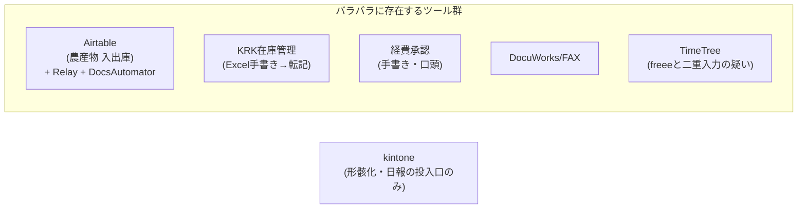
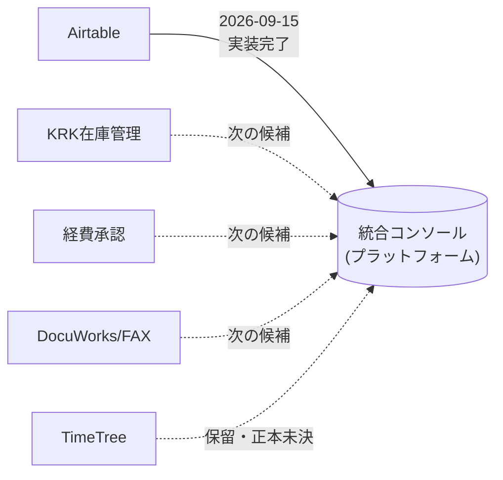

---
tags:
  - 緑茶園
  - 打ち合わせ
  - アジェンダ
client: 緑茶園グループ
date: 2026-09-16
created: 2026-09-15
updated: 2026-09-15
---

# テーマ2｜グループウェア整理の方向性協議（2026-09-16）

親: [[00 MOC|緑茶園グループ MOC]] ／ 関連: [[テーマ2 - グループウェアの役割再定義]] / [[Airtable再構築 - 00 概要]] / [[platform - 00 概要]]

> [!info] このノートについて
> 2026-09-16実施予定の打ち合わせ、**テーマ2（グループウェアの役割再定義）**の事前アジェンダ。**下の図・数値は2026-09-15時点のスナップショット**（打ち合わせ当日に手元で見返せるようにこのノートに複製）。設計判断・最新版の正本は [[テーマ2 - グループウェアの役割再定義]] と [[Airtable再構築 - 00 概要]] 側。見直しが入ったら本ノートではなくそちらを更新し、本ノートは「この日この案で協議した」という記録として残す。

## この協議の目的

バラバラに細かく管理されているツール群（Airtable・KRK在庫管理・経費承認・DocuWorks/FAX・TimeTreeなど）の解体を、**まずAirtableから**始める。Airtableについては2026-09-14に「自前再構築（統合コンソールの仕入機能）」で確定し、2026-09-15に実装も完了済み。**この方針（コスト・柔軟性の観点でプラットフォームに寄せる）でこのまま進めてよいか、先方の合意を取りたい**。あわせて、残りの候補も同じ路線で続けるかを相談する。

> [!warning] GUIファースト方針との矛盾は未解決のまま
> [[テーマ2 - グループウェアの役割再定義]] の「GUIファースト方針」は本来 kintone のような**git/npm に依存しない構成**を志向していた。Airtableを自前（統合コンソール）で再構築したのは、コスト・柔軟性を優先してこの方針とは逆方向に進んだ判断。保守の属人性（SPOFがちぇる個人に寄る）は解消されていない。この点も含めて先方の意思を確認したい。

## 前提：現在のプラットフォームの役割・機能整理（仕入まわり）

### 現在の状態（2026-09-15時点）
- Airtableの「農産物 入出庫」（入荷記録表）を、統合コンソールの**仕入機能（`inventory`）として再構築・実装完了**（`stage3/inventory`ブランチ、画面で確認済み）
- Airtable側からの抽出スクリプトも移植済みだが、**本番での実行（実データ移行）はまだ**
- テーマ1（EC受注）と同じプラットフォーム1本の中の、別モジュールという位置づけ

### 今すでに使える機能
- **ホーム**：KPIダッシュボードではなく「今日やること」の入口（入荷入力ボタン・月締め待ち件数・要確認件数）
- **入荷入力**：取引先と取引日を選ぶと、その取引先の商品が「前回いつ・何個仕入れたか」付きで並び、数量を打つだけで伝票化。単価は原価履歴から自動入力
- **取引一覧**：期間・取引先・支払進捗で絞り込み、複数行を選んで進捗を一括変更。CSV出力対応（現行のExcelピボット集計運用を踏襲）
- **月締め・支払明細書**：取引先ごとに発行。税率ごとに自動集計、支払期日は取引条件から自動計算。発行後の誤りは「取消→修正→再発行」で対応
- **マスタ**：取引先・商品・規格
- **（POC期間のみ）データ品質画面**：移行データの要確認項目一覧

## Airtable調査の要約（詳細はリンク先）

- 現行はAirtable本体＋Relay＋DocsAutomatorの**月額課金3層構成**。全23テーブル・商品マスタ73フィールド（うちSKU系formulaが6個併存）
- **2026-07-14ごろにデータ破損が発生**し、現在は複数バックアップ運用中（原因はヒアリングで解消済み）
- 中核アウトプットは**支払明細書**（月締め入荷記録）。16か月で80件＝月あたり約5枚だが、明細行が可変で複数ページに及ぶケースがある（例：㈱高橋果樹園2025年5月分は明細80行近い）
- ヒアリングで判明：取引一覧はCSV出力してExcelのピボットで集計する運用、支払進捗は口頭で入金依頼を受けてから手で変更（Relayの自動進捗機能は実は未使用と判明）

> [!note] kintone案（案A）も検討したうえでの選択
> 当初はkintoneへの統合を優先候補として検討していた。本体ライセンスは既に契約済みで追加費用がなく、保守の属人性も低く、GUIファースト方針とも合致するため。**ただし支払明細書の帳票出力には別途プラグインが必要**（買い切り20万円〜、サブスクなら月8,333〜20,000円）で、他アプリの明細行を展開できる製品は数が限られる。2026-09-11に一度「自前で進める」と決め、2026-09-12に軽量なkintone設計案が見つかり再検討したが、**2026-09-14に改めて自前（統合コンソール）で確定**した。比較の詳細は [[Airtable再構築 - 00 概要]] の案A／案B比較表・帳票プラグイン実額調査を参照。

詳細・原典：
- [[Airtable再構築 - 00 概要]] — 案A（kintone）／案B（自前）比較表、ゲート判定、5年総額比較
- [[Airtable再構築 - ヒアリング回答ログ]] — ヒアリングへの回答原文
- [[Airtable再構築 - データモデル設計比較]] — 全23テーブルのAS-IS調査とTO-BE正規化スキーマ
- [[Airtable再構築 - 画面設計（UI・UX）]] — 新画面の決定事項

## AS-IS（現状）

## TO-BE（提案）

## 確認したいこと

### 1. Airtable解体の方針そのものの確認
- 「自前（統合コンソール）で解体・再構築」で確定した方針のまま進めてよいか
- コスト比較（下表）を見せて、コスト・柔軟性の観点での判断を再確認する

> [!warning] 訂正（2026-09-15）：どちらの選択肢も「ほぼゼロ」ではない。両方フル価格で並べ直した
> 旧版は自前を「追加インフラ費ほぼゼロ」、kintoneを「本体は契約済みだから帳票プラグイン代だけ」という、**前提が揃っていない比較**になっていた。Vercel／Supabase／さくらVPSは実際に毎月課金される（月2万円程度の見込み）し、kintoneも公式サイトでは**スタンダードコース月額1,800円／人・最低10人から**（[kintone公式](https://kintone.cybozu.co.jp/price/)）。既契約分で足りるかは未確認のため、両方とも「ゼロから契約した場合のフル価格」で並べ、その上で実際の増分がいくらかを注記する形にした。

| 選択肢                                 | 5年総額（目安）        | 内訳                                                                                    |
| ----------------------------------- | --------------- | ------------------------------------------------------------------------------------- |
| 現行（Airtable＋Relay＋DocsAutomator）    | 90万〜240万円       | 月額課金3層構成                                                                              |
| kintone スタンダード10名＋k-Report          | 約158万円          | 本体108万円（¥1,800×10名×60ヶ月、税別）＋帳票50万円                                                    |
| kintone スタンダード10名＋プリントクリエイター スタンダード | 約180万円          | 本体108万円＋帳票72万円                                                                        |
| **自前（統合コンソール）**                     | **約120万円＋開発工数** | インフラ費 月2万円程度 （Vercel／Supabase／さくらVPS。**EC受注機能と共有**のため、Airtable単体の増分はこれより小さい可能性がある） |

> [!note] 「本体は既契約」の扱いは要確認
> [[Airtable再構築 - 00 概要]] は「kintone本体は質問トラッカー用に既に契約済みで追加費用なし」という前提で判断していた。その前提が今も有効（現在の契約人数・プランで足りる）なら、kintone側の実質増分は帳票プラグイン代（50万〜72万円）だけになり、自前より安くなる。**現在の契約人数・プランを確認してから、この表の「実質増分」を確定させる。**

### 2. 残りの候補をどう進めるか
- KRK在庫管理・経費承認・DocuWorks/FAX・TimeTreeも、同じ路線（プラットフォームへ寄せる）で続けてよいか
- それとも、GUIファースト方針に立ち返って一部はkintoneに寄せるべきか（保守の属人性の懸念とセットで相談）

### 3. 体制リスクの共有
- 自前で進める場合、保守の属人性（SPOFがちぇる個人に寄る）が残る点をどう捉えているか。経営者への業務集中の解消という当初目的と矛盾しないか

## 関連ノート

- [[テーマ2 - グループウェアの役割再定義]]
- [[Airtable再構築 - 00 概要]] / [[Airtable再構築 - ヒアリング回答ログ]] / [[Airtable再構築 - データモデル設計比較]] / [[Airtable再構築 - 画面設計（UI・UX）]]
- [[platform - 00 概要]]
- [[テーマ1 - 受注チャネル統合の方向性協議]] — 同日協議のテーマ1
