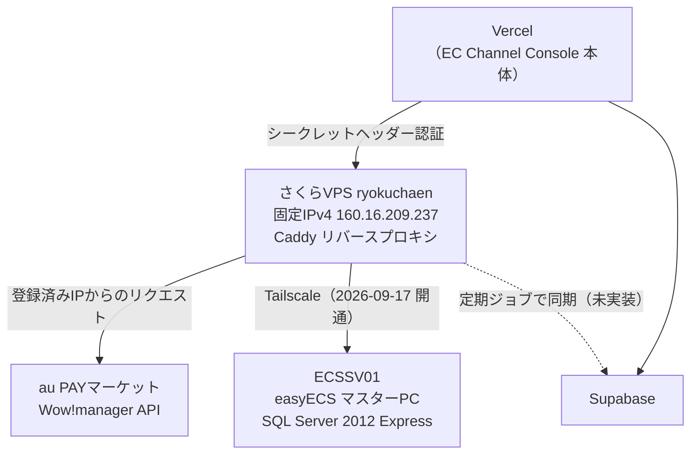
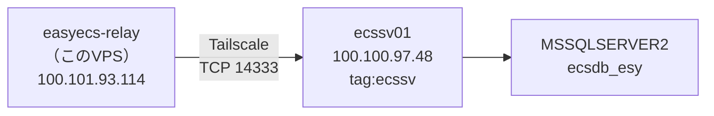

---
tags:
  - 緑茶園
  - 案件
  - 開発中システム
  - インフラ
client: 緑茶園グループ
親論点: テーマ1 - 受注チャネル統合とツール複数人化
フェーズ: 運用中
created: 2026-09-12
updated: 2026-09-17
aliases:
  - ryokuchaen
  - さくらのVPS
---

# さくらのVPS `ryokuchaen`（固定IP中継サーバ）

親: [[EC Channel Console - 00 概要]] ／ 親論点: [[テーマ1 - 受注チャネル統合とツール複数人化]]

> [!info] このノートの位置づけ
> [[EC Channel Console - 00 概要|EC Channel Console]] のために契約した**固定IPのサーバ1台**についての、契約情報・入り方・運用メモ。
>
> **サーバ上で動いているものの実装仕様（Caddyの設定・環境変数・切り分け手順）はリポジトリ側が正本** → `~/git/multi-channel-order-fetcher/docs/credentials.md`「中継プロキシ経由で使う場合」。このノートが持つのは**サーバそのもの**（契約・ログイン・OS・役割）だけ。二重管理にしない。
>
> **認証情報はこのVaultに書かない。** SSHパスワード・`AU_PROXY_SECRET` などはここには載せない（契約時に設定した値／パスワード管理側で管理する）。

## なぜこのサーバがあるのか

月数百円のVPS1台で、**構造の同じ壁が2つ**解ける。どちらも「送信元が固定IPでないと繋げない」という同型の問題。



| 役割 | 状態 | 詳細 |
|---|---|---|
| **au PAYマーケット中継プロキシ**（Caddy＋シークレットヘッダー認証＋Let's Encrypt自動HTTPS） | 🟢 **稼働中**。2026-09-09 に本番デプロイから実データ62件の取得を確認 | → [[EC Channel Console - 00 概要]]「au PAYマーケットのIP制限」 |
| **easyECS の SQL Server から読み取り、Supabaseへ同期する定期ジョブ** | 🟡 **経路と読み取り専用ログインは用意済み（2026-09-17）**。ジョブ本体は未実装（受注残に使うテーブルの特定待ち） | → [[EC Channel Console - 変換器構想とMDC出力]] |

> [!note] 2026-09-12 時点の記述（履歴として残す）
> VPS側には Tailscale を導入済み。**繋ぐ相手側（`ECSSV01`）が未対応**なので、SQL Server 側の役割はまだ動いていない。
> → **2026-09-17 解消**。下記「Tailscale（easyECS SQL Server への経路）」参照。

## Tailscale（easyECS SQL Server への経路）

2026-09-17 に開通。**VPS から `ECSSV01` の SQL Server に、読み取り専用ログインで接続できることを確認済み。**



### tailnet は「こちら管理」に一本化した

| 端末 | tailnet 上の名前 | Tailscale IP | 所有 |
|---|---|---|---|
| さくらVPS | `easyecs-relay` | `100.101.93.114` | `CHOISC1208@github` |
| 先方マスターPC | `ecssv01` | `100.100.97.48` | タグ `tag:ecssv`（キー期限切れなし） |

tailnet は **`choisc1208.github`（こちらのアカウント・Free プラン）**。

> [!important] なぜ先方の tailnet ではなく、こちらの tailnet に入れたか
> 先方は当初、遠藤氏のアカウントで**別の tailnet**（`yamagataelab.page`、有料プランのトライアル中）を作り、そこに `ECSSV01` を登録していた。別 tailnet の端末同士は通信できないため、次の3案を比べた。
>
> | 案 | 採否 | 理由 |
> |---|---|---|
> | **A. `ECSSV01` をこちらの tailnet に入れ直す** | ✅ 採用 | 先方のトライアル終了に左右されない。アクセス制御をこちらで一元管理できる |
> | B. 先方 tailnet のまま、ノード共有（Share）してもらう | 不採用 | 先方の管理画面操作が要る。トライアル終了後の挙動が未確認 |
> | C. VPS を先方 tailnet に入れる | 不採用 | 管理が先方持ちになり、運用負荷とリスクが最大 |
>
> **残る論点**：先方の業務サーバが、こちらの**個人アカウント（GitHub ログイン）の tailnet** に入っている。契約終了・引き継ぎ時には、先方持ちの tailnet へ移す（B 相当）かを判断する必要がある。

### 先方マスターPC（`ECSSV01`）側で行ったこと（2026-09-17）

遠藤氏に PowerShell で実行してもらった。

1. `tailscale logout`（先方 tailnet から抜ける）
2. `tailscale up --auth-key=... --unattended`（こちらで発行した**使い捨て・タグ付き**の認証キーで参加。`--unattended` は Windows に誰もログインしていなくても接続を保つため）
3. Windows ファイアウォールに受信規則を追加：**`SQL Server from easyecs-relay (Tailscale)`**（TCP **14333**、許可元は **`100.101.93.114` のみ**、プロファイル Any）

SQL Server・easyECS の設定は変えていない。

### SQL Server について分かったこと

| 項目 | 値 |
|---|---|
| バージョン | **SQL Server 2012**（11.0.5058）**Express Edition** |
| 使われているインスタンス | **`MSSQLSERVER2`**（名前付き）。既定の `MSSQLSERVER` は停止中 |
| 待ち受けポート | **14333**（全アドレス）。49448 も待ち受けているが用途未確認 |
| SQL Server Browser | 停止中 → **接続時はポート番号を直接指定する**（インスタンス名では探せない） |
| 業務DB | **`ecsdb_esy`**（ユーザーDBはこれ1つ。テーブル120・ビュー2） |
| Tailscale 接続のネットワーク種別 | Private |

> [!warning] SQL Server 2012 は Microsoft のサポートが終了している（延長サポート 2022年7月まで）
> 先方・easyECS ベンダーが認識しているかは未確認 → [[08 要確認事項]]

### 読み取り専用ログイン

- **2026-09-17、こちらで `sa` を使って作成**。2026-09-09 に先方へ発行を依頼していたが、`sa` の認証情報を共有されたため自前で作った。**easyECS ベンダーには未連絡**
- 権限は **`ecsdb_esy` の `db_datareader` のみ**。確認結果：sysadmin／db_datawriter／db_owner いずれも無し、DB 権限は `CONNECT`・`SELECT` だけ、ほかの DB にはアクセス不可
- **VPS のジョブ・開発はこのログインだけを使う。`sa` は使わない**
- 認証情報はこの Vault に書かない（開発機の `.env.local` で管理）

> [!danger] `sa` のパスワードは変えられない前提で扱う
> easyECS の接続先設定そのものが `sa` を使っている（2026-09-09 に先方の接続先設定画面で確認）。**`sa` のパスワードを変えると easyECS 本体が繋がらなくなるおそれがある。** 変える場合はベンダーに確認してから。

### つまずいたポイント

> [!warning] ポートは 1433 ではなく 14333
> 既定の 1433 で規則を作ってもタイムアウトした。名前付きインスタンスは既定ポートを使わない。**`Get-NetTCPConnection -State Listen` で `sqlservr` の待ち受けポートを見て**特定した。

> [!warning] ファイアウォール規則の追加には「管理者として実行」が必要
> 通常の PowerShell（プロンプトが `C:\Users\...`）だと `New-NetFirewallRule` が「アクセスが拒否されました」になる。`tailscale` コマンドは管理者でなくても通る。管理者で開くとプロンプトは `C:\WINDOWS\system32`。

> [!info] 直接接続ではなく DERP（東京）経由
> `tailscale ping` の結果は `via DERP(tok)`・`direct connection not established`（17〜23ms）。先方ルーターの事情と思われる。定期同期の用途では問題ない。

### 接続の確かめ方

```bash
# VPS 上で
tailscale ping ecssv01
nc -vz ecssv01 14333
```

開発機から SQL Server を触るときは、VPS を踏み台にした SSH トンネルを使う（VPS には SQL クライアントを入れていない）。

```bash
ssh -N -L 14333:100.100.97.48:14333 ryokuchaen-vps
# → 開発機の 127.0.0.1:14333 が ECSSV01 の SQL Server に繋がる
```

## サーバー情報

| 項目 | 値 |
|---|---|
| 名前 | `ryokuchaen` |
| ホスト名 | `tk2-246-32983.vs.sakura.ne.jp` |
| IPv4 | `160.16.209.237` |
| IPv6 | `2001:e42:102:1806:160:16:209:237` |
| OS | Ubuntu 24.04 LTS |
| サービスコード | `113802134330` |
| 管理ユーザー名 | `ubuntu` |

**このIPv4アドレスが、先方のWow!managerに登録してもらった値**（クロスモール側の8個のIPに追記する形。上書きではない）。サーバを再契約・移設するとIPが変わり、au PAYの受注取得が止まる。→ [[EC Channel Console - 00 概要]]

## ログイン

```bash
ssh ubuntu@tk2-246-32983.vs.sakura.ne.jp
```

パスワードは契約時に自分で設定したもの。

会員メニュー（コンソール・再インストール・シリアルコンソール）：https://secure.sakura.ad.jp/vps/

## つまずいたポイント

> [!warning] さくらのVPSの管理ユーザー名は、OSごとに決まっている
> `root` や Mac 側のユーザー名で入ろうとすると `Permission denied` になる。Ubuntu の管理ユーザーは **`ubuntu` 固定**。
>
> | OS | 管理ユーザー名 |
> |---|---|
> | Ubuntu | `ubuntu` |
> | Debian | `debian` |
> | CentOS 系 | `root` |

> [!danger] パスワードを忘れると再発行できない
> さくら側はユーザーが設定したパスワードを保持していないため、**再発行の手段が無い**。次善策は会員メニューからの **OS再インストール**（＝サーバ上のものが全部消える）。
> このサーバは au PAY の中継プロキシが載っており、**再インストールすると Caddy の設定ごと作り直しになる**（IPは維持される）。パスワードは確実に保管する。

## 運用TODO

- [ ] **未適用のアップデートを当てる**（初回ログイン時点で32件・うちセキュリティ1件、再起動要求あり）
  ```bash
  sudo apt update && sudo apt upgrade -y
  sudo reboot
  ```
  再起動中は au PAYマーケットの受注取得が一時的に落ちる（プロキシが止まるため）。取り込み作業と重ならない時間に実施する。
- [ ] SSH鍵認証に切り替え、パスワード認証を無効化するか判断する（現状はパスワード認証）
  - 2026-09-17 時点で、開発機からは鍵（`~/.ssh/config` の `ryokuchaen-vps`）で入れることを確認。パスワード認証が無効化済みかは未確認
- [ ] **Tailscale のアクセス制御を絞る**。現在は既定の「全部許可」のまま。`easyecs-relay` → `tag:ecssv` の TCP 14333 だけに絞る（ポリシーには `tagOwners` の `tag:ecssv` だけ追加済み）
- [ ] 契約終了・引き継ぎ時に、`ECSSV01` を先方持ちの tailnet へ移すか判断する（上記「なぜ先方の tailnet ではなく…」）
- [ ] au PAY用に**このツール専用のAPIキー**を発行してもらうか判断する（現在クロスモールとキーを共用している）→ [[EC Channel Console - 00 概要]]

## 関連

- [[EC Channel Console - 00 概要]] — au PAYマーケットのIP制限と、その解決の経緯
- [[EC Channel Console - 変換器構想とMDC出力]] — Tailscale＋VPS経由で easyECS の SQL Server を読む構想（2026-09-17 経路開通）
- [[08 要確認事項]] — SQL Server 2012 のサポート終了・テーブル定義書・負荷の許容など、先方に確認が残っている事項
- [[各モール API認証情報の取得手順]] — 先方に渡す配布用資料。IP登録の説明はこちら
- [[クロスモール（I'LL社）]] — 一元管理SaaS各社も固定IPを確保している、という判断根拠
