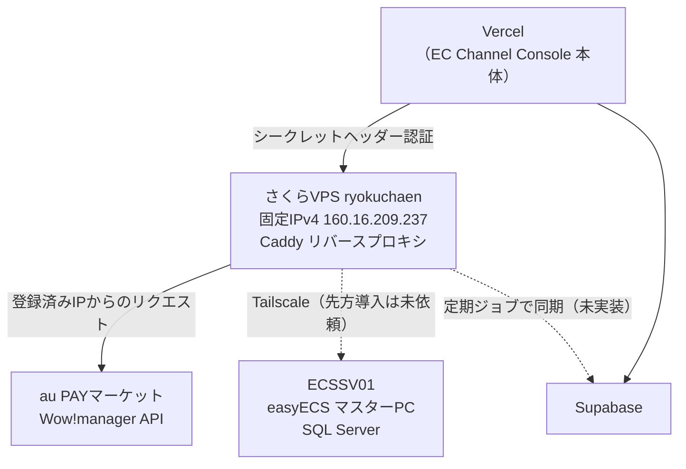

---
tags:
  - 緑茶園
  - 案件
  - 開発中システム
  - インフラ
client: 緑茶園グループ
親論点: テーマ1 - 受注チャネル統合とツール複数人化
フェーズ: 運用中
created: 2026-09-12
updated: 2026-09-12
aliases:
  - ryokuchaen
  - さくらのVPS
---

# さくらのVPS `ryokuchaen`（固定IP中継サーバ）

親: [[EC Channel Console - 00 概要]] ／ 親論点: [[テーマ1 - 受注チャネル統合とツール複数人化]]

> [!info] このノートの位置づけ
> [[EC Channel Console - 00 概要|EC Channel Console]] のために契約した**固定IPのサーバ1台**についての、契約情報・入り方・運用メモ。
>
> **サーバ上で動いているものの実装仕様（Caddyの設定・環境変数・切り分け手順）はリポジトリ側が正本** → `~/git/multi-channel-order-fetcher/docs/credentials.md`「中継プロキシ経由で使う場合」。このノートが持つのは**サーバそのもの**（契約・ログイン・OS・役割）だけ。二重管理にしない。
>
> **認証情報はこのVaultに書かない。** SSHパスワード・`AU_PROXY_SECRET` などはここには載せない（契約時に設定した値／パスワード管理側で管理する）。

## なぜこのサーバがあるのか

月数百円のVPS1台で、**構造の同じ壁が2つ**解ける。どちらも「送信元が固定IPでないと繋げない」という同型の問題。



| 役割 | 状態 | 詳細 |
|---|---|---|
| **au PAYマーケット中継プロキシ**（Caddy＋シークレットヘッダー認証＋Let's Encrypt自動HTTPS） | 🟢 **稼働中**。2026-09-09 に本番デプロイから実データ62件の取得を確認 | → [[EC Channel Console - 00 概要]]「au PAYマーケットのIP制限」 |
| **easyECS の SQL Server から読み取り、Supabaseへ同期する定期ジョブ** | 🔴 未実装。先方マスターPCへの Tailscale 導入が未依頼のため着手できない | → [[EC Channel Console - 変換器構想とMDC出力]] |

VPS側には Tailscale を導入済み。**繋ぐ相手側（`ECSSV01`）が未対応**なので、SQL Server 側の役割はまだ動いていない。

## サーバー情報

| 項目 | 値 |
|---|---|
| 名前 | `ryokuchaen` |
| ホスト名 | `tk2-246-32983.vs.sakura.ne.jp` |
| IPv4 | `160.16.209.237` |
| IPv6 | `2001:e42:102:1806:160:16:209:237` |
| OS | Ubuntu 24.04 LTS |
| サービスコード | `113802134330` |
| 管理ユーザー名 | `ubuntu` |

**このIPv4アドレスが、先方のWow!managerに登録してもらった値**（クロスモール側の8個のIPに追記する形。上書きではない）。サーバを再契約・移設するとIPが変わり、au PAYの受注取得が止まる。→ [[EC Channel Console - 00 概要]]

## ログイン

```bash
ssh ubuntu@tk2-246-32983.vs.sakura.ne.jp
```

パスワードは契約時に自分で設定したもの。

会員メニュー（コンソール・再インストール・シリアルコンソール）：https://secure.sakura.ad.jp/vps/

## つまずいたポイント

> [!warning] さくらのVPSの管理ユーザー名は、OSごとに決まっている
> `root` や Mac 側のユーザー名で入ろうとすると `Permission denied` になる。Ubuntu の管理ユーザーは **`ubuntu` 固定**。
>
> | OS | 管理ユーザー名 |
> |---|---|
> | Ubuntu | `ubuntu` |
> | Debian | `debian` |
> | CentOS 系 | `root` |

> [!danger] パスワードを忘れると再発行できない
> さくら側はユーザーが設定したパスワードを保持していないため、**再発行の手段が無い**。次善策は会員メニューからの **OS再インストール**（＝サーバ上のものが全部消える）。
> このサーバは au PAY の中継プロキシが載っており、**再インストールすると Caddy の設定ごと作り直しになる**（IPは維持される）。パスワードは確実に保管する。

## 運用TODO

- [ ] **未適用のアップデートを当てる**（初回ログイン時点で32件・うちセキュリティ1件、再起動要求あり）
  ```bash
  sudo apt update && sudo apt upgrade -y
  sudo reboot
  ```
  再起動中は au PAYマーケットの受注取得が一時的に落ちる（プロキシが止まるため）。取り込み作業と重ならない時間に実施する。
- [ ] SSH鍵認証に切り替え、パスワード認証を無効化するか判断する（現状はパスワード認証）
- [ ] au PAY用に**このツール専用のAPIキー**を発行してもらうか判断する（現在クロスモールとキーを共用している）→ [[EC Channel Console - 00 概要]]

## 関連

- [[EC Channel Console - 00 概要]] — au PAYマーケットのIP制限と、その解決の経緯
- [[EC Channel Console - 変換器構想とMDC出力]] — Tailscale＋VPS経由で easyECS の SQL Server を読む構想
- [[EC Channel Console - 認証情報取得手順]] — 先方に渡す配布用資料。IP登録の説明はこちら
- [[クロスモール（I'LL社）]] — 一元管理SaaS各社も固定IPを確保している、という判断根拠
