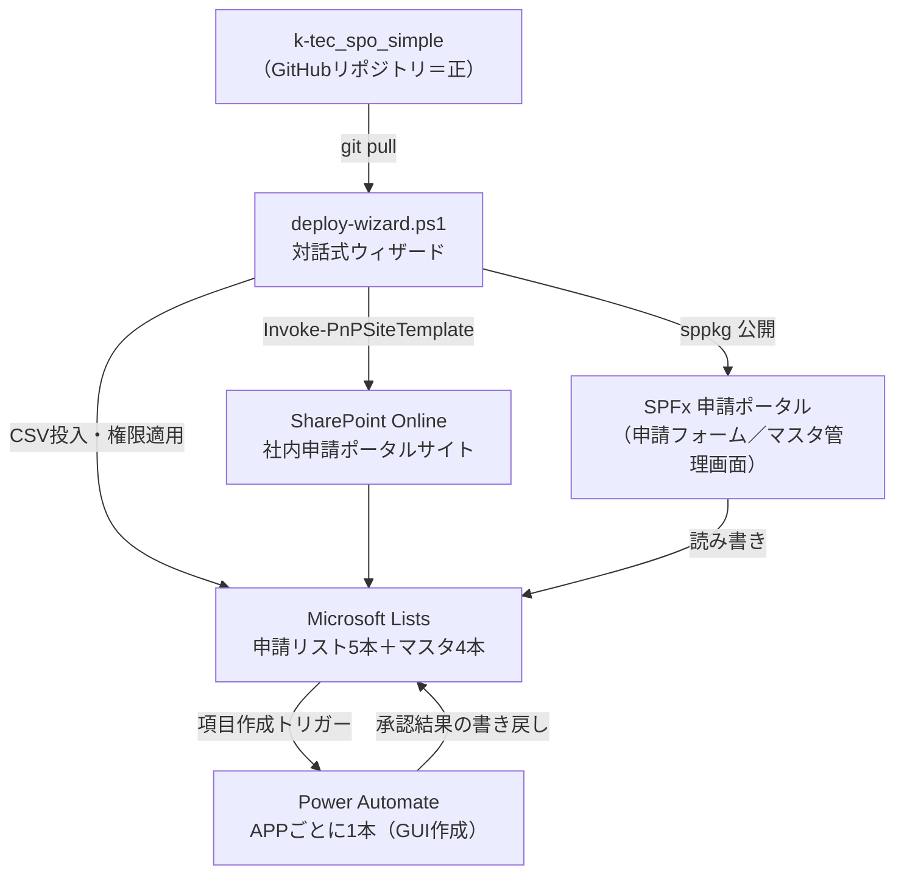

---
tags:
  - common
  - resume
  - ケーテック
created: 2026-09-16
updated: 2026-09-16
---

# 取り組み内容 - ケーテック株式会社

親: [[取り組み内容]]（[[common/02_resume/00 MOC|common/02_resume]]）
参照元: [[ケーテック株式会社/00 MOC|ケーテック株式会社（クライアントフォルダ）]]

**期間**：2026-08〜現在（フリーランス・外部DXパートナー、経営サポートグループ所属扱い）
**起点**：先方から受領した「IT依頼事項20260806.xlsx」を2026-08-07に18件の依頼として整理したのが最初の資料。

## これは何か

ケーテック株式会社の社内申請業務を M365（SharePoint Online + Microsoft Lists + Power Automate + SPFx）で電子化するプロジェクト。実装リポジトリは `k-tec_spo_simple`（GitHub `k-ktec/k-tec_spo_simple`）。

## 数字で見る進捗（2026-09-05時点）

| 指標 | 値 |
|---|---|
| 先方から受けた依頼（元Excel） | 18件 |
| うち対象として整理した件数 | 14件 |
| SPOに構築済みのAPP（申請リスト） | 5本 |
| 仮組みのまま残しているAPP | 1本 |
| 取り下げ・保留になった依頼 | 5件 |
| 未着手の横断依頼 | 3件 |
| 承認方式の設計転換 | 2回（2026-08-08・2026-08-10） |
| 実施したヒアリング | 3回（2026-08-17／08-21／08-27） |

## 構築した申請APP（5本、稼働中）

| APP | 内容 |
|---|---|
| APP No.01 仮払金申請 | 仮払金の申請・承認フロー |
| APP No.02 慶弔連絡 | 慶弔見舞金規程に基づく連絡・申請フロー |
| APP No.03 海外保険加入依頼 | 海外出張時の保険加入依頼 |
| APP No.06 昼食申込 | 昼食の申込フロー |
| APP No.07 年休申請 | 年次有給休暇の申請フロー。**設計のパイロットケース**として最初にテンプレート化し、他APPへ横展開した |

このほか APP No.11（許可申請）は先方から別紙が未入手のため仮組みのまま保留。実印・勤怠・日程調整・付与基準・旅費の5件は、ヒアリングを重ねた結果「作らない」判断に至り取り下げ・保留。

## アーキテクチャ

先方の運用能力（非エンジニアが回せること）を最優先の制約とし、PnPサイトテンプレート（XML）とPower AutomateフローによるInfrastructure as Codeアプローチを採用。GitHub上のリポジトリを正本として、対話式のPowerShellウィザード1本で先方テナントへ提供する経路を構築した。

## 設計上の転換点

1. **承認方式を2回、大きく転換**：マスタによる動的解決 → APPフローへの直接設定 → 申請者が申請時に選択、という順に変化。最終的に「中央承認エンジン方式（全社1本のフロー＋トランザクションリスト＋監査ログ）」を設計しきった後、非エンジニアでも保守できる**簡易承認方式へ全面転換**した。
2. **「作らない」判断を積極的に行った**：18件の依頼のうち実際に作ったのは5本。元Excelが「困りごとの列挙」であって要件ではなかったことを踏まえ、ヒアリングを重ねるほど「やらない」判断が増えた（実印・勤怠・日程調整・付与基準は取り下げ、旅費は保留）。
3. **先方の運用能力への適合を最優先制約とした**：前任者が作ったAPPが「前任者しかメンテできない」という理由でやり直しになった経緯から、以降は「マスタを増やさない」「非エンジニアが回せるウィザード」「M365標準機能のみで完結（外部DB・非標準インフラ・プレミアムコネクタは対象外）」を一貫方針にした。

## 未解決の課題

**総務が申請の全件を閲覧できない。** SharePointの項目レベル権限（`ReadSecurity=2`）の仕様上、単純なビュー追加では解決しない構造的な壁として残っている。

## 使ったスキル・技術

SharePoint Online（Microsoft Lists設計）／Power Automate（承認フロー設計・2回のアーキテクチャ転換）／SPFx（申請フォーム・マスタ管理画面）／PnP PowerShell（サイトテンプレートのコード化・デプロイ自動化）／要件整理とヒアリング設計（ヒアリング支援SaaS「Req Navi」を自社ツールとして活用）

## 関連

- [[取り組み内容]]
- [[職務経歴]]
- [[ケーテック株式会社/00 MOC|ケーテック株式会社（クライアントフォルダ）]]
