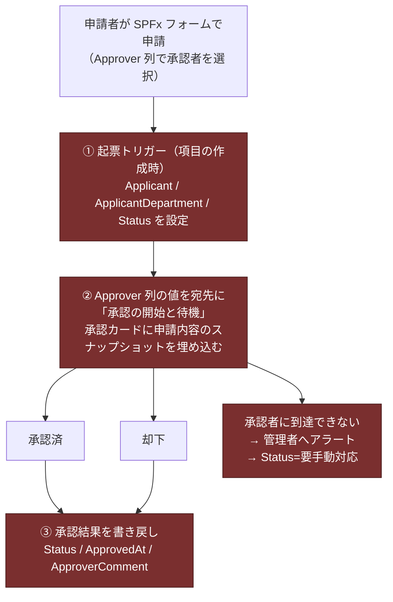

---
tags:
  - ケーテック
  - 案件
  - アーキテクチャ
  - 設計判断
client: ケーテック株式会社
親論点: テーマ1 - 電子化をどこまで広げるか
フェーズ: 開発中
created: 2026-09-05
updated: 2026-09-05
---

# 申請ポータル - 承認方式（簡易承認への転換）

親: [[申請ポータル - 00 概要]] ／ [[00 MOC|ケーテック株式会社 MOC]]

> [!important] このノートが記録していること
> このプロジェクトで**最も大きい設計判断**。2026-08-08 に中央承認エンジン方式へ転換し、
> その2日後（08-10）に方式ごと捨てて簡易承認方式に切り替えた。
> 承認者の決め方の変遷は [[テーマ2 - 承認者をどう決めるか]] に分けてある。

## 3つの案の比較

| 観点 | ① 個別フロー方式 （〜2026-08-08） | ② 中央承認エンジン方式 （08-08〜08-10） | ③ 簡易承認方式 （08-10〜現在） |
|---|---|---|---|
| フローの本数 | APPごとに1本（完全版） | Flow-A（種別ごと）＋ Flow-B〜G（中央） | **APPごとに1本**（3ステップ） |
| 承認者の決め方 | フローにハードコード | `ApproverMaster` から動的解決 | **申請者が申請時に選択** |
| 承認段数の変え方 | フローを改修 | `RequestTypeSettings` の値を変える | そのAPPのフローで「承認の開始と待機」を2回呼ぶ |
| 新種別の追加コスト | フロー1本を作り直す | **マスタに1行足すだけ** | フローを複製して列参照を差し替える |
| 単一障害点 | 無し | **Flow-B が全社の単一障害点** | 無し |
| 必要な中核リスト | 無し | `ApprovalTransactions` / `AuditLog` / `RequestTypeSettings` / `ApproverMaster` | **無し** |
| 督促・滞留検知・監査ログ | 個別実装 | 中央で一括提供 | **スコープ外** |
| 先方がメンテできるか | △ | **✕（複雑すぎる）** | ○ |

## なぜ ② を捨てたか

②は設計としては筋が良かった。「型ごとの分岐をフローの IF 文にせず、マスタのデータで表現する」
という原則は正しく、`docs/flow-design.md` に594行の設計書として残っている。

捨てた理由は**技術ではなく、先方の運用能力**にある。

> [!important] 決定打になった事実
> No.7（年休申請）のやり直し理由が「**現状M365前任者しかメンテできない（PowerAppsが複雑なため）**」
> だった（[[2026-08-17 ヒアリング回答]]）。
> 中央承認エンジン方式は、まさに「作った人しか分からないシステム」になる構造をしている。
> 同じ失敗を繰り返す設計だった。
>
> → [[テーマ5 - 既存システムとの併存と属人化解消]]

補足すると、②が想定していた規模（10種類以上の申請が増え続ける）に対し、
実際に残ったAPPは5本で、しかも[[01 依頼の全体像（IT依頼事項18件）]]の通り
**増えるどころか減っていった**。中央エンジンの投資が回収できる見込みが薄かった。

## ③ 簡易承認方式の中身

**各APP（申請リスト）ごとに1本の独立したフロー**を Power Automate の組み込みアクション
「承認の開始と待機」で作る。流れは全APP共通で3ステップだけ。

**図中の赤いステップはすべて未実装**（フロー本体は1本も作られていない）。

### APPごとの違いの吸収の仕方

**そのAPP自身のフロー内で対応する。** 共通エンジンを介さないため、
横展開時にフローを複製すること自体は許容される（②の「中央フロー複製禁止」ルールは適用されない）。

| APPの事情 | 対応 |
|---|---|
| 2段承認が要る（No.3 海外保険） | 「承認の開始と待機」を2回連続で呼ぶ。2人目は `FinalApprover` 列（社長・フローが固定値を設定） |
| 承認不要（No.6 昼食の客専用） | フロー内で分岐して承認をスキップ |
| マスタ参照して金額を計算（No.2 慶弔） | フロー内で `KeichoMaster` を検索して `PlannedAmount` に書き戻す |

## ③ でも引き継いだ承認整合性の設計

②から最小限だけ引き継いでいる。**全APPのフローで必須**。

1. **スナップショット承認** — 申請時点の全項目値を承認カードの文面に埋め込む
2. **申請受付時に項目を申請者読み取り専用へ権限変更**（`breakroleinheritance`）
3. **削除は物理禁止・論理削除**（`Status` 列で管理）

②にあった以下は**必須にしない**方針に変えた。

- 「修正＝取下げ→再申請」（`WithdrawnAt` / `OriginItemId` 列は削除）
- 監査ログ（`AuditLog`）への追記
- 承認直前のスナップショット差分チェック
- 督促・滞留検知・ハッシュチェーンによる改ざん検知

→ 権限とデータ保護の現在の設計は [[申請ポータル - 権限設計とデータ保護]]。

## ③ の既知の弱点

| 弱点 | 内容 | 緩和策 |
|---|---|---|
| **退職者・異動者を承認者に選べてしまう** | `Approver` はマスタで選択肢を制限しない自由な Person 列 | 「承認者に到達できない場合」のフォールバック（管理者アラート＋`Status=要手動対応`）を共通部品として全フローに組み込む。**承認者に到達できなくても申請を却下にしない** |
| **フローの本数が増える** | APP × 1本。列を変えるたびに全フローの追従が必要 | 「Flow-A は種別間で完全に同一構造にする」という②の規律を、③でも引き継いでいる |
| **督促・監査ログが無い** | 承認が止まっても誰も気づかない | 必要になった時点でAPP単位に追加する。→ [[テーマ6 - 未着手の横断依頼]] |
| **単一障害点は無いが、1本が全ステップを担う** | そのフロー自身のエラーハンドリングと管理者アラートが必須 | フロー実装時の必須要件として明記済み |

## ②の設計資産の扱い

`docs/flow-design.md`（594行）は現行実装と一致しないが、**捨てるべきではない**。

| 中身 | ③での有効性 |
|---|---|
| Flow-A〜G の構成・トリガー・環境変数一覧 | ✕ 無効 |
| `ApprovalTransactions` / `AuditLog` のスキーマ | ✕ 無効 |
| **スナップショット承認の考え方** | ○ 有効（③でも必須設計） |
| **受付時の読み取り専用化（breakroleinheritance）の実装メモ** | ○ 有効 |
| **承認カードの件名テンプレート・差し込みトークン** | △ 参考になる |
| 状態遷移（取下げ/変更申請/取消申請） | △ 将来必要になったら参照する価値がある |

→ 「旧設計書」と冒頭に断り書きを入れて残すのが適切。
→ [[06 リポジトリ内ドキュメントの現状差分]]

## 未着手の残骸

`flows/solution/ApprovalFlows_1_0_0_2.zip` の中身は `FlowA_LeaveRequests_Submit`（2026-08-09作成）
**1本だけ**。環境変数が `spp_ApprovalTransactionsListId` / `spp_AuditLogListId` /
`spp_RequestTypeSettingsListId` を参照しており、いずれも現在は存在しないリスト。
**②の時代の遺物であり、このままインポートしても動かない。**
