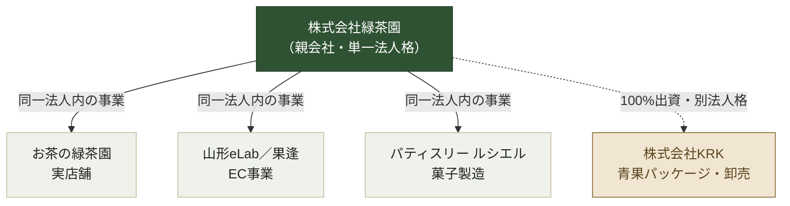

---
tags:
  - moc
  - 緑茶園
client: 緑茶園グループ
created: 2026-08-29
updated: 2026-09-04
---

# 緑茶園グループ — MOC

> [!info] このノートについて
> 緑茶園グループに関するすべてのノートの入口（Map of Content）。まずここから該当ノートに飛ぶ。

## 対象

株式会社緑茶園（山形eLab／果逢／お茶の緑茶園／パティスリー ルシエル）・株式会社KRK。調査日 2026-08-29 時点の情報を出典とする。

## いま数字で見えていること

| 指標 | 値 |
|---|---|
| 法人格 | 2社（株式会社緑茶園／株式会社KRK） |
| 事業ブランド | 4（お茶・EC・スイーツ・青果） |
| KRK売上に占める緑茶園向けの割合 | 約90% |
| 代替者がいない業務 | 11件（うち9件が会長・社長） |
| easyECS＋クロスモールの工数 | 11時間／日（最大だが「残す」判断） |
| ビジョン2029 | 売上10億円・粗利25% |
| EC Channel Console（開発中）の実装状況 | 5／7チャネル実装済み（残るはTemu・LINEギフト） |

## ノート一覧

### 企業構造
- [[01 資本・ブランド構造]] — どこまでが同じ法人で、どこからが別法人か
- [[02 沿革]] — お茶の老舗から青果流通の別法人化までの時系列
- 事業体プロフィール
  - [[株式会社緑茶園（本体）]]
  - [[山形eLab・果逢]]
  - [[お茶の緑茶園]]
  - [[パティスリー ルシエル]]
  - [[株式会社KRK]]

### システム棚卸
- [[03 業務フローとツール状況]] — 仕入から会計までの5ステップと自動化状況
- [[04 ツールリファレンス]] — 場面別の全ツール一覧（会社別）
- [[05 3つの構造課題]] — 棚卸から浮かび上がった本質的な論点
- [[06 触らない領域]] — 変更提案の対象から明示的に外すもの

### 経営の方向性
- [[07 理念体系とビジョン2029]] — パーパスからKPIまでの階層

### 開発中のシステム
- [[10 開発中システム - EC Channel Console]] — 断絶チャネルの受注取得を補うツール。楽天・Amazon・Yahoo・au PAY・Shopifyが実装済み
- [[11 認証情報取得手順（EC Channel Console）]] — クライアント担当者への配布用ドキュメント

### 次のアクション
- [[08 要確認事項]] — 空白領域。次のヒアリングで埋めるべき項目
- [[09 初回すり合わせ論点]] — 外部人材との討議アジェンダ

## 全体像（資本構造の要約図）

詳細と根拠は [[01 資本・ブランド構造]] を参照。

## 現時点の総括（コンサルタント観点）

1. **ツールは足りている。連携が足りていない。** 受注・仕入・在庫・会計が別々のツールで完結し、間を人が繋いでいる。→ [[03 業務フローとツール状況]]
2. **代替者のいない業務が11件、うち9件が会長または社長。** 求めているのはツール改善ではなく、経営者からの業務移管。→ [[05 3つの構造課題]]
3. **理念体系とビジョン2029（売上10億円）が2026年に確定しつつある。** 棚卸の提案はこの数値目標に接続してこそ響く。→ [[07 理念体系とビジョン2029]]
4. **断絶チャネルの一部はすでに開発中のツールで解消しつつある。** Shopify（自社EC）はEC Channel Consoleで受注取得API実装済み。残るはTemu・LINEギフト。→ [[10 開発中システム - EC Channel Console]]
