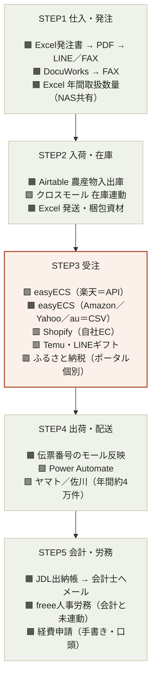

---
tags:
  - 緑茶園
  - システム棚卸
client: 緑茶園グループ
created: 2026-08
updated: 2026-09-05
---

# 業務フローとツール状況

親: [[00 MOC|緑茶園グループ MOC]] ／ 受注部分の詳細: [[12 現行の受注フロー（先方提供資料）]]

出典：システム・ツール棚卸表 ver.1.0（2026年8月作成、株式会社緑茶園グループ／バックヤード強化プロジェクト 外部人材向け引継ぎ資料）

## この資料の読み方 — 先に押さえてほしい3点

1. **ツールは足りている。連携が足りていない。** 受注・仕入・在庫・会計がそれぞれ別のツールで完結しており、間を人が繋いでいる。強化の主眼は「新ツール導入」ではなく「分断の解消」。
2. **工数の大きさと、変えるべき優先度は一致しない。** ツール最大のeasyECS・クロスモール（11時間/日）は現場が「残す」と判断している。一方、1日5分の作業に会社全体が依存している箇所がある（→ [[05 3つの構造課題]]）。
3. **代替者のいない業務が11件、うち9件が会長または社長。** バックヤードの実行者が経営者2名になっている。求めるのはツールの改善ではなく、経営者からの業務移管。

## 業務フロー上のツール配置

山形eLab（通販事業）を主軸に、モノとカネの流れに沿ってツールを並べたもの。

凡例：🟩 システム内で完結／API連携あり　🟧 人手を介する（CSV・転記・FAX）　🟥 連携が断絶している／仕組みがない

## 各ステップの補足

- **STEP1 仕入・発注**：農産物はExcel→PDF化→LINE/FAXで生産者へ、加工品はExcel→DocuWorks経由でFAX送信。取扱数量はExcel＋NASで年間・月間・週間を管理（予実管理への活用は未着手）。
- **STEP2 入荷・在庫**：農産物の入出庫はAirtable（担当ムック、スノー退職後は単独運用へ）。在庫連動・商品ページ作成はクロスモールが自動処理。

> [!tip] 検討中の解消策
> AirtableはRelay・DocsAutomatorと合わせて月額課金が発生する3層構成で、2026-07-14ごろにデータ破損も発生している。既存の価格計算ロジック・オートメーションを解明したうえで、Vercel／Supabaseへのフルスクラッチ再構築を検討中 → [[Airtable再構築 - 要件定義ドラフト]]
- **STEP3 受注**：easyECS（SAVAWAY）がインストール型の受注一元管理。楽天のみAPI連携、Amazon・Yahoo・au PAYはCSV取込。Temu・LINEギフトはコピー＆ペースト、自社EC（Shopify）とふるさと納税ポータルは一元管理の外側で完全に断絶している。

> [!tip] 開発中の解消策
> Shopify（自社EC）はすでに [[EC Channel Console - 00 概要|EC Channel Console]] で受注取得APIが実装済み。楽天・Amazon・Yahoo・au PAYも並行実装済みで、残る断絶はTemu・LINEギフトのみ。
- **STEP4 出荷・配送**：運送会社の伝票番号を各モールへ反映する作業は、出力フォーマットがモール毎に異なり手間がかかる。Power Automateは一部工程のみ導入済み（適用範囲の拡大余地あり）。
- **STEP5 会計・労務**：JDL出納帳への入力後、会計士へメール送付して確認を受ける運用。freee人事労務は勤怠・有給を扱うが会計とは連動していない。経費申請は仕組みがなく手書き・口頭。

## 触れていない領域

市場調査（NINT）、社内情報共有（kintone／Chatwork／TimeTree／Notion／NAS）、基盤（トラストログイン／IVRy）、店舗レジ（Airレジ／旧式レジ）は場面別に [[04 ツールリファレンス]] にまとめている。

## 関連ノート

- [[04 ツールリファレンス]]
- [[05 3つの構造課題]]
- [[06 触らない領域]]
- [[EC Channel Console - 00 概要]]
- [[Airtable再構築 - 要件定義ドラフト]]
