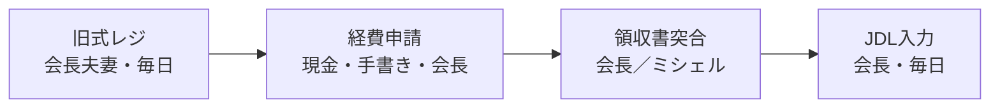
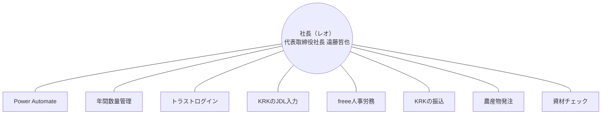
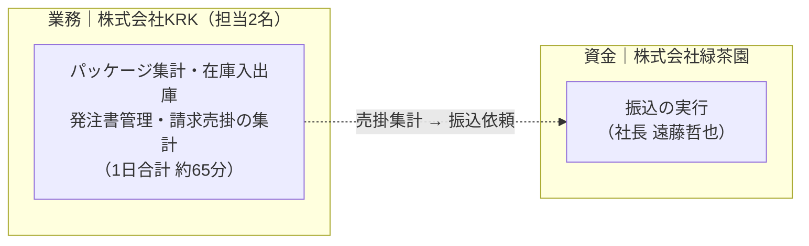

---
tags:
  - 緑茶園
  - システム棚卸
  - 経営構造
client: 緑茶園グループ
created: 2026-08
updated: 2026-09-04
---

# 棚卸から見えた3つの構造課題

親: [[00 MOC|緑茶園グループ MOC]]

ツール単位ではなく、業務の流れの塊として3つ。外部人材への説明もこの単位で行うのが正しい。

## 構造①　会長ライン — 現金と紙の一本の流れ

[[お茶の緑茶園]] の旧式レジ（毎日・会長夫妻）→ 経費申請（現金・手書き）→ 領収書の回収・突合 → JDL入力（毎日・会長）。**4件すべて代替者なし、4件すべて「変えたい」。**

- 4つの別課題ではなく、ひとつの流れ。個別に直すと繋がらない。
- 会長・社長の負担軽減が目的なら、この流れごとの再設計が唯一の解。
- 起点は旧式レジ（データが出ない）。ここを変えないと下流は自動化できない。

## 構造②　実行部隊が経営者2名 — 社長への業務集中

代替者なし11件のうち、**9件が会長または社長**（レオ＝代表取締役社長 遠藤哲也）。残る2件は [[株式会社KRK]] の担当者。社長が直接担当する業務は8つの異なるツール・領域にまたがる。

- バックヤードの実行者が経営者2名になっている。分断の解消より前に、この構造が最大の課題。
- したがって外部人材の役割は「ツールを繋ぐ人」ではなく「**経営者から業務を引き取る人**」。
- 完了条件は「連携が動く」ではなく「**社長が触らなくても回る**」。
- ID管理（トラストログイン）は社長単独。業務継続上、副管理者を1名置くこと。

## 構造③　KRKの孤立 — 業務は2名、資金は緑茶園

担当者2名で毎日65分。4業務すべて同じ2名で代替なし。うち手書き→Excelの二重入力が2件（パッケージ集計・在庫）。

- 2名が同時に不在になると、KRKの業務系は完全停止する。
- 売掛の集計はKRK、振込はレオ。業務と資金が別会社に分かれている。
- 発注書の紙運用は「うまくいっている」ため、変更対象から外す（→ [[06 触らない領域]]）。

## 対応の方向性（まとめ）

| 構造 | 単独最適化ではなく… |
|---|---|
| ① 会長ライン | 4業務を1つの流れとして再設計。起点の旧式レジから着手 |
| ② 社長への集中 | ツール連携より先に、経営者からの業務移管先を決める |
| ③ KRKの孤立 | 緑茶園↔KRK間の受発注・請求ループとして2社間で再設計 |

## 関連ノート

- [[04 ツールリファレンス]]（代替者ゼロ業務の一覧）
- [[06 触らない領域]]
- [[09 初回すり合わせ論点]]
- [[お茶の緑茶園]] / [[株式会社KRK]] / [[株式会社緑茶園（本体）]]
