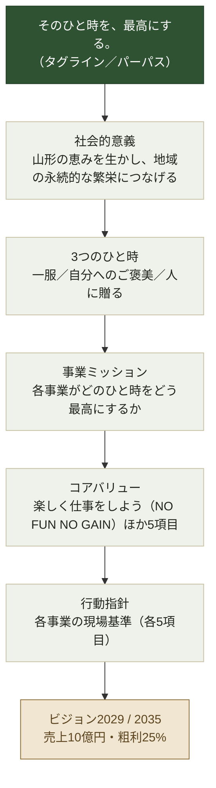
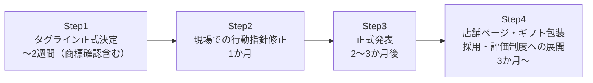

---
tags:
  - 緑茶園
  - 経営構造
  - 理念
client: 緑茶園グループ
created: 2026-08-29
updated: 2026-09-04
---

# 理念体系とビジョン2029

親: [[00 MOC|緑茶園グループ MOC]]

出典：『緑茶園グループ 理念体系・行動指針 展開書（第2次案）』（2026年8月、株式会社緑茶園・株式会社KRK）

## 資料の位置づけ

経営理念・行動指針の策定途中資料。タグライン＝パーパスに**「そのひと時を、最高にする。」**を第一候補として決定し、4事業を階層で束ね直す展開書。2026年8月時点では、下表のStep1〜2の段階。

## 3つのひと時（顧客シーンの定義）

| シーン | 対応事業 |
|---|---|
| 一服のひと時 | [[お茶の緑茶園|お茶]] |
| 自分へのご褒美のひと時 | [[パティスリー ルシエル|スイーツ]] |
| 人に贈るひと時 | [[山形eLab・果逢\|EC]]・ギフト・ふるさと納税（グループ中核シーンと明記） |

## 判断基準「3つの問い」

グループ共通の意思決定基準として提案されている。

1. 誰のどのひと時を最高にするか
2. 「最高」と言い切れる品質か
3. その先で山形の生産者と地域は豊かになるか

## 4事業のミッション（KRKも含む）

[[株式会社KRK|KRK]] は「開ける瞬間を、最高にする。」＝安定集荷・供給＋パッケージングの中核と位置づけられ、親会社の販売（届いた瞬間・開けた瞬間までが商品）を支える役割が明文化されている。

## 行動指針に見える現状課題の裏取り

- **お茶**：店頭でもECでも一言を添える／小さな約束（納期・品質・応対）を丁寧に果たす
- **スイーツ**：予約専門の期待値を超える／見た目・箱・受け渡しまで演出
- **くだもの**：レビュー4.5以上を品質の証／鮮度・コールドチェーン劣化ゼロ／生産者の物語を添える
- **KRK**：品質基準の明文化・目視に頼らない仕組みで誰が詰めても同じ品質に（＝手書き→目視依存の現状からの脱却を明示）／輸送中の温度・時間から逆算／現場の改善を毎週一つ

> [!tip] コンサルティング上の使いどころ
> KRKの行動指針が「手書き→目視依存からの脱却」を自ら明言している。[[05 3つの構造課題]] の③（KRKの孤立）で挙げた棚卸・業務整理の提案は、この行動指針＝グループの公式な理念に接続して語れる。

## 浸透の工程表

2026年8月時点ではStep1〜2の段階。

## この資料から見えてくる「会社の今」

- グループは経営理念の再構築（パーパス経営）を2026年に推進中で、タグライン決定と同時並行で副業人材によるDX推進も募集している（→ [[株式会社KRK]]）＝「理念」と「仕組み」の両輪で変革を進めている中期フェーズ。
- **ビジョン2029（売上10億円・粗利25%）**という公式の数値目標が存在するため、KRKの棚卸・業務整理（65分/日）をこの成長目標に位置づけて提案できる。KRKの現状規模（1期目売上約1.2億円）から逆算すると、5倍以上の成長を計画していることになる。
- 緑茶園・KRK間の「パッケージ化と販売」分業は、単なる業務分担ではなく理念体系で定義された役割である点が、コンサルティングの共通言語として使える。

## 関連ノート

- [[00 MOC|緑茶園グループ MOC]]
- [[05 3つの構造課題]]
- [[株式会社KRK]]
