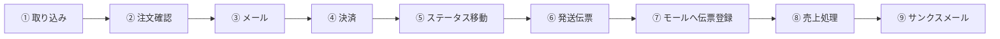

---
tags:
  - 緑茶園
  - システム棚卸
  - 受注フロー
  - 先方提供資料
client: 緑茶園グループ
created: 2026-09-04
updated: 2026-09-04
---

# 現行の受注フロー（先方提供資料）

親: [[00 MOC|緑茶園グループ MOC]] ／ 前提: [[03 業務フローとツール状況]] ／ 検討文脈: [[テーマ1 - 受注チャネル統合とツール複数人化]]

> [!info] 出典
> **作成者：社長／作成時点：2026-08-30**（[[2026-08-30 初回打ち合わせ]] と同日）。1枚もののフロー図（PDF）。9ステップの横フローに、各段階の処理内容（黒字）と**要望・疑問（赤字の「※」項目）**が併記されている。
> 送付時のメッセージ：「自作の受注システムの話があったので、**現在の受注システムで行っている主な流れ**を共有したい。裏側では**決済や配送キャリアなどの自動設定等が動いている**ので、追って仕組みを共有したい」。
> つまりこの資料は、[[10 開発中システム - EC Channel Console|EC Channel Console]] や [[店舗アップ♪（外部ベンダー製品）]] を評価するための**先方側の実質的な要件リスト**として読むべきもの。→ [[2026-08-30 初回打ち合わせ]] の「受注管理システムの変更」発言の続き。

## フロー全体

## 各ステップの処理内容

| # | ステップ | 内容 |
|---|---|---|
| ① | 取り込み | 楽天＝API／amazon＝csv・api／yahoo＝csv・api／au＝csv・api／電話・fax＝手入力／**ふるさと納税＝なし**／**ショピファイ＝なし** |
| ② | 注文確認 | 離島／あす楽・マケプレ／リピート／硬い・柔らかい・2021・マケ〔読み取り不確実〕／日付指定／熨斗・備考欄／商品ごとの配送方法／商品ごとのお届け日時／価格の変更等（apiでできるか）／温度帯や複数注文の注文分割 |
| ③ | メール | 新規／リピート／先行予約 |
| ④ | 決済 | 楽天ペイ／NP（後払い）／振込ほか |
| ⑤ | ステータス移動 | すぐ発送／取り寄せ／予約 |
| ⑥ | 発送伝票 | 宅配・ネコポス／佐川（商品名）／遠隔への発送はヤマト登録／ヤマトweb出荷コントロールに出す／遠隔地での伝票発行のみ対応 |
| ⑦ | モールへ伝票登録 | API同期のタイミング（**楽天は特に**） |
| ⑧ | 売上処理 | 楽天＝API／amazon＝csv／yahoo／au／ふるさと／**NPは請求** |
| ⑨ | サンクスメール | 有無の管理 |

## 赤字＝新システムへの要件・疑問（この資料の本体）

### A. 複数人運用・統制 ★最重要
- **スタッフごとのログイン**
- **ステータスの追跡、メール送信者・日時の確認**
- **特記事項を検索・クレーム集計**

> [!warning] [[テーマ1 - 受注チャネル統合とツール複数人化]] の最大の制約と正面衝突する
> [[10 開発中システム - EC Channel Console|EC Channel Console]] は現状 `npm run dev` のローカル専用・認証情報は平文の `.env.local` 保存で、**ユーザーという概念自体がない**。「誰がいつ何をしたか」の追跡は設計の根幹に関わるため、後付けが最も難しい部類の要件。先方が最初に挙げているのがこの3点であることの意味は大きい。

### B. 需給の可視化 ★[[テーマ3 - KRKの標準化と接続]] に直結
- **フルーツの注文残数を確認**（母の日用）
- **フルーツごとの販売数量をお届け日時ごとに把握したい**（父の日・母の日・敬老の日）
- 時期のフルーツを日付ごとに出す／時期のフルーツの予定を把握したい

> [!note] 2026-08-30 の発言と同じことを言っている
> 打ち合わせでの「**いつ・何が・どれだけ必要かを注文ベースで生産管理側と共有したい**」は、この3項目の言い換え。受注システムの載せ替え要求の動機は、フロント（受注処理の効率化）ではなく**バック（KRK・生産者への需要予測の受け渡し）**にあると読める。→ [[テーマ3 - KRKの標準化と接続]]

### C. 仕入・発注との連動
- **取り寄せ発注商品について**：自動発注／発注書作成、入荷日の確認／入荷日登録

現行の発注は Excel→PDF→LINE／FAX（→ [[04 ツールリファレンス]]）。受注システム側から発注書を出したいという要望であり、[[03 業務フローとツール状況]] のSTEP1とSTEP3を繋ぐ話になる。

### D. メール運用
- メールで移動？？／特記事項にコメント／リピートごとのメール
- **メールワイズとの連携**
- サンクスメールは**楽天クーポンの代わり**

### E. 出荷・伝票まわり
- 発送日時になった場合の自動〔化〕〔原文はセル幅で途切れている〕／移動できるフォルダ
- **熨斗をわかるようにしたい**
- 遠隔への発送（ヤマト登録）→ **事前に伝票を出せるか**
- 遠隔発送の発送状況確認

### F. データ整合・同期
- 価格の変更等（apiでできるか）／**変更時の同期は？**
- モールへの伝票登録の**API同期のタイミング（楽天は特に）**

### G. データ保有
- **過去データの保有期間／過去メールの保有期間**（「※データ保有期間について」として再掲）

### H. 分析・活用
- **好評価レビューからの優良生産者選定**

## 既存ノートとの突き合わせ

### 裏付けが取れたこと

- **ふるさと納税・Shopify（ショピファイ）が「なし」と先方資料にも明記**。[[04 ツールリファレンス]] の🟥断絶判定はそのまま正しい。→ [[テーマ1 - 受注チャネル統合とツール複数人化]]
- 出荷後の**伝票番号のモール反映**が独立した1ステップとして存在し、モールごとの同期タイミングが論点になっている点も棚卸と一致。

### 新しく分かったこと

1. **メールワイズ（サイボウズ製）が登場。** [[04 ツールリファレンス]] に無かったツール。[[kintone]] と同じサイボウズ製品であり、**[[テーマ2 - グループウェアの役割再定義]] のkintoneセントリック案とライセンス面で繋がる可能性**がある。導入済みか検討中かは要確認。
2. **決済手段の全体像が判明**：楽天ペイ／NP後払い／振込ほか。売上処理では**NPのみ請求フロー**が別建て。棚卸には決済の記述が無かった。
3. **配送は宅配・ネコポス・佐川の使い分け＋ヤマトweb出荷コントロール**。これは [[店舗アップ♪（外部ベンダー製品）]] の配送連携（e飛伝Ⅲ／B2クラウド／産直用Web出荷コントロールサービス）と**ほぼ一致する**。既製品が現行フローをかなりの範囲でカバーし得る、という比較材料になる。
4. **青果特有の複雑性が受注段階に集中している**：温度帯や複数注文の注文分割、商品ごとの配送方法・お届け日時、離島判定、熨斗。汎用の受注ツールが最も詰まりやすい部分であり、**「既製品を入れる／自作を育てる」の判断はここの適合度で決まる**。
5. **裏側で決済・配送キャリアの自動設定が動いている**（先方メッセージ）。現行システムの自動化範囲は棚卸の想定より広い可能性がある。仕組みの共有を受けてから比較表を更新すべき。

## 要確認

- [x] ~~この資料の作成者・作成時点~~ → **社長が2026-08-30に作成**と確認済み
- [ ] 「現行システム」がeasyECS単体を指すのか、別ツールを含むのか
- [x] ~~メールワイズは導入済みか~~ → **導入済み。社内メールを一元管理していると社長より確認**（→ [[テーマ5 - 問い合わせ情報のナレッジ化（潜在要件）]]）
- [ ] 「裏側で動いている決済・配送キャリアの自動設定」の具体的な仕組み（先方から追って共有予定）
- [ ] ②注文確認の「硬い／柔らかい／2021／マケ」の意味（桃の硬さ選択など商品属性の可能性）
- [ ] 過去データ・過去メールの保有期間の現状値と、必要な保有年数

## 要件書との突き合わせ

上記の赤字要件が [[店舗アップ♪（外部ベンダー製品）|『店舗アップ♪』要件書（2026-01-22）]] でどこまでカバーされるかは、同ノートの対応表にまとめた。要点は **業務処理（出荷・伝票・マスタ・集計）のカバー率は高いが、A. 複数人運用・統制（スタッフごとのログイン、誰がいつメールを送ったかの追跡）は要件書に記載が見当たらない**こと。

## 関連ノート

- [[2026-08-30 初回打ち合わせ]] — 「受注管理システムを変更したい」発言の出どころ
- [[テーマ1 - 受注チャネル統合とツール複数人化]] — この要件リストの主たる受け皿
- [[テーマ3 - KRKの標準化と接続]] — 需給可視化の要件が接続する先
- [[03 業務フローとツール状況]] / [[04 ツールリファレンス]] / [[08 要確認事項]]
- [[10 開発中システム - EC Channel Console]] / [[店舗アップ♪（外部ベンダー製品）]] / [[Shopify]]
