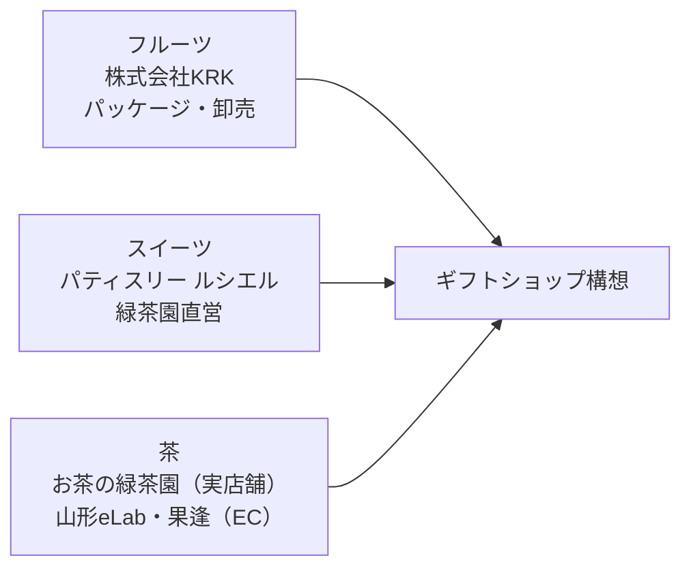
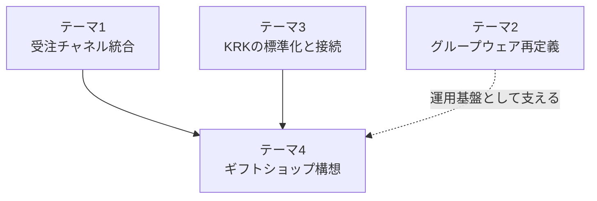

---
tags:
  - 緑茶園
  - 課題テーマ
  - 経営戦略
client: 緑茶園グループ
created: 2026-09-04
updated: 2026-09-05
---

# テーマ4｜山形のトップ食材をお届けできるギフトショップ

親: [[00 MOC|緑茶園グループ MOC]]

## 先方の理想像

- 「**百貨店にも負けないギフトショップ**」：山形のトップ食材（フルーツ・米・肉など）を集めた高級ギフトを全国へ届ける構想。
- **[[パティスリー ルシエル|ルシエル]]のスイーツもギフト券でセレクトできる**商品構成を想定。
- 参考事例として「フルーツギフトカード（楽天市場・蝶結び）」のような**ギフト券（引換券）型の販売手法**を検討中（自社システムで売る案も俎上）。

## 理念体系との整合

→ 詳細は [[07 理念体系とビジョン2029]]

- パーパス：「そのひと時を、最高にする。」
- **「3つのひと時」**：一服のひと時（[[お茶の緑茶園|お茶]]）／自分へのご褒美のひと時（[[パティスリー ルシエル|スイーツ]]）／**人に贈るひと時**（[[山形eLab・果逢|EC]]＋ギフト・ふるさと納税）。
- **「人に贈るひと時」がグループ中核シーンと明記**されており、ギフトショップ構想は理念上も本流に位置づけられる。
- 判断基準「3つの問い」：①誰のどのひと時を最高にするか ②「最高」と言い切れる品質か ③その先で山形の生産者と地域は豊かになるか。
- ビジョン2029：**売上10億円・粗利25%**（グループ合算）。現状（KRK約1.2億円、緑茶園通販非公表）から5倍以上の成長が前提。ギフトショップ構想はこの成長シナリオの主軸候補。

## 供給チェーンはすでにグループ内で完結できる構造

→ 「調達力（仕入・製造）は強いが、販売面の自社チャネル構築と人材が弱い」という構造的特徴の裏返し。

## 2026-08-30 打ち合わせで判明した事業サイドの状況

→ 出典: [[2026-08-30 初回打ち合わせ]]

- **物量が増加中**。倉庫・冷蔵設備の活用と物流拡大がステージとして進行している。
- 物流は**B2Cがヤマト・佐川、B2Bは自社物流**で地方量販店にも対応。自社物流の存在は棚卸に入っていなかった新情報。
- **ギフト商材はパッケージ変更で単価を2倍にできる可能性があり、EC販売を優先したい** — 本構想の収益仮説を先方自身が持っている。
- Instagramなどのメディア露出も強化していきたい。
- 「**裏側のシステムが進化していないことが事業の停滞につながっている**」という経営認識があり、**変化への抵抗はない**姿勢が明言された。下記「過去の失敗前例2件」を踏まえてもなお、提案を受け入れる素地はある。

## 実行上のリソース制約（重要な制約条件）

- [[株式会社KRK|KRK]]は2名・約65分/日、緑茶園本社は7〜10名規模。**新規事業を自前開発で回す余力はない**。
- **過去の失敗前例が2件**：①[[Shopify]]自社サイトが構築されたが一度も本格稼働しなかった、②外部コンサル起用も成果が残らなかった。
- → **ギフトショップ構想も「自社開発する」前提にすべきかどうかが最初の論点**（先方要望として記録はするが、構造調査とは切り分けて扱う、という既存スタンスあり）。

## 技術的な検討方向

- **Shopify再稼働を推奨**：新規構築より、既にある自社ECサイト（未稼働）の立て直しを優先（→ [[Shopify]]）。
- カタログ型ギフトSaaSの比較検討を、カスタム開発着手の前に行う。
- **LINE LIFFベースの自社管理ギフト体験（Shopify連携）を、LINEギフトのマーケットプレイス展開拡大よりも優先**する方針。
- 需要検証を最小インフラで先に行ってから開発リソースを投じる、という原則（過去の失敗を繰り返さないため）。

## テーマ1・3との接続

ギフトショップが軌道に乗るには、**[[テーマ1 - 受注チャネル統合とツール複数人化|Shopifyの断絶解消（テーマ1）]]**と**[[テーマ3 - KRKの標準化と接続|KRKからの安定供給・品質標準化（テーマ3）]]**が前提条件になる。3テーマは独立ではなく、ギフトショップ構想を頂点とした依存関係にあると整理できる。

## 関連ノート

- [[Shopify]] / [[株式会社KRK]] / [[パティスリー ルシエル]] / [[お茶の緑茶園]] / [[山形eLab・果逢]]
- [[07 理念体系とビジョン2029]] / [[テーマ1 - 受注チャネル統合とツール複数人化]] / [[テーマ3 - KRKの標準化と接続]]
- [[13 要件定義ドラフト - Airtable入荷記録表フルスクラッチ再構築]] — Shopifyサイト未稼働の前例を体制リスクの根拠として参照
