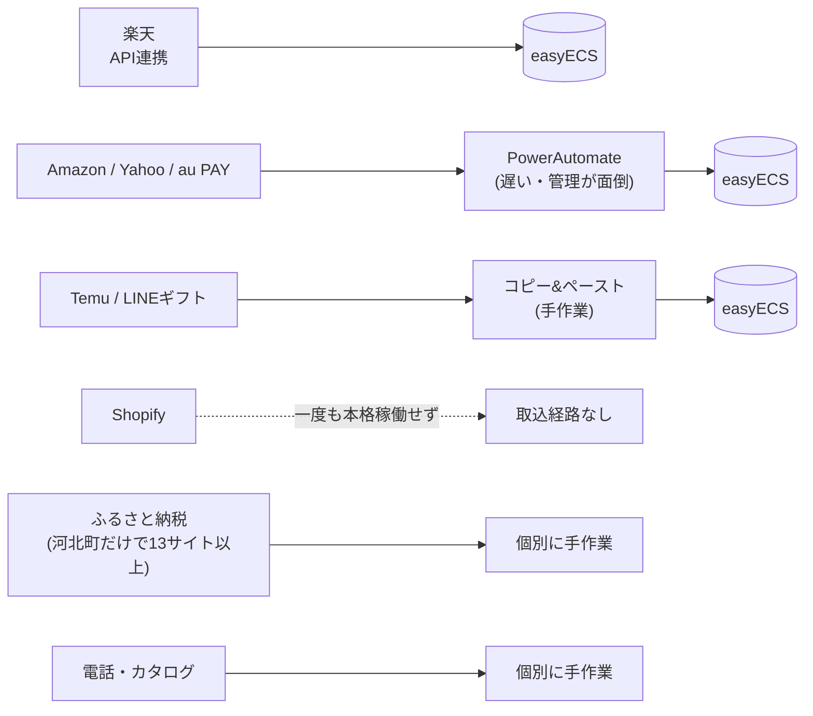
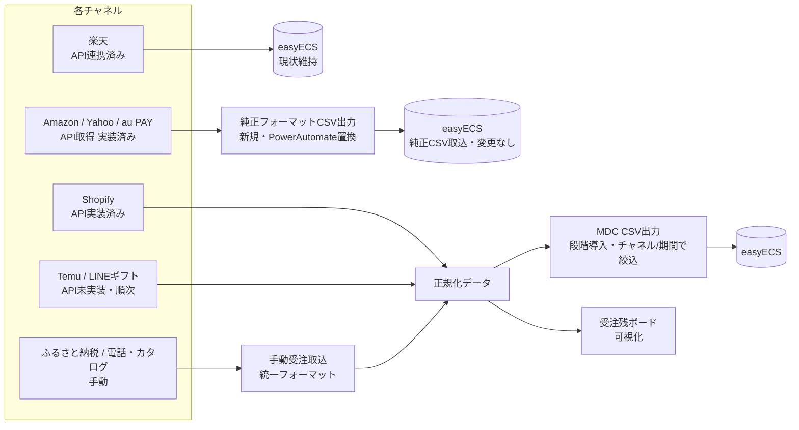

---
tags:
  - 緑茶園
  - 打ち合わせ
  - アジェンダ
client: 緑茶園グループ
date: 2026-09-16
created: 2026-09-15
updated: 2026-09-15
---

# テーマ1｜受注チャネル統合の方向性協議（2026-09-16）

親: [[00 MOC|緑茶園グループ MOC]] ／ 関連: [[テーマ1 - 受注チャネル統合とツール複数人化]] / [[EC Channel Console - 変換器構想とMDC出力]] / [[EC Channel Console - 00 概要]]

> [!info] このノートについて
> 2026-09-16実施予定の打ち合わせ、**テーマ1（受注チャネル統合）**の事前アジェンダ。AS-IS／TO-BEの整理と、当日確認したい事項をまとめたもの。**下の図は2026-09-15時点のTO-BE案のスナップショット**（打ち合わせ当日に手元で見返せるようにこのノートに複製）。設計判断・最新版の正本は常に [[EC Channel Console - 変換器構想とMDC出力]] 側。見直しが入ったら本ノートではなくそちらを更新し、本ノートは「この日この案で協議した」という記録として残す。

## この協議の目的

先方から「[[店舗アップ♪（外部ベンダー製品）]] も検討している」という話と、「（自社開発を積み上げるより）**easyECSにやっぱり寄せた方がいい**のでは」という話の両方が出ている。この2つは矛盾しない可能性がある——今回整理したTO-BE案は、**EC Channel Consoleを「変換器」として使い、最終的には全チャネルの受注をeasyECSに集約する**という、まさに「easyECSに寄せる」方向そのもの。店舗アップ♪（受注取得〜出荷まで一気通貫の別パッケージへの載せ替え）とは役割が違うため、**[[テーマ1 - 受注チャネル統合とツール複数人化]] の3案（①自社開発を変換器として育てる／②店舗アップ導入／③easyECSごと載せ替え）のうちどれを取るか、先方の意図をすり合わせたい**。

## 前提：現在のプラットフォームの役割・機能整理

> [!info] 先方向けの一言でまとめると
> システムを新しく作っているわけではない。**EC受注取得ツール（EC Channel Console）と仕入システムは、すでに1つの社内ポータル（プラットフォーム）に統合済み**。今回の話はその中の「受注」部分への機能追加。

### プラットフォームとは
- 緑茶園グループ 統合コンソール（社内向けWebアプリ）。仕入業務（inventory）とEC受注（ec）を1つにまとめている
- 画面の入口はモジュール軸（受注／入出荷／帳票／マスタ）、データの持ち主は業務軸（inventory／ec／core：権限・監査）で分かれている

### 現在の状態（2026-09-15時点）
- **EC側の切替まで完了・本番稼働中。** 旧「EC Channel Console」（別アプリ・別Vercelプロジェクト）は**廃止・アーカイブ済み**。今後の開発・運用はこのプラットフォーム1本に集約されている
- ログイン・権限管理（誰が何を見られるか）・操作の記録もプラットフォーム共通の仕組みに統一済み

### 今すでに使える機能（受注まわり）
- 7チャネル（楽天・Amazon・Yahoo・au PAY・Shopify・Temu・LINEギフト）の受注データ取得・表示（Temu・LINEギフトはまだ未実装／仕様書待ち）
- 受注残ボード（easyECSから出したCSVを手動で取り込んで表示。自治体側との直結はまだ）
- 手動受注取込（現状「MDC形式」「その他」の2画面。**今回の協議で統一する予定の部分**）
- SKU対応表（チャネル側の商品コード ⇔ 自社SKU）
- チャネルごとの認証情報の保存画面

### まだ無い機能（今回のTO-BEで足す部分）
- 正規化した受注データをeasyECSへ書き出す機能（MDC出力）
- Amazon/Yahoo/au PAY向けの、モール純正フォーマットでのCSV出力（新規・PowerAutomate置き換え）
- 受注残ボードの自治体側システムとの直結表示（先方から接続情報を受領後に着手）

### この協議がプラットフォームのどこに効くか
今回相談する3点（①純正フォーマット出力の新設／②手動受注取込の統一／③MDC出力の段階導入）は、すべて**このプラットフォームの「受注」機能の拡張**として実装する。新しいシステムを作るわけでも、URLやログイン方法が変わるわけでもない。

## AS-IS（現状）

## TO-BE（提案）

## 明日確認したいこと

### 1. 方向性の確認
- 今回整理したTO-BE（変換器化して受注をeasyECSに集約する方向）で進めてよいか
- [[店舗アップ♪（外部ベンダー製品）]] の検討は継続するか。継続する場合、EC Channel Console（変換器）と役割がどう違うか、認識をすり合わせる

### 2. 宿題の確認：API調査
- Temu・LINEギフトのAPI仕様書は入手できたか（LINEギフトは仕様書入手だけがブロッカー、Temuは対応状況自体が未確認）
- クロスモールの契約に、LINEギフト・Shopifyの受注連携メニューが含まれるか（既存の要確認事項。含まれるなら手作業になっている理由が変わる）

### 3. PowerAutomateの正規フォーマット確認
- Amazon・Yahoo・au PAYで今PowerAutomateが出力しているCSVのサンプルを1つ共有してもらう（easyECS純正フォーマットの列仕様を確認するため）

### 4. ふるさと納税・電話/カタログの捌き方の確認（今の想定）

現状の想定はこう置いている。これで合っているか確認する。

- **ふるさと納税**：河北町だけで13サイト以上に分散しており、構造的にAPI一括取得がほぼ不可能（受注データの一次保有者が自治体、さとふるはAPI非対応など）。EC Channel Consoleの手動受注取込（統一フォーマット）で正規化データに集約し、MDC出力でeasyECSへ流す想定
- **電話・カタログ**：同様に手動受注取込で正規化データに集約し、MDC出力でeasyECSへ流す想定。返却先が無く金額の重要度も低いため、**MDC出力の最初の実験台**として想定している
- どちらも「実際にどう受注が緑茶園側に届いているか」「ふるさと納税の『枚数管理』の実体」はまだヒアリングできていないので、当日実態を聞く

## 関連ノート

- [[テーマ1 - 受注チャネル統合とツール複数人化]]
- [[EC Channel Console - 00 概要]] / [[EC Channel Console - 変換器構想とMDC出力]]
- [[ふるさと納税の取扱い]]
- [[店舗アップ♪（外部ベンダー製品）]]
