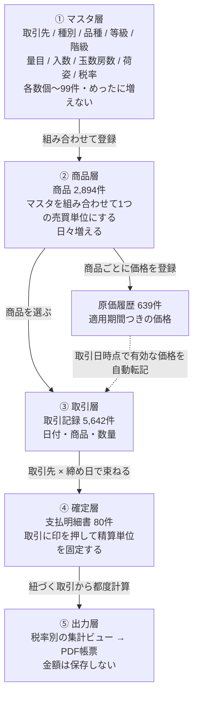
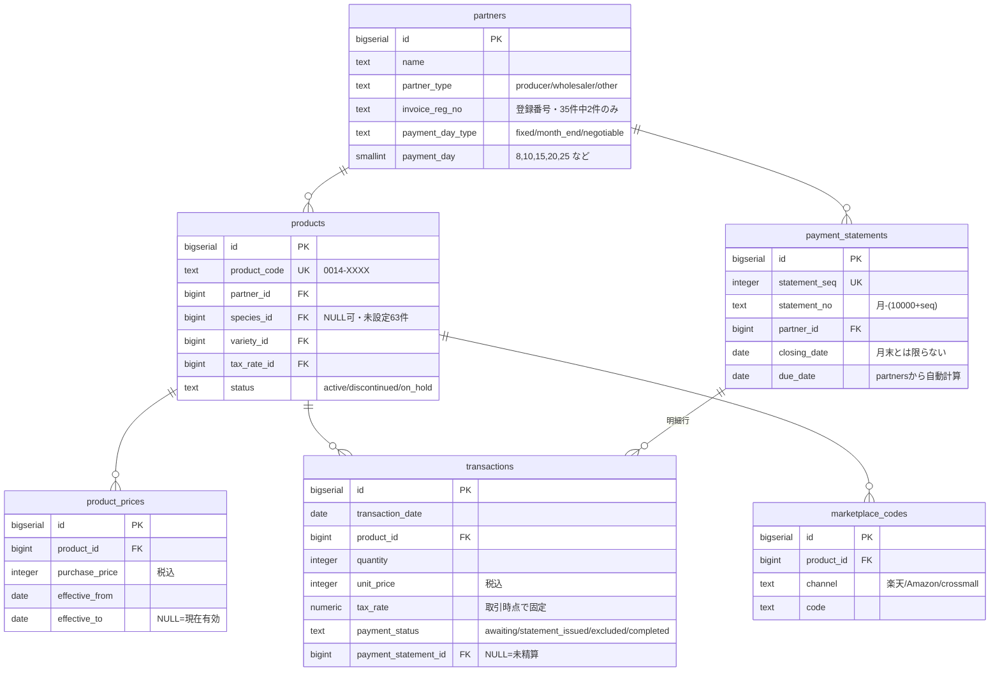
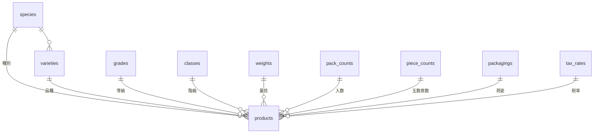

---
tags:
  - 緑茶園
  - 案件
  - Airtable
  - データモデル
  - スキーマ定義
client: 緑茶園グループ
created: 2026-09-11
updated: 2026-09-11
aliases:
  - Airtable再構築 DDL
  - 入荷記録表 新DBスキーマ
  - 入荷記録表 アーキテクチャ
---

# DBスキーマ定義：Airtable「入荷記録表」再構築（第1弾＝仕入側）

親: [[Airtable再構築 - 00 概要|案件概要]] ／ 要件: [[Airtable再構築 - 要件定義ドラフト]] ／ AS-IS調査: [[Airtable再構築 - データモデル設計比較]]

## この案件を1分で

株式会社緑茶園は、生産者から果物を仕入れ、月末に締めて**支払明細書**を発行している。その業務はAirtable（＋自動化のRelay＋帳票生成のDocsAutomator）で回っているが、月額1.5〜4万円の固定費がかかり、2026年7月にはマスタ削除で過去の取引データが巻き添えで消える事故も起きた。これを**Vercel＋Supabase＋Next.jsの自前アプリに載せ替える**のが本案件。

- **第1弾＝仕入側**（生産者との取引〜支払明細書）に絞る。販売側（顧客への請求書・納品書）は第2弾
- 対象ユーザーは入力担当のムック（2026年9月以降は単独運用）と、確認するレオ（社長）
- 本書は現行23テーブル・640フィールドをAirtable APIで棚卸しした結果に基づく実装用の設計。**AS-IS分析は [[Airtable再構築 - データモデル設計比較]]、経緯は [[Airtable再構築 - ヒアリング回答ログ]] にある**

| | 現行Airtable | 新スキーマ |
|---|---|---|
| テーブル | 23 | **13** |
| フィールド／カラム | **640** | **約90** |

## アーキテクチャ

業務は5つの層に分かれる。**現行の混乱は、この5層が1つのテーブルに混ざっていたことが原因**だった（品種マスタに集計が45フィールド、商品マスタに月別rollupが20個以上、など）。



読み違えやすい点が2つある。

**「商品マスタ」はマスタではない。** マスタ層が各数個〜99件でめったに増えないのに対し、商品は2,894件あって日々増える。実態は「9種類のマスタを組み合わせて1つの売買単位として登録する行為」で、ここがこの業務の重心。`阿部大介 × サンつがる × 茶箱 × 訳 × 5kg × 1入` に `0014-209` という番号を与えることで、初めて価格がつけられ取引が記録できる。

**月締めは集計ではなく確定操作。** 合計を出す作業ではなく、「この取引群はこの1枚の明細書で精算する」と決めて取引に `payment_statement_id` を書き込む操作である。だから支払明細書には**金額を1円も保存しない**。合計も消費税も紐づいた取引から都度計算する。集計結果を保存すると、あとから取引を直したときに帳票と食い違う（現行がまさにその構造だった）。

## ER図



上図では省いたが、**8つのマスタ（種別・品種・等級・階級・量目・入数・玉数房数・荷姿）はすべて `products` に外部キーでぶら下がる**。品種だけは種別に属する階層構造を持つ。



## 決定事項（再検討しない前提）

| # | 決定 | 根拠 |
|---|---|---|
| 1 | ⚠️**再検討中**（2026-09-12）。自前かkintoneか未確定 | 13テーブルまでスリム化した結果kintoneでも載ることと、帳票プラグインが現行より大幅に安いことが判明（→ [[Airtable再構築 - 00 概要]]）。**下記のテーブル設計はどちらに転んでも流用できる**（13テーブル＝13アプリ） |
| 2 | 第1弾は仕入側のみ。販売側は第2弾 | 顧客マスタ・請求書・納品書は実データ2〜3件のパイロット止まりで、本格運用の意思が未確認 |
| 3 | 表示名の生成ロジックは「商品タイトル」1本に統合 | 6つあったSKU/タイトル系formulaのうち実使用は1つだけ（→ヒアリングログ Q1） |
| 4 | 「販売規格名組合せ」「商品」formulaは移植せず廃棄 | 目的不明かつ未使用 |
| 5 | 内部コードと外部モールコードは別テーブルに分離 | 現行は1フィールドに同居させた結果、誰も正体を把握できなくなっていた |
| 6 | 税率はマスタ化し、明細ごとに保持して税率別に積み上げる | 現行は`÷1.08`が直書きで、10%取引が混ざると必ず壊れる |
| 7 | 支払期日は取引先マスタから自動計算し、手動上書きも可 | 35件すべて「当月末締め」で、支払日だけ8/10/15/20/25/末/相談の7パターン |
| 8 | 移行前にAirtable側をクレンジングしない。新システムで直す | 捨てる側に工数をかけない。整備不要な商品が混じっている可能性もある |
| 9 | 集計結果は一切保存しない。すべてビューで都度計算 | 「取引先が増えるたびに列を足す」構造の根絶 |
| 10 | 全外部キーを `ON DELETE RESTRICT` | 2026-07のデータ破損（荷姿マスタ削除で取引が巻き添え）の直接対策 |

## 設計原則

1. **導出できる値は保存しない。** rollup・集計formulaは全廃し、SQLで都度計算する
2. **同じ属性を二重に持たない。** 現行の商品マスタは等級・階級・量目・入数・玉数・荷姿を「singleSelect」と「マスタへのリンク」の両方で保持しており乖離しうる（実際に`等級emptyチェック``量目emptyチェック`という手作りの検知用フィールドが存在する）。外部キー1本に統一する
3. **入力補助のための構造をデータに持ち込まない。** 現行はマスタ間に「品種（紐付け）」等の候補絞り込み用リンクを張っているが、これは`SELECT DISTINCT`で商品データから導出できる
4. **ハードコードされた業務ルールをデータにする。** 税率と支払サイトを構造化する
5. **マスタを消してもトランザクションが消えない。**

## DDL

```sql
create extension if not exists btree_gist;   -- 原価履歴の期間重複排除に使用

-- ============================================================
-- ① マスタ層
-- ============================================================

create table partners (                        -- 【3】取引先（35件）
  id                bigserial primary key,
  name              text not null,
  name_for_print    text,                      -- 帳票用の表記
  name_kana         text,
  partner_type      text not null
                      check (partner_type in ('producer','wholesaler','other')),
  status            text not null default 'active'
                      check (status in ('active','ended')),
  invoice_reg_no    text,                      -- 適格請求書発行事業者登録番号（現行35件中2件のみ登録）
  payment_method    text
                      check (payment_method in ('bank_transfer','cash','cash_collect')),
  -- 支払サイト：現行は「当月末締め/翌月25日払い」等のテキスト。35件すべて当月末締め
  closing_type      text not null default 'month_end'
                      check (closing_type in ('month_end')),
  payment_day_type  text not null default 'fixed'
                      check (payment_day_type in ('fixed','month_end','negotiable')),
  payment_day       smallint check (payment_day between 1 and 31),
  postal_code       text,
  address1          text,
  address2          text,
  phone             text,
  fax               text,
  email             text,
  note              text,
  created_at        timestamptz not null default now(),
  updated_at        timestamptz not null default now(),
  check (payment_day_type <> 'fixed' or payment_day is not null)
);

create table species (                         -- 【6】種別（りんご・さくらんぼ等）
  id bigserial primary key,
  name text not null unique,
  sort_order int not null default 0
);

create table varieties (                       -- 【7】品種（99件）
  id bigserial primary key,
  species_id bigint not null references species(id) on delete restrict,
  name text not null,
  sort_order int not null default 0,
  unique (species_id, name),
  unique (species_id, id)                      -- productsからの複合外部キー用
);

-- 以下6つは同じ形。個別テーブルにするのは外部キーで取り違えを防ぐため
create table grades       (id bigserial primary key, name text not null unique, sort_order int not null default 0); -- 【9】等級
create table classes      (id bigserial primary key, name text not null unique, sort_order int not null default 0); -- 【11】階級
create table weights      (id bigserial primary key, name text not null unique, sort_order int not null default 0); -- 【10】量目
create table pack_counts  (id bigserial primary key, name text not null unique, sort_order int not null default 0); -- 【12】入数
create table piece_counts (id bigserial primary key, name text not null unique, sort_order int not null default 0); -- 【13】玉数・房数
create table packagings   (id bigserial primary key, name text not null unique, sort_order int not null default 0); -- 【14】荷姿

create table tax_rates (                       -- 新設：現行は÷1.08の直書き
  id bigserial primary key,
  rate           numeric(4,3) not null,        -- 0.080 / 0.100
  label          text not null,                -- 軽減税率 / 標準税率
  effective_from date not null,
  effective_to   date,
  unique (rate, effective_from)
);

-- ============================================================
-- ② 商品層
-- ============================================================

create table products (                        -- 【4】商品マスタ（2,894件）
  id             bigserial primary key,
  product_code   text not null unique,         -- 現行SKU「0014-XXXX」を引き継ぐ
  partner_id     bigint not null references partners(id)   on delete restrict,
  species_id     bigint references species(id)    on delete restrict,  -- 現行に未設定63件あり
  variety_id     bigint,
  grade_id       bigint references grades(id)        on delete restrict,
  class_id       bigint references classes(id)       on delete restrict,
  weight_id      bigint references weights(id)       on delete restrict,
  pack_count_id  bigint references pack_counts(id)   on delete restrict,
  piece_count_id bigint references piece_counts(id)  on delete restrict,
  packaging_id   bigint references packagings(id)    on delete restrict,
  tax_rate_id    bigint not null references tax_rates(id)  on delete restrict,
  status         text not null default 'active'
                   check (status in ('active','discontinued','on_hold')),
  note           text,
  created_at     timestamptz not null default now(),
  updated_at     timestamptz not null default now(),
  -- 品種は必ず種別に属する。両方を持つと乖離しうるので複合外部キーで縛る
  -- （variety_idがNULLのときはMATCH SIMPLEにより制約はスキップされる）
  foreign key (species_id, variety_id)
    references varieties (species_id, id) on delete restrict,
  -- 現行の「商品タイトル」formulaが暗黙に担っていた一意性をDB制約に格上げする。
  -- 8要素のうち商品によってNULLの要素があるため nulls not distinct が必須（PG15以降）。
  -- species_idを含めるのは、品種が未設定の商品どうしが種別違いでも衝突してしまうため
  unique nulls not distinct
    (partner_id, species_id, variety_id, grade_id, class_id, weight_id,
     pack_count_id, piece_count_id, packaging_id)
);

create index on products (partner_id) where status = 'active';
create index on products (variety_id);

create table product_prices (                  -- 【5】原価履歴（639件、うち空レコードあり）
  id             bigserial primary key,
  product_id     bigint not null references products(id) on delete restrict,
  purchase_price integer not null,             -- 税込
  effective_from date not null,
  effective_to   date,                         -- NULL = 現在有効
  created_at     timestamptz not null default now(),
  check (effective_to is null or effective_to >= effective_from),
  -- 現行テーブルの説明文に「必ず過去の価格の適用終了日を設定してください」と
  -- 書かれている＝設定漏れが起きる前提の運用。DB制約で期間の重複を弾く
  exclude using gist (
    product_id with =,
    daterange(effective_from, coalesce(effective_to, 'infinity'::date), '[]') with &&
  )
);

create table marketplace_codes (               -- 新設：外部モールの商品販売コード
  id         bigserial primary key,
  product_id bigint not null references products(id) on delete cascade,
  channel    text not null,                    -- 楽天 / Amazon / crossmall 等
  code       text not null,
  created_at timestamptz not null default now(),
  unique (channel, code)
);

-- ============================================================
-- ③ 取引層 ／ ④ 確定層
-- ============================================================

create table payment_statements (              -- 【1】月締め入荷記録＝支払明細書（80件）
  id             bigserial primary key,
  statement_seq  integer not null unique,      -- 現行autoNumberを引き継ぐ（欠番あり）
  statement_no   text generated always as (
                   extract(month from closing_date)::int::text
                   || '-' || (10000 + statement_seq)::text
                 ) stored,
  partner_id     bigint not null references partners(id) on delete restrict,
  closing_date   date not null,                -- 締め日（月末とは限らない。月中締めが実在）
  due_date       date,                         -- 支払期日（partnersから自動計算＋手動上書き可）
  is_sent        boolean not null default false,
  note           text,
  pdf_path       text,                         -- Supabase Storageのパス
  created_at     timestamptz not null default now(),
  updated_at     timestamptz not null default now()
);

create index on payment_statements (partner_id, closing_date desc);

create table transactions (                    -- 【2】取引内容一覧（5,642件）
  id                   bigserial primary key,
  transaction_seq      integer not null unique,   -- 現行「取引ID」の連番
  transaction_date     date not null,
  product_id           bigint not null references products(id) on delete restrict,
  quantity             integer not null check (quantity > 0),
  unit_price           integer not null,          -- 税込単価（現行運用どおり）
  tax_rate             numeric(4,3) not null,     -- 取引時点の税率を固定保持
  payment_status       text not null default 'awaiting'
                         check (payment_status in
                           ('awaiting','statement_issued','excluded','completed')),
  payment_statement_id bigint references payment_statements(id) on delete restrict,
  note                 text,
  created_at           timestamptz not null default now(),
  created_by           uuid references auth.users(id),
  updated_at           timestamptz not null default now()
);

create index on transactions (transaction_date);
create index on transactions (payment_statement_id);
create index on transactions (product_id);
create index on transactions (payment_status) where payment_status = 'awaiting';

-- ============================================================
-- 監査（2026-07のデータ破損の再発防止）
-- ============================================================

create table audit_logs (
  id          bigserial primary key,
  table_name  text not null,
  record_id   bigint not null,
  action      text not null check (action in ('insert','update','delete')),
  changed_by  uuid,
  changed_at  timestamptz not null default now(),
  before_data jsonb,
  after_data  jsonb
);

create index on audit_logs (table_name, record_id, changed_at desc);
```

## ⑤ 出力層：現行の rollup 157フィールドを置き換えるビュー

```sql
-- 支払明細書の税率別集計。インボイス制度が求める「税率ごとに1回の端数処理」と同じ粒度。
-- 現行の ÷1.08 直書きを置き換える本体
create view v_statement_totals as
select
  t.payment_statement_id,
  t.tax_rate,
  sum(t.quantity * t.unit_price)                                        as amount_incl_tax,
  round(sum(t.quantity * t.unit_price) * t.tax_rate / (1 + t.tax_rate)) as tax_amount,
  sum(t.quantity * t.unit_price)
    - round(sum(t.quantity * t.unit_price) * t.tax_rate / (1 + t.tax_rate)) as amount_ex_tax
from transactions t
where t.payment_statement_id is not null
group by t.payment_statement_id, t.tax_rate;
```

**検算済み**：支払明細書 8-10109（阿部大介、2026-08-31）は税込合計 51,071。`round(51071 × 0.08 ÷ 1.08)` = 3,783、税抜 = 47,288 で現行PDFと一致する。

現行の統計テーブル（販売規格86・月統計38・年統計33フィールド）は、すべて下記の形のクエリ1本に置き換わる。取引先や年が増えても列を足す必要がない。

```sql
select date_trunc('month', t.transaction_date) as month,
       p.partner_id, sum(t.quantity), sum(t.quantity * t.unit_price)
from transactions t join products p on p.id = t.product_id
group by 1, 2;
```

## 未整備データの可視化

移行時にクレンジングせず現行のまま取り込む方針のため、「直すべきものが見えない」状態にしないビューを用意する。

```sql
-- 種別が未設定・一度も取引がない等、整備または削除の判断が要る商品
create view v_products_needing_review as
select p.id, p.product_code, pt.name as partner_name, p.status,
       case when p.species_id is null then '種別なし' end            as issue_species,
       case when not exists (select 1 from transactions t
                             where t.product_id = p.id) then '取引実績なし' end as issue_unused,
       case when not exists (select 1 from product_prices pp
                             where pp.product_id = p.id
                               and pp.effective_to is null) then '有効な原価なし' end as issue_price
from products p
join partners pt on pt.id = p.partner_id
where p.species_id is null
   or not exists (select 1 from transactions t where t.product_id = p.id)
   or not exists (select 1 from product_prices pp
                  where pp.product_id = p.id and pp.effective_to is null);
```

`species_id` を `NOT NULL` にせず nullable にしたのはこのため。移行を止めないかわりに、未整備のまま放置されないようにする。取引実績がなく原価もない商品は、整備せず削除してよい候補として同じビューに出る。

## 廃止するものと理由

| 現行 | 廃止理由 |
|---|---|
| 商品マスタの月別rollup 12個＋`12月取引数量 copy` | `GROUP BY date_trunc('month', …)` |
| 商品マスタの年別rollup（24年/25年/26年） | 年が変わるたびに列追加する構造そのものが不要 |
| 商品マスタの singleSelect 版 等級・階級・量目・入数・玉数・荷姿 | リンク版と二重管理。外部キー1本に統一 |
| `等級emptyチェック` `量目emptyチェック` | 上の二重管理を検知するための手作りフィールド。原因ごと消える |
| 商品マスタの `販売規格名組合せ` `商品` formula | 目的不明・未使用。移植せず廃棄 |
| 商品マスタの `【集計用】商品タイトル` `【集計用】荷姿＊等級＊…` | 未使用。集計はCSV→Excelピボットに移行済み |
| 取引内容一覧の 9つの `【商品マスタ参照】` lookup | 商品経由でJOINすれば取れる |
| 取引内容一覧の 8マスタへの直リンク | 入力時の候補絞り込み用。UIの責務であってデータではない |
| 取引内容一覧の `年統計` `月統計` `販売規格` リンク | 集計テーブルごと廃止 |
| マスタ間の `品種（紐付け）` `荷姿（紐付け）` 等 | `SELECT DISTINCT` で商品データから導出 |
| 品種テーブルの等級×荷姿別rollup 11個＋年別集計 | 同上。45フィールド→3列になる |
| 各テーブルの `copy` `copy copy` `copy 2` `Field 31` 等の残骸 | 【9】等級だけで10個以上。すべて削除 |
| DocsAutomator呼び出しボタン | APIキーが平文で埋まっている。自前PDF生成またはサーバ側の環境変数へ |

## 実データ検証の結果（2026-09-11）

`NOT NULL` を張った列が既存データで本当に埋まっているかをAPIで検証した。

| 検証項目 | 結果 |
|---|---|
| 取引5,642件すべてに商品リンクがあるか | ✅ 欠損0件。`transactions.product_id NOT NULL` は安全 |
| 商品2,894件すべてに取引先が入っているか | ✅ 欠損0件。`products.partner_id NOT NULL` は安全 |
| 商品すべてに種別・消費税率が入っているか | ❌ **63件が種別未設定**（2026-08-31に一括登録された「本白桃」シリーズ）。消費税率は全件入力済み |

### まだ検証していないこと

| 項目 | なぜ効くか |
|---|---|
| 取引の「取引先」が商品の「取引先」と常に一致するか | 一致しない取引があると、`transactions`から取引先列を落とした設計が破綻する |
| `unique nulls not distinct` を張って既存2,894件が通るか | 重複があれば移行が止まる。現行に一意制約がないため未知 |
| 取引内容一覧の「納品書」添付が使われているか | 使われていれば移行対象に追加が必要 |
| 月統計・年統計を定期的に見ている人がいるか | 廃止の前提条件。[[08 要確認事項]] に未解決のまま残っている |

上2つはAPIで1件ずつ突き合わせるより、**一度RAWでSupabaseに流し込んでSQLで検証するほうが速い**。移行スクリプトのdry-runで確認する。

## 移行時の注意

1. 🟡 **原価履歴の税区分（移行のブロッカーではない）**：2025-11-01を適用開始日とするレコードは639件中**42件のみ**で、一斉変換ではなく部分的だった。金額を見ると **1,080＝1,000×1.08、1,620＝1,500×1.08、3,240＝3,000×1.08** のように税抜のキリのいい額を1.08倍した値が並ぶ＝**原価は税抜で交渉し、システムには税込で登録する**運用と読める。一方で阿部大介の830→896・1,660→1,793は旧価格そのものの1.08倍で、その商品については税抜→税込の表記変換だった可能性が高い。
   ただし**これは移行を止める理由にならない**。原価履歴は「次の取引の単価を自動入力する」ためのマスタであり、過去の取引には単価が値としてコピー済みだからである。実務上重要なのは `effective_to IS NULL` の現在有効な価格だけで、それらはすべて税込であることを確認済み。**過去分は参考情報として現行のまま持ち込んでよい**
2. **空レコードのクレンジング**：原価履歴639件に、商品リンクも価格も持たない空レコード（例 PH0-616）が混在
3. **番号の欠番を保つ**：支払明細書番号・商品コード・取引IDはいずれも `固定プレフィックス＋オフセット＋autoNumber` 形式で、削除による欠番がある。番号を引き継ぐなら連番を明示カラムとして移行し、新システム側のシーケンスは既存の最大値から開始する
4. **添付ファイル**：支払明細書PDF 80件をSupabase Storageへ移す

## 着手手順

1. **Supabaseプロジェクトを作成**し、上記DDLをマイグレーションとして適用する（`btree_gist` 拡張を忘れない）
2. **マスタを移行**する（種別・品種・等級・階級・量目・入数・玉数房数・荷姿・取引先・税率）。取引先の「締日/支払日」テキストを `payment_day_type` / `payment_day` に構造化する
3. **商品2,894件を移行**し、`unique nulls not distinct` が通るか確認する。弾かれたら重複の実物を見て判断する
4. **原価履歴・取引・支払明細書を移行**し、`v_products_needing_review` で未整備データを一覧する
5. **価格ロジックを実装**する（取引日時点で有効な原価を引いて単価に転記。現行Airtableのスクリプトは入手済みで、日付範囲検索をそのまま移植できる）
6. **CRUD画面を構築**する。既存の [[EC Channel Console - 00 概要|EC Channel Console]] と同じNext.js＋Supabase構成を流用する
7. **支払明細書のPDF生成**を実装する

> [!warning] UIの実装コストを見誤らないこと
> カスケード入力（品種を選ぶと等級の候補が絞られる）をデータ構造から外し「UIの責務」とした。設計としては正しいが、**2,894商品から選ぶUIを作らないとムックの入力が成立しない**。テーブルがスッキリした分の複雑さはフロントに移っている。候補の絞り込みは `SELECT DISTINCT` で既存の商品データから導出する。

## 未決事項

- **顧客マスタ・販売側の請求書／納品書の本格運用意思**（レオ様への確認待ち。第2弾スコープなので急がない）
- **販売側☑請求書作成テンプレートのインボイス対応**（第2弾へ）
- **crossmallでの外部モールSKUの管理ルール**（実在するかの確認から。`marketplace_codes` を分離してあるので実装はブロックしない）
- **DocsAutomatorを継続するか自前PDF生成にするか**
- **月統計・年統計を定期的に見ている人がいるか**

## 現行Airtableの参照情報

Base ID: `appgHXd85EhNBuXlt`（【現行】入荷記録表）

| テーブル | Table ID |
|---|---|
| 【1】月締め入荷記録（＝支払明細書） | `tblKm1ZNu9wKzzpG5` |
| 【2】取引内容一覧 | `tblX0PKJApqYQ6Ekt` |
| 【3】取引先 | `tbls6IPcnVHeFEvRb` |
| 【4】商品マスタ | `tblX390MUDDYOf7gs` |
| 【5】原価履歴 | `tblB6IF6l81bLdysA` |
| 【6】種別 | `tbl25jYVcp30jjESW` |
| 【7】品種 | `tble5jzMkq8opcpbw` |
| 【8】旧・入荷記録表（移行対象外） | `tbl4ZT3A7pV9LvdrZ` |
| 【9】等級 | `tblZ0AWFQqz09NaCW` |
| 【10】量目 | `tblm4F5vsBnz44LA4` |
| 【11】階級 | `tblzxgV1chwDiB3FJ` |
| 【12】入数 | `tblpUitShlUaYEmGj` |
| 【13】玉数・房数 | `tblN90suVnaSox1Yi` |
| 【14】荷姿 | `tblfkTwfwcgBLSgrz` |

## 関連ノート

- [[Airtable再構築 - 00 概要]] — 案件の位置づけと次のアクション
- [[Airtable再構築 - 要件定義ドラフト]] — スコープ・マイルストーン・体制リスク
- [[Airtable再構築 - データモデル設計比較]] — 現行の何が問題かのAS-IS分析
- [[Airtable再構築 - ヒアリング回答ログ]] — 設計判断の根拠となった回答の原文
- [[08 要確認事項]] — 未決事項の集約先
- [[EC Channel Console - 00 概要]] — 流用するNext.js＋Supabase構成
