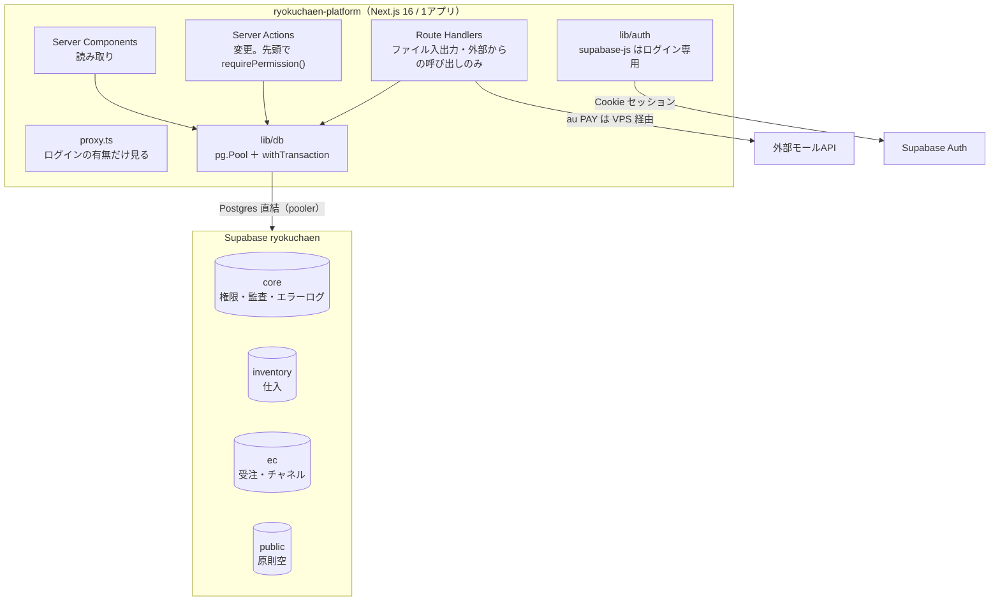

---
tags:
  - 緑茶園
  - 案件
  - platform
  - 設計方針
  - 決定事項
client: 緑茶園グループ
created: 2026-09-14
updated: 2026-09-14
aliases:
  - platform 統合方針
---

# 統合方針：決定事項とターゲット構成

親: [[platform - 00 概要]] ／ 障害の整理: [[platform - 04 移植の障害と設計判断]]

> [!info] 本書の位置づけ
> 2026-09-14 の調査結果（00〜04）を受けて、ちぇるが決めた方針と、そこから導いた**統合先 `ryokuchaen-platform` の設計方針**をまとめる。
> 「決定」はユーザー判断で確定したもの。「推奨」は決定を満たすために本書で選んだ案で、**未決の論点は末尾にまとめた**。実装はまだしていない。

## 決定事項（2026-09-14）

| # | 論点 | 決定 | 対応する障害 |
|---|---|---|---|
| D1 | 仕入業務の行き先 | **今回は自前前提で作る**（kintone案は本統合では採らない） | [[platform - 04 移植の障害と設計判断\|04]] #1 |
| D2 | データアクセス層 | **1系統に統一する** | #2 |
| D3 | マイグレーション | **新規実装では必ず共通ルールに合わせる** | #3 |
| D4 | 権限 | **ロール単位と個人単位で設定でき、設定画面で superuser が操作する。superuser 自体は Supabase で直接設定する** | #4 |
| D5 | その他のアーキテクチャ | **合わせられる部分はできるだけ合わせる** | #7〜#16 |
| D6 | SQL の置き場 | **SQL は必ず `sql/` ディレクトリに整理する** | #3 |
| D7 | 統合先 | **`ryokuchaen/ryokuchaen-platform`**（作成済み・Initial commit のみ） | — |
| D8 | Supabase | **同じプロジェクト `ryokuchaen` を使い続ける。EC は `public` から新しいスキーマへ移す。`public` は原則使わない** | #7 |
| D9 | デザイン | **[[platform - 06 デザイン指示書]]（v2）に従う**（shadcn/ui を導入し既定テーマは上書き、深緑トークン、Noto Sans JP 1系統・400/500、影なし、ヘッダーのモジュールタブ、サイドバーの折りたたみ）。v1 への指摘は [[platform - 07 デザイン指示書レビュー]] | #9・#13 |
| D10 | 画面とデータの切り方 | **画面の入口（ヘッダーのタブ・サイドバー・URL）はモジュール（受注／入出荷／帳票／マスタ）で切り、データの持ち主（スキーマ・`lib/`・権限キー）は業務（`inventory`／`ec`／`core`）で切る。** 受注残ボードと月締めは「入出荷」 | #8・#9 |

> [!success] D1 は [[Airtable再構築 - 00 概要]] に反映済み（2026-09-14）
> kintone 案は「採らなかった判断の記録」として比較表・帳票プラグイン調査を残し、方針欄を「自前で確定」に更新した。

### 推奨案の採用（2026-09-14）

本書で「推奨」とした案は、2026-09-14 に**すべてそのまま採用**された。末尾の「未決・要確認」のうち、推奨案で決着したものは同じ日付で閉じている。

## 全体像



---

## 1. スキーマ（D8）

| スキーマ | 役割 | 中身 |
|---|---|---|
| `core`（推奨名） | 業務をまたぐ共通部品 | 権限（ロール・割り当て・superuser）、監査ログ、エラーログ、`set_updated_at()` などの共通関数 |
| `inventory` | 仕入 | 現行のまま（17テーブル・3ビュー） |
| `ec`（推奨名） | 受注・チャネル | 現在 `public` にある EC の7テーブル・5ビューを移す |
| `public` | — | **原則空。新しいオブジェクトを作らない** |

### EC オブジェクトの移動先（案）

| 現在 | 移動先 | 理由 |
|---|---|---|
| `public.multi_channel_order_fetcher` | `ec.channel_credentials` | 旧リポジトリ名由来の名前で、中身（チャネル認証情報）を表していない |
| `public.multi_channel_order_fetcher_logs` | `core.error_logs` | アプリ全体のエラーログ（`channel` が null の行もある）。仕入側でも使う |
| `public.order_backlog_snapshots` / `order_backlog_lines` | `ec.` に同名で移す | 名前は既に内容を表している。改名はリスクに見合わない |
| `public.manual_order_batches` / `manual_order_lines` / `manual_order_sku_map` | `ec.` に同名で移す | 同上 |
| `public.v_backlog_*`（4本）/ `v_manual_order_lines_current` | `ec.` に同名で移す | 同上 |

### 共通ルール（新規実装は必ず従う）

- **SQL では常にスキーマ名を付けて書く**（`search_path` に頼らない）。inventory の書き方を全体に広げる
- **RLS は全テーブルで有効・ポリシーなし**。アプリは Postgres 直結で読み書きするので、ポリシーは anon キーからの読み取りを防ぐ壁として置く
- `core`・`inventory`・`ec` は **PostgREST の Exposed schemas に追加しない**。`anon`・`authenticated` にスキーマの usage を与えない
- 主キー：新しいテーブルは `bigint generated always as identity`。**既存の uuid（EC の取込バッチ）は移動時に変えない**
- 時刻：`created_at` / `updated_at timestamptz not null default now()`、更新は `core.set_updated_at()` トリガーで
- 外部キーは `on delete restrict` を既定にする（2026-07 のマスタ削除事故の教訓。inventory の方針を全体へ）
- 区分値は `text` ＋ `check` 制約、画面ラベルは TS 側の registry に持つ（両アプリで既にこの形）
- 設計と違う判断をした列・制約には `comment on` で理由を残す（inventory の書き方）
- ビューは `with (security_invoker = true)` で作る

---

## 2. `sql/` ディレクトリ（D3・D6）

```
sql/
├── README.md        適用手順と命名規則
├── migrations/      スキーマ変更（DDL・ビュー・関数・権限）。追記のみ
├── seeds/           初期データ（ロールの初期セット、税率など）
├── ops/             Supabase で人が直接流す運用SQL（superuser の付与・剥奪など）
└── checks/          読み取り専用の検算・調査SQL（移行時の件数突合、品質チェック）
```

### migrations のルール

| ルール | 内容 |
|---|---|
| ファイル名 | `YYYYMMDDHHMMSS_snake_case_description.sql` |
| 履歴との一致 | **先頭14桁を Supabase のマイグレーション履歴の version と一致させる**。今は本番の履歴とファイルが対応していない（[[platform - 02 Supabase・認証・環境変数]]）ので、これを二度と起こさない |
| 適用済みファイル | **編集しない**。直すときは新しいファイルを足す |
| 1ファイル1目的 | 1つの変更を1ファイルにまとめる |
| 破壊的な文 | `drop schema ... cascade`・`truncate` を migrations に書かない。必要なら理由をコメントに残してレビューを通す |
| ベースライン | 統合開始時に本番の現状を書き起こし、`inventory` 用と `ec`（現 public）用の2本で表す。本番には適用済みとして履歴だけ登録する |
| 旧リポジトリ | 2リポジトリの `supabase/migrations/` は凍結し、以後は触らない |

> [!warning] Supabase CLI は `sql/migrations` をそのまま読めない（要検証）
> 手元の Supabase CLI 2.109.1 では、マイグレーションの置き場所を変えるオプションが見当たらない（`--workdir` で `supabase/` 一式の場所を変えられるだけ）。
> - **推奨**：これまでどおり Supabase MCP の `apply_migration` で適用し、version をファイル名の先頭14桁と揃える
> - CLI の `db push` を使いたい場合は、`supabase/migrations` から `sql/migrations` へのシンボリックリンクなどが要る。動くかは未検証

---

## 3. データアクセスの統一（D2）

**推奨：Postgres 直結（`pg`）＋ Server Actions に統一する。**

| 理由 | 内容 |
|---|---|
| `public` を使わない方針と合う | PostgREST は既定で `public` しか見ない。直結なら新しいスキーマを API に公開する必要がない |
| トランザクションが要る | 支払明細書の発行など、複数テーブルを1回で確定させる処理が inventory にある。supabase-js ではDB関数（RPC）に逃がすしかない |
| 秘密情報が1つ減る | service_role キーが不要になり、DB 接続情報だけになる |
| `sql/` で管理する方針と合う | SQL をそのまま書く前提になる |
| 移植量が小さい | EC の supabase-js 利用は5ファイル＋Route Handler 3本で、処理も単純（key/value の読み書き、取込、ビューの参照） |

### 層の分け方

| 層 | 使う場面 | 決まり |
|---|---|---|
| Server Component | 画面の読み取り | `lib/<domain>/queries.ts` を呼ぶ |
| Server Action | 画面からの変更 | `lib/<domain>/actions.ts`。**先頭で必ず `requirePermission()`**。複数テーブルは `withTransaction` |
| Route Handler | **次の3つに限る**：ファイルのダウンロード（CSV出力）／大きいファイルのアップロード／スクリプトや外部からの呼び出し（`test:mock` の Bearer など） | ここでも先頭で権限を確認する |
| supabase-js | **ログイン（Auth）専用** | `.from()` でテーブルを読まない |

> [!warning] CSV 取り込みをどちらで受けるかはファイルの実サイズ次第
> Next.js の Server Actions はリクエスト本体が**既定で1MB まで**（同梱ドキュメント `server-actions.md`。`serverActions.bodySizeLimit` で変更可）。EC の取込 Route Handler は上限20MBにしているが、Vercel にデプロイすると関数のリクエスト本体の上限が別にかかる（4.5MB）。easyECS 受注CSV（3,211行）の実サイズを確認してから決める。

### そのほか揃えるもの

- **結果の形を1つにする**：inventory の `ActionResult`／`FormState` と EC の `{ error: { code, message, detail } }` を合わせ、「成功ならデータ、失敗なら `code`・`message`・`detail`」の1つの形にする。`code` は EC の `ChannelErrorCode` に `FORBIDDEN`（権限なし）・`VALIDATION`・`NOT_FOUND` を足す。Route Handler は同じ形を JSON で返す
- **エラーログ**：EC の `logError()`（保存に失敗しても応答を止めない）を `core.error_logs` 向けにして全体で使う
- **監査ログ**：変更系の Server Action は必ず前後の値を残す（inventory の `audit()` を全体へ）。EC で一度も入っていない `imported_by` もこれで解消する
- **DB 接続ユーザー**：今は inventory が `postgres` ユーザーで接続している。**アプリ専用のDBロール**（例：`platform_app`）を作り、`core.superusers` には読み取りしか与えない。こうすると「superuser は Supabase で直接設定」をDBの権限でも保証できる。Supabase の pooler 経由で独自ロールが使えるか、Transaction pooler（6543）に切り替えるかは要検証
- **抽出スクリプト**（Airtable → inventory）は truncate を使うので、アプリとは別の接続ユーザーで動かす

---

## 4. 権限モデル（D4）

### 登場するもの

| もの | 置き場所 | 誰が設定するか |
|---|---|---|
| **superuser** | `core.superusers`（ユーザーIDの一覧） | **Supabase で直接**（`sql/ops/` のSQLを SQL Editor で流す）。アプリからは書けない |
| **権限キー** | **コードの registry が正本**（例：`inventory.statements.issue`）。DB には割り当てだけを文字列で保存する | 開発者（EC の `registry.ts` と同じ考え方） |
| **ロール** | `core.roles` | superuser が設定画面で作る |
| ロールに付ける権限 | `core.role_permissions` | 同上 |
| ユーザーに付けるロール | `core.user_roles`（1人に複数可） | 同上 |
| **個人単位の上書き** | `core.user_permissions`（許可／拒否） | 同上 |

### 有効な権限の決まり方

1. **superuser なら全権限**。権限設定画面に入れるのも superuser だけ
2. それ以外は「ロールから来る権限 ＋ 個人で許可した権限 − 個人で拒否した権限」
3. **何も割り当てられていない人は何も見えない**（既定は拒否）

設定画面では、個人単位の上書きを「ロールに従う／許可／拒否」の3状態で見せる。

### 権限の粒度（たたき台）

| 業務 | 権限キー（案） | 対象 |
|---|---|---|
| 仕入 | `inventory.receiving.edit` | 入荷入力 |
| | `inventory.transactions.view` / `.edit` | 取引一覧の閲覧／修正・進捗変更 |
| | `inventory.statements.issue` | 月締め・支払明細書の発行と取り消し |
| | `inventory.statements.view` | 発行済み支払明細書の閲覧・印刷（帳票モジュール。2026-09-14 追加） |
| | `inventory.masters.edit` | 取引先・商品・原価・規格の編集と削除 |
| EC | `ec.orders.view` | チャネル別の受注取得 |
| | `ec.credentials.edit` | **モールの認証情報の上書き** |
| | `ec.manual_orders.import` | 手動受注取り込み・SKU対応表の登録 |
| | `ec.backlog.view` / `.import` | 受注残ボードの閲覧／CSV取り込み（全件置き換え） |
| 共通 | （割り当て不可） | 権限設定は superuser 専用 |

### 確認する場所（3段）

| 段 | 何を確認するか |
|---|---|
| `proxy.ts` | ログインしているかだけ（現行どおり） |
| 画面・サイドバー | 権限の無い画面は出さない。サイドバーの項目も消す |
| **Server Action・Route Handler の先頭** | **必ず `requirePermission()`**。省略しない（POSTで直接呼べるため。inventory の `requireUser()` の考え方を広げる） |

- 権限の変更は `core.audit_logs` に残す
- 設定画面のユーザー一覧は `auth.users` を読む必要がある。アプリ専用ロールに `auth` スキーマを丸ごと見せず、`core` 側に必要な列（メール・最終ログイン）だけを出す読み取り専用ビューを置く

### 設定画面（案）

`/settings/access`（superuser だけが入れる）

- **ユーザー**タブ：ユーザーごとにロールを付ける／外す、権限を個人で上書きする（3状態）。superuser は印を付けて表示し、画面からは変えられない
- **ロール**タブ：ロールの作成・名前変更・削除、ロール×権限の表で付け外し

---

## 5. アプリ構成の統一（D5）

> [!success] 2026-09-14：画面とデータの切り方が確定（D10）
> **画面の入口（ヘッダーのタブ・サイドバー・URL）はモジュール、データの持ち主（スキーマ・`lib/`・権限キー）は業務で切る。** 画面ごとの割り当ての正本は [[platform - 06 デザイン指示書]] の 4.3。
> 当初の「URL の第1階層＝スキーマ名」は、帳票とマスタが仕入と EC の両方にまたがるため採らなかった（経緯は [[platform - 07 デザイン指示書レビュー]] の3章）。

### 名前の揃え方

2本の軸で揃える。

- **データの持ち主**：DBスキーマ名 ＝ `lib/` のディレクトリ名 ＝ 権限キーの接頭辞 ＝ `/api/` の第1階層
- **画面の入口**：ヘッダーのタブ ＝ サイドバーの中身 ＝ 画面の URL の第1階層（URL に `inventory`・`ec` は出さない）

| 業務 | スキーマ | lib | 権限キー | API |
|---|---|---|---|---|
| 仕入 | `inventory` | `lib/inventory/` | `inventory.*` | `/api/inventory/...` |
| EC | `ec` | `lib/ec/` | `ec.*` | `/api/ec/...` |
| 共通・設定 | `core` | `lib/core/` | （superuser） | — |

| モジュール | URL（仮） | 含む画面のデータ |
|---|---|---|
| 受注 | `/orders` | ec |
| 入出荷 | `/logistics` | inventory・ec（受注残ボード） |
| 帳票 | `/documents` | inventory（将来は ec も） |
| マスタ | `/masters` | inventory・ec |
| （ユーザーメニュー） | `/settings/access` | core |

### 画面のパス（現在 → 統合後）

| 現在 | 統合後（URL は仮） |
|---|---|
| inventory `/`（ホーム）＋ EC `/`（ダッシュボード） | `/`（横断ホーム。権限のある業務の要約だけ出す）。チャネルの接続状態は `/orders` にも出す |
| EC `/channels/[c]` | `/orders/channels/[channel]` |
| EC `/manual-orders/{mdc,other}` | `/orders/manual/[destination]` |
| inventory `/receiving` | `/logistics/receiving` |
| inventory `/transactions` | `/logistics/transactions` |
| EC `/backlog/{live,manual}` | `/logistics/backlog/[mode]` |
| inventory `/closing` | `/logistics/closing` |
| inventory `/statements`・`/statements/[id]` | `/documents/statements`・`/documents/statements/[id]` |
| inventory `/transactions/export` | 画面は `/documents/transactions-export`、実体は `/api/inventory/transactions/export` |
| inventory `/partners`・`/products`・`/specs` | `/masters/partners`・`/masters/products`・`/masters/specs` |
| EC の SKU対応表（手動受注取り込みの画面の中） | `/masters/sku-map/[destination]` |
| EC `/settings`（マスタ設定） | `/masters/channel-credentials`（画面名は「チャネル認証情報」。「マスタ設定」という名前はやめる） |
| inventory `/quality` | `/masters/quality`（POC期間のみ） |
| EC `/api/*` | `/api/ec/*` |
| （新規） | `/settings/access`（権限設定。ユーザーメニューから） |

### ディレクトリ構成（案）

```
ryokuchaen-platform/
├── app/
│   ├── login/
│   ├── (app)/
│   │   ├── page.tsx              横断ホーム
│   │   ├── orders/               受注モジュール
│   │   ├── logistics/            入出荷モジュール（受注残ボード・月締めを含む）
│   │   ├── documents/            帳票モジュール
│   │   ├── masters/              マスタモジュール
│   │   └── settings/access/      権限設定（superuser のみ）
│   └── api/
│       ├── inventory/            ファイル出力など（データの持ち主で切る）
│       └── ec/                   取込・スクリプト用
├── components/                   共通部品（AppShell・PageHeader など）
│   ├── ui/                       shadcn/ui の部品（デザイン指示書 6.1 の上書きを適用）
│   ├── inventory/                仕入専用の部品
│   └── ec/                       EC専用の部品
├── lib/
│   ├── db/                       pg.Pool・withTransaction
│   ├── auth/                     ログイン（supabase-js）
│   ├── core/                     権限・監査・エラーログ・結果の型
│   ├── csv/                      CSV パーサ・文字コード判定（EC から）
│   ├── inventory/
│   ├── ec/                       channels・backlog・manual-orders
│   └── navigation.ts             モジュールタブとサイドバーの定義（権限キー付き）
├── sql/                          → 2章
├── scripts/extract-airtable/     inventory から
├── test/                         EC の検証スクリプトを引き継ぐ
├── docs/
├── proxy.ts
└── CLAUDE.md                     vault 同期ルール（仕入側のノートも対象に広げる）
```

### ヘッダー・サイドバー・レイアウト

見た目（色・角丸・フォント・余白）はすべて [[platform - 06 デザイン指示書]] に従う。ここでは構成だけを書く。

| 項目 | 方針 | 由来 |
|---|---|---|
| 第1階層 | **ヘッダーのモジュールタブ**（受注／入出荷／帳票／マスタ）。使える画面が1つも無いタブは出さない | デザイン指示書 |
| サイドバーの中身 | 選択中モジュールの項目だけ。入出荷は「毎日／月次」、マスタは「商品・取引先／受注連携／POC期間のみ」で分ける | 指示書 4.3（仕入の「頻度で切る」判断を入出荷の中に残す。[[Airtable再構築 - 画面設計（UI・UX）]]） |
| アイコン | lucide-react | inventory |
| 折りたたみ | **あり**（240px ⇔ 56px、開閉状態を覚える、1024px 未満は畳んで開始） | inventory（2026-09-14 決定） |
| チャネルの設定状態ドット | 受注モジュールのサイドバーに残す | EC |
| バージョン表示・ロゴ | 残す（置き場所は実装時に決める） | EC |
| 表示する項目 | 権限のある画面だけ | 新規 |
| 定義の置き場 | `lib/navigation.ts` の1か所（タブ・項目・権限キー） | EC の registry の考え方 |
| 本文幅 | 指示書に指定なし。一覧→詳細の2ペインもあるので画面ごとに決める | 指示書 |
| 印刷 | `.no-print` を残し、印刷時は背景を白にする | inventory／指示書 2.2 |
| 環境の注意帯 | 「POC環境」の帯は inventory のデータを表示する画面にだけ出す（警告の地色＋墨緑の文字） | inventory／指示書 4.3 |
| サイドバー用のDB読み取り | チャネル設定状態は受注モジュールを開いたときだけ読む。全ページで読まない | 04 #9 |

### コードの決まり（推奨）

| 項目 | 推奨 | 由来 |
|---|---|---|
| `lib/` のファイル名 | kebab-case（`parse-mdc.ts`） | inventory |
| コンポーネント | PascalCase・default export | 両方 |
| クォート | ダブル | EC（inventory もアプリ側はダブル） |
| tsconfig | `strict` ＋ `noUncheckedIndexedAccess` ＋ `noUnusedLocals` | inventory（厳しい方） |
| `package.json` | `"type": "module"`、依存は**バージョン固定** | inventory／EC |
| リンタ・フォーマッタ | ESLint（Next 16 は `next lint` 廃止のため eslint を直接呼ぶ）＋ Prettier を入れる | 新規 |
| UI ライブラリ | ~~shadcn/ui は入れない~~ → **shadcn/ui を導入する**（D9、2026-09-14）。既定テーマは使わず、指示書のトークンで上書きする | [[platform - 06 デザイン指示書\|デザイン指示書]] |
| DB 列／TS の型 | snake_case／camelCase、変換は手書き | 両方 |
| テスト | 純関数の単体テスト＋モックAPIの通し検証（`.mjs`）を引き継ぎ、仕入の計算（原価・税率別集計・支払期日）にも足す | EC |
| バージョン | リポジトリで1本（`package.json`＋CHANGELOG） | EC |

### 環境変数（統合後）

| 変数 | 用途 |
|---|---|
| `NEXT_PUBLIC_SUPABASE_URL` / `NEXT_PUBLIC_SUPABASE_ANON_KEY` | ログイン |
| `SUPABASE_DB_HOST` / `_PORT` / `_USER` / `_PASSWORD` / `_NAME` | アプリの DB 接続（アプリ専用ロール） |
| 抽出スクリプト用の DB 接続（別ユーザー）・`AIRTABLE_API_KEY` | `scripts/` のみ |
| `EC_MOCK_*` / `EC_DIST_DIR` | テストのみ |
| ~~`SUPABASE_URL`・`SUPABASE_SERVICE_ROLE_KEY`~~ | **不要になる** |

チャネル認証情報は今までどおり DB（`ec.channel_credentials`）に置き、環境変数にしない。

---

## 6. EC を `public` から `ec` へ移す手順（方針）

> [!tip] 無停止の切り替えは狙わない
> 利用者は社内の3名なので、**旧 EC Channel Console を短時間止めて切り替える**方が安全。
> `public` に互換ビューを残して無停止にする案もあるが、EC の supabase-js の `upsert`（認証情報・SKU対応表）がビュー越しに動くか不確実なので採らない。

1. **ベースライン**：本番の `public` にある EC のオブジェクトを `sql/migrations` に書き起こし、適用済みとして履歴に登録する
2. **platform 側の実装**：EC の画面を `ec` スキーマ前提・`pg` 直結で移植する。テーブル名を直書きしている箇所（`lib/env.ts`・`lib/logger.ts`・`lib/backlog/store.ts`・`lib/manual-orders/store.ts`・`lib/manual-orders/skuMap.ts`・`app/api/backlog/[view]`・`app/api/backlog/export/[tab]`・`app/api/manual-orders/[destination]/sku-map`・`test/run-mock-check.mjs`）は、データアクセスの統一でどのみち書き直す対象と同じ
3. **切り替え**：旧アプリ（Vercel）を止める → `ec` スキーマを作ってテーブルとビューを移し、2本を改名するマイグレーションを適用 → platform をデプロイ
   - テーブルのスキーマ変更（`set schema`）では、データ・インデックス・制約・列が持つシーケンスが一緒に移る。ビューはテーブルを参照したまま `public` に残るので、別に移す
4. **検算**：`sql/checks/` の件数突合（2026-09-14 時点：認証情報 6／エラーログ 76／受注残スナップショット 1／受注残明細 3,211／手動バッチ 2／手動明細 15／SKU対応表 0）
5. **後片付け**：`public` に EC のオブジェクトが残っていないことを確認し、旧リポジトリをアーカイブする

au PAY の中継プロキシの URL と共有シークレットは認証情報テーブルに入っているので、データと一緒に移る。

---

## 7. inventory の扱い

- スキーマ名は `inventory` のまま
- **POC 中は抽出のたびに全件を入れ直し、id が振り直される**。カットオーバー（Airtable 停止）までは、`core`・`ec` から inventory の id を外部キーで参照しない
- `inventory.audit_logs` はカットオーバーまで inventory に残す。抽出スクリプトが一緒に消していること、支払明細書の採番（`nextSeq`）が削除済みの番号を参照していることの2点に依存しているため。カットオーバー後に `core.audit_logs` へまとめる
- `drop schema if exists inventory cascade` で始まる現行のマイグレーションはベースラインに置き換え、以後は使わない
- 商品コードの見かけの一致（[[platform - 03 概念が重なるテーブルと型]]）があるので、仕入商品と EC の SKU を**コードの文字列で結びつけない**。`inventory.marketplace_codes` と `ec.manual_order_sku_map` はどちらもまだ0件なので、横断機能を作る前に対応づけの設計を1つに決める

---

## 未決・要確認

- [x] ~~**アプリが実行するクエリも `sql/` に `.sql` ファイルとして置くか**~~ → **置かない（推奨案で決定、2026-09-14）**。`sql/` には DDL・ビュー・関数・seed・運用SQL・検算SQLを置き、画面から実行するクエリは `lib/<domain>/queries.ts` と `sql.ts` に置く
- [x] ~~スキーマ名を `core`・`ec` にしてよいか~~ → **`core`・`ec` で決定**（2026-09-14）
- [x] ~~個人単位の上書きに「拒否」まで要るか~~ → **4章の設計どおり「ロールに従う／許可／拒否」の3状態で決定**（2026-09-14）
- [ ] ユーザーの作成・招待も設定画面で行うか（現状は Supabase で直接作っている）
- [ ] 初期ロールのセットと、既存3名への割り当て（superuser を誰にするか）。既定が拒否なので、切り替え直後に全員が締め出されないよう seed で用意する
- [ ] easyECS 受注CSVの実ファイルサイズ（Server Action の 1MB／Vercel の 4.5MB）
- [ ] アプリ専用DBロールで pooler 経由の接続ができるか。Session pooler と Transaction pooler のどちらにするか
- [ ] Supabase Auth の「新規サインアップを許可」がオフになっているか
- [ ] 旧2リポジトリと、旧 EC Channel Console の Vercel プロジェクトをいつアーカイブするか
- [ ] D1 を [[Airtable再構築 - 00 概要]] にどう反映するか
